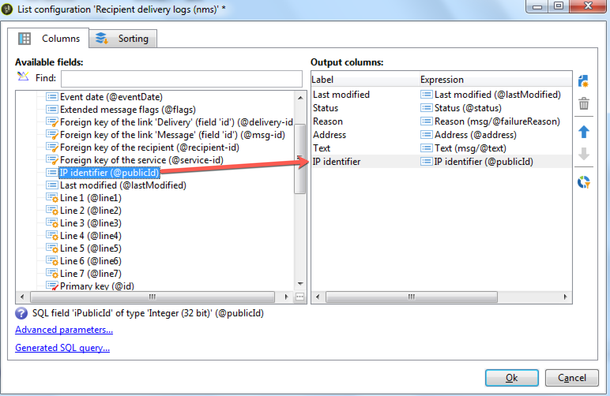

# 傳遞儀表板 {#delivery-dashboard}

**傳遞控制面板**&#x200B;是監控傳送及訊息傳送期間最終發生問題的關鍵。

它可讓您擷取傳遞的資訊，並視需要加以編輯。 請注意，傳送後，索引標籤內容不再變更。

以下是您可使用控制面板中數個索引標籤來監控的資訊：

* [傳送摘要](#delivery-summary)
* [傳遞報告](#delivery-reports)
* [傳送記錄、鏡像頁面、排除項目](#delivery-logs-and-history)
* [傳送追蹤記錄和歷史記錄](#tracking-logs)
* [傳送呈現](#delivery-rendering)
* [傳遞稽核](#delivery-audit-)


**相關主題：**

* [瞭解傳送故障](../../delivery/using/understanding-delivery-failures.md)
* [瞭解隔離管理](../../delivery/using/understanding-quarantine-management.md)
* [關於傳遞的最佳實務](../../delivery/using/delivery-best-practices.md)
* [管理傳送能力](../../delivery/using/about-deliverability.md)

## 傳送摘要 {#delivery-summary}

**[!UICONTROL Summary]**&#x200B;標籤包含傳送的特性：傳送狀態、使用的通道、傳送者的相關資訊、主旨、執行的相關資訊。

## 傳遞報告 {#delivery-reports}

可從&#x200B;**[!UICONTROL Summary]**&#x200B;標籤存取的&#x200B;**[!UICONTROL Reports]**&#x200B;連結可讓您查看與傳送動作相關的一組報表：一般傳送報告、詳細報告、傳送報告、失敗訊息的分發、開啟率、點按和交易等。

此索引標籤的內容可依您的需求進行設定。 如需傳送報告的詳細資訊，請參閱[此區段](../../reporting/using/delivery-reports.md)。


## 傳送記錄、歷史記錄和排除{#delivery-logs-and-history}

**[!UICONTROL Delivery]**&#x200B;標籤提供此傳送中發生次數的歷史記錄。 它包含傳送記錄，亦即已傳送的訊息清單、其狀態以及相關的訊息。

對於傳送，您只能顯示（例如）傳送失敗或隔離中地址的收件者。 要執行此操作，請按一下&#x200B;**[!UICONTROL Filters]**&#x200B;按鈕並選擇&#x200B;**[!UICONTROL By state]**。 然後選取下拉式清單中的狀態。 [此頁面](../../delivery/using/delivery-statuses.md)列出了各種狀態。

>[!NOTE]
>
>顯示傳送記錄的清單可以自訂，如Campaign Classic中的任何清單。 例如，您可以新增欄，以了解傳送中每個電子郵件的傳送IP位址。 有關詳細資訊，請參閱[本節](#use-case)中詳述的使用案例。


**[!UICONTROL Display the mirror page for this message...]**&#x200B;連結可讓您在新視窗中檢視從清單中選取之傳送內容的鏡像頁面。

鏡像頁面僅適用於已定義HTML內容的傳送。 有關詳細資訊，請參閱[生成鏡像頁](../../delivery/using/sending-messages.md#generating-the-mirror-page)。


## 傳送追蹤記錄和歷史記錄{#tracking-logs}

**[!UICONTROL Tracking]**&#x200B;索引標籤會列出此傳送的追蹤歷史記錄。 此索引標籤會顯示所傳送訊息的追蹤資料，亦即所有須受Adobe Campaign追蹤的URL。 追蹤資料會每小時更新。

>[!NOTE]
>
>如果未針對傳送啟用追蹤，則不會顯示此索引標籤。

追蹤設定會在傳送精靈的適當階段執行。 請參閱[如何設定追蹤的連結](../../delivery/using/how-to-configure-tracked-links.md)。

**[!UICONTROL Tracking]** 資料會在傳送報表中解譯。請參閱[本節](../../reporting/using/delivery-reports.md)。


## 收件匣轉譯 {#delivery-rendering}

**[!UICONTROL Inbox rendering]**&#x200B;頁簽允許您在可能接收郵件的不同上下文中預覽郵件，並檢查主要案頭和應用程式的相容性。

這樣，您就可以確保以最佳方式向收件者顯示您的郵件，在各種Web用戶端、網頁郵件和裝置上。

有關收件箱呈現的詳細資訊，請參閱[此頁](../../delivery/using/inbox-rendering.md)


## 傳遞審核{#delivery-audit-}

**[!UICONTROL Audit]**&#x200B;索引標籤包含傳送記錄檔以及與校樣相關的所有訊息。

**[!UICONTROL Refresh]**&#x200B;按鈕可讓您更新資料。 使用&#x200B;**[!UICONTROL Filters]**&#x200B;按鈕定義資料的篩選器。

特殊圖示可讓您識別錯誤或警告。 請參閱[分析傳送](../../delivery/using/steps-validating-the-delivery.md#analyzing-the-delivery)。

**[!UICONTROL Proofs]**&#x200B;子標籤可讓您檢視已傳送的校樣清單。


通過選擇要顯示的列，可以修改此窗口中顯示的資訊（以及&#x200B;**[!UICONTROL Delivery]**&#x200B;和&#x200B;**[!UICONTROL Tracking]**&#x200B;頁簽的資訊）。 要執行此操作，請按一下右下角的&#x200B;**[!UICONTROL Configure list]**&#x200B;圖示。 有關配置清單顯示的詳細資訊，請參閱[此部分](../../platform/using/adobe-campaign-workspace.md#configuring-lists)。

## 傳遞控制面板同步{#delivery-dashboard-synchronization}

在您的傳送控制面板中，您要檢查已處理的訊息和傳送記錄，以確定您的傳送已成功傳送。

某些指標或狀態可能不正確或不是最新狀態，這可透過下列解決方案解決：

* 如果您的傳送狀態不正確，請檢查是否已針對此傳送完成所有必要的核准，或&#x200B;**[!UICONTROL operationMgt]**&#x200B;和&#x200B;**[!UICONTROL deliveryMgt]**&#x200B;工作流程是否執行且未發生錯誤。 這也可能是因為傳送時使用了未在傳送執行個體上設定的相似性。

* 如果您的傳送指標仍為零，且您處於中間來源設定，請檢查&#x200B;**[!UICONTROL Mid-sourcing (delivery counters)]**&#x200B;技術工作流程。 如果狀態不是&#x200B;**[!UICONTROL Started]**，請啟動它。 然後，您可以嘗試以滑鼠右鍵按一下Adobe Campaign檔案總管中的相關傳送，並選取&#x200B;**[!UICONTROL Actions]** > **[!UICONTROL Recompute delivery and tracking indicators]**，以重新計算指標。 如需追蹤指標的詳細資訊，請參閱此[區段](../../reporting/using/delivery-reports.md#tracking-indicators)。

* 如果您的傳送計數器與您的傳送不符，請嘗試以滑鼠右鍵按一下Adobe Campaign檔案總管中的相關傳送，然後選取&#x200B;**[!UICONTROL Actions]** > **[!UICONTROL Recompute delivery and tracking indicators]**&#x200B;以重新同步，以重新計算指標。 如需追蹤指標的詳細資訊，請參閱此[區段](../../reporting/using/delivery-reports.md#tracking-indicators)。

* 如果您的傳送計數器不是中間來源部署的最新狀態，請檢查&#x200B;**[!UICONTROL Mid-Sourcing (Delivery counters)]**&#x200B;技術工作流程是否執行中。 如需關於此項目的詳細資訊，請參閱此[頁面](../../installation/using/mid-sourcing-deployment.md)。

您也可以透過傳遞控制面板，以不同的報表來追蹤您的傳送。 如需詳細資訊，請參閱本[區段](../../reporting/using/delivery-reports.md)。

## 使用案例：將發件人的IP地址添加到日誌{#use-case}

在本節中，您將了解如何將傳送記錄檔中傳送每個電子郵件之IP位址的相關資訊新增至傳送。

>[!NOTE]
>
>如果您使用單一例項或中間來源例項，此修改便不同。 進行修改之前，請確定您已連線至電子郵件傳送執行個體。

### 步驟1:擴充結構

若要在傳送記錄中新增&#x200B;**publicID**，您必須先擴充結構。 您可以依照下列步驟進行。

1. 在&#x200B;**[!UICONTROL Administration]** > **[!UICONTROL Configuration]** > **[!UICONTROL Data Schemas]** > **[!UICONTROL New]**&#x200B;下建立架構擴充功能。

   有關架構擴展的詳細資訊，請參閱[本頁](../../configuration/using/extending-a-schema.md)。

1. 選取&#x200B;**[!UICONTROL broadLogRcp]**&#x200B;以擴充收件者傳送記錄檔(nms)並定義自訂命名空間。 在此情況下，會是「自訂」：

   

   >[!NOTE]
   >
   >如果您的執行個體位於中間來源，則需要使用broadLogMid結構。

1. 在擴充功能中新增欄位。 在此範例中，您需要取代：

   ```
   <element img="nms:broadLog.png" label="Recipient delivery logs" labelSingular="Recipient delivery log" name="broadLogRcp"/>
   ```

   按：

   ```
   <element img="nms:broadLog.png" label="Recipient delivery logs" labelSingular="Recipient delivery log" name="broadLogRcp">
   <attribute desc="Outbound IP identifier" label="IP identifier"
   name="publicId" type="long"/>
   </element>
   ```

   

### 步驟2:更新資料庫結構

修改完成後，您需要更新資料庫結構，使其與其邏輯說明對齊。

要執行此操作，請遵循下列步驟：

1. 按一下「**[!UICONTROL Tools]** > **[!UICONTROL Advanced]** > **[!UICONTROL Update database structure...]**」功能表。

   

1. 在&#x200B;**[!UICONTROL Edit tables]**&#x200B;窗口中，檢查&#x200B;**[!UICONTROL NmsBroadLogRcp]**&#x200B;表（如果您處於中間來源環境，則檢查&#x200B;**[!UICONTROL broadLogMid]**&#x200B;表），如下所示：

   

   >[!IMPORTANT]
   >
   >請務必確認沒有其他修改，但&#x200B;**[!UICONTROL NmsBroadLoGRcp]**&#x200B;表格除外（若您位於中間來源環境，則為&#x200B;**[!UICONTROL broadLogMid]**&#x200B;表格）。 如果是，請取消選中其他表。

1. 按一下&#x200B;**[!UICONTROL Next]**&#x200B;進行驗證。 下列畫面隨即顯示：

   

1. 按一下&#x200B;**[!UICONTROL Next]**，然後按一下&#x200B;**[!UICONTROL Start]**&#x200B;以開始更新資料庫結構。 正在建立索引。 此步驟可能會很長，具體取決於&#x200B;**[!UICONTROL NmsBroadLogRcp]**&#x200B;表中的行數。

   

>[!NOTE]
>
>資料庫的物理結構更新成功完成後，您需要斷開連接並重新連接，以便將您的修改納入考量。

### 步驟3:驗證修改

若要確認一切皆正常運作，您必須更新傳送記錄檔畫面。

若要這麼做，請存取傳送記錄並新增「IP識別碼」欄。



>[!NOTE]
>
>若要了解如何在Campaign Classic介面中設定清單，請參閱[本頁面](../../platform/using/adobe-campaign-workspace.md)。

以下是修改後您應在&#x200B;**[!UICONTROL Delivery]**&#x200B;標籤中看到的內容：


