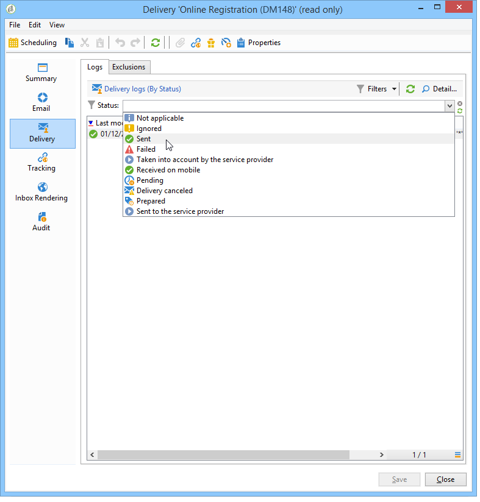

# 傳遞儀表板 {#delivery-dashboard}

**傳送控制面板**&#x200B;是監控傳送以及傳送訊息時最終遇到問題的關鍵。

它可讓您擷取傳送的相關資訊，並視需要加以編輯。 請注意，傳送後，標籤內容不再變更。

以下是您可使用控制面板中數個標籤來監控的資訊：

* [傳送摘要](#delivery-summary)
* [傳遞報表](#delivery-reports)
* [傳送記錄檔、鏡像頁面、排除](#delivery-logs-and-history)
* [傳送追蹤記錄檔和歷史記錄](#tracking-logs)
* [傳送轉換](#delivery-rendering)
* [傳送審核](#delivery-audit-)


**相關主題：**

* [瞭解傳送故障](../../delivery/using/understanding-delivery-failures.md)
* [瞭解隔離管理](../../delivery/using/understanding-quarantine-management.md)
* [傳遞最佳實務](../../delivery/using/delivery-best-practices.md)
* [管理傳送能力](../../delivery/using/about-deliverability.md)

## 傳送摘要 {#delivery-summary}

**[!UICONTROL Summary]**&#x200B;標籤包含傳送的特性：傳送狀態、使用的頻道、傳送者的資訊、主旨、執行的相關資訊。

## 傳遞報表 {#delivery-reports}

可從&#x200B;**[!UICONTROL Summary]**&#x200B;標籤存取的&#x200B;**[!UICONTROL Reports]**&#x200B;連結可讓您查看與傳送動作相關的報表集：一般傳送報表、詳細報表、傳送報表、失敗訊息的分發、開啟率、點按次數和交易等。

此標籤的內容可依您的需求進行設定。 如需傳送報表的詳細資訊，請參閱[本節](../../reporting/using/delivery-reports.md)。


## 傳送記錄、歷史記錄和排除{#delivery-logs-and-history}

**[!UICONTROL Delivery]**&#x200B;標籤會提供此傳送中發生次數的歷史記錄。 它包含傳送記錄，即已傳送訊息的清單、其狀態及相關訊息。

對於傳送，您只能顯示（例如）傳送失敗或隔離中有地址的收件者。 要執行此操作，請按一下&#x200B;**[!UICONTROL Filters]**&#x200B;按鈕並選擇&#x200B;**[!UICONTROL By state]**。 然後在下拉式清單中選取狀態。 [本頁](../../delivery/using/delivery-statuses.md)列出了各種狀態。

>[!NOTE]
>
>可自訂顯示傳送記錄的清單，如同Campaign Classic中的任何清單。 例如，您可以新增欄，以瞭解傳送中每封電子郵件的傳送IP位址。 有關詳細資訊，請參閱[本節](#use-case)中詳細介紹的使用案例。



**[!UICONTROL Display the mirror page for this message...]**&#x200B;連結可讓您在新視窗中檢視從清單選取之傳送內容的鏡像頁面。

鏡像頁面僅適用於已定義HTML內容的傳送。 有關詳細資訊，請參閱[生成鏡像頁](../../delivery/using/sending-messages.md#generating-the-mirror-page)。


## 傳送追蹤記錄檔和記錄{#tracking-logs}

**[!UICONTROL Tracking]**&#x200B;標籤會列出此傳送的追蹤歷史記錄。 此標籤會顯示所傳送訊息的追蹤資料，亦即所有受Adobe Campaign追蹤的URL。 追蹤資料會每小時更新一次。

>[!NOTE]
>
>如果傳送未啟用追蹤，則不會顯示此標籤。

追蹤設定是在傳送精靈的適當階段執行。 請參閱[如何設定追蹤的連結](../../delivery/using/how-to-configure-tracked-links.md)。

**[!UICONTROL Tracking]** 資料會在傳送報表中解譯。請參閱[本節](../../reporting/using/delivery-reports.md)。


## 收件匣轉譯 {#delivery-rendering}

**[!UICONTROL Inbox rendering]**&#x200B;頁籤允許您在接收消息的不同上下文中預覽消息，並檢查主要台式機和應用程式的相容性。

如此，您就可以確保以最佳方式，將訊息顯示給收件者，並可在各種網頁用戶端、網頁郵件和裝置上顯示。

有關收件箱轉換的詳細資訊，請參閱[此頁](../../delivery/using/inbox-rendering.md)


## 傳送審核{#delivery-audit-}

**[!UICONTROL Audit]**&#x200B;標籤包含傳送記錄檔和所有與校樣相關的訊息。

**[!UICONTROL Refresh]**&#x200B;按鈕可讓您更新資料。 使用&#x200B;**[!UICONTROL Filters]**&#x200B;按鈕來定義資料上的篩選。

特殊圖示可讓您識別錯誤或警告。 請參閱[分析傳送](../../delivery/using/steps-validating-the-delivery.md#analyzing-the-delivery)。

**[!UICONTROL Proofs]**&#x200B;子標籤可讓您檢視已傳送的校樣清單。


通過選擇要顯示的列，可以修改此窗口（以及&#x200B;**[!UICONTROL Delivery]**&#x200B;和&#x200B;**[!UICONTROL Tracking]**&#x200B;頁籤的資訊）中顯示的資訊。 若要這麼做，請按一下右下角的&#x200B;**[!UICONTROL Configure list]**&#x200B;圖示。 有關配置清單顯示的詳細資訊，請參閱[本節](../../platform/using/adobe-campaign-workspace.md#configuring-lists)。

## 傳送控制面板同步{#delivery-dashboard-synchronization}

在您的傳送控制面板中，您要檢查已處理的訊息和傳送記錄，以確定傳送成功。

某些指標或狀態可能不正確或不是最新，這可透過下列解決方案解決：

* 如果您的傳送狀態不正確，請檢查是否已完成此傳送的所有必要核准，或是&#x200B;**[!UICONTROL operationMgt]**&#x200B;和&#x200B;**[!UICONTROL deliveryMgt]**&#x200B;工作流程正在執行，而無錯誤。 這也可能是因為傳送時使用了傳送執行個體上未設定的相似性。

* 如果您的交貨指標仍為零且您處於中間採購配置中，請檢查&#x200B;**[!UICONTROL Mid-sourcing (delivery counters)]**&#x200B;技術工作流程。 如果狀態不是&#x200B;**[!UICONTROL Started]**，請啟動它。 然後，您可以嘗試在Adobe Campaign檔案總管中按一下滑鼠右鍵並選取&#x200B;**[!UICONTROL Actions]** > **[!UICONTROL Recompute delivery and tracking indicators]**，重新計算指標。 有關跟蹤指示器的詳細資訊，請參閱此[部分](../../reporting/using/delivery-reports.md#tracking-indicators)。

* 如果您的傳送計數器與您的傳送不符，請嘗試在Adobe Campaign檔案總管中以滑鼠右鍵按一下相關的傳送，然後選取&#x200B;**[!UICONTROL Actions]** > **[!UICONTROL Recompute delivery and tracking indicators]**&#x200B;以重新同步，以重新計算指標。 有關跟蹤指示器的詳細資訊，請參閱此[部分](../../reporting/using/delivery-reports.md#tracking-indicators)。

* 如果您的交貨計數器不是中部採購部署的最新狀態，請檢查&#x200B;**[!UICONTROL Mid-Sourcing (Delivery counters)]**&#x200B;技術工作流程是否正在執行。 如需關於此項目的詳細資訊，請參閱此[頁面](../../installation/using/mid-sourcing-deployment.md)。

您也可以透過傳送控制面板，使用不同的報表來追蹤傳送。 如需詳細資訊，請參閱本[區段](../../reporting/using/delivery-reports.md)。

## 使用案例：將發件人的IP地址添加到日誌{#use-case}

在本節中，您將學習如何將傳送記錄檔中傳送每封電子郵件的IP位址相關資訊新增至。

>[!NOTE]
>
>如果您使用單個實例或中間採購實例，則此修改會有所不同。 進行修改前，請確定您已連線至電子郵件傳送例項。

### 步驟1:擴充架構

若要在傳送記錄檔中新增&#x200B;**publicID**，您必須先擴充架構。 您可依下列方式進行。

1. 在&#x200B;**[!UICONTROL Administration]** > **[!UICONTROL Configuration]** > **[!UICONTROL Data Schemas]** > **[!UICONTROL New]**&#x200B;下建立架構擴展。

   有關架構擴展的詳細資訊，請參閱[此頁](../../configuration/using/extending-a-schema.md)。

1. 選擇&#x200B;**[!UICONTROL broadLogRcp]**&#x200B;以擴展Recipient交付日誌(nms)並定義自定義命名空間。 在這種情況下，它將是「cus」:

   

   >[!NOTE]
   >
   >如果實例位於Mid-sourcing中，則需要使用broadLogMid架構。

1. 將新欄位新增至您的擴充功能。 在本範例中，您需要取代：

   ```
   <element img="nms:broadLog.png" label="Recipient delivery logs" labelSingular="Recipient delivery log" name="broadLogRcp"/>
   ```

   作者：

   ```
   <element img="nms:broadLog.png" label="Recipient delivery logs" labelSingular="Recipient delivery log" name="broadLogRcp">
   <attribute desc="Outbound IP identifier" label="IP identifier"
   name="publicId" type="long"/>
   </element>
   ```

   

### 步驟2:更新資料庫結構

完成修改後，您需要更新資料庫結構，使其與其邏輯說明一致。

要執行此操作，請遵循下列步驟：

1. 按一下&#x200B;**[!UICONTROL Tools]** > **[!UICONTROL Advanced]** > **[!UICONTROL Update database structure...]**&#x200B;菜單。

   

1. 在&#x200B;**[!UICONTROL Edit tables]**&#x200B;窗口中，將檢查&#x200B;**[!UICONTROL NmsBroadLogRcp]**&#x200B;表（如果您在Mid-sourcing環境中，則檢查&#x200B;**[!UICONTROL broadLogMid]**&#x200B;表），如下所示：

   

   >[!IMPORTANT]
   >
   >請務必確保沒有其他修改，但&#x200B;**[!UICONTROL NmsBroadLoGRcp]**&#x200B;表(或&#x200B;**[!UICONTROL broadLogMid]**&#x200B;表（如果您位於Mid-sourcing環境）除外。 如果是，請取消選中其他表。

1. 按一下&#x200B;**[!UICONTROL Next]**&#x200B;進行驗證。 會顯示下列畫面：

   

1. 按一下&#x200B;**[!UICONTROL Next]** ，然後按一下&#x200B;**[!UICONTROL Start]**&#x200B;開始更新資料庫結構。 索引建立工作正在開始。 此步驟可能很長，具體取決於&#x200B;**[!UICONTROL NmsBroadLogRcp]**&#x200B;表中的行數。

   

>[!NOTE]
>
>資料庫物理結構的更新成功完成後，您需要斷開並重新連接，以便考慮您所做的修改。

### 步驟3:驗證修改

若要確認一切正常運作，您必須更新傳送記錄檔畫面。

若要這麼做，請存取傳送記錄檔並新增「IP識別碼」欄。


>[!NOTE]
>
>若要瞭解如何在Campaign Classic介面中設定清單，請參閱[本頁](../../platform/using/adobe-campaign-workspace.md)。

以下是修改後應在&#x200B;**[!UICONTROL Delivery]**&#x200B;標籤中看到的內容：


