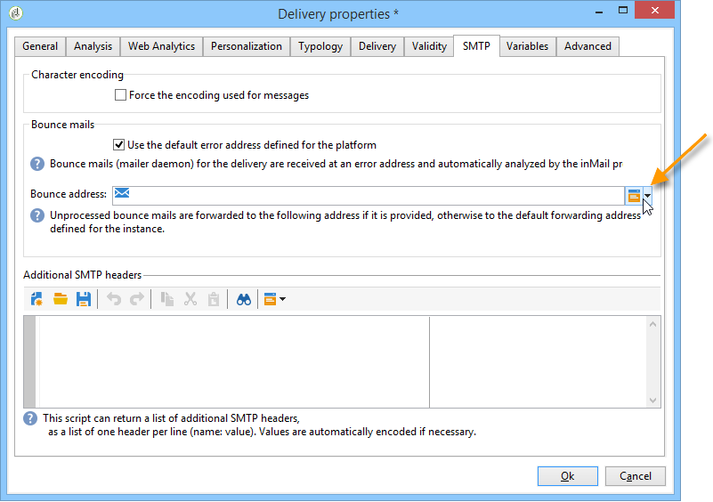

# 電子郵件參數 {#email-parameters}

本節提供電子郵件傳送專屬的選項和參數。

## 電子郵件密件副本 {#email-bcc}

Adobe Campaign可讓您透過密件副本，將密件副本電子郵件地址新增至訊息目標，以在外部系統上儲存電子郵件。

啟用選項後，會保留所有已傳送訊息的確切副本，以供傳送。

如需電子郵件密件副本設定和最佳實務的詳細資訊，請參閱[此區段](../../installation/using/email-archiving.md)。

>[!NOTE]
>
>電子郵件密件副本是一項可選功能。 請檢查您的授權合約，並聯絡您的帳戶管理員以啟用它。

建立新的傳送或傳送範本時，預設不會啟用電子郵件密件副本。 您必須在電子郵件傳遞或傳遞範本層級手動啟用。

>[!NOTE]
>
>如果您使用具有增強MTA的電子郵件密件副本，系統會為所有傳送自動啟用此選項。

若要為電子郵件傳送範本啟用電子郵件密件副本，請遵循下列步驟：

1. 前往&#x200B;**[!UICONTROL Campaign Management]** > **[!UICONTROL Deliveries]**&#x200B;或&#x200B;**[!UICONTROL Resources]** > **[!UICONTROL Templates]** > **[!UICONTROL Delivery templates]**。
1. 選取您選擇的傳送或複製現成可用的&#x200B;**電子郵件傳送**&#x200B;範本，然後選取重複的範本。
1. 按一下&#x200B;**Properties**&#x200B;按鈕。
1. 選取 **[!UICONTROL Delivery]** 索引標籤。
1. 檢查&#x200B;**電子郵件BCC**&#x200B;選項。 根據此範本，每次傳送的所有已傳送訊息副本都會傳送至已設定的電子郵件密件副本地址。

   

>[!NOTE]
>
>如果開啟並點進傳送至BCC位址的電子郵件，在傳送分析的&#x200B;**[!UICONTROL Total opens]**&#x200B;和&#x200B;**[!UICONTROL Clicks]**&#x200B;中會考量這一點，這可能會造成某些錯誤計算。

## 選擇消息格式 {#selecting-message-formats}

您可以變更傳送的電子郵件訊息的格式。 若要這麼做，請編輯傳送屬性，然後按一下&#x200B;**[!UICONTROL Delivery]**&#x200B;標籤。

在視窗的下方區段中選取電子郵件格式：

* **[!UICONTROL Use recipient preferences]** （預設模式）

   根據儲存在收件者設定檔中的資料定義訊息格式，並預設儲存在&#x200B;**[!UICONTROL email format]**&#x200B;欄位(@emailFormat)中。 如果收件者希望以特定格式接收郵件，則此格式為傳送的格式。如果未填入欄位，則會傳送替代的多重部分訊息（請參閱下方）。

* **[!UICONTROL Let recipient mail client choose the most appropriate format]**

   訊息包含兩種格式：文字和HTML。 接收時顯示的格式取決於收件者的郵件軟體（替代的多重部分）的設定。

   >[!IMPORTANT]
   >
   >此選項包括文檔的兩個版本。 因此，它會影響傳送率，因為訊息大小較大。

* **[!UICONTROL Send all messages in text format]**

   訊息會以文字格式傳送。 不會傳送HTML格式，但只有當收件者點按訊息時，才會用於鏡像頁面。

>[!NOTE]
>
>如需定義電子郵件內容的詳細資訊，請參閱[此區段](defining-the-email-content.md)。

## 產生鏡像頁面 {#generating-mirror-page}

鏡像頁面是可透過網頁瀏覽器線上存取的HTML頁面。 其內容與電子郵件相同。

依預設，如果將連結插入郵件內容中，則會產生鏡像頁面。 有關個人化區塊插入的詳細資訊，請參閱[個人化區塊](personalization-blocks.md)。

在傳送屬性中， **[!UICONTROL Validity]**&#x200B;標籤的&#x200B;**[!UICONTROL Mode]**&#x200B;欄位可讓您修改此頁面的產生模式。

>[!IMPORTANT]
>
>必須為要建立鏡像頁面的傳送定義HTML內容。

除了預設模式外，還提供下列選項：

* **[!UICONTROL Force the generation of the mirror page]**:即使傳送中未插入鏡像頁面的連結，也會建立鏡像頁面。
* **[!UICONTROL Do not generate the mirror page]**:不會產生任何鏡像頁面，即使傳送中存在連結亦然。
* **[!UICONTROL Generates a mirror page accessible using only the message identifier]**:此選項可讓您在傳送記錄視窗中存取鏡像頁面的內容，並附上個人化資訊。要執行此操作，在傳送結束後，按一下&#x200B;**[!UICONTROL Delivery]**&#x200B;標籤，並選取您要檢視其鏡像頁面的收件者行。 按一下&#x200B;**[!UICONTROL Display the mirror page for this message...]**&#x200B;連結。

   

## 字元編碼 {#character-encoding}

在傳送參數的&#x200B;**[!UICONTROL SMTP]**&#x200B;標籤中， **[!UICONTROL Character encoding]**&#x200B;區段可讓您設定特定編碼。

預設編碼為UTF-8。 如果您的某些收件者電子郵件提供者不支援UTF-8標準編碼，您可能想要設定特定編碼，以正確地向您電子郵件的收件者顯示特殊字元。

例如，您想要傳送包含日文字元的電子郵件。 為確保所有字元均正確顯示給您在日本的收件者，您可能想使用可支援日文字元的編碼，而非標準UTF-8。

要執行此操作，請選取&#x200B;**[!UICONTROL Character encoding]**&#x200B;區段中的&#x200B;**[!UICONTROL Force the encoding used for messages]**&#x200B;選項，然後從顯示的下拉式清單中選擇編碼。

## 管理退信電子郵件 {#managing-bounce-emails}

傳送參數的&#x200B;**[!UICONTROL SMTP]**&#x200B;標籤可讓您設定退信郵件的管理。

依預設，系統會在平台的預設錯誤方塊中接收退信的電子郵件，但您可以為傳送定義特定錯誤地址。

您也可以從此畫面中定義特定地址，以調查當應用程式無法自動限定退回郵件的原因。 對於這些欄位， **新增個人化欄位**&#x200B;圖示可讓您新增個人化參數。

有關退信管理的詳細資訊，請參閱[此部分](understanding-delivery-failures.md#bounce-mail-management)。

## 新增SMTP標題 {#adding-smtp-headers}

您可以將SMTP標題新增至您的傳送。 若要這麼做，請在傳送中使用&#x200B;**[!UICONTROL SMTP]**&#x200B;標籤的相關區段。

在此窗口中輸入的指令碼必須引用以下格式的每行一個標題：**name:value**。

如有必要，會自動對值編碼。

>[!IMPORTANT]
>
>會為進階使用者保留新增指令碼，以便插入其他 SMTP 標題。
>
>此指令碼的語法必須符合以下內容類型的要求：沒有未使用的空間，沒有空行等。
