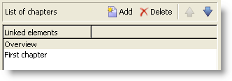

# 豐富化內容{#enriching-content}

彙總可讓您利用外部資料豐富內容。 此資料來自一般查詢或連結表格。

## 一般查詢 {#generic-queries}

透過中的發佈範本設定查詢 **[!UICONTROL Aggregator]** 標籤。

擷取的資料會透過其主要元素擴充XML輸出檔案。

從收件者綱要上的查詢傳回的範例(**nms：recipient**)：

```
<book name="Content Management">
  ...
  <collection-recipient>
    <recipient lastName="Doe" firstName="John" email="john.doe@aolf.com">
    ...
  </collection-recipient>
</book>
```

此 **`<collection-recipient>`** element代表由查詢產生的檔案的輸入元素。 擷取的資料會傳回至此元素下；在我們的範例中，為收件者清單。

### 新增查詢 {#adding-a-query}

使用精靈編輯查詢引數。

1. 在第一個頁面中，指定標籤和包含要擷取之資料的結構描述。

   

   >[!NOTE]
   >
   >編輯欄位 **路徑** 用於重新命名查詢輸出元素。

1. 下一頁可讓您選取要擷取的資料。

   

1. 下一頁會定義篩選條件。

   

1. 最後一頁會啟動查詢傳回資料的預覽。

   

## 連結表格 {#linked-tables}

連結可讓您擷取連結到內容的外部資料。

連結資料有兩種型別：

* 內容連結：這是原生內容管理模式。 連結的內容會自動整合到XML輸出檔案中。
* 外部表格的連結可讓您存取資料庫中的所有其他表格，但會限制使用彙總器擷取所選連結的資料。

### 連結至內容結構描述 {#link-to-a-content-schema}

在資料結構中宣告內容連結的方式如下：

```
<element expandSchemaTarget="cus:chapter" label="Main chapter" name="mainChapter" type="string"/>
```

連結的定義會填入到 **字串**-type **`<element>`**，以及 **expandschematarget** 屬性會參考目標結構描述（在我們的範例中為「cus：chapter」）。 參考的結構描述必須是內容結構描述。

目標元素的內容會豐富連結元素，即 **`<chapter>`** 個元素（在我們的範例結構描述中）：

```
<mainChapter computeString="Introduction" id="7011" title="Introduction" xtkschema="cus:chapter">    
  <page>Introduction to input <STRONG>forms</STRONG>.</page>
</mainChapter>
```

>[!NOTE]
>
>此 **計算字串** 的「 」連結，來自 **computeString** 屬性。

在輸入表單中，連結的編輯控制項宣告如下：

```
<input type="articleEdit" xpath="mainChapter"/>
```


此 **[!UICONTROL Magnifier]** 圖示可讓您開啟已連結元素的編輯表單。

#### 連結集合 {#link-collection}

若要填入連結集合，請新增 **unbound=&quot;true&quot;** 屬性來定義資料架構中的連結元素：

```
<element expandSchemaTarget="cus:chapter" label="List of chapters" name="chapter"  ordered="true" unbound="true"/>
```

目標要素的內容豐富了每個收集要素：

```
<chapter computeString="Introduction" id="7011" title="Introduction" xtkschema="cus:chapter">    
  <page>Introduction to input <STRONG>forms</STRONG>.</page>
</chapter>
```

在輸入表單中，清單控制項宣告如下：

```
<input editable="false" nolabel="true" toolbarCaption="List of chapters" type="articleList" xpath="chapter" zoom="true"/>
```



將顯示預設欄，以便檢視 **計算字串** 目標元素的ID。

### 外部表格的連結 {#links-to-external-tables}

在資料綱要中宣告外部表格的連結如下：

```
<element label="Main contact" name="mainContact" target="nms:recipient" type="link"/>
```

連結的定義會填入到 **連結**-type **`<element>`**，以及 **目標** 屬性會參考目標結構描述（在我們的範例中為「nms：recipient」）。

依照慣例，必須從資料結構描述的主要元素宣告連結。

此 **計算字串** 而目標元素的鍵會擴充 **`<name>-id`** 和 **`<name>-cs`** 屬性。

在我們的範例中，連結填入到「cus：book」綱要中，連結資料的內容包含在「mainContact-id」和「mainContact-cs」屬性中：

```
<book computeString="Content management" date="2006/06/08" id="6106" language="en" mainContact-cs="John Doe (john.doe@adobe.com)" mainContact-id="3012" name="Content management" xtkschema="cus:book">
```

連結編輯控制項宣告如下：

```
<input xpath="mainContact"/>
```


您可以透過新增以下專案限制目標元素的選擇 **`<sysfilter>`** 元素，透過輸入表單中的連結定義：

```
<input xpath="mainContact">
  <!-- Filter the selection of the link on the Adobe domain -->
  <sysFilter>
    <condition expr="@domain =  'adobe.com '"/>
  </sysFilter>
</input>
```

>[!NOTE]
>
>此限制也適用於內容連結。

#### 連結集合 {#link-collection-1}

集合的定義與集合元素上清單的定義相同：

```
<element label="List of contacts" name="contact" unbound="true">
  <element label="Recipient" name="recipient" target="nms:recipient" type="link"/>
</element>
```

在輸入表單中，清單控制項宣告如下：

```
<input nolabel="true" toolbarCaption="List of contacts" type="list" xpath="contact">
  <input xpath="recipient"/>
</input>
```


>[!NOTE]
>
>此清單可編輯，並讓您從上方顯示的「連結」型別控制項中選取連結。

目標要素的內容豐富了輸出檔案中的每個收集要素：

```
<contact id="11504978621" recipient-cs="Doe John (john.doe@adobe.com)" recipient-id="3012"/>
<contact id="11504982510" recipient-cs="Martinez Peter (peter.martinez@adobe.com)" recipient-id="3013"/>
```

#### 連結彙總 {#link-aggregation}

每個參考連結的內容僅限於內部索引鍵及 **計算字串** 目標元素的。

JavaScript指令碼是用來透過SOAP查詢擴充連結的內容。

**範例**：將收件者名稱新增至「mainContact」連結和「contact」集合連結：

```
// Update <mainContact> link
var mainContactId = content.@['mainContact-id']
var query = xtk.queryDef.create(
    <queryDef schema="nms:recipient" operation="get">
      <select>
        <node expr="@lastName"/>
      </select>
      <where>
        <condition expr={"@id="+mainContactId}/>
      </where>
    </queryDef>)

var recipient = query.ExecuteQuery()
content.mainContact.@lastName = recipient.@lastName

// Update <contact> link collection
for each(var contact in content.contact)
{
  var contactId = contact.@['recipient-id']
  var query = xtk.queryDef.create(
    <queryDef schema="nms:recipient" operation="get">
      <select>
        <node expr="@lastName"/>
      </select>
      <where>
        <condition expr={"@id="+contactId}/>
      </where>
    </queryDef>
  )
  
  var recipient = query.ExecuteQuery()
  contact.@lastName = recipient.@lastName
}
```

指令碼執行後取得的結果：

```
<mainContact lastName="Doe"/>

<contact id="11504978621" lastName="Doe" recipient-cs="Doe John (john.doe@adobe.com)" recipient-id="3012"/>  
<contact id="11504982510" lastName="Martinez" recipient-cs="Martinez Peter (peter.martinez@adobe.com)" recipient-id="3013"/> 
```

JavaScript程式碼的內容是透過 **[!UICONTROL Administration > Configuration > Content management > JavaScript Codes]** 資料夾，且必須填入每個轉換的發佈範本中。


