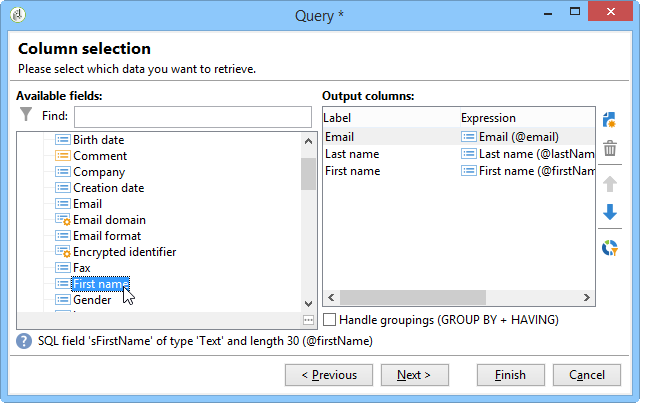

# 豐富化內容{#enriching-content}


聚合器允許您使用外部資料來豐富內容。 此資料來自一般查詢或連結表。

## 一般查詢 {#generic-queries}

查詢是通過 **[!UICONTROL Aggregator]** 頁籤。

檢索到的資料將通過XML的主要元素豐富XML輸出文檔。

從收件人方案上的查詢返回的示例(**nms：收件人**):

```
<book name="Content Management">
  ...
  <collection-recipient>
    <recipient lastName="Doe" firstName="John" email="john.doe@aolf.com">
    ...
  </collection-recipient>
</book>
```

的 **`<collection-recipient>`** 元素表示由查詢生成的文檔的輸入元素。 檢索到的資料在此元素下返回；在我們的例子中，收件人清單。

### 添加查詢 {#adding-a-query}

查詢參數使用嚮導進行編輯。

1. 在第一頁中，指定包含要檢索的資料的標籤和架構。

   

   >[!NOTE]
   >
   >編輯欄位 **路徑** 用於更名查詢輸出元素。

1. 下一頁允許您選擇要檢索的資料。

   

1. 下一頁定義篩選器條件。

   

1. 最後一頁啟動查詢返回的資料的預覽。

   

## 連結表 {#linked-tables}

連結允許您檢索連結到內容的外部資料。

連結資料有兩種類型：

* 內容連結：這是本機內容管理模式。 連結的內容自動整合在XML輸出文檔中。
* 到外部表的連結允許訪問資料庫中的所有其它表，但約束是使用聚合器檢索所選連結的資料。

### 連結到內容架構 {#link-to-a-content-schema}

在資料模式中聲明內容連結如下：

```
<element expandSchemaTarget="cus:chapter" label="Main chapter" name="mainChapter" type="string"/>
```

連結的定義填充在 **字串** — 類型 **`<element>`**&#x200B;的 **擴展架構目標** 屬性引用目標架構（示例中的「cus:chapter」）。 引用的架構必須是內容架構。

目標元素的內容豐富了連結元素，即 **`<chapter>`** 示例架構中的元素：

```
<mainChapter computeString="Introduction" id="7011" title="Introduction" xtkschema="cus:chapter">    
  <page>Introduction to input <STRONG>forms</STRONG>.</page>
</mainChapter>
```

>[!NOTE]
>
>的 **計算字串** 的 **計算字串** 屬性。

在輸入表單中，連結的編輯控制項聲明如下：

```
<input type="articleEdit" xpath="mainChapter"/>
```


的 **[!UICONTROL Magnifier]** 表徵圖可開啟連結元素的編輯窗體。

#### 連結集合 {#link-collection}

要填充連結集合，請添加 **未綁定=&quot;true&quot;** 屬於資料架構中連結元素的定義：

```
<element expandSchemaTarget="cus:chapter" label="List of chapters" name="chapter"  ordered="true" unbound="true"/>
```

目標元素的內容豐富了每個收集元素：

```
<chapter computeString="Introduction" id="7011" title="Introduction" xtkschema="cus:chapter">    
  <page>Introduction to input <STRONG>forms</STRONG>.</page>
</chapter>
```

在輸入表單中，清單控制項聲明如下：

```
<input editable="false" nolabel="true" toolbarCaption="List of chapters" type="articleList" xpath="chapter" zoom="true"/>
```


將顯示預設列，以查看 **計算字串** 目標元素。

### 指向外部表的連結 {#links-to-external-tables}

在資料模式中聲明到外部表的連結如下：

```
<element label="Main contact" name="mainContact" target="nms:recipient" type="link"/>
```

連結的定義填充在 **連結** — 類型 **`<element>`**&#x200B;的 **目標** 屬性引用目標模式（本例中為「nms:recipient」）。

根據約定，必須從資料架構的主要元素聲明連結。

的 **計算字串** 目標元素的關鍵是豐富了 **`<name>-id`** 和 **`<name>-cs`** 屬性。

在本例中，連結在「cus:book」架構中填充，連結資料的內容包含在「mainContact-id」和「mainContact-cs」屬性中：

```
<book computeString="Content management" date="2006/06/08" id="6106" language="en" mainContact-cs="John Doe (john.doe@adobe.com)" mainContact-id="3012" name="Content management" xtkschema="cus:book">
```

連結編輯控制項聲明如下：

```
<input xpath="mainContact"/>
```


通過添加 **`<sysfilter>`** 元素，通過輸入表單中的連結定義：

```
<input xpath="mainContact">
  <!-- Filter the selection of the link on the Adobe domain -->
  <sysFilter>
    <condition expr="@domain =  'adobe.com '"/>
  </sysFilter>
</input>
```

>[!NOTE]
>
>此限制也適用於內容連結。

#### 連結集合 {#link-collection-1}

集合的定義與集合元素上清單的定義相同：

```
<element label="List of contacts" name="contact" unbound="true">
  <element label="Recipient" name="recipient" target="nms:recipient" type="link"/>
</element>
```

在輸入表單中，清單控制項聲明如下：

```
<input nolabel="true" toolbarCaption="List of contacts" type="list" xpath="contact">
  <input xpath="recipient"/>
</input>
```


>[!NOTE]
>
>該清單是可編輯的，允許您從上面顯示的「連結」類型控制項中選擇連結。

目標元素的內容豐富了輸出文檔中的每個集合元素：

```
<contact id="11504978621" recipient-cs="Doe John (john.doe@adobe.com)" recipient-id="3012"/>
<contact id="11504982510" recipient-cs="Martinez Peter (peter.martinez@adobe.com)" recipient-id="3013"/>
```

#### 連結聚合 {#link-aggregation}

引用的每個連結的內容限於內部密鑰和 **計算字串** 目標元素。

使用JavaScript指令碼通過SOAP查詢來豐富連結的內容。

**示例**:將收件人姓名添加到「mainContact」連結和「contact」集合連結：

```
// Update <mainContact> link
var mainContactId = content.@['mainContact-id']
var query = xtk.queryDef.create(
    <queryDef schema="nms:recipient" operation="get">
      <select>
        <node expr="@lastName"/>
      </select>
      <where>
        <condition expr={"@id="+mainContactId}/>
      </where>
    </queryDef>)

var recipient = query.ExecuteQuery()
content.mainContact.@lastName = recipient.@lastName

// Update <contact> link collection
for each(var contact in content.contact)
{
  var contactId = contact.@['recipient-id']
  var query = xtk.queryDef.create(
    <queryDef schema="nms:recipient" operation="get">
      <select>
        <node expr="@lastName"/>
      </select>
      <where>
        <condition expr={"@id="+contactId}/>
      </where>
    </queryDef>
  )
  
  var recipient = query.ExecuteQuery()
  contact.@lastName = recipient.@lastName
}
```

指令碼執行後獲得的結果：

```
<mainContact lastName="Doe"/>

<contact id="11504978621" lastName="Doe" recipient-cs="Doe John (john.doe@adobe.com)" recipient-id="3012"/>  
<contact id="11504982510" lastName="Martinez" recipient-cs="Martinez Peter (peter.martinez@adobe.com)" recipient-id="3013"/> 
```

JavaScript代碼的內容通過 **[!UICONTROL Administration > Configuration > Content management > JavaScript Codes]** 資料夾，必須在每個轉換的發佈模板中填充。


