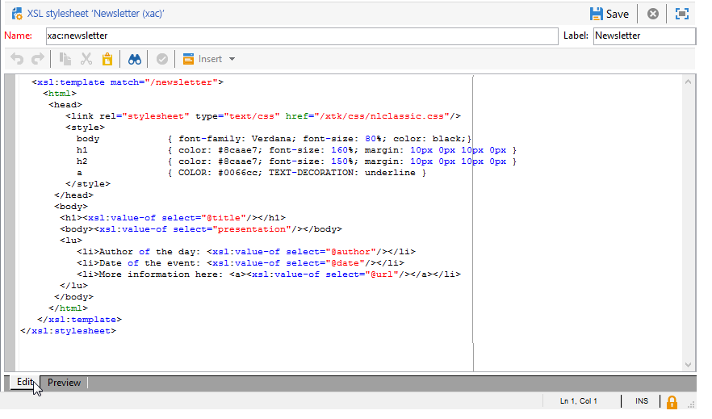

# 格式{#formatting}

## JavaScript 範本 {#javascript-templates}

JavaScript範本是包含JavaScript程式碼的HTML或文字檔案。 其建構方式與傳遞動作中的電子郵件內容相同。

### JavaScript範本的識別 {#identification-of-a-javascript-template}

JavaScript範本是透過其名稱和名稱空間來識別，就像結構描述和表單一樣。 不過，建議新增 **.js** 選項至範本名稱。

### JavaScript範本的結構 {#structure-of-a-javascript-template}

根據「cus：book」結構描述的JavaScriptHTML格式範本範例：

```
<html>
  <body>
    <!-- Title of book -->
    <h1><%= content.@name %></h1>
    <ul>
      <% for each(var chapter in content.chapter) { %>
        <li><%= chapter.@name %></li>
      <% }%>
    </ul>
  </body>
</html>
```

各種JavaScript指令會以下列形式顯示：

* 合併欄位：顯示資料的內容，包含 **`<%= <source> %>`** 語法，其中 `<source>`是要顯示之資料的來源欄位。
* 指示區塊：執行&lt;%和%>標籤之間包含的一系列JavaScript指示。

此 **內容** 物件代表輸入XML檔案的主要元素。

在我們的範例中，下列一行會顯示名稱簿名稱的內容：

```
<h1><%= content.@name %></h1>
```

下列程式碼會在 `<chapter>` 收集要素：

```
<% for each(var chapter in content.chapter) { %>
  <li><%= chapter.@name %></li>
<% }%>
```

內容的屬性和元素以JavaScript物件表示，並遵循來原始檔的結構。

**範例**：

* **內容。@name**：擷取主要元素的「name」屬性值
* **內容。@`['name']`**：等同於 **內容。@name** 語法
* **content.chapter.length**：傳回上的元素數 `<chapter` collection element — 收集要素
* **content.chapter`[0]`.@name**：擷取第一筆的名稱 `<chapter>` 元素
* **chapter.name()**：傳回的名稱 `<chapter>` 元素
* **chapter.parent()。name()**：傳回的父元素名稱 `<chapter>`

>[!CAUTION]
>
>由於&#39;-&#39;字元保留在JavaScript語言中，因此必須透過 `['<field>']` 語法。
>
>例如： `content.@['offer-id']`.

程式語言的所有功能（變數、回圈、條件測試、函式等） )可用來建構輸出檔案。 可存取SOAP API以擴充輸出檔案。

範例：

* 條件式測試：

  ```
  <% if (content.@number == 1 || content.@language == 'en') { %>
  <!-- Content to be displayed if test is true--> 
  <% } %>
  ```

* 函式呼叫：

  ```
  <!-- Displays a horizontal bar -->
  ;<% function DisplayHorizontalBar() { %>
    <hr/>
  <% } %> 
  
  <!-- The same function in a block  -->
  <% 
  function DisplayHorizontalBar2()
  {
    document.write('<hr/>');
  }
  %> 
  
  <!-- Returns the value in uppercase -->
  <% 
  function formatName(value)
  { 
    return value.toUpperCase(); 
  }
  %>
  
  <!-- Call functions -->
  <%= DisplayHorizontalBar1() %>
  <%= DisplayHorizontalBar2() %>
  <%= formatName(content.@name) %>
  ```

* 宣告和變數呼叫：

  ```
  <%  var counter = 0; %>
  
  <%= counter += 10 %>
  ```

* 使用靜態方法擷取及顯示收件者名稱：

  ```
  <% var recipient = nms.recipient.get(1246); %>
  <%= recipient.lastName %>
  ```

* 使用非靜態方法復原及顯示收件者名稱：

  ```
  <% var query = xtk.queryDef.create(
    <queryDef schema="nms:recipient" operation="get">
      <select>
        <node expr="@lastName"/>
      </select>
      <where>
        <condition expr="@id=1246"/>
      </where>
    </queryDef>);
  
    var recipient = query.ExecuteQuery();
  %>
  
  <%= recipient.@lastName %>
  ```

### 包含JavaScript範本 {#including-a-javascript-template}

您可以建構函式或變數程式庫以供稍後使用。 若要這麼做，請使用匯入JavaScript範本 **估計** 函式。 這可讓您使用在其他JavaScript範本中宣告的其他函式擴充內容。

**範例**：匯入 **common.jsp** 範本。

```
<% eval(xtk.javascript.get("cus:common.js").data);  %>
```

### 編輯JavaScript範本 {#editing-a-javascript-template}

編輯區域可讓您填入JavaScript範本的內容：


>[!NOTE]
>
>必須填入關聯的資料模型結構描述，以初始化JavaScript物件。

若要隨時產生輸出檔案的預覽，請選取內容和輸出格式(HTML、文字、XML)，然後按一下 **[!UICONTROL Generate]** ：


>[!NOTE]
>
>不需要儲存變更即可預覽輸出檔案。

### 如何建立及使用JavaScript範本的範例 {#example-of-how-to-create-and-use-a-javascript-template}

在下方，您會找到使用JavaScript範本實作下列內容管理所需的設定：


此範例涉及下列步驟：

1. 建立下列結構描述(在此案例中為： **neo：news**)：

   ```
   <srcSchema _cs="Invitation (neo)"   entitySchema="xtk:srcSchema" img="xtk:schema.png" label="Invitation" mappingType="sql" name="news" namespace="neo" xtkschema="xtk:srcSchema">
   
     <enumeration basetype="string" default="en" name="language">
       <value label="Français" name="fr" value="fr"/>
       <value label="English" name="gb" value="gb"/>
     </enumeration>
   
     <enumeration basetype="string" name="css">
       <value label="Blue" name="bl" value="blue"/>
       <value label="Orange" name="or" value="orange"/>
     </enumeration>
   
     <element label="Intervenants" name="attendee">
       <key internal="true" name="id">
         <keyfield xpath="@id"/>
       </key>
       <attribute label="Name" name="name" type="string"/>
       <element label="Image" name="image" target="xtk:fileRes" type="link"/>
       <attribute label="Description" name="description" type="string"/>
       <attribute default="Gid()" label="Id" name="id" type="long"/>
     </element>
   
     <element label="Invitation" name="news" template="ncm:content" xmlChildren="true">
   
       <compute-string expr="@name"/>
       <attribute enum="language" label="Language" name="language" type="string"/>
       <attribute enum="css" label="Stylesheet" name="css" type="string"/>
       <attribute label="Title" name="title" type="string"/>
       <element label="Presentation" name="presentation" type="html"/>
       <attribute label="Date" name="date" type="date"/>
       <element label="Attendees list" name="attendeesList" ordered="true" ref="attendee" unbound="true"/>
   
     </element>
   </srcSchema>
   ```

1. 建立連結的 **[!UICONTROL Content management]** 輸入表單(**neo：news**)

   ```
   <form _cs="News (neo)" entitySchema="xtk:form"  img="xtk:form.png" label="News"  name="news" namespace="neo" type="contentForm" xtkschema="xtk:form">
   
     <container type="iconbox">
       <container label="Invitation">
         <input xpath="@langue"/>
         <input xpath="@css"/>
         <input xpath="@title"/>
         <input xpath="@date"/>
         <input xpath="presentation"/>
       </container>
   
       <container label="Intervenants">
         <container toolbarCaption="Liste des intervenants" type="notebooklist" xpath="attendeesList" xpath-label="@nom">
           <container>
             <input xpath="@nom"/>
             <input img="nl:sryimage.png" newEntityFormChoice="true" xpath="image">
               <sysFilter>
                 <condition expr="@isImage = true"/>
               </sysFilter>
             </input>
             <input xpath="@description"/>
           </container>
         </container>
       </container>
     </container>
   
   </form>
   ```

1. 使用HTML和文字格式的訊息內容建立JavaScript範本。

   * 在我們的範例中，對於HTML：

     ```
     <html>     
       <head>         
         <title>Newsletter</title>
          <style type="text/css">
           .body {font-family:Verdana, Arial, Helvetica, sans-serif; font-size:10px; color:#514c48; margin-left: auto; margin-right: auto;}
           .body table {width:748; border: solid 1px; cellpadding:0; cellspacing:0"}
          </style>
       </head>     
       <body>
         <p><center><%= mirrorPage %></center></p>
         <center>
           <table>      
            <tr>
             <td>                                                         
                                                  
             </td>
             <td>
               <h1><%= content.@title %></h1>
             </td>
            </tr>
            <tr>
     
            <td>
             <div >                                    
               <h0><%= hello,</h0>                              
               <p><%= content.presentation %></p>                                          
     
               <h0>Useful information</h0>                              
               <p>                                  
                 When? <br/><%= formatDate(content.@date, "%2D %Bl %4Y") %> From 10 AM in your bookshop.</p><br/>                                       
               <p>                                  
                 Who? <br>Meet our favorite authors and illustrators and get a signed copy of their book.</p><br/>                                                         
               <p>                                  
                 Attendance is free but there is a limited number of seats: sign up now!</p>
           </div>
           </td>
     
             <td>                                                    
              <div style="text-align:left; width:210; height:400px; background:url([IMAGE DE FOND])">
     
                 <h0><%= participant %></h0>
                 <%
                 var i
                 var iLength = content.attendeesList.length()
                 for (i=0; i<iLength; i++)
                 { %>
                 <p>
                   <%= generateImgTag(content.attendeesList[i].@["image-id"]) %>  <%= content.attendeesList[i].@description %>
                 </p>  
                 <% }  
                 %>                              
              </div2>
             </td>
         </tr>
       </table>
     </center>
     </body>    
     </html>
     ```

   * 對於文字：

     ```
     <%= content.@title %>
     <%= content.presentation %>
     
     *** When? On <%= formatDate(content.@date, "%2D %Bl %4Y") %> From 10 AM in your bookshop.
     
     *** Who? Come and meet our favorite authors and illustrators and get a signed copy of their books. 
     
     *** Attendance is free but there is a limited number of seats: sign up now!
     
     Guests:
     ******************
     <%
     var i
     var iLength = content.attendeesList.length()
     //for (i=(iLength-1); i>-1; i--)
     for( i=0 ; i<iLength ; i++ )
       { %>
       Description <%= i %> : <%= content.attendeesList[i].@description %>
       <% }  
     %>
     ```

1. 現在建立用於兩種格式的出版物範本：

   * 對於HTML：

     

   * 針對文字：

     

1. 然後，您就可以在傳送中使用此內容範本。

   有關詳細資訊，請參閱 [使用內容範本](using-a-content-template.md).

## XSL樣式表 {#xsl-stylesheets}

XSLT語言可讓您將XML檔案變更為輸出檔案。 根據樣式表的輸出方法，產生的檔案可以以HTML、純文字或其他XML樹狀結構產生。

在稱為樣式表的檔案中，此轉換又以XML格式詳述。

### 識別樣式表 {#identifying-a-stylesheet}

樣式表會以其名稱和名稱空間來識別，就像結構描述和表單一樣。 不過，建議您新增 **.xsl** 樣式表名稱的延伸。

樣式表的識別索引鍵是由名稱空間和名稱組成的字串，以冒號分隔；例如： **cus：book.xsl**.

### 樣式表的結構 {#structure-of-a-stylesheet}

根據範例結構描述「cus：book」的HTML格式化樣式表範例：

```
<?xml version="1.0" encoding="ISO-8859-1" ?>
<xsl:stylesheet xmlns:xsl="http://www.w3.org/1999/XSL/Transform" version="1.0">
  <xsl:output encoding="ISO-8859-1" method="html"/>
  <!-- Point of entry of the stylesheet -->
  <xsl:template match="/book">
    <html>
      <body>
        <!-- Book title -->
        <h1><xsl:value-of select="@name"/></h1>
        <lu>
          <!-- List of chapters -->
          <xsl:for-each select="child::chapter">
            <li><xsl:value-of select="@name"/></li>
          </xsl:for-each>
       </lu>
      </body>
    </html>
   </xsl:template>
</xsl:stylesheet>
```

樣式表是遵循下列規則的XML檔案：

* 屬性的值在引號之間，
* 元素必須有開始標籤和結束標籤，
* 將&#39;&lt;&#39;或&#39;&amp;&#39;字元取代為 **&#39;&lt;&#39;** 或 **&#39;&amp;&#39;** 實體，
* 每個XSL元素都必須使用 **xsl** 名稱空間。

樣式表必須以XSL根元素標籤開頭 **`<xsl:stylesheet>`** 結尾為 **`</xsl:stylesheet>`** 標籤。 XSL名稱空間必須在開頭標籤中定義，如下所示：

```
<xsl:stylesheet xmlns:xsl="http://www.w3.org/1999/XSL/Transform" version="1.0">
```

此 **`<xsl:output>`** 元素會指定所產生的檔案格式。 指定所需的字元集和輸出格式。

```
<xsl:output encoding="ISO-8859-1" method="html"/>
```

下列指示說明輸出檔案格式化的樣式表組態。

```
<xsl:template match="/book">
  <html>
    <body>
      <!-- Book title -->
      <h1><xsl:value-of select="@name"/></h1>
      <lu>
        <!-- List of chapters -->
        <xsl:for-each select="child::chapter">
          <li><xsl:value-of select="@name"/></li>
        </xsl:for-each>
      </lu>
    </body>
  </html>
</xsl:template>
```

根據預設，XSLT處理器會搜尋 **範本** 適用於輸入XML檔案的根或主節點。 輸出檔案的建構會以此開頭 **範本**.

在我們的範例中，HTML頁面是從&quot;cus：book&quot;結構描述產生，並顯示書冊名稱和章節清單。

>[!NOTE]
>
>如需XSLT語言的詳細資訊，請參閱XSLT參考檔案。

### 顯示HTML/XML {#displaying-html-xml}

若要顯示 **html** 欄位，使用 **disable-output-escaping=&quot;yes&quot;** 選項來自 **`<xsl:value-of>`** 指令。 這可讓您避免將字元取代為其XML實體（例如&lt;替換為&lt;）。

此 **`<xsl:text>`** 指示詞和 **disable-output-escaping=&quot;yes&quot;** 選項可讓您為個人化欄位或條件測試插入JavaScript標籤。

範例：

* 顯示「html」型別欄位的內容：

  ```
  <xsl:value-of select="summary" disable-output-escaping="yes"/>
  ```

* 插入個人化欄位 **&lt;%= recipient.email %>**：

  ```
  <xsl:text disable-output-escaping="yes"><%= recipient.email %></xsl:text>
  ```

* 新增條件式測試 **&lt;%，如果(recipient.language == &#39;en&#39;) `{` %>**：

  ```
  <xsl:text disable-output-escaping="yes"><% if (recipient.language == 'en') { %></xsl:text>
  ```

### 包含樣式表 {#including-stylesheets}

您可以建立範本或變數的程式庫，以便在數個樣式表之間共用。 &quot;longMonth&quot; **範本**&#x200B;如上所示，是可在樣式表中遠端定位範本，以便日後重複使用之優勢的典型範例。

此 **`<xsl:include>`** 指示指示要包含在檔案中的樣式表名稱。

**範例**：包含「common.xsl」樣式表。

```
<? xml version="1.0" encoding="ISO-8859-1" ?>
<xsl:stylesheet xmlns:xsl="http://www.w3.org/1999/XSL/Transform" version="1.0">
  <xsl:include href="common.xsl"/> 
  <xsl:output encoding="ISO-8859-1" method="jsp" indent="yes"/>
  ...
</xsl:stylesheet>
```

>[!NOTE]
>
>不得在要包含的樣式表參照中輸入名稱空間名稱。 作為標準，此樣式表是使用使用者名稱空間建立的。

### 編輯樣式表 {#editing-a-stylesheet}

編輯區域可讓您填入樣式表的內容：



若要隨時產生輸出檔案的預覽，請選取內容例項和格式(HTML、文字、XML)，然後按一下 **[!UICONTROL Generate]** ：


>[!NOTE]
>
>不需要在樣式表中儲存變更即可檢視輸出檔案預覽。

## 影像管理 {#image-management}

### 影像引用 {#image-referencing}

在HTML輸出檔案中輸入的影像可以使用絕對或相對參照來參照。

相對參照可讓您輸入包含影像的伺服器URL，該影像位於 **NcmResourcesDir** 和 **NcmResourcesDirPreview** 選項。 這些選項包含在Adobe Campaign使用者端主控台中發佈和預覽的影像位置。

這兩個選項可透過 **[!UICONTROL Administration > Platform > Options]** 資料夾。

**範例**：

* NcmResourcesDir = &quot;https://server/images/&quot;
* NcmResourcesDirPreview = &quot;x：/images/&quot;

在樣式表處理期間， **_resPath** 輸入XML檔案之主要元素上的屬性，會根據上下文（預覽或發佈）自動以一或多種選項填入。

如何搭配影像使用影像放置選項及其使用範例：

```
/newsletter/image.png"/>
```

>[!NOTE]
>
>我們建議宣告包含儲存影像之伺服器參考的變數（範例中為「resPath」）。

### 使用公用資源 {#using-public-resources}

您也可以使用 **[!UICONTROL Public resources]** 以宣告影像，並根據在部署精靈中輸入的執行個體設定將其上傳到伺服器。

然後您可以在內容中呼叫這些影像。 若要這麼做，請在內容管理架構中使用下列語法：

```
<element label="Image" name="image" target="xtk:fileRes" type="link"/>
```

在表單中，將透過以下語法新增用於選取影像的欄位：

```
<input img="nl:sryimage.png" newEntityFormChoice="true" xpath="image">
    <sysFilter>
      <condition expr="@isImage = true"/>
    </sysFilter>
  </input>
```

>[!NOTE]
>
>有關詳細資訊 **[!UICONTROL Public resources]** 以及如何設定和使用它們，請參閱 [本節](../../installation/using/deploying-an-instance.md#managing-public-resources).

## 日期顯示 {#date-display}

在XML輸入檔案中，日期會以內部XML格式儲存： **`YYYY/MM/DD HH:MM:SS`** (範例 `2018/10/01 12:23:30`)。

Adobe Campaign為JavaScript範本和XSL樣式表提供日期格式功能，如下所述。

### JavaScript日期格式 {#javascript-date-formatting}

若要以所需格式顯示日期，Adobe Campaign提供 **formatDate** 將日期內容作為輸入並使用以下語法指定輸出格式的字串的函式： **%4Y/%2M/%2D %2H%2N%2S**

範例：

* 在中顯示日期 **31/10/2018** 格式：

  ```
   <%= formatDate(content.@date, "%2D/%2M/%4Y") %>
  ```

* 在中顯示日期 **2018年7月** 格式：

  ```
  <%
   function displayDate(date)
    {
      var aMonth = 
      [ 'January', 'February', 'March', 'April', 'May', 'June', 'July', 'August', 'September', 'October', 'November', 'December' ];
  
      var month = formatDate(content.@date, "%2M")
      var year = formatDate(content.@date, "%4Y")
  
      return aMonth[month-1]+" "+year;
    }
  %>
  
  <%= displayDate(content.@date) %>
  ```

### XSL日期格式 {#xsl-date-formatting}

XSLT語法中沒有標準的日期管理函式。 若要以所需格式顯示日期，Adobe Campaign提供外部功能 **date-format**. 此函式將日期的內容當作輸入，並使用下列語法指定輸出格式的字串： **%4Y/%2M/%2D %2H%2N%2S**

範例：

* 若要在 **01/10/2018** 格式：

  ```
  <xsl:value-of select="external:date-format(@date, '%2D/%2M/%4Y')"/>
  ```

* 若要在 **2018年7月** 格式：

  ```
  <!-- Returns the month in the form of a string with the month number as input -->
  <xsl:template name="longMonth">
    <xsl:param name="monthNumber"/>
  
    <xsl:choose>
      <xsl:when test="$monthNumber = 1">January</xsl:when>
      <xsl:when test="$monthNumber = 2">February</xsl:when>
      <xsl:when test="$monthNumber = 3">March</xsl:when>
      <xsl:when test="$monthNumber = 4">April</xsl:when>
      <xsl:when test="$monthNumber = 5">May</xsl:when>
      <xsl:when test="$monthNumber = 6">June</xsl:when>
      <xsl:when test="$monthNumber = 7">July</xsl:when>
      <xsl:when test="$monthNumber = 8">August</xsl:when>
      <xsl:when test="$monthNumber = 9">September</xsl:when>
      <xsl:when test="$monthNumber = 10">October</xsl:when>
      <xsl:when test="$monthNumber = 11">November</xsl:when>
      <xsl:when test="$monthNumber = 12">December</xsl:when>
    </xsl:choose>
  </xsl:template> 
  
  <!-- Display date -->
  <xsl:call-template name="longMonth">
    <xsl:with-param name="monthNumber">
      <xsl:value-of select="external:date-format(@date, '%2M')"/>
    </xsl:with-param>
  </xsl:call-template>
   <xsl:value-of select="external:date-format(@date, '%4y')"/>
  ```
