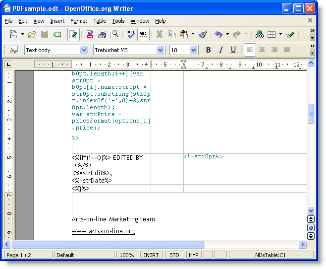

# 產生個人化 PDF 文件{#generating-personalized-pdf-documents}

## 關於變數PDF文檔{#about-variable-pdf-documents}

Adobe Campaign可讓您從LibreOffice或Microsoft Word檔案產生變數PDF檔案（適用於電子郵件附件、直接郵件傳送）。

支援下列擴充功能：&quot;。docx&quot;、&quot;。doc&quot;和&quot;。odt&quot;。

若要個人化您的檔案，可使用與電子郵件個人化相同的JavaScript功能。

您需要啟用&#x200B;**[!UICONTROL "The content of the file is personalized and converted to PDF during the delivery of each message"]**&#x200B;選項。 將檔案附加至傳送電子郵件時，即可存取此選項。 有關附加計算檔案的詳細資訊，請參閱[附加檔案](../../delivery/using/attaching-files.md)區段。

發票題頭個人化範例：


若要透過URL產生動態表格或包含影像，您必須遵循特定程式。

## 生成動態表{#generating-dynamic-tables}

生成動態表的過程如下：

* 建立包含三行且視需要多列的表格，然後設定其配置（邊框等）。
* 將游標放在表上，然後按一下&#x200B;**[!UICONTROL Table > Table properties]**&#x200B;菜單。 前往&#x200B;**[!UICONTROL Table]**&#x200B;標籤，並輸入以&#x200B;**NlJsTable**&#x200B;開頭的名稱。
* 在第一行的第一個儲存格中，定義一個循環（例如「for」），以對要在表格中顯示的值啟用迭代。
* 在表格第二行的每個儲存格中，插入傳回要顯示的值的指令碼。
* 關閉表格第三行和最後一行中的環路。

   動態表格定義的範例：

   

## 插入外部影像{#inserting-external-images}

例如，如果您想要使用在收件者的欄位中輸入URL的影像個人化檔案，則插入外部影像很有用。

若要這麼做，您需要設定個人化區塊，然後在附件中包含對個人化區塊的呼叫。

**範例：根據收件者的國家/地區插入個人化標誌**

**步驟1:建立附件：**

* 插入對個人化區塊的呼叫：**&lt;%@ include view=&quot;blockname&quot; %>**。
* 將您的內容（個人化或不個人化）插入檔案內文。


**步驟2:建立個人化區塊：**

* 前往Adobe Campaign主控台的&#x200B;**[!UICONTROL Resources > Campaign management > Personalization blocks]**&#x200B;功能表。
* 以「My_Logo」作為內部名稱，建立新的「My Logo」個人化區塊。
* 按一下&#x200B;**[!UICONTROL Advanced parameters...]**&#x200B;連結，然後勾選&#x200B;**[!UICONTROL "The content of the block is included in an attachment"]**&#x200B;選項。 這可讓您將個人化區塊的定義直接複製到OpenOffice檔案的內容中。

   

   您需要區分個人化區塊中的兩種宣告：

   * 個人化欄位的Adobe Campaign程式碼，其中「open」和「closed」雪佛蘭必須取代為逸出字元（分別為`&lt;`和`&gt;`）。
   * 整個OpenOffice XML代碼將複製到OpenOffice文檔中。

在範例中，個人化區塊看起來如下：

```
<% if (recipient.country.label == "Germany") { %>
<draw:frame svg:width="4cm" svg:height="3cm">
<draw:image xlink:href=https://..../logo_germany.png />
</draw:frame>
<% } else
if (recipient.country.label == "USA")
{ %>
<draw:frame svg:width="4cm" svg:height="3cm">
<draw:image xlink:href=https://..../logo_USA.png />
</draw:frame>
<% } %>
```

根據收件者的國家/地區，個人化會顯示在連結至傳送的檔案中：


