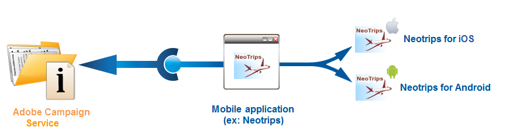

# 開始使用應用程式設定

您可以在本節中找到銷售線上假日套件的公司設定範例。 其行動應用程式(Neotrips)提供兩個版本供客戶使用：Android的Neotrips和iOS的Neotrips。

若要在Adobe Campaign中傳送推播通知，您需要：

* 為Neotrips行動應用程式建立&#x200B;**[!UICONTROL Mobile application]**&#x200B;型別資訊服務。 請參閱iOS[&#128279;](configuring-the-mobile-application.md#configuring-ios-service)的本節。 和[Android](configuring-the-mobile-application-android.md#configuring-android-service)的此區段。
* 將應用程式的iOS和Android版本新增至此服務。
* 建立[iOS](create-notifications-ios.md)和[Android](create-notifications-android.md)的傳遞。

>[!NOTE]
>
>移至服務的&#x200B;**[!UICONTROL Subscriptions]**&#x200B;標籤，以檢視服務的訂閱者清單，亦即已在行動裝置上安裝應用程式並同意接收通知的所有人員。

## 安裝套件 {#installing-package-ios}

[!BADGE 內部部署與混合式]{type=Caution url="https://experienceleague.adobe.com/docs/campaign-classic/using/installing-campaign-classic/architecture-and-hosting-models/hosting-models-lp/hosting-models.html?lang=zh-Hant" tooltip="僅適用於內部部署和混合部署"}

 [瞭解如何在影片中安裝行動應用程式套件](https://experienceleague.adobe.com/docs/campaign-classic-learn/tutorials/sending-messages/push-channel/installing-the-mobile-app-channel.html#sending-messages)

身為混合/託管客戶，請聯絡[Adobe客戶服務](https://helpx.adobe.com/tw/enterprise/admin-guide.html/enterprise/using/support-for-experience-cloud.ug.html)團隊以存取Campaign中的推播通知頻道。

身為內部部署客戶，您必須安裝內建套件。

>[!CAUTION]
>
>在[此頁面](../../installation/using/installing-campaign-standard-packages.md)中進一步瞭解Campaign內建套件、最佳實務和建議。

安裝步驟如下：

1. 從Adobe Campaign使用者端主控台的&#x200B;**[!UICONTROL Tools > Advanced > Import package]**&#x200B;存取套件匯入小幫手。

   

1. 選取 **[!UICONTROL Install a standard package]**。

1. 在出現的清單中，核取&#x200B;**[!UICONTROL Mobile App Channel]**。

   

1. 按一下&#x200B;**[!UICONTROL Next]**，然後按一下&#x200B;**[!UICONTROL Start]**&#x200B;以開始安裝封裝。

   安裝套件後，進度列會顯示&#x200B;**100%**，您可以在安裝記錄檔中看到下列訊息： **[!UICONTROL Installation of packages successful]**。

   

1. **[!UICONTROL Close]**&#x200B;安裝視窗。

完成此步驟後，您就可以設定您的Android和iOS應用程式。
請參閱下列章節：

* [針對 iOS 的設定步驟](configuring-the-mobile-application.md)

* [針對 Android 的設定步驟](configuring-the-mobile-application-android.md)
