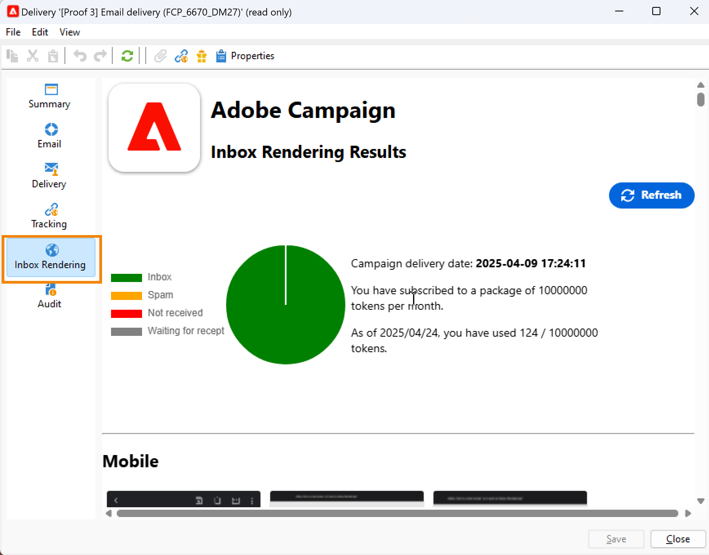

# 收件匣轉譯{#inbox-rendering}


## 關於收件匣轉譯 {#about-inbox-rendering}

在按&#x200B;**Send**&#x200B;按鈕之前，請確定您的郵件會以最佳方式顯示在各種Web用戶端、網頁郵件和裝置上。

為此，Adobe Campaign會運用[Litmus](https://litmus.com/email-testing)網頁型電子郵件測試解決方案來擷取呈現，並在專用報表中提供。 這使您能夠在可能接收郵件的不同上下文中預覽所發送的郵件，並檢查主要案頭和應用程式的相容性。

Litmus是功能豐富的電子郵件驗證和預覽應用程式。 它可讓電子郵件內容建立者在超過70個電子郵件轉譯器（例如Gmail收件匣或Apple Mail用戶端）中預覽其郵件內容。

[Litmus網站](https://litmus.com/email-testing)上列有可用於Adobe Campaign中&#x200B;**收件匣轉譯**&#x200B;的行動裝置、傳訊和網頁郵件用戶端（按一下&#x200B;**檢視所有電子郵件用戶端**）。

>[!NOTE]
>
>在傳送中測試個人化不需要收件匣轉譯。 您可以使用Adobe Campaign工具（例如&#x200B;**[!UICONTROL Preview]**&#x200B;和[Doods](steps-validating-the-delivery.md#sending-a-proof)）來檢查個人化。

## 啟用收件匣轉譯 {#activating-inbox-rendering}

對於托管和混合式用戶端，收件匣轉譯是由Adobe技術支援和顧問在您的執行個體上設定。 如需詳細資訊，請連絡您的Adobe帳戶高階主管。

若為內部部署安裝，請依照下列步驟設定收件匣轉譯。

1. 透過&#x200B;**[!UICONTROL Tools]** > **[!UICONTROL Advanced]** > **[!UICONTROL Import package]**&#x200B;功能表安裝&#x200B;**[!UICONTROL Inbox rendering (IR)]**&#x200B;套件。 有關詳細資訊，請參閱[安裝Campaign Classic標準包](../../installation/using/installing-campaign-standard-packages.md)。
1. 透過&#x200B;**[!UICONTROL Administration]** > **[!UICONTROL Platform]** > **[!UICONTROL External Accounts]**&#x200B;節點設定HTTP類型的外部帳戶。 有關詳細資訊，請參閱[建立外部帳戶](../../installation/using/external-accounts.md#creating-an-external-account)。
1. 按如下方式設定外部帳戶參數：
   * **[!UICONTROL Label]**:傳遞能力伺服器資訊
   * **[!UICONTROL Internal name]**:deliverabilityInstance
   * **[!UICONTROL Type]**: HTTP
   * **[!UICONTROL Server]**:https://deliverability-app.neolane.net/deliverability
   * **[!UICONTROL Encryption]**:無
   * 核取 **[!UICONTROL Enabled]** 選項。

   

1. 前往&#x200B;**[!UICONTROL Administration]** > **[!UICONTROL Platform]** > **[!UICONTROL Options]**&#x200B;節點。 搜尋&#x200B;**[!UICONTROL DmRendering_cuid]**&#x200B;選項並聯絡支援，取得您需要複製到&#x200B;**[!UICONTROL Value (text)]**&#x200B;欄位的傳送報表識別碼。
1. 編輯&#x200B;**serverConf.xml**&#x200B;檔案以允許呼叫Litmus伺服器。 將下列行新增至`<urlPermission>`區段：

   ```
   <url dnsSuffix="deliverability-app.neolane.net" urlRegEx="https://.*"/>
   ```

1. 使用以下命令重新載入配置：

   ```
   nlserver config -reload
   ```

>[!NOTE]
>
>您可能必須從主控台登出並重新登入，才能使用收件匣呈現。

## 關於Litmus權杖 {#about-litmus-tokens}

由於Litmus是第三方服務，因此其運作模式是按使用計分。 每次使用者呼叫Litmus功能時，都會扣除評分。

在Adobe Campaign中，評分對應至可用呈現的數量（稱為代號）。

>[!NOTE]
>
>可用的Litmus權杖數量取決於您購買的Campaign授權。 檢查您的授權合約。

每次您在傳送中使用&#x200B;**[!UICONTROL Inbox rendering]**&#x200B;功能時，產生的每次呈現都會將可用代號減少一。

>[!IMPORTANT]
>
>代號會用於每個個別呈現，而非整個收件匣呈現報表，這表示：
>
>* 每次產生收件匣呈現報表時，每個傳訊用戶端會扣除一個代號：一個Outlook 2000呈現的代號、一個Outlook 2010呈現的代號、一個Apple Mail 9呈現的代號等。
>* 對於相同的傳送，如果您再次產生收件匣轉譯，可用代號的數量會再次減少為產生的轉譯數量。

>


剩餘的可用令牌數顯示在[收件箱呈現報告](#inbox-rendering-report)的&#x200B;**[!UICONTROL General summary]**&#x200B;中。


收件匣轉譯功能通常用於測試新設計之電子郵件的HTML架構。 每次轉譯最多需要70個代號（視通常測試的環境數量而定）。 不過，在某些情況下，您可能需要多個收件匣呈現報表，才能完整測試您的傳送。 因此，可能需要更多代號才能完成數個檢查。

## 存取收件匣呈現報告 {#accessing-the-inbox-rendering-report}

在您建立電子郵件傳送並定義其內容以及目標定位人口族群後，請遵循下列步驟。

如需建立、設計和定位傳送的詳細資訊，請參閱[此區段](about-email-channel.md)。

1. 在傳送的頂端列上，按一下&#x200B;**[!UICONTROL Inbox rendering]**&#x200B;按鈕。
1. 選擇&#x200B;**[!UICONTROL Analyze]**&#x200B;以啟動捕獲進程。

   

   已傳送校樣。 傳送電子郵件後幾分鐘，即可在該校樣中存取呈現的縮圖。 如需傳送校樣的詳細資訊，請參閱[此區段](steps-validating-the-delivery.md#sending-a-proof)。

1. 傳送後，校樣會顯示在傳送清單中。 按兩下。

   

1. 前往校樣的&#x200B;**收件匣轉譯**&#x200B;標籤。

   

   隨即顯示收件匣呈現報告。

## 收件匣呈現報告 {#inbox-rendering-report}

此報表會以收件者看到的方式顯示收件匣呈現。 呈現會因收件者開啟電子郵件傳送的方式而異：在瀏覽器、行動裝置或透過電子郵件應用程式。

**[!UICONTROL General summary]**&#x200B;將接收、不想要（垃圾郵件）、未接收或待接收的消息數作為清單並通過圖形的彩色編碼表示顯示。


將滑鼠指標暫留在圖表上，可顯示每種顏色的詳細資訊。

報告正文分為三部分：**[!UICONTROL Mobile]**、**[!UICONTROL Messaging clients]**&#x200B;和&#x200B;**[!UICONTROL Webmails]**。 向下捲動報告，以顯示分為這三種類別的所有呈現。


若要取得每個報告的詳細資料，請按一下相對應的卡片。會針對所選取接收方法來顯示呈現。


