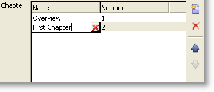

# 輸入表單{#input-forms}

以下是有關在Adobe Campaign中使用輸入表單的一些一般原則。

本節將詳述 [表單](../../configuration/using/identifying-a-form.md)。

## 表單結構 {#form-structure}

輸入表單的XML檔案必須包含 **`<form>`** 根元素，其中 **包含name** 和namespace **** 屬性，以分別填入表單名稱及其namespace。

```
<form name="form_name" namespace="name_space">
...
</form>
```

預設情況下，表單與具有相同名稱和命名空間的資料架構相關聯。 要將表單與不同名稱關聯，請在元素的 **entity-schema屬性中輸入模式鍵****`<form>`** 。

為了說明輸入表單的結構，我們基於示例模式&quot;cus:book&quot;描述一個介面：


這是相應的輸入表單：

```
<form name="book" namespace="cus" type="contentForm">
  <input xpath="@name"/>
  <input xpath="@date"/>
  <input xpath="@language"/>
</form>
```

編輯元素的說明以根元素開 **`<form>`** 頭。

在元素中輸入編輯控 **`<input>`** 制項，其中 **xpath** 屬性包含其架構中欄位的路徑。

**有關XPath語法的提醒：**

Adobe Campaign使用XPath語言來參考屬於資料結構的元素或屬性。

XPath是一種語法，可讓您在XML文檔的樹狀結構中找到節點。

元素由其名稱指定，屬性由名稱前面帶有字元&quot;@&quot;指定。

範例：

* **@date**:選擇名稱為&quot;date&quot;的屬性
* **chapter/@title**:在元素下選取「title」屬 `<chapter>` 性
* **../@date**:從當前要素的父要素中選擇日期

編輯控制項自動適應相應的資料類型並使用模式中定義的標籤。

依預設，每個欄位會顯示在一行上，並佔用所有可用空間，視資料類型而定。

>[!CAUTION]
>
>輸入表單必須參考元 **素上的type=&quot;contentForm&quot;** 屬性， **`<form>`** 以自動新增要輸入內容所需的影格。

## 格式 {#formatting}

控制項彼此相對的排列類似於HTML表格中使用的排列，可將控制項分成多列、交錯元素或指定可用空間的佔用。 但請記住，格式設定僅授權比例分配；不能為對象指定固定尺寸。

如需詳細資訊，請參閱[本小節](../../configuration/using/form-structure.md#formatting)。

## 清單類型控制項 {#list-type-controls}

若要編輯系列元素，您必須使用清單類型控制項。

### 列清單 {#column-list}

此控制項會顯示可編輯的欄清單，其工具列包含「新增」和「刪除」按鈕。



```
<input xpath="chapter" type="list">
  <input xpath="@name"/>
  <input xpath="@number"/>
</input>
```

清單控制項必須填入 **type=&quot;list&quot;屬性** ，清單的路徑必須參照系列元素。

列由清單的子 **`<input>`** 元素聲明。

>[!NOTE]
>
>當資料結構中的收集元素完成 **** ordered=&quot;true&quot;屬性時，會自動新增向上和向下排序箭頭。

依預設，工具列按鈕會垂直對齊。 也可以水準對齊：


```
<input nolabel="true" toolbarCaption="List of chapters" type="list" xpath="chapter">
  <input xpath="@name"/>
  <input xpath="@number"/>
</input>
```

工具 **列Caption** 屬性會強制工具列的水準對齊方式，並填入清單上方的標題。

>[!NOTE]
>
>對於不要顯示在控制項左側的系列元素標籤，請新增 **nolabel=&quot;true&quot;屬性** 。

#### 放大清單 {#zoom-in-a-list}

清單資料的插入和編輯可以在單獨的編輯表單中執行。

在下列情況下，可使用清單中的編輯表單：

* 為方便您輸入資訊，
* 有多線控制，
* 清單中的欄僅包含主要欄位，表單會顯示系列元素的所有欄位。


```
<input nolabel="true" toolbarCaption="List of chapters" type="list" xpath="chapter" zoom="true" zoomOnAdd="true">
  <input xpath="@name"/>
  <input xpath="@number"/>

  <form colcount="2" label="Editing a chapter">
    <input xpath="@name"/>
    <input xpath="@number"/>
    <input colspan="2" xpath="page"/>
  </form>
</input>
```

編輯表單的定義是通過清單元素下 **`<form>`** 的元素指定的。 其結構與輸入形式的結構相同。

當 **[!UICONTROL Detail]** 在清單定義中輸 **** 入zoom=&quot;true&quot;屬性時，會自動新增按鈕。 這可讓您在選取的行上開啟編輯表格。

>[!NOTE]
>
>新增 **zoomOnAdd=&quot;true&quot;屬性** ，會強制在插入清單的元素時呼叫編輯表單。

### 頁籤清單 {#tab-list}

此清單以標籤的形式呈現系列元素的編輯。


```
<container toolbarCaption="List of chapters" type="notebooklist" xpath="chapter" xpath-label="@name">
  <container colcount="2">
    <input xpath="@name"/>
    <input xpath="@number"/>
    <input colspan="2" xpath="page"/>
  </container>
</container>
```

清單控制項必須填入 **type=&quot;notebooklist&quot;屬性** ，清單的路徑必須參照系列元素。

該頁籤的標題包含通過 **xpath-label屬性輸入的資料值** 。

編輯控制項必須宣告在 **`<container>`** 清單控制項的子項元素下。

使用工具列按鈕來新增或刪除清單元素。

>[!NOTE]
>
>為資料結構中的收集元素填入 **** ordered=&quot;true&quot;屬性時，會自動新增向左和向右排序箭頭。

## 容器 {#containers}

容器可讓您將一組控制項分組。 它們透過元素存 **`<container>`** 在。 它們已用於格式化多欄中的控制項，以及用於控制標籤清單。

有關容器以及如何在輸入表單中使用容器的詳細資訊，請參閱 [本節](../../configuration/using/form-structure.md#containers)。

## 編輯表格 {#editing-forms}

編輯區可讓您輸入輸入表單的XML內容：


此標 **[!UICONTROL Preview]** 簽可讓您檢視輸入表單：


