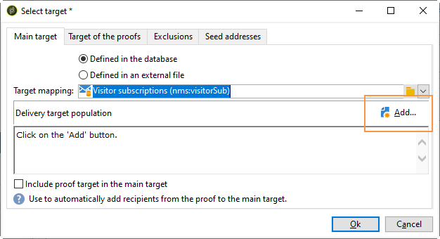
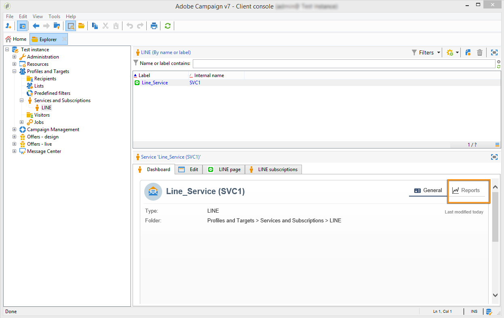
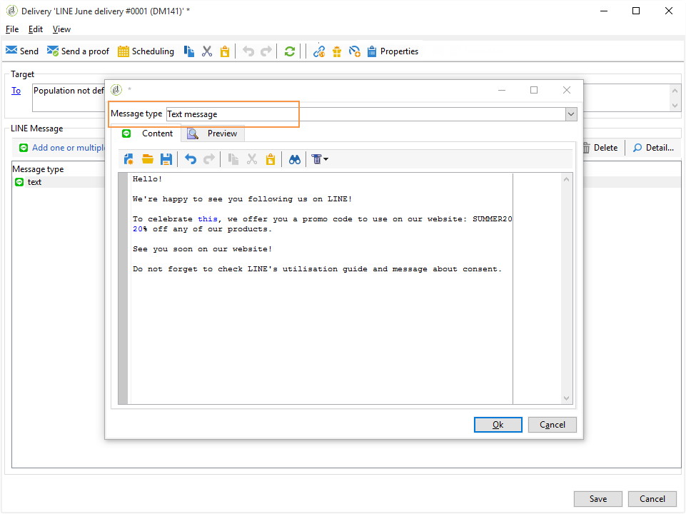
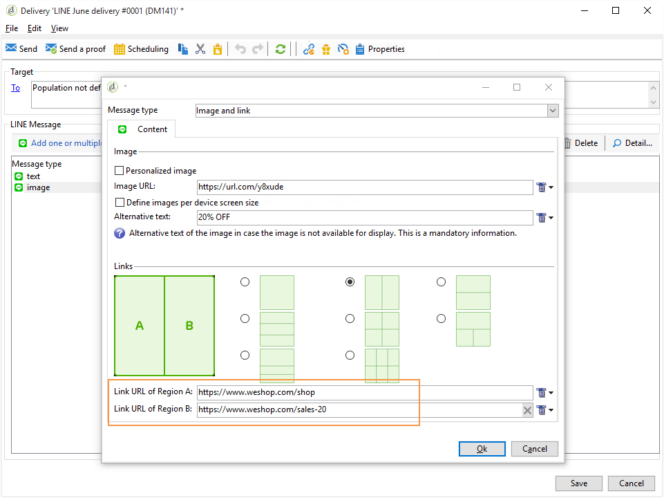
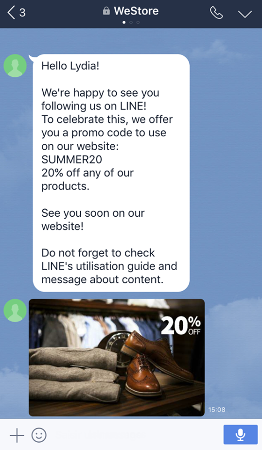

# 建立LINE交貨{#line-channel}

>[!NOTE]
>
>[!DNL LINE] 僅可用於本地或托管服務安裝。

[!DNL LINE] 是一款適用於免費即時消息、語音和視頻通話的應用程式，可在每個移動作業系統和PC上使用。

[!DNL LINE] 還可以與事務消息模組結合，在上面發送即時消息 [!DNL LINE] 應用程式安裝在消費者移動設備中。 如需關於此項目的詳細資訊，請參閱此[頁面](../../message-center/using/transactional-messaging-architecture.md#transactional-messaging-and-line)。

使用 [!DNL LINE] 通道為：

1. [設定LINE通道](#setting-up-line-channel)
1. [建立交貨](#creating-the-delivery)
1. [配置內容類型](#defining-the-content)
1. [監視傳送（跟蹤、隔離、報告等）](#accessing-reports)

## 設定LINE通道 {#setting-up-line-channel}

在建立 [!DNL LINE] 帳戶和外部帳戶，您首先需要在實例上安裝LINE包。 有關此的詳細資訊，請咨詢 [此部分](../../installation/using/installing-campaign-standard-packages.md#line-package)。

必須首先建立 [!DNL LINE] 帳戶，這樣你就能把它連結到Adobe Campaign。 然後，你可以 [!DNL LINE] 向已添加您 [!DNL LINE] 移動應用程式中的帳戶。 外部帳戶和 [!DNL LINE] 帳戶只能由平台的功能管理員管理。

建立和配置 [!DNL LINE] 帳戶，請參閱 [LINE開發人員文檔](https://developers.line.me/)。

### 建立和配置LINE服務 {#configure-line-service}

建立 [!DNL LINE] 服務：

1. 在Adobe Campaign Classic首頁中，選擇 **[!UICONTROL Profiles and Targets]** 頁籤。

1. 在左側菜單中，選擇 **[!UICONTROL Services and Subscriptions]** 按一下 **[!UICONTROL Create]**。

   

1. 添加 **[!UICONTROL Label]** 和 **[!UICONTROL Internal name]** 新服務。

1. 選擇 **[!UICONTROL LINE]** 從 **[!UICONTROL Type]** 下拉。

   

1. 按一下&#x200B;**[!UICONTROL Save]**。

有關訂閱和服務的詳細資訊，請參見 [管理訂閱](managing-subscriptions.md)。

### 配置LINE外部帳戶 {#configure-line-external}

在建立 [!DNL LINE] 服務，您需要配置 [!DNL LINE] Adobe Campaign外部帳戶：

1. 在 **[!UICONTROL Administration]** > **[!UICONTROL Platform]** 樹結構，按一下 **[!UICONTROL External Accounts]** 頁籤。

1. 選擇內置 **[!UICONTROL LINE V2 routing]** 外部帳戶。

   

1. 按一下 **[!UICONTROL LINE]** 的子菜單。 填寫以下欄位：

   

   * **[!UICONTROL Channel Alias]**:通過 [!DNL LINE] 帳戶 **[!UICONTROL Channels]** > **[!UICONTROL Technical configuration]** 頁籤。
   * **[!UICONTROL Channel ID]**:通過 [!DNL LINE] 帳戶 **[!UICONTROL Channels]** > **[!UICONTROL Basic Information panel]** 頁籤。
   * **[!UICONTROL Channel secret key]**:通過 [!DNL LINE] 帳戶 **[!UICONTROL Channels]** > **[!UICONTROL Basic Information panel]** 頁籤。
   * **[!UICONTROL Access token]**:通過 [!DNL LINE] 或按一下 **[!UICONTROL Get access token]** 按鈕
   * **[!UICONTROL Access token expiration date]**:允許您指定訪問令牌的到期日期。
   * **[!UICONTROL LINE subscription service]**:允許您指定用戶將訂閱的服務。

1. 完成設定後，按一下 **[!UICONTROL Save]**。

1. 從 **[!UICONTROL Explorer]**&#x200B;選中 **[!UICONTROL Administration]** > **[!UICONTROL Production]** > **[!UICONTROL Technical workflows]** > **[!UICONTROL LINE workflows]** 檢查 **[!UICONTROL LINE V2 access token update (updateLineAccessToken)]** 和 **[!UICONTROL Delete blocked LINE users (deleteBlockedLineUsers)]** 工作流已啟動。

的 [!DNL LINE] 現在在Adobe Campaign配置，您可以開始建立LINE交付並將其發送給訂閱者。

## 建立LINE交貨 {#creating-the-delivery}

>[!NOTE]
>
>發送 [!DNL LINE] 首次向新接收人傳遞時，您必須將有關使用條款和同意的正式LINE消息添加到傳遞中。 官方資訊可在 [以下連結](https://terms.line.me/OA_privacy/)。

建立 [!DNL LINE] 交付時必須執行以下步驟：

1. 從 **[!UICONTROL Campaigns]** 頁籤 **[!UICONTROL Deliveries]** 然後按一下 **[!UICONTROL Create]** 按鈕

   

1. 選擇 **[!UICONTROL LINE V2 delivery]** 交貨模板。

   

1. 使用 **[!UICONTROL Label]**。 **[!UICONTROL Delivery code]**,  **[!UICONTROL Description]**。 如需詳細資訊，請參閱[本章節](steps-create-and-identify-the-delivery.md#identifying-the-delivery)。

1. 按一下 **[!UICONTROL Continue]** 來建立交貨。

1. 在傳遞編輯器中，選擇 **[!UICONTROL To]** 以目標 [!DNL LINE] 交貨。 目標已執行 **[!UICONTROL Visitor subscriptions (nms:visitorSub)]**。

   有關詳細資訊，請參閱 [確定目標群體](steps-defining-the-target-population.md)。

   

1. 按一下 **[!UICONTROL Add]** 選擇 **[!UICONTROL Delivery target population]**。

   

1. 選擇是否要目標 [!DNL LINE] 直接訂閱或根據用戶 [!DNL LINE] 訂閱，按一下 **[!UICONTROL Next]**。 在此示例中，我們選擇 **[!UICONTROL By LINE V2 subscription]**。

1. 選擇 **[!UICONTROL Line-V2]** 的 **[!UICONTROL Folder]** 然後 [!DNL LINE] 服務。 按一下 **[!UICONTROL Finish]** 然後 **[!UICONTROL Ok]** 開始個性化交付。

   

1. 在交付編輯器中，按一下 **[!UICONTROL Add]** 添加一條或多條消息並選擇 **[!UICONTROL Content type]**。

   有關不同 **[!UICONTROL Content type]** 可用，請參閱 [定義內容類型](#defining-the-content)。

   

1. 在正確建立和配置交貨後，您可以將其發送到先前定義的目標。

   有關發送交貨的詳細資訊，請參閱 [發送消息](sending-messages.md)。

1. 在發送郵件後，請訪問您的報告以衡量傳遞的有效性。

   有關 [!DNL LINE] 報告，請參閱 [訪問報告](#accessing-reports)。

## 定義內容類型 {#defining-the-content}

定義內容 [!DNL LINE] 傳遞，您首先必須將消息類型添加到傳遞。 每個 [!DNL LINE] 傳遞最多可包含5條消息。

您可以選擇以下三種消息類型：

* [簡訊](#configuring-a-text-message-delivery)
* [影像和連結](#configuring-an-image-and-link-delivery)
* [視頻消息](#configuring-a-video-message-delivery)

### 配置文本消息傳遞 {#configuring-a-text-message-delivery}

>[!NOTE]
>
>的 `<%@ include option='NmsServer_URL' %>/webApp/APP3?id=<%=escapeUrl(cryptString(visitor.id))%>` 語法允許您在LINE消息中包含指向Web應用的連結。

A **[!UICONTROL Text message]** [!DNL LINE] delivery是以文本形式發送給收件人的郵件。

此類型消息的配置與 **[!UICONTROL Text]** 郵件里。 有關詳細資訊，請參閱 [頁](defining-the-email-content.md#message-content)。

### 配置映像和連結傳遞 {#configuring-an-image-and-link-delivery}

安 **[!UICONTROL Image and link]** [!DNL LINE] delivery是以可能包含一個或多個URL的影像形式發送給收件人的郵件。

您可以使用：

* a **[!UICONTROL Personalized image]**,

   >[!NOTE]
   >
   >您可以使用 **%大小%** 根據接收者移動裝置的螢幕大小來優化影像顯示。

   

* 一個 **[!UICONTROL Image URL]** 按設備螢幕大小，

   

   的 **[!UICONTROL Define images per device screen size]** 選項允許您使用不同的影像解析度來優化移動設備上的交付可視性。 僅支援具有相同高度和寬度的影像。

   可以根據螢幕大小定義影像：

   * 1040px
   * 700px
   * 460px
   * 300px
   * 240px

   >[!CAUTION]
   >
   >每個帶連結的LINE映像都必須使用1040x1040像素大小。

   然後，您必須添加將在收件人的移動設備上彈出的替代文本。

* 和 **[!UICONTROL Links]**.

   的 **[!UICONTROL Links]** 部分允許您在將影像分割為多個可按一下區域的不同佈局之間進行選擇。 然後，您可以為每個 **[!UICONTROL Link URL]**。

   

### 配置視頻消息傳遞 {#configuring-a-video-message-delivery}

A **[!UICONTROL Video message]** [!DNL LINE] delivery是以可包含URL的視頻形式發送給收件人的郵件。

的 **[!UICONTROL Preview Image URL]** 欄位允許您添加字元限制為1000的預覽影像的URL。 JPEG和PNG受1 MB的檔案大小限制支援。

的 **[!UICONTROL Video Image URL]** 欄位中，可以添加字元限制為1000的視頻檔案的URL。 檔案大小限制為200 MB時僅支援mp4格式。

請注意，在某些設備上播放時可能會裁剪寬視頻或高視頻。

## 訪問報告 {#accessing-reports}

在發送交貨後，您可以查看 [!DNL LINE] 通過菜單報告 **[!UICONTROL Campaign Management]** > **[!UICONTROL Deliveries]** 從 **[!UICONTROL Explorer]**。

>[!NOTE]
>
>跟蹤報告指示點擊率。 [!DNL LINE] 沒有考慮未結匯率。

對於 [!DNL LINE] 服務報告，訪問菜單 **[!UICONTROL Profiles and Targets]** > **[!UICONTROL Services and Subscriptions]** > **[!UICONTROL LINE-V2]** 從 **[!UICONTROL Explorer]** 頁籤。 然後按一下 **[!UICONTROL Reports]** 的 [!DNL LINE] 服務。

## 示例：建立併發送個性化LINE消息 {#example--create-and-send-a-personalized-line-message}

在本示例中，我們將建立和配置包含資料的文本消息和影像，這些資料將根據收件人進行個性化。

1. 建立 [!DNL LINE] 通過按一下 **[!UICONTROL Create]** 按鈕 **[!UICONTROL Campaign]** 頁籤。

   

1. 選擇 **[!UICONTROL LINE V2 delivery]** 交貨模板並命名交貨。

   

1. 在交貨的配置窗口中，選擇目標填充。

   有關詳細資訊，請參閱 [確定目標群體](steps-defining-the-target-population.md)。

   

1. 按一下 **[!UICONTROL Add]** 建立消息並選擇 **[!UICONTROL Content type]**。

   在這裡，我們首先要建立 **[!UICONTROL Text message]**。

   

1. 將游標置於要插入個性化文本的位置，然後按一下下拉表徵圖，然後選擇 **[!UICONTROL Visitor]** > **[!UICONTROL First name]**。

   

1. 按照相同的步驟添加影像，選擇 **[!UICONTROL Image and links]** 的 **[!UICONTROL Message type]** 下拉。

   添加 **[!UICONTROL Image URL]**。

   

1. 在 **[!UICONTROL Links]** 的子菜單。

1. 為影像的每個區域分配URL。

   

1. 保存交貨，然後按一下 **[!UICONTROL Send]** 分析併發送到目標。

   將傳遞發送到目標。

   

