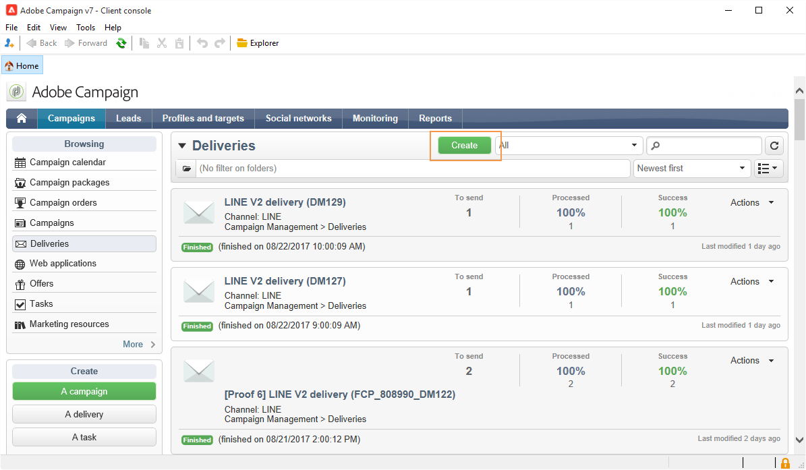

# 建立LINE交貨{#line-channel}

LINE是免費即時訊息、語音和視訊通話的應用程式，適用於所有智慧型手機(iPhone、Android、Windows Phone、Blackberry、Nokia)和PC。 Adobe Campaign允許您發送LINE消息。

LINE僅適用於內部部署或托管服務安裝。

LINE也可與交易訊息模組結合，以在安裝在消費性行動裝置上的LINE應用程式上傳送即時訊息。 如需關於此項目的詳細資訊，請參閱此[頁面](../../message-center/using/transactional-messaging-architecture.md#transactional-messaging-and-line)。

以下各節提供LINE頻道專屬的資訊。 有關如何建立傳送的全局資訊，請參閱[本節](../../delivery/using/steps-about-delivery-creation-steps.md)。

使用LINE渠道的步驟如下：

1. 建立傳送
1. 配置消息內容
1. 選擇目標人口
1. 傳送訊息
1. 監控傳送（追蹤、隔離、報告等）。

## 設定LINE通道{#setting-up-line-channel}

### 建立LINE帳戶和外部帳戶{#creating-a-line-account-and-an-external-account-}

>[!NOTE]
>
>在建立LINE帳戶和外部帳戶之前，您必須先將LINE套件安裝在實例上。 有關此問題的詳細資訊，請參閱《安裝指南》中的[LINE](../../installation/using/installing-campaign-standard-packages.md#line-package)部分。

您必須先建立LINE帳戶，以便將其連結至Adobe Campaign。 然後，您可以傳送LINE訊息給已在行動應用程式中新增您LINE帳戶的使用者。 外部帳戶和LINE帳戶只能由平台的功能管理員管理。

要建立和配置LINE帳戶，請參閱[https://developers.line.me/](https://developers.line.me/)。

要建立和配置LINE服務，請參閱[管理預訂](../../delivery/using/managing-subscriptions.md)。

最後，要在Adobe Campaign建立外部帳戶：

1. 在&#x200B;**管理** > **平台**&#x200B;樹結構中，按一下&#x200B;**外部帳戶**&#x200B;頁籤。
1. 然後按一下&#x200B;**新增**&#x200B;圖示。

   

1. 填寫&#x200B;**Label**&#x200B;和&#x200B;**Internal name**&#x200B;欄位。
1. 在&#x200B;**[!UICONTROL Type]**&#x200B;欄位中，選擇路由，在&#x200B;**Channel**&#x200B;欄位中，選擇LINE。
1. 按一下&#x200B;**[!UICONTROL Save]**&#x200B;建立您的LINE外部帳戶。
1. 然後，**LINE**&#x200B;個人化欄位會出現在&#x200B;**General**&#x200B;圖示下，填寫下列欄位：

   

   * **渠道別名**:是透過您的LINE帳戶在>標籤中 **[!UICONTROL Channels]** 提供 **[!UICONTROL Technical configuration]** 的。
   * **頻道ID**:是透過「渠道 **>基本資訊」面板** 標籤中 **的** LINE帳戶提供。
   * **通道密鑰**:是透過「渠道 **>基本資訊」面板** 標籤中 **的** LINE帳戶提供。
   * **存取Token**:是透過您在開發人員入口網站中的LINE帳戶，或按一下按鈕提 **[!UICONTROL Get access token]** 供。
   * **存取Token到期日**:可讓您指定存取Token的到期日。
   * **LINE訂閱服務**:允許您指定用戶將訂閱的服務。

>[!NOTE]
>
>您必須確認&#x200B;**[!UICONTROL LINE access token update (updateLineAccessToken)]**&#x200B;和&#x200B;**[!UICONTROL Delete blocked LINE users (deleteBlockedLineUsers)]**&#x200B;工作流是否已啟動。 在瀏覽器中，按一下&#x200B;**[!UICONTROL Administration > Production > Technical workflows > LINE workflows]**&#x200B;以檢查工作流的狀態。

## 建立傳送 {#creating-the-delivery}

要建立&#x200B;**LINE**&#x200B;交貨，必須執行以下步驟：

>[!NOTE]
>
>在[本節](../../delivery/using/steps-about-delivery-creation-steps.md)中介紹了建立交付的全局概念。

1. 在&#x200B;**[!UICONTROL Campaigns]**&#x200B;標籤中，選擇&#x200B;**[!UICONTROL Deliveries]**，然後按一下&#x200B;**[!UICONTROL Create]**&#x200B;按鈕。
1. 在出現的視窗中，選取&#x200B;**[!UICONTROL LINE V2 delivery]**&#x200B;傳送範本。

   

1. 使用標籤、程式碼和說明來識別您的傳送。 如需詳細資訊，請參閱[本章節](../../delivery/using/steps-create-and-identify-the-delivery.md#identifying-the-delivery)。
1. 按一下&#x200B;**[!UICONTROL Continue]**&#x200B;以建立傳送。

## 定義內容 {#defining-the-content}

要定義LINE傳送的內容，首先必須向傳送添加消息類型。 每個LINE傳送最多可包含5條消息。

您可以選擇兩種消息類型：

* 文字訊息
* 影像和連結

### 配置文本消息傳送{#configuring-a-text-message-delivery}

**文本消息** LINE發送是以文本形式發送給收件人的消息。

此類型訊息的組態類似電子郵件中&#x200B;**text**&#x200B;的組態。 如需詳細資訊，請參閱此[頁面](../../delivery/using/defining-the-email-content.md#message-content)。

### 設定影像和連結傳送{#configuring-an-image-and-link-delivery}

**影像和連結** LINE傳送是以影像形式傳送給收件者的訊息，可包含一或多個URL。

您可以使用：

* a **個人化影像**,

   >[!NOTE]
   >
   >您可以使用&#x200B;**%SIZE%**&#x200B;變數：此變數可讓您根據收件者行動裝置的螢幕大小，最佳化影像顯示。

   

* an **影像URL**,

   

   影像URL可讓您使用不同的影像解析度，以最佳化行動裝置上的傳送可見度。 僅支援相同高度和寬度的影像。

   您可以根據螢幕大小來定義影像：

   * 1040px
   * 700px
   * 460px
   * 300px
   * 240px

   >[!NOTE]
   >
   >每個具有連結的LINE影像都必須使用1040x1040像素大小。

   然後，您必須新增會在收件者行動裝置上彈出的替代文字。

* 和&#x200B;**[!UICONTROL Links]**。

   

   **[!UICONTROL Links]**&#x200B;區段可讓您選擇不同的版面，這些版面會在多個可點選區域分割影像。 然後，您可以為每位使用者指派專屬連結。

>[!NOTE]
>
>&lt;%@ include option=&#39;NmsServer_URL&#39; %>/webApp/APP3?id=&lt;%=escapeUrl(cryptString(visitor.id))%>語法可讓您在LINE訊息中包含網頁應用程式的連結。

### 建議 {#recommendations}

* 當您第一次將LINE傳送傳送給新的收件者時，必須將有關使用條款和同意的正式LINE訊息新增至傳送。 官方訊息可從下列連結取得：[https://terms.line.me/OA_privacy/](https://terms.line.me/OA_privacy/sp?lang=fr)。

## 選擇目標人口{#selecting-the-target-population}

選擇LINE傳送的收件者類似於定義電子郵件傳送的收件者。 如需詳細資訊，請參閱[識別目標群體](../../delivery/using/steps-defining-the-target-population.md)。

定位是對&#x200B;**訪客**&#x200B;執行。

## 傳送訊息 {#sending-messages}

當您的傳送已建立並正確設定時，您可以將它傳送至先前定義的目標。

傳送LINE傳送類似於傳送電子郵件傳送。 有關發送傳送的詳細資訊，請參閱[發送消息](../../delivery/using/sending-messages.md)。

## 訪問報告{#accessing-reports}

通過按一下瀏覽器中的&#x200B;**[!UICONTROL Profiles and Targets > Services and Subscriptions > LINE]**，可以查看LINE服務的報告。 然後按一下LINE服務中的&#x200B;**[!UICONTROL Reports]**&#x200B;表徵圖。

要查看有關LINE交貨的報表，請按一下&#x200B;**[!UICONTROL Campaign Management > Deliveries]** ，然後選擇所需的交貨。 追蹤報表會指出點進率。 LINE未考慮開放率。

## 範例：建立併發送個性化的LINE消息{#example--create-and-send-a-personalized-line-message}

在此範例中，我們將建立並設定文字訊息和包含資料的影像，這些資料會根據收件者個人化。

1. 按一下&#x200B;**[!UICONTROL Campaign]**&#x200B;頁籤中的&#x200B;**[!UICONTROL Create]**&#x200B;按鈕，建立LINE傳送。

   

1. 選擇&#x200B;**[!UICONTROL LINE V2 delivery]**&#x200B;傳送範本並命名傳送。

   

1. 在傳送的設定視窗中，選取您的目標人口。

   

1. 按一下&#x200B;**[!UICONTROL Add]**&#x200B;建立消息並選擇&#x200B;**[!UICONTROL Message type]**。

   在這裡，我們首先要建立文字訊息。

   

1. 將游標置於要插入個人化文字的位置，然後按一下下拉式圖示，然後選取&#x200B;**[!UICONTROL Visitor > First name]**。

   

1. 按照相同的步驟添加映像，在&#x200B;**[!UICONTROL Message type]**&#x200B;下拉清單中選擇&#x200B;**[!UICONTROL Image and links]**。

   新增您的影像URL。

   

1. 在&#x200B;**[!UICONTROL Links]**&#x200B;區段中，選取將影像分割為多個可點選區域的版面。
1. 為影像的每個區域指派URL。

   

1. 儲存傳送內容，然後按一下&#x200B;**[!UICONTROL Send]**&#x200B;以分析並傳送至目標。

   傳送內容會傳送至目標。

   
