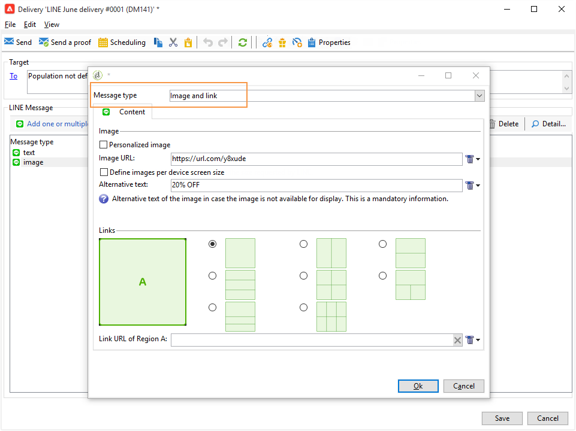

# 建立LINE傳遞{#line-channel}

[!DNL LINE] 是免費立即訊息、語音和視訊通話的應用程式，可在每個行動作業系統和個人電腦上使用。

[!DNL LINE] 也可以與異動訊息模組結合，以在頁面上傳送即時訊息 [!DNL LINE] 安裝在消費者行動裝置中的應用程式。 如需關於此項目的詳細資訊，請參閱此[頁面](../../message-center/using/transactional-messaging-architecture.md#transactional-messaging-and-line)。

使用的步驟 [!DNL LINE] 頻道為：

1. [設定LINE頻道](#setting-up-line-channel)
1. [建立傳遞](#creating-the-delivery)
1. [設定內容型別](#defining-the-content)
1. [監控傳送（追蹤、隔離、報告等）](#accessing-reports)

## 設定LINE頻道 {#setting-up-line-channel}

建立之前 [!DNL LINE] 帳戶和外部帳戶，您首先需要在執行個體上安裝LINE套件。 如需此專案的詳細資訊，請參閱 [本節](../../installation/using/installing-campaign-standard-packages.md#line-package).

您必須先建立 [!DNL LINE] 帳戶，以便將其連結至Adobe Campaign。 然後，您可以傳送 [!DNL LINE] 傳送訊息給已新增您的 [!DNL LINE] 帳戶移動應用程式。 外部帳戶和 [!DNL LINE] 帳戶只能由平台的功能管理員管理。

若要建立和設定 [!DNL LINE] 帳戶，請參閱 [LINE開發人員檔案](https://developers.line.me/).

### 建立和設定LINE服務 {#configure-line-service}

若要建立 [!DNL LINE] 服務：

1. 從Adobe Campaign Classic首頁選取 **[!UICONTROL Profiles and Targets]** 標籤。

1. 在左側功能表中，選取 **[!UICONTROL Services and Subscriptions]** 並按一下 **[!UICONTROL Create]**.

   

1. 新增 **[!UICONTROL Label]** 和 **[!UICONTROL Internal name]** 新服務。

1. 選取 **[!UICONTROL LINE]** 從 **[!UICONTROL Type]** 下拉式清單。

   

1. 按一下&#x200B;**[!UICONTROL Save]**。

如需訂閱與服務的詳細資訊，請參閱 [管理訂閱](managing-subscriptions.md).

### 設定LINE外部帳戶 {#configure-line-external}

建立您的 [!DNL LINE] 服務，您需要設定 [!DNL LINE] Adobe Campaign上的外部帳戶：

1. 在 **[!UICONTROL Administration]** > **[!UICONTROL Platform]** 樹狀結構，按一下 **[!UICONTROL External Accounts]** 標籤。

1. 選取內建 **[!UICONTROL LINE V2 routing]** 外部帳戶。

   

1. 按一下 **[!UICONTROL LINE]** 從外部帳戶中選取「 」標籤，以開始設定外部帳戶。 填寫下列欄位：

   

   * **[!UICONTROL Channel Alias]**：透過您的網站提供 [!DNL LINE] 中的帳戶 **[!UICONTROL Channels]** > **[!UICONTROL Technical configuration]** 標籤。
   * **[!UICONTROL Channel ID]**：透過您的網站提供 [!DNL LINE] 中的帳戶 **[!UICONTROL Channels]** > **[!UICONTROL Basic Information panel]** 標籤。
   * **[!UICONTROL Channel secret key]**：透過您的網站提供 [!DNL LINE] 中的帳戶 **[!UICONTROL Channels]** > **[!UICONTROL Basic Information panel]** 標籤。
   * **[!UICONTROL Access token]**：透過您的網站提供 [!DNL LINE] 開發人員入口網站中的帳戶或按一下 **[!UICONTROL Get access token]** 按鈕。
   * **[!UICONTROL Access token expiration date]**：可讓您指定存取權杖的到期日。
   * **[!UICONTROL LINE subscription service]**：可讓您指定使用者將訂閱的服務。

1. 完成設定後，按一下 **[!UICONTROL Save]**。

1. 從 **[!UICONTROL Explorer]**，選取 **[!UICONTROL Administration]** > **[!UICONTROL Production]** > **[!UICONTROL Technical workflows]** > **[!UICONTROL LINE workflows]** 以檢查 **[!UICONTROL LINE V2 access token update (updateLineAccessToken)]** 和 **[!UICONTROL Delete blocked LINE users (deleteBlockedLineUsers)]** 工作流程已開始。

此 [!DNL LINE] 現在已在Adobe Campaign中設定，您可以開始建立LINE傳遞並傳送給訂閱者。

## 建立LINE傳遞 {#creating-the-delivery}

>[!NOTE]
>
>傳送時 [!DNL LINE] 第一次傳遞給新收件者時，您必須將有關使用條款和同意的官方LINE訊息新增至傳遞中。 官方訊息可在以下網址取得： [下列連結](https://terms.line.me/OA_privacy/).

若要建立 [!DNL LINE] 傳送您必須遵循下列步驟：

1. 從 **[!UICONTROL Campaigns]** 索引標籤，選取 **[!UICONTROL Deliveries]** 然後按一下 **[!UICONTROL Create]** 按鈕。

   

1. 選取 **[!UICONTROL LINE V2 delivery]** 傳遞範本。

   

1. 透過識別您的傳遞 **[!UICONTROL Label]**， **[!UICONTROL Delivery code]**、和  **[!UICONTROL Description]**. 如需詳細資訊，請參閱[本章節](steps-create-and-identify-the-delivery.md#identifying-the-delivery)。

1. 按一下 **[!UICONTROL Continue]** 以建立您的傳遞。

1. 在傳遞編輯器中，選取 **[!UICONTROL To]** 將目標鎖定在您的 [!DNL LINE] 傳遞。 目標定位執行於 **[!UICONTROL Visitor subscriptions (nms:visitorSub)]**.

   如需詳細資訊，請參閱 [識別目標母體](steps-defining-the-target-population.md).

   

1. 按一下 **[!UICONTROL Add]** 以選取您的 **[!UICONTROL Delivery target population]**.

   

1. 選擇是否要定位 [!DNL LINE] 直接訂閱者，或如果您想要根據訂閱者的訂閱者以目標定位使用者， [!DNL LINE] 訂閱並按一下 **[!UICONTROL Next]**. 在此範例中，我們選取 **[!UICONTROL By LINE V2 subscription]**.

1. 選取 **[!UICONTROL Line-V2]** 在 **[!UICONTROL Folder]** 下拉式清單，然後您的 [!DNL LINE] 服務。 按一下 **[!UICONTROL Finish]** 則 **[!UICONTROL Ok]** 以開始個人化您的傳遞。

   

1. 在傳遞編輯器中，按一下 **[!UICONTROL Add]** 以新增一或多則訊息並選取 **[!UICONTROL Content type]**.

   如需不同產品的詳細資訊， **[!UICONTROL Content type]** 可用，請參閱 [定義內容型別](#defining-the-content).

   

1. 正確建立與設定您的傳遞後，您可以將其傳送至先前定義的目標。

   如需傳送傳送的詳細資訊，請參閱 [傳送訊息](sending-messages.md).

1. 傳送訊息後，存取報表以評估傳送的成效。

   如需詳細資訊，請參閱 [!DNL LINE] 報表，請參閱 [存取報告](#accessing-reports).

## 定義內容型別 {#defining-the-content}

若要定義 [!DNL LINE] 傳送，您必須先將訊息型別新增至傳送。 每個 [!DNL LINE] 傳遞最多可包含5則訊息。

您可以在三種訊息型別之間進行選擇：

* [文字訊息](#configuring-a-text-message-delivery)
* [影像和連結](#configuring-an-image-and-link-delivery)
* [影片訊息](#configuring-a-video-message-delivery)

### 設定文字訊息傳送 {#configuring-a-text-message-delivery}

>[!NOTE]
>
>此 `<%@ include option='NmsServer_URL' %>/webApp/APP3?id=<%=escapeUrl(cryptString(visitor.id))%>` 語法可讓您將網頁應用程式的連結包含在LINE訊息中。

A **[!UICONTROL Text message]** [!DNL LINE] 傳遞是以文字形式傳送給收件者的訊息。

此型別訊息的設定類似於 **[!UICONTROL Text]** 在電子郵件中。 如需詳細資訊，請參閱此 [頁面](defining-the-email-content.md#message-content).

### 設定影像和連結傳送 {#configuring-an-image-and-link-delivery}

一個 **[!UICONTROL Image and link]** [!DNL LINE] 傳遞是以影像形式傳送給收件者的訊息，其中可能包含一或多個URL。

您可以使用：

* a **[!UICONTROL Personalized image]**，

  >[!NOTE]
  >
  >您可以使用 **%SIZE%** 變數，以根據收件者行動裝置的熒幕大小最佳化影像顯示。

  

* 一個 **[!UICONTROL Image URL]** 每個裝置的熒幕大小，

  

  此 **[!UICONTROL Define images per device screen size]** 選項可讓您使用不同的影像解析度，以最佳化行動裝置上的傳遞可見度。 僅支援具有相同高度和寬度的影像。

  您可以根據熒幕大小定義影像：

   * 1040畫素
   * 700畫素
   * 460畫素
   * 300畫素
   * 240畫素

  >[!CAUTION]
  >
  >每個具有連結的LINE影像都必須有1040x1040畫素大小。

  之後，您必須新增會出現在收件者行動裝置上的替代文字。

* 和 **[!UICONTROL Links]**.

  此 **[!UICONTROL Links]** 區段可讓您在不同的版面之間進行選擇，將影像分割成多個可點選區域。 然後，您可以為每個使用者指派一個專用的 **[!UICONTROL Link URL]**.

  

### 設定視訊訊息傳送 {#configuring-a-video-message-delivery}

A **[!UICONTROL Video message]** [!DNL LINE] 傳遞是以影片形式傳送給收件者的訊息，其中可包含URL。

此 **[!UICONTROL Preview Image URL]** 欄位可讓您新增字元限製為1000的預覽影像URL。 支援JPEG和PNG，檔案大小限製為1 MB。

此 **[!UICONTROL Video Image URL]** 欄位可讓您新增字元限製為1000的視訊檔案URL。 只有200 MB的檔案大小限制才支援mp4格式。

請注意，在某些裝置上播放寬視訊或高視訊時，可能會遭到裁剪。

## 存取報告 {#accessing-reports}

傳送傳遞後，您可以檢視您的 [!DNL LINE] 透過功能表建立報表 **[!UICONTROL Campaign Management]** > **[!UICONTROL Deliveries]** 從 **[!UICONTROL Explorer]**.

>[!NOTE]
>
>追蹤報表會指出點進率。 [!DNL LINE] 未考量未結匯率。

的 [!DNL LINE] 服務報表，存取功能表 **[!UICONTROL Profiles and Targets]** > **[!UICONTROL Services and Subscriptions]** > **[!UICONTROL LINE-V2]** 從 **[!UICONTROL Explorer]** 標籤。 然後按一下 **[!UICONTROL Reports]** 圖示於 [!DNL LINE] 服務。

## 範例：建立並傳送個人化LINE訊息 {#example--create-and-send-a-personalized-line-message}

在此範例中，我們將建立和設定文字訊息和影像，其中包含將根據收件者進行個人化的資料。

1. 建立您的 [!DNL LINE] 透過按一下 **[!UICONTROL Create]** 按鈕來自 **[!UICONTROL Campaign]** 標籤。

   

1. 選取 **[!UICONTROL LINE V2 delivery]** 傳遞範本並命名您的傳遞。

   

1. 在傳送的設定視窗中，選取目標母體。

   如需詳細資訊，請參閱 [識別目標母體](steps-defining-the-target-population.md).

   

1. 按一下 **[!UICONTROL Add]** 以建立訊息並選取 **[!UICONTROL Content type]**.

   首先，我們要建立 **[!UICONTROL Text message]**.

   

1. 將游標放在您要插入個人化文字的位置，然後按一下下拉式圖示，然後選取 **[!UICONTROL Visitor]** > **[!UICONTROL First name]**.

   

1. 依照相同的程式新增影像，選取 **[!UICONTROL Image and links]** 在 **[!UICONTROL Message type]** 下拉式清單。

   新增您的 **[!UICONTROL Image URL]**.

   

1. 在 **[!UICONTROL Links]** 區段，選取將影像分割成多個可點選區域的版面。

1. 將URL指派給影像的每個區域。

   

1. 儲存您的傳遞，然後按一下 **[!UICONTROL Send]** 以分析並傳送至目標。

   傳送至目標。

   

