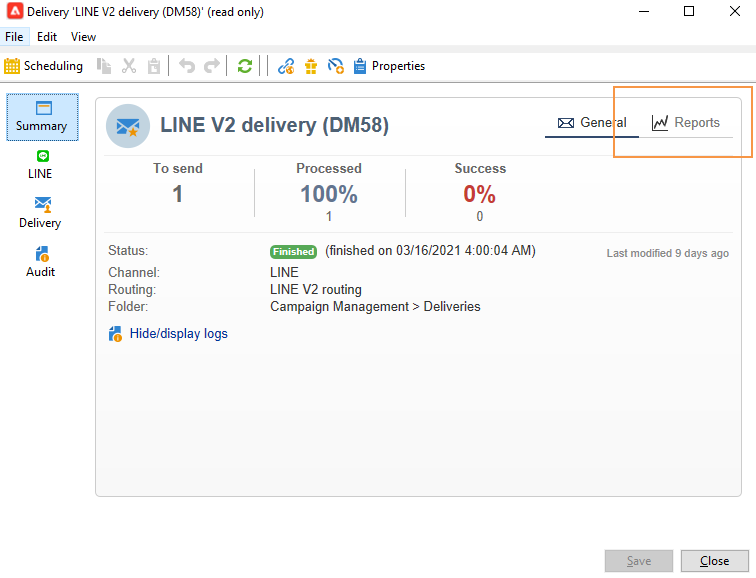

# 建立LINE傳送{#line-channel}

LINE是一種免費即時消息、語音和視頻呼叫的應用程式，可在所有智慧手機(iPhone、Android、Windows Phone、Blackberry、Nokia)和PC上使用。 Adobe Campaign可讓您傳送LINE訊息。

LINE僅適用於內部部署或托管服務安裝。

LINE也可與交易式訊息模組結合，以在安裝在消費者行動裝置中的LINE應用程式上傳送即時訊息。 如需關於此項目的詳細資訊，請參閱此[頁面](../../message-center/using/transactional-messaging-architecture.md#transactional-messaging-and-line)。

以下各節提供LINE通道的特定資訊。 如需如何建立傳送的全域資訊，請參閱[此區段](../../delivery/using/steps-about-delivery-creation-steps.md)。

使用LINE通道的步驟如下：

1. 建立傳遞
1. 設定訊息內容
1. 選取目標母體
1. 傳送訊息
1. 監控傳送（追蹤、隔離、報表等）。

## 設定LINE通道{#setting-up-line-channel}

### 建立LINE帳戶和外部帳戶{#creating-a-line-account-and-an-external-account-}

>[!NOTE]
>
>建立LINE帳戶和外部帳戶之前，您必須先在執行個體上安裝LINE套件。 有關詳細資訊，請參閱《安裝指南》中的[LINE](../../installation/using/installing-campaign-standard-packages.md#line-package)部分。

您必須先建立LINE帳戶，然後才能將其連結至Adobe Campaign。 然後，您可以將LINE消息發送給已在其移動應用程式中添加了LINE帳戶的用戶。 外部帳戶和LINE帳戶只能由平台的功能管理員管理。

要建立和配置LINE帳戶，請參閱[https://developers.line.me/](https://developers.line.me/)。

要建立和配置LINE服務，請參閱[管理訂閱](../../delivery/using/managing-subscriptions.md)。

最後，若要在Adobe Campaign上建立外部帳戶：

1. 在&#x200B;**Administration** > **Platform**&#x200B;樹結構中，按一下&#x200B;**External Accounts**&#x200B;頁簽。
1. 然後按一下&#x200B;**New**&#x200B;圖示。

   

1. 填寫&#x200B;**Label**&#x200B;和&#x200B;**內部名稱**&#x200B;欄位。
1. 在&#x200B;**[!UICONTROL Type]**&#x200B;欄位中，選擇「路由」，在&#x200B;**Channel**&#x200B;欄位中，選擇LINE。
1. 按一下&#x200B;**[!UICONTROL Save]**&#x200B;以建立您的LINE外部帳戶。
1. **LINE**&#x200B;個人化欄位隨後出現在&#x200B;**一般**&#x200B;圖示下方，填入下列欄位：

   

   * **通道別名**:是透過您在>標籤中的LINE帳 **[!UICONTROL Channels]** 戶提 **[!UICONTROL Technical configuration]** 供。
   * **管道ID**:是透過「管道」>「基本資訊」面 **板中的LINE帳** 戶提 **** 供的。
   * **通道密鑰**:是透過「管道」>「基本資訊」面 **板中的LINE帳** 戶提 **** 供的。
   * **存取權杖**:是透過您在開發人員入口網站中的LINE帳戶，或按一下按鈕來 **[!UICONTROL Get access token]** 提供。
   * **存取權杖到期日**:可讓您指定存取權杖的到期日。
   * **LINE訂閱服務**:可讓您指定將訂閱使用者的服務。

>[!NOTE]
>
>您必須確認&#x200B;**[!UICONTROL LINE access token update (updateLineAccessToken)]**&#x200B;和&#x200B;**[!UICONTROL Delete blocked LINE users (deleteBlockedLineUsers)]**&#x200B;工作流程已啟動。 在瀏覽器中，按一下&#x200B;**[!UICONTROL Administration > Production > Technical workflows > LINE workflows]**&#x200B;以檢查工作流的狀態。

## 建立傳送 {#creating-the-delivery}

若要建立&#x200B;**LINE**&#x200B;傳遞，您必須遵循下列步驟：

>[!NOTE]
>
>傳遞建立的全域概念在[此小節](../../delivery/using/steps-about-delivery-creation-steps.md)中介紹。

1. 從&#x200B;**[!UICONTROL Campaigns]**&#x200B;頁簽中，選擇&#x200B;**[!UICONTROL Deliveries]** ，然後按一下&#x200B;**[!UICONTROL Create]**&#x200B;按鈕。
1. 在顯示的視窗中，選取&#x200B;**[!UICONTROL LINE V2 delivery]**&#x200B;傳送範本。

   

1. 使用標籤、程式碼和說明來識別您的傳送。 如需詳細資訊，請參閱[本章節](../../delivery/using/steps-create-and-identify-the-delivery.md#identifying-the-delivery)。
1. 按一下&#x200B;**[!UICONTROL Continue]**&#x200B;以建立傳遞。

## 定義內容 {#defining-the-content}

若要定義LINE傳送的內容，您必須先將訊息類型新增至傳送。 每個LINE傳送最多可包含5則訊息。

您可以選擇兩種訊息類型：

* 文字訊息
* 影像和連結

### 配置文本消息傳送{#configuring-a-text-message-delivery}

**文字訊息** LINE傳送是以文字形式傳送給收件者的訊息。

此類型訊息的設定類似於電子郵件中&#x200B;**text**&#x200B;的設定。 如需詳細資訊，請參閱此[page](../../delivery/using/defining-the-email-content.md#message-content)。

### 設定影像和連結傳送{#configuring-an-image-and-link-delivery}

**影像和連結** LINE傳送是以影像形式傳送給收件者的訊息，可能包含一或多個URL。

您可以使用：

* a **個人化影像**,

   >[!NOTE]
   >
   >您可以使用&#x200B;**%SIZE%**&#x200B;變數：此變數可讓您根據收件者行動裝置的螢幕大小，最佳化影像顯示。

   

* an **影像URL**,

   

   影像URL可讓您使用不同的影像解析度，以最佳化行動裝置上的傳送可見性。 僅支援高度和寬度相同的影像。

   可根據螢幕大小定義影像：

   * 1040px
   * 700px
   * 460px
   * 300px
   * 240px

   >[!NOTE]
   >
   >每個具有連結的LINE影像都必須大小為1040x1040像素。

   然後，您必須新增會在收件者行動裝置上顯示的替代文字。

* 和&#x200B;**[!UICONTROL Links]**。

   

   **[!UICONTROL Links]**&#x200B;區段可讓您在將影像分割成多個可點按區域的不同配置之間進行選擇。 然後，您可為每個使用者指派專用連結。

>[!NOTE]
>
>&lt;%@ include選項=&#39;NmsServer_URL&#39; %>/webApp/APP3?id=&lt;%=escapeUrl(cryptString(visitor.id))%>語法可讓您在LINE訊息中包含網頁應用程式的連結。

### 建議 {#recommendations}

* 第一次將LINE傳送傳送給新收件者時，您必須將有關使用條款與同意的官方LINE訊息新增至傳送。 官方訊息可透過下列連結取得：[https://terms.line.me/OA_privacy/](https://terms.line.me/OA_privacy/sp?lang=fr)。

## 選擇目標人口{#selecting-the-target-population}

選取LINE傳送的收件者與定義電子郵件傳送收件者類似。 如需詳細資訊，請參閱[識別目標母體](../../delivery/using/steps-defining-the-target-population.md)。

對&#x200B;**visitors**&#x200B;執行定位。

## 傳送訊息 {#sending-messages}

當您的傳送建立並正確設定時，您可以將其傳送至先前定義的目標。

傳送LINE傳遞與傳送電子郵件傳遞類似。 如需傳送傳遞的詳細資訊，請參閱[傳送訊息](../../delivery/using/sending-messages.md)。

## 存取報表{#accessing-reports}

您可以按一下瀏覽器中的&#x200B;**[!UICONTROL Profiles and Targets > Services and Subscriptions > LINE]** ，以檢視LINE服務的報表。 然後按一下LINE服務中的&#x200B;**[!UICONTROL Reports]**&#x200B;圖示。

若要檢視LINE傳送的報表，請按一下&#x200B;**[!UICONTROL Campaign Management > Deliveries]**，然後選取您要的傳送。 追蹤報告會指出點進率。 LINE未考慮開放率。

## 範例：建立併發送個性化的LINE消息{#example--create-and-send-a-personalized-line-message}

在此範例中，我們將建立並設定文字訊息和影像，其中包含將根據收件者個人化的資料。

1. 按一下&#x200B;**[!UICONTROL Campaign]**&#x200B;標籤中的&#x200B;**[!UICONTROL Create]**&#x200B;按鈕，建立LINE傳送。

   

1. 選取&#x200B;**[!UICONTROL LINE V2 delivery]**&#x200B;傳遞範本，並為您的傳遞命名。

   

1. 在傳送的設定視窗中，選取目標母體。

   

1. 按一下&#x200B;**[!UICONTROL Add]**&#x200B;建立訊息並選取&#x200B;**[!UICONTROL Message type]**。

   在此，我們首先要建立文字訊息。

   

1. 將游標置於要插入個性化文本的位置，然後按一下下拉式表徵圖，然後選擇&#x200B;**[!UICONTROL Visitor > First name]**。

   

1. 請依照相同的程式新增影像，在&#x200B;**[!UICONTROL Message type]**&#x200B;下拉式清單中選取&#x200B;**[!UICONTROL Image and links]**。

   新增您的影像URL。

   

1. 在&#x200B;**[!UICONTROL Links]**&#x200B;區段中，選取將影像分割為多個可點按區域的版面。
1. 指派URL至影像的每個區域。

   

1. 儲存您的傳送，然後按一下&#x200B;**[!UICONTROL Send]**&#x200B;以分析並傳送至目標。

   傳送會傳送至目標。

   
