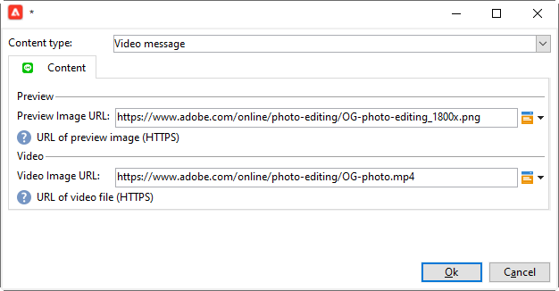

# 建立LINE傳送{#line-channel}

>[!NOTE]
>
>[!DNL LINE] 僅適用於內部部署或托管服務安裝。

[!DNL LINE] 是免費即時消息、語音和視頻呼叫的應用程式，可在每個移動作業系統和PC上使用。

[!DNL LINE] 也可與交易式訊息模組結合，以在消費者行動裝置中安裝 [!DNL LINE] 的應用程式上傳送即時訊息。如需關於此項目的詳細資訊，請參閱此[頁面](../../message-center/using/transactional-messaging-architecture.md#transactional-messaging-and-line)。

使用[!DNL LINE]通道的步驟如下：

1. [設定LINE通道](#setting-up-line-channel)
1. [建立傳送](#creating-the-delivery)
1. [設定內容類型](#defining-the-content)
1. [監控傳送（追蹤、隔離、報表等）](#accessing-reports)

## 設定LINE通道 {#setting-up-line-channel}

建立[!DNL LINE]帳戶和外部帳戶之前，您必須先在執行個體上安裝LINE套件。 有關詳細資訊，請參閱《安裝指南》中的[LINE](../../installation/using/installing-campaign-standard-packages.md#line-package)部分。

您必須先建立[!DNL LINE]帳戶，然後才能將其連結至Adobe Campaign。 然後，您可以傳送[!DNL LINE]訊息給已在行動應用程式中新增您的[!DNL LINE]帳戶的使用者。 外部帳戶和[!DNL LINE]帳戶只能由平台的功能管理員管理。

若要建立和設定[!DNL LINE]帳戶，請參閱[LINE開發人員檔案](https://developers.line.me/)。

### 建立和配置LINE服務 {#configure-line-service}

要建立[!DNL LINE]服務，請執行以下操作：

1. 從Adobe Campaign Classic首頁，選取&#x200B;**[!UICONTROL Profiles and Targets]**&#x200B;標籤。

1. 在左側菜單中，選擇&#x200B;**[!UICONTROL Services and Subscriptions]**&#x200B;並按一下&#x200B;**[!UICONTROL Create]**。

   

1. 將&#x200B;**[!UICONTROL Label]**&#x200B;和&#x200B;**[!UICONTROL Internal name]**&#x200B;新增至新服務。

1. 從&#x200B;**[!UICONTROL Type]**&#x200B;下拉式清單中選取&#x200B;**[!UICONTROL LINE]**。

   

1. 按一下 **[!UICONTROL Save]**。

如需訂閱與服務的詳細資訊，請參閱[管理訂閱](managing-subscriptions.md)。

### 配置LINE外部帳戶 {#configure-line-external}

建立[!DNL LINE]服務後，您需要在Adobe Campaign上設定[!DNL LINE]外部帳戶：

1. 在&#x200B;**[!UICONTROL Administration]** > **[!UICONTROL Platform]**&#x200B;樹結構中，按一下&#x200B;**[!UICONTROL External Accounts]**&#x200B;頁簽。

1. 選取內建&#x200B;**[!UICONTROL LINE V2 routing]**&#x200B;外部帳戶。

   

1. 按一下外部帳戶的&#x200B;**[!UICONTROL LINE]**&#x200B;標籤以開始設定外部帳戶。 填寫下列欄位：

   

   * **[!UICONTROL Channel Alias]**:是透過帳戶在 [!DNL LINE] >標籤中 **[!UICONTROL Channels]** 提供 **[!UICONTROL Technical configuration]** 的。
   * **[!UICONTROL Channel ID]**:是透過帳戶在 [!DNL LINE] >標籤中 **[!UICONTROL Channels]** 提供 **[!UICONTROL Basic Information panel]** 的。
   * **[!UICONTROL Channel secret key]**:是透過帳戶在 [!DNL LINE] >標籤中 **[!UICONTROL Channels]** 提供 **[!UICONTROL Basic Information panel]** 的。
   * **[!UICONTROL Access token]**:是透過您在開發人 [!DNL LINE] 員入口網站中的帳戶或按一下按鈕 **[!UICONTROL Get access token]** 提供。
   * **[!UICONTROL Access token expiration date]**:可讓您指定存取權杖的到期日。
   * **[!UICONTROL LINE subscription service]**:可讓您指定將訂閱使用者的服務。

1. 完成設定後，按一下 **[!UICONTROL Save]**。

1. 從&#x200B;**[!UICONTROL Explorer]**&#x200B;中，選擇&#x200B;**[!UICONTROL Administration]** > **[!UICONTROL Production]** > **[!UICONTROL Technical workflows]** > **[!UICONTROL LINE workflows]**&#x200B;以檢查&#x200B;**[!UICONTROL LINE V2 access token update (updateLineAccessToken)]**&#x200B;和&#x200B;**[!UICONTROL Delete blocked LINE users (deleteBlockedLineUsers)]**&#x200B;工作流是否已啟動。

[!DNL LINE]現在已在Adobe Campaign中設定，您可以開始建立並傳送LINE傳送給訂閱者。

## 建立LINE傳送 {#creating-the-delivery}

>[!NOTE]
>
>首次將[!DNL LINE]傳遞傳送給新收件者時，您必須將有關使用條款與同意的官方LINE訊息新增至傳遞。 官方訊息可在[下列連結](https://terms.line.me/OA_privacy/)取得。

若要建立[!DNL LINE]傳送，您必須遵循下列步驟：

1. 從&#x200B;**[!UICONTROL Campaigns]**&#x200B;頁簽中，選擇&#x200B;**[!UICONTROL Deliveries]** ，然後按一下&#x200B;**[!UICONTROL Create]**&#x200B;按鈕。

   

1. 選擇&#x200B;**[!UICONTROL LINE V2 delivery]**&#x200B;傳遞模板。

   

1. 使用&#x200B;**[!UICONTROL Label]**、**[!UICONTROL Delivery code]**&#x200B;和&#x200B;**[!UICONTROL Description]**&#x200B;識別您的傳送。 如需詳細資訊，請參閱[本章節](steps-create-and-identify-the-delivery.md#identifying-the-delivery)。

1. 按一下&#x200B;**[!UICONTROL Continue]**&#x200B;以建立傳遞。

1. 在傳遞編輯器中，選取&#x200B;**[!UICONTROL To]**&#x200B;以定位[!DNL LINE]傳遞的收件者。 在&#x200B;**[!UICONTROL Visitor subscriptions (nms:visitorSub)]**&#x200B;上執行定位。

   如需詳細資訊，請參閱[識別目標母體](steps-defining-the-target-population.md)。

   

1. 按一下&#x200B;**[!UICONTROL Add]**&#x200B;以選取您的&#x200B;**[!UICONTROL Delivery target population]**。

   

1. 選擇是要直接定位[!DNL LINE]訂閱者，還是要根據其[!DNL LINE]訂閱定位用戶，然後按一下&#x200B;**[!UICONTROL Next]**。 在此示例中，我們選擇了&#x200B;**[!UICONTROL By LINE V2 subscription]**。

1. 在&#x200B;**[!UICONTROL Folder]**&#x200B;下拉式清單中，然後選擇[!DNL LINE]服務。 **[!UICONTROL Line-V2]**&#x200B;按一下&#x200B;**[!UICONTROL Finish]**，然後按一下&#x200B;**[!UICONTROL Ok]**&#x200B;以開始個人化傳送。

   

1. 在傳遞編輯器中，按一下&#x200B;**[!UICONTROL Add]**&#x200B;以新增一或多則訊息並選取&#x200B;**[!UICONTROL Content type]**。

   有關可用的不同&#x200B;**[!UICONTROL Content type]**&#x200B;的詳細資訊，請參閱[定義內容類型](#defining-the-content)。

   

1. 當您的傳送建立並正確設定時，您可以將其傳送至先前定義的目標。

   如需傳送傳遞的詳細資訊，請參閱[傳送訊息](sending-messages.md)。

1. 傳送訊息後，請存取您的報表以評估傳送的成效。

   有關[!DNL LINE]報告的詳細資訊，請參閱[存取報告](#accessing-reports)。

## 定義內容類型 {#defining-the-content}

若要定義[!DNL LINE]傳送的內容，您必須先將訊息類型新增至傳送。 每個[!DNL LINE]傳送最多可包含5則訊息。

您可以選擇三種訊息類型：

* [文字訊息](#configuring-a-text-message-delivery)
* [影像和連結](#configuring-an-image-and-link-delivery)
* [視訊訊息](#configuring-a-video-message-delivery)

### 設定文字訊息傳送 {#configuring-a-text-message-delivery}

>[!NOTE]
>
>`<%@ include option='NmsServer_URL' %>/webApp/APP3?id=<%=escapeUrl(cryptString(visitor.id))%>`語法可讓您在LINE訊息中包含連結至Web應用程式的連結。

**[!UICONTROL Text message]** [!DNL LINE]傳遞是以文字形式傳送給收件者的訊息。

此類型訊息的設定類似於電子郵件中&#x200B;**[!UICONTROL Text]**&#x200B;的設定。 如需詳細資訊，請參閱此[page](defining-the-email-content.md#message-content)。

### 設定影像和連結傳送 {#configuring-an-image-and-link-delivery}

**[!UICONTROL Image and link]** [!DNL LINE]傳遞是以影像形式傳送給收件者的訊息，可能包含一或多個URL。

您可以使用：

* a **[!UICONTROL Personalized image]**,

   >[!NOTE]
   >
   >您可以使用&#x200B;**%SIZE%**&#x200B;變數，根據收件者行動裝置的螢幕大小來最佳化影像顯示。

   

* 每個設備螢幕大小的&#x200B;**[!UICONTROL Image URL]**

   

   **[!UICONTROL Define images per device screen size]**&#x200B;選項可讓您使用不同的影像解析度來最佳化行動裝置上的傳送可見性。 僅支援高度和寬度相同的影像。

   可根據螢幕大小定義影像：

   * 1040px
   * 700px
   * 460px
   * 300px
   * 240px

   >[!CAUTION]
   >
   >每個具有連結的LINE影像都必須大小為1040x1040像素。

   然後，您必須新增會在收件者行動裝置上顯示的替代文字。

* 和 **[!UICONTROL Links]**.

   **[!UICONTROL Links]**&#x200B;區段可讓您在將影像分割成多個可點按區域的不同配置之間進行選擇。 然後，您可以為每個目標分配專用的&#x200B;**[!UICONTROL Link URL]**。

   

### 設定視訊訊息傳送 {#configuring-a-video-message-delivery}

**[!UICONTROL Video message]** [!DNL LINE]傳遞是以可包含URL的視訊形式傳送給收件者的訊息。

**[!UICONTROL Preview Image URL]**&#x200B;欄位可讓您新增預覽影像的URL，字元限制為1000。 支援JPEG和PNG，檔案大小限制為1 MB。

**[!UICONTROL Video Image URL]**&#x200B;欄位可讓您新增視訊檔案的URL，字元限制為1000。 檔案大小限制為200 MB時，僅支援mp4格式。

請注意，在某些裝置上播放寬視訊或高視訊時可能會被裁切。

## 存取報表 {#accessing-reports}

傳送傳遞後，您可以透過&#x200B;**[!UICONTROL Campaign Management]** > **[!UICONTROL Deliveries]**&#x200B;功能表，從&#x200B;**[!UICONTROL Explorer]**&#x200B;檢視[!DNL LINE]報表。

>[!NOTE]
>
>追蹤報告會指出點進率。 [!DNL LINE] 不考慮開放率。

對於[!DNL LINE]服務報告，從&#x200B;**[!UICONTROL Explorer]**&#x200B;頁簽訪問菜單&#x200B;**[!UICONTROL Profiles and Targets]** > **[!UICONTROL Services and Subscriptions]** > **[!UICONTROL LINE-V2]**。 然後按一下[!DNL LINE]服務中的&#x200B;**[!UICONTROL Reports]**&#x200B;圖示。

## 範例：建立併發送個性化的LINE消息 {#example--create-and-send-a-personalized-line-message}

在此範例中，我們將建立並設定文字訊息和影像，其中包含將根據收件者個人化的資料。

1. 按一下&#x200B;**[!UICONTROL Campaign]**&#x200B;標籤中的&#x200B;**[!UICONTROL Create]**&#x200B;按鈕，建立您的[!DNL LINE]傳送。

   

1. 選取&#x200B;**[!UICONTROL LINE V2 delivery]**&#x200B;傳遞範本，並為您的傳遞命名。

   

1. 在傳送的設定視窗中，選取目標母體。

   如需詳細資訊，請參閱[識別目標母體](steps-defining-the-target-population.md)。

   

1. 按一下&#x200B;**[!UICONTROL Add]**&#x200B;建立訊息並選取&#x200B;**[!UICONTROL Content type]**。

   在此，我們首先要建立&#x200B;**[!UICONTROL Text message]**。

   

1. 將游標置於要插入個性化文本的位置，然後按一下下拉式表徵圖，然後選擇&#x200B;**[!UICONTROL Visitor]** > **[!UICONTROL First name]**。

   

1. 請依照相同的程式新增影像，在&#x200B;**[!UICONTROL Message type]**&#x200B;下拉式清單中選取&#x200B;**[!UICONTROL Image and links]**。

   新增您的&#x200B;**[!UICONTROL Image URL]**。

   

1. 在&#x200B;**[!UICONTROL Links]**&#x200B;區段中，選取將影像分割為多個可點按區域的版面。

1. 指派URL至影像的每個區域。

   

1. 儲存您的傳送，然後按一下&#x200B;**[!UICONTROL Send]**&#x200B;以分析並傳送至目標。

   傳送會傳送至目標。

   

