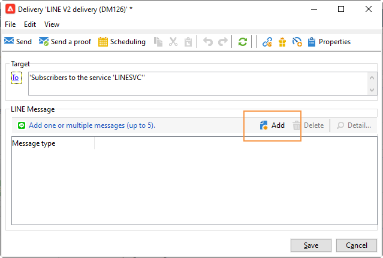

# 建立LINE傳送{#line-channel}

>[!NOTE]
>
>[!DNL LINE] 僅適用於內部部署或托管服務安裝。

[!DNL LINE] 是免費即時消息、語音和視頻呼叫的應用程式，可在每個移動作業系統和PC上使用。

[!DNL LINE] 也可與交易式訊息模組結合，以在 [!DNL LINE] 安裝在消費者行動裝置中的應用程式。 如需關於此項目的詳細資訊，請參閱此[頁面](../../message-center/using/transactional-messaging-architecture.md#transactional-messaging-and-line)。

使用 [!DNL LINE] 管道包括：

1. [設定LINE通道](#setting-up-line-channel)
1. [建立傳送](#creating-the-delivery)
1. [設定內容類型](#defining-the-content)
1. [監控傳送（追蹤、隔離、報表等）](#accessing-reports)

## 設定LINE通道 {#setting-up-line-channel}

建立之前 [!DNL LINE] 帳戶和外部帳戶，您必須先在執行個體上安裝LINE套件。 如需詳細資訊，請參閱 [折線圖](../../installation/using/installing-campaign-standard-packages.md#line-package) 一節。

您必須先建立 [!DNL LINE] 帳戶，以便您將其連結至Adobe Campaign。 然後，您可以 [!DNL LINE] 訊息給已新增您 [!DNL LINE] 帳戶。 外部帳戶和 [!DNL LINE] 帳戶只能由平台的功能管理員管理。

建立和設定 [!DNL LINE] 帳戶，請參閱 [LINE開發人員檔案](https://developers.line.me/).

### 建立和配置LINE服務 {#configure-line-service}

若要建立 [!DNL LINE] 服務：

1. 從Adobe Campaign Classic首頁，選取 **[!UICONTROL Profiles and Targets]** 標籤。

1. 在左側功能表中，選取 **[!UICONTROL Services and Subscriptions]** 按一下 **[!UICONTROL Create]**.

   

1. 新增 **[!UICONTROL Label]** 和 **[!UICONTROL Internal name]** 新服務。

1. 選擇 **[!UICONTROL LINE]** 從 **[!UICONTROL Type]** 下拉式清單。

   

1. 按一下&#x200B;**[!UICONTROL Save]**。

如需訂閱與服務的詳細資訊，請參閱 [管理訂閱](managing-subscriptions.md).

### 配置LINE外部帳戶 {#configure-line-external}

建立 [!DNL LINE] 服務，您需要設定 [!DNL LINE] Adobe Campaign上的外部帳戶：

1. 在 **[!UICONTROL Administration]** > **[!UICONTROL Platform]** 樹結構，按一下 **[!UICONTROL External Accounts]** 標籤。

1. 選取內建 **[!UICONTROL LINE V2 routing]** 外部帳戶。

   

1. 按一下 **[!UICONTROL LINE]** 標籤，以開始設定外部帳戶。 填寫下列欄位：

   

   * **[!UICONTROL Channel Alias]**:是透過 [!DNL LINE] 帳戶 **[!UICONTROL Channels]** > **[!UICONTROL Technical configuration]** 標籤。
   * **[!UICONTROL Channel ID]**:是透過 [!DNL LINE] 帳戶 **[!UICONTROL Channels]** > **[!UICONTROL Basic Information panel]** 標籤。
   * **[!UICONTROL Channel secret key]**:是透過 [!DNL LINE] 帳戶 **[!UICONTROL Channels]** > **[!UICONTROL Basic Information panel]** 標籤。
   * **[!UICONTROL Access token]**:是透過 [!DNL LINE] 帳戶，或按一下 **[!UICONTROL Get access token]** 按鈕。
   * **[!UICONTROL Access token expiration date]**:可讓您指定存取權杖的到期日。
   * **[!UICONTROL LINE subscription service]**:可讓您指定將訂閱使用者的服務。

1. 完成設定後，按一下 **[!UICONTROL Save]**。

1. 從 **[!UICONTROL Explorer]**，選取 **[!UICONTROL Administration]** > **[!UICONTROL Production]** > **[!UICONTROL Technical workflows]** > **[!UICONTROL LINE workflows]** 檢查 **[!UICONTROL LINE V2 access token update (updateLineAccessToken)]** 和 **[!UICONTROL Delete blocked LINE users (deleteBlockedLineUsers)]** 工作流程已開始。

此 [!DNL LINE] 現在已在Adobe Campaign中設定，您可以開始建立並傳送LINE傳送給訂閱者。

## 建立LINE傳送 {#creating-the-delivery}

>[!NOTE]
>
>傳送 [!DNL LINE] 首次傳送給新收件者時，您必須將有關使用條款與同意的官方LINE訊息新增至傳送。 此官方訊息可在 [下列連結](https://terms.line.me/OA_privacy/).

建立 [!DNL LINE] 傳送您必須遵循下列步驟：

1. 從 **[!UICONTROL Campaigns]** 索引標籤，選取 **[!UICONTROL Deliveries]** 然後按一下 **[!UICONTROL Create]** 按鈕。

   

1. 選擇 **[!UICONTROL LINE V2 delivery]** 傳遞範本。

   

1. 識別您的傳送方式， **[!UICONTROL Label]**, **[!UICONTROL Delivery code]**，和  **[!UICONTROL Description]**. 如需詳細資訊，請參閱[本章節](steps-create-and-identify-the-delivery.md#identifying-the-delivery)。

1. 按一下 **[!UICONTROL Continue]** 來建立傳遞。

1. 在傳送編輯器中，選取 **[!UICONTROL To]** 定位 [!DNL LINE] 傳遞。 目標定位執行於 **[!UICONTROL Visitor subscriptions (nms:visitorSub)]**.

   如需詳細資訊，請參閱 [識別目標人口](steps-defining-the-target-population.md).

   

1. 按一下 **[!UICONTROL Add]** 選取 **[!UICONTROL Delivery target population]**.

   

1. 選擇是否要定位 [!DNL LINE] 訂閱者，或根據使用者的 [!DNL LINE] 訂閱，按一下 **[!UICONTROL Next]**. 在此範例中，我們選取 **[!UICONTROL By LINE V2 subscription]**.

1. 選擇 **[!UICONTROL Line-V2]** 在 **[!UICONTROL Folder]** 下拉式清單，然後 [!DNL LINE] 服務。 按一下 **[!UICONTROL Finish]** then **[!UICONTROL Ok]** 開始個人化傳遞。

   

1. 在傳送編輯器中，按一下 **[!UICONTROL Add]** 要添加一條或多條消息並選擇 **[!UICONTROL Content type]**.

   如需不同 **[!UICONTROL Content type]** 可用，請參閱 [定義內容類型](#defining-the-content).

   

1. 當您的傳送建立並正確設定時，您可以將其傳送至先前定義的目標。

   如需傳送傳遞的詳細資訊，請參閱 [傳送訊息](sending-messages.md).

1. 傳送訊息後，請存取您的報表以評估傳送的成效。

   如需 [!DNL LINE] 報表，請參閱 [存取報表](#accessing-reports).

## 定義內容類型 {#defining-the-content}

定義 [!DNL LINE] 傳送時，您必須先將訊息類型新增至您的傳送。 每個 [!DNL LINE] 傳送最多可包含5則訊息。

您可以選擇三種訊息類型：

* [文字訊息](#configuring-a-text-message-delivery)
* [影像和連結](#configuring-an-image-and-link-delivery)
* [視訊訊息](#configuring-a-video-message-delivery)

### 設定文字訊息傳送 {#configuring-a-text-message-delivery}

>[!NOTE]
>
>此 `<%@ include option='NmsServer_URL' %>/webApp/APP3?id=<%=escapeUrl(cryptString(visitor.id))%>` 語法可讓您在LINE訊息中包含網頁應用程式的連結。

A **[!UICONTROL Text message]** [!DNL LINE] 傳送是以文字形式傳送給收件者的訊息。

此類型訊息的設定類似於 **[!UICONTROL Text]** 在電子郵件中。 如需詳細資訊，請參閱 [頁面](defining-the-email-content.md#message-content).

### 設定影像和連結傳送 {#configuring-an-image-and-link-delivery}

安 **[!UICONTROL Image and link]** [!DNL LINE] 傳送是以影像形式傳送給收件者的訊息，可能包含一或多個URL。

您可以使用：

* a **[!UICONTROL Personalized image]**,

   >[!NOTE]
   >
   >您可以使用 **%SIZE%** 變數來根據收件者行動裝置的螢幕大小來最佳化影像顯示。

   

* an **[!UICONTROL Image URL]** 根據裝置螢幕大小，

   

   此 **[!UICONTROL Define images per device screen size]** 選項可讓您使用不同的影像解析度，以最佳化行動裝置上的傳送可見性。 僅支援高度和寬度相同的影像。

   可根據螢幕大小定義影像：

   * 1040px
   * 700px
   * 460px
   * 300px
   * 240px

   >[!CAUTION]
   >
   >每個具有連結的LINE影像都必須大小為1040x1040像素。

   然後，您必須新增會在收件者行動裝置上顯示的替代文字。

* 和 **[!UICONTROL Links]**.

   此 **[!UICONTROL Links]** 區段可讓您在不同的版面之間進行選擇，這些版面會將影像分割成多個可點按的區域。 然後，您可以為每個使用者指派專屬 **[!UICONTROL Link URL]**.

   

### 設定視訊訊息傳送 {#configuring-a-video-message-delivery}

A **[!UICONTROL Video message]** [!DNL LINE] 傳送是以可包含URL的視訊形式傳送給收件者的訊息。

此 **[!UICONTROL Preview Image URL]** 欄位可讓您新增預覽影像的URL，字元限制為1000。 JPEG和PNG支援，檔案大小限制為1 MB。

此 **[!UICONTROL Video Image URL]** 欄位可讓您新增視訊檔案的URL，字元限制為1000。 檔案大小限制為200 MB時，僅支援mp4格式。

請注意，在某些裝置上播放寬視訊或高視訊時可能會被裁切。

## 存取報表 {#accessing-reports}

傳送傳遞後，您可以檢視 [!DNL LINE] 透過功能表製作報表 **[!UICONTROL Campaign Management]** > **[!UICONTROL Deliveries]** 從 **[!UICONTROL Explorer]**.

>[!NOTE]
>
>追蹤報告會指出點進率。 [!DNL LINE] 不考慮開放率。

針對 [!DNL LINE] 服務報告，訪問菜單 **[!UICONTROL Profiles and Targets]** > **[!UICONTROL Services and Subscriptions]** > **[!UICONTROL LINE-V2]** 從 **[!UICONTROL Explorer]** 標籤。 然後按一下 **[!UICONTROL Reports]** 圖示 [!DNL LINE] 服務。

## 範例：建立併發送個性化的LINE消息 {#example--create-and-send-a-personalized-line-message}

在此範例中，我們將建立並設定文字訊息和影像，其中包含將根據收件者個人化的資料。

1. 建立 [!DNL LINE] 傳送，方法是按一下 **[!UICONTROL Create]** 按鈕 **[!UICONTROL Campaign]** 標籤。

   

1. 選取 **[!UICONTROL LINE V2 delivery]** 傳送範本，並為您的傳送命名。

   

1. 在傳送的設定視窗中，選取目標母體。

   如需詳細資訊，請參閱 [識別目標人口](steps-defining-the-target-population.md).

   

1. 按一下 **[!UICONTROL Add]** 建立訊息並選取 **[!UICONTROL Content type]**.

   在此，我們首先要建立 **[!UICONTROL Text message]**.

   

1. 將游標置於要插入個人化文字的位置，然後按一下下拉式圖示，然後選取 **[!UICONTROL Visitor]** > **[!UICONTROL First name]**.

   

1. 按照相同的過程添加影像，選擇 **[!UICONTROL Image and links]** 在 **[!UICONTROL Message type]** 下拉式清單。

   新增 **[!UICONTROL Image URL]**.

   

1. 在 **[!UICONTROL Links]** 區段中，選取將影像分割成多個可點按區域的版面。

1. 指派URL至影像的每個區域。

   

1. 儲存您的傳送，然後按一下 **[!UICONTROL Send]** 來分析並傳送至目標。

   傳送會傳送至目標。

   

