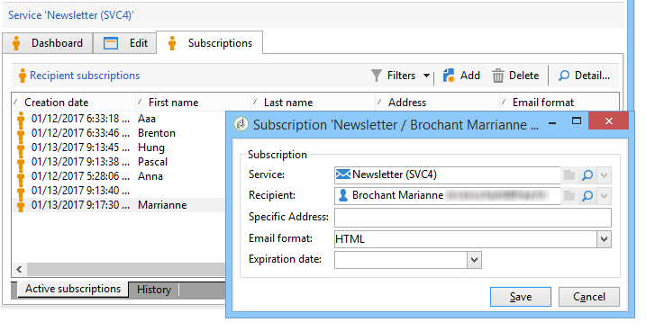

# 管理訂閱{#managing-subscriptions}

## 關於資訊服務 {#about-information-services}

資訊服務包含：

* 註冊與訂閱（選擇加入），
* 取消註冊、自願取消訂閱（選擇退出）或自動取消訂閱（限時服務，例如作為試用方案），
* 訂閱和取消訂閱的確認機制（包含確認的簡單機制、雙重選擇加入等），
* 追蹤訂閱者歷史記錄。

這些服務做為標準功能，包含特定的統計報表：訂閱者追蹤、忠誠度、取消訂閱趨勢等。

對於電子郵件，會自動產生強製取消訂閱連結，而整個選擇加入/選擇退出程式也會完全自動化，並透過歷史記錄追蹤，確保完全符合生效的法規。

有三種服務訂閱/取消訂閱模式：

1. 手動
1. 透過匯入（僅限訂閱），
1. 透過網路表單

>[!NOTE]
>
>建立包含雙重選擇加入的訂閱表單的範例詳見 [本節](../../web/using/use-cases--web-forms.md#create-a-subscription--form-with-double-opt-in).

## 建立資訊服務 {#creating-an-information-service}

您可以建立和管理資訊服務的訂閱，並包含關聯的確認訊息或自動傳送給訂閱者。

若要存取資訊服務地圖，請開啟 **[!UICONTROL Profiles and Targets]** 標籤並按一下 **[!UICONTROL Services and Subscriptions]** 連結。

若要編輯現有服務，請按一下其名稱。 若要建立服務，請按一下 **[!UICONTROL Create]** 按鈕的位置。

* 輸入服務名稱，在 **[!UICONTROL Label]** 欄位並選取傳送頻道：電子郵件、行動裝置、Facebook、Twitter或行動應用程式。

  >[!NOTE]
  >
  >facebook和Twitter訂閱的詳細資訊，請參見 [本節](../../social/using/about-social-marketing.md). 行動應用程式訂閱的詳細資訊，請參見 [關於行動應用程式頻道](about-mobile-app-channel.md).

* 針對電子郵件型別服務，選取 **傳遞模式**. 可能的模式包括： **[!UICONTROL Newsletter]** 或 **[!UICONTROL Viral]**.
* 您可以傳送 **確認訊息** 以取得訂閱或取消訂閱。 若要這麼做，請選取傳遞範本，以用於從 **[!UICONTROL Subscription]** 和 **[!UICONTROL Unsubscription]** 欄位。 這些範本必須設定為 **[!UICONTROL Subscription]** 型別目標對應，沒有已定義的目標。 請參閱區段 [關於電子郵件頻道](about-email-channel.md).
* 依預設，訂閱沒有限制。 您可以取消選取 **[!UICONTROL Unlimited]** 定義服務有效持續時間的選項。 持續時間以天為單位指定(**[!UICONTROL d]** )或月(**[!UICONTROL m]** )。

儲存服務後，服務會新增至「服務和訂閱」清單：按一下名稱即可編輯。 有數個索引標籤可供使用。 此 **[!UICONTROL Subscriptions]** 索引標籤可讓您檢視資訊服務的訂閱者清單(**[!UICONTROL Active subscriptions]** 索引標籤)或訂閱/取消訂閱歷史記錄(**[!UICONTROL History]** 標籤)。 您也可以從此索引標籤新增及刪除訂閱者。 另請參閱 [新增和刪除訂閱者](#adding-and-deleting-subscribers).

此 **[!UICONTROL Detail...]** 按鈕可讓您檢視所選收件者的訂閱屬性。

您可以修改收件者的訂閱屬性。

在控制面板上，按一下 **[!UICONTROL Reports]** 索引標籤以追蹤訂閱：訂閱層級的變更、訂閱者總數等。 您可以封存報告並檢視此索引標籤的歷史。

## 新增和刪除訂閱者 {#adding-and-deleting-subscribers}

從 **[!UICONTROL Subscriptions]** 資訊服務點按的標籤 **[!UICONTROL Add]** 以新增訂閱者。 您也可以以滑鼠右鍵按一下訂閱者清單，然後選取 **[!UICONTROL Add]**. 選取要訂閱的設定檔儲存所在的資料夾，然後選取要訂閱的設定檔，再按一下 **[!UICONTROL OK]** 以進行驗證。

若要刪除訂閱者，請選取訂閱者，然後按一下 **[!UICONTROL Delete]**. 您也可以用滑鼠右鍵按一下訂戶清單，然後選取 **[!UICONTROL Delete]**.

在這兩種情況下，如果服務已附加取消訂閱的傳遞範本，您可以傳送確認訊息給相關使用者(請參閱 [建立資訊服務](#creating-an-information-service))。 警告可讓您驗證或不驗證此傳遞：

另請參閱 [訂閱和取消訂閱機制](#subscription-and-unsubscription-mechanisms).

## 傳遞給服務的訂閱者 {#delivering-to-the-subscribers-of-a-service}

若要傳送給資訊服務的訂閱者，您可以鎖定相關資訊服務的訂閱者，如下列範例所示：

>[!CAUTION]
>
>目標對應必須為 **[!UICONTROL Subscriptions]**.

選取 **[!UICONTROL Subscribers of an information service]** 並按一下 **[!UICONTROL Next]**。

選取目標資訊服務，然後按一下 **[!UICONTROL Finish]**.

此 **[!UICONTROL Preview]** 索引標籤可讓您檢視所選資訊服務的訂閱者清單。

## 訂閱和取消訂閱機制 {#subscription-and-unsubscription-mechanisms}

您可以設定訂閱和取消訂閱機制，以自動化流程和訂閱者管理。

>[!NOTE]
>
>您可以傳送確認訊息給新訂閱者。\
>此訊息的內容是在資訊服務設定中定義的，透過 **[!UICONTROL Subscription]** 或 **[!UICONTROL Unsubscription]** 欄位。
>
>確認訊息會透過這些欄位中指定的傳遞範本建立。 這些目標對應必須 **[!UICONTROL Subscriptions]**.

### 訂閱收件者服務 {#subscribing-a-recipient-to-a-service}

若要註冊資訊服務的收件者，您可以：

* 手動新增服務：若要這麼做，請從 **[!UICONTROL Subscriptions]** 索引標籤中，按一下 **[!UICONTROL Add]** 並選取相關的資訊服務。

  如需詳細資訊，請參閱中有關設定檔編輯的章節。 [本節](../../platform/using/editing-a-profile.md).

* 自動為一組收件者訂閱此服務。 收件者清單可來自篩選操作、群組、資料夾、匯入或使用滑鼠的直接選取。 若要訂閱這些收件者，請選取設定檔，然後按一下滑鼠右鍵。 選取 **[!UICONTROL Actions > Subscribe selection to a service...]**，選取相關的服務，然後啟動作業。
* 匯入收件者並自動訂閱資訊服務。 若要這麼做，請選取匯入精靈最後一步中涉及的服務。

  如需詳細資訊，請參閱[本章節](../../platform/using/executing-import-jobs.md)。

* 使用網路表單，讓收件者可以訂閱服務。

  如需詳細資訊，請參閱[本章節](../../web/using/about-web-applications.md)。

* 建立目標工作流程並使用 **[!UICONTROL Subscription service]** 方塊。

  

  中詳細說明了工作流程及使用方法 [本節](../../workflow/using/about-workflows.md).

### 從服務取消訂閱收件者 {#unsubscribing-a-recipient-from-a-service}

#### 手動取消訂閱 {#manual-unsubscribing}

根據法律，電子郵件傳送必須包含取消訂閱連結。 收件者可以按一下此連結以更新其設定檔，並從未來傳送的目標中排除。

預設取消訂閱連結會透過傳送精靈中提供的內容編輯器工具列中的最後一個按鈕插入(請參閱 [關於個人化](about-personalization.md))。 收件者按一下此連結時，設定檔會新增至封鎖清單（選擇退出），表示任何傳遞動作都不會再鎖定此收件者。

但是，收件者可以選擇取消訂閱服務，而不取消訂閱所有服務。 若要允許這樣做，您可以使用網路表單(請參閱 [本節](../../web/using/adding-fields-to-a-web-form.md#subscription-checkboxes))或插入個人化的取消訂閱連結(請參閱 [個人化區塊](personalization-blocks.md))。

您也可以從收件者設定檔手動取消訂閱收件者。 若要這麼做，請按一下 **[!UICONTROL Subscriptions]** 收件者的索引標籤，選取相關的資訊服務，然後按一下 **[!UICONTROL Delete]**.

您最終可以透過相關的資訊服務取消訂閱一或多個收件者。 若要這麼做，請按一下 **[!UICONTROL Subscriptions]** 索引標籤中，選取相關的收件者，然後按一下 **[!UICONTROL Delete]**.

#### 自動取消訂閱 {#automatic-unsubscription}

資訊服務的持續時間有限。 當有效期間過期時，收件者將會自動取消訂閱。 此期間指定於 **[!UICONTROL Edit]** 服務屬性的索引標籤。 以天為單位表示。

您也可以為母體設定取消訂閱工作流程。 要執行此操作，請遵循與訂閱工作流程相同的程式，但選取 **[!UICONTROL Unsubscription]** 選項。 另請參閱 [訂閱收件者服務](#subscribing-a-recipient-to-a-service).

### 訂閱者追蹤 {#subscriber-tracking}

您可以使用以下工具追蹤資訊服務訂閱中的變更： **[!UICONTROL Reports]** 控制面板上的連結。

