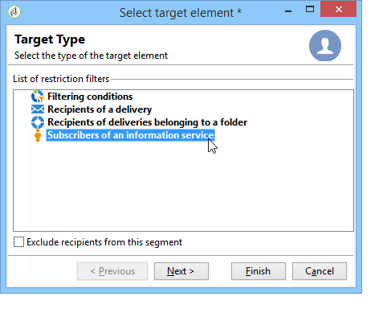

# 管理訂閱{#managing-subscriptions}

## 關於資訊服務 {#about-information-services}

一種資訊服務包括：

* 註冊和訂閱（選擇加入）,
* 取消註冊、自願取消訂閱（選擇退出）或自動取消訂閱（限時服務，例如試用優惠方案）、
* 訂閱和取消訂閱確認機制（具有確認的簡單機制、雙重加入等）,
* 訂閱者歷史記錄的追蹤。

作為標準功能，這些服務包含特定統計報表：訂閱者追蹤、忠誠度、取消訂閱趨勢等。

對於電子郵件，強制取消訂閱連結會自動產生，而整個選擇加入/退出程式都會完全自動化，並提供歷史記錄追蹤功能，確保完全符合現行法規。

有三種服務訂閱/取消訂閱模式：

1. 手動
1. 通過導入（僅訂閱）,
1. 通過網路表單

>[!NOTE]
>
>[本區段](../../web/using/use-cases--web-forms.md#create-a-subscription--form-with-double-opt-in)會詳細說明使用雙重選擇加入建立訂閱表單的範例。

## 建立資訊服務 {#creating-an-information-service}

您可以建立和管理資訊服務的訂閱，這些訂閱包含關聯的確認訊息或自動傳送給訂閱者。

要訪問資訊服務映射，請開啟&#x200B;**[!UICONTROL Profiles and Targets]**&#x200B;頁簽，然後按一下&#x200B;**[!UICONTROL Services and Subscriptions]**&#x200B;連結。

若要編輯現有服務，請按一下其名稱。 要建立服務，請按一下位於清單上方的&#x200B;**[!UICONTROL Create]**&#x200B;按鈕。

* 在&#x200B;**[!UICONTROL Label]**&#x200B;欄位中輸入服務名稱，然後選取傳送通道：電子郵件、行動裝置、Facebook、Twitter或行動應用程式。

   >[!NOTE]
   >
   >Facebook和Twitter訂閱在[本節](../../social/using/about-social-marketing.md)中詳細說明。 [關於行動應用程式頻道](about-mobile-app-channel.md)中會詳細說明行動應用程式訂閱。

* 對於電子郵件類型服務，選擇&#x200B;**傳送模式**。 可能的模式包括：**[!UICONTROL Newsletter]**&#x200B;或&#x200B;**[!UICONTROL Viral]**。
* 您可以針對訂閱或取消訂閱傳送&#x200B;**確認訊息**。 若要這麼做，請選取要用來從&#x200B;**[!UICONTROL Subscription]**&#x200B;和&#x200B;**[!UICONTROL Unsubscription]**&#x200B;欄位建立對應傳送的傳送範本。 這些模板必須配置&#x200B;**[!UICONTROL Subscription]**&#x200B;類型目標映射，而沒有定義的目標。 請參閱[關於電子郵件通道](about-email-channel.md)一節。
* 預設為無限制訂閱。 您可以取消選取&#x200B;**[!UICONTROL Unlimited]**&#x200B;選項，以定義服務的有效持續時間。 持續時間可以以天(**[!UICONTROL d]**)或月(**[!UICONTROL m]**)指定。

服務儲存後會新增至「服務與訂閱」清單：按一下其名稱即可編輯。 有數個索引標籤可供使用。 **[!UICONTROL Subscriptions]**&#x200B;標籤可讓您查看資訊服務（**[!UICONTROL Active subscriptions]**&#x200B;標籤）或訂閱/取消訂閱歷史記錄（**[!UICONTROL History]**&#x200B;標籤）的訂閱者清單。 您也可以從此索引標籤新增和刪除訂閱者。 請參閱[新增和刪除訂閱者](#adding-and-deleting-subscribers)。

**[!UICONTROL Detail...]**&#x200B;按鈕可讓您查看所選收件者的訂閱屬性。

您可以修改收件者的訂閱屬性。

在控制面板上，按一下&#x200B;**[!UICONTROL Reports]**&#x200B;標籤以追蹤訂閱：訂閱層級、訂閱者總數等的變更。 您可以從此索引標籤封存報表和查看歷史記錄。

## 新增和刪除訂閱者 {#adding-and-deleting-subscribers}

在資訊服務的&#x200B;**[!UICONTROL Subscriptions]**&#x200B;標籤中，按一下&#x200B;**[!UICONTROL Add]**&#x200B;以添加訂閱者。 也可以按一下右鍵訂閱者清單，然後選擇&#x200B;**[!UICONTROL Add]**。 選擇要訂閱的配置檔案儲存在其中的資料夾，然後選擇要訂閱的配置檔案並按一下&#x200B;**[!UICONTROL OK]**&#x200B;進行驗證。

要刪除訂閱者，請選擇訂閱者，然後按一下&#x200B;**[!UICONTROL Delete]**。 也可以按一下右鍵訂閱者清單，然後選擇&#x200B;**[!UICONTROL Delete]**。

在這兩種情況下，如果已將取消訂閱的傳送範本附加至服務，您都可以傳送確認訊息給相關使用者（請參閱[建立資訊服務](#creating-an-information-service)）。 警告可讓您驗證或不驗證此傳送：

請參閱[訂閱和取消訂閱機制](#subscription-and-unsubscription-mechanisms)。

## 傳送給服務的訂閱者 {#delivering-to-the-subscribers-of-a-service}

若要傳送給資訊服務的訂閱者，您可以將目標定位為相關資訊服務的訂閱者，如下列範例所示：

>[!CAUTION]
>
>目標映射必須為&#x200B;**[!UICONTROL Subscriptions]**。

選取 **[!UICONTROL Subscribers of an information service]** 並按一下 **[!UICONTROL Next]**。

選擇目標資訊服務，然後按一下&#x200B;**[!UICONTROL Finish]**。

**[!UICONTROL Preview]**&#x200B;標籤可讓您檢視所選資訊服務的訂閱者清單。

## 訂閱和取消訂閱機制 {#subscription-and-unsubscription-mechanisms}

您可以設定訂閱和取消訂閱機制，以自動化流程和訂閱者管理。

>[!NOTE]
>
>您可以向新訂閱者傳送確認訊息。\
>此消息的內容通過&#x200B;**[!UICONTROL Subscription]**&#x200B;或&#x200B;**[!UICONTROL Unsubscription]**&#x200B;欄位在資訊服務配置中定義。
>
>確認訊息會透過這些欄位中指定的傳送範本建立。 這些目標映射必須為&#x200B;**[!UICONTROL Subscriptions]**。

### 將收件者訂閱服務 {#subscribing-a-recipient-to-a-service}

要註冊資訊服務的收件者，您可以：

* 手動新增服務：要執行此操作，請從其配置檔案的&#x200B;**[!UICONTROL Subscriptions]**&#x200B;頁簽中，按一下&#x200B;**[!UICONTROL Add]**&#x200B;並選擇相關資訊服務。

   如需詳細資訊，請參閱[此區段](../../platform/using/editing-a-profile.md)中關於設定檔編輯的區段。

* 自動訂閱此服務的一組收件者。 收件者清單可來自篩選操作、群組、資料夾、匯入，或使用滑鼠直接選取。 若要訂閱這些收件者，請選取設定檔並按一下滑鼠右鍵。 選擇&#x200B;**[!UICONTROL Actions > Subscribe selection to a service...]**，選擇相關服務並啟動操作。
* 將收件者自動匯入並訂閱至資訊服務。 要執行此操作，請選取匯入精靈最後一個步驟中相關的服務。

   如需詳細資訊，請參閱[本章節](../../platform/using/executing-import-jobs.md)。

* 使用Web表單，讓收件者可以訂閱服務。

   如需詳細資訊，請參閱[本章節](../../web/using/about-web-applications.md)。

* 建立目標工作流程並使用&#x200B;**[!UICONTROL Subscription service]**&#x200B;方塊。

   

   在[本小節](../../workflow/using/about-workflows.md)中會詳細說明工作流程及其使用方法。

### 從服務取消訂閱收件者 {#unsubscribing-a-recipient-from-a-service}

#### 手動取消訂閱 {#manual-unsubscribing}

依法，電子郵件傳送必須包含取消訂閱連結。 收件者可以按一下此連結以更新其設定檔，並排除在未來傳送的目標之外。

預設的取消訂閱連結會透過傳送精靈中內容編輯器工具列中的最後一個按鈕插入（請參閱[關於個人化](about-personalization.md)）。 收件者按一下此連結時，設定檔會新增至封鎖清單（選擇退出），這表示此收件者將不再被任何傳送動作鎖定。

但是，收件者可以選擇取消訂閱服務，而不會取消訂閱所有服務。 若要允許，您可以使用網路表單（請參閱[此區段](../../web/using/adding-fields-to-a-web-form.md#subscription-checkboxes)）或插入個人化的取消訂閱連結（請參閱[個人化區塊](personalization-blocks.md)）。

您也可以從收件者設定檔手動取消訂閱收件者。 要執行此操作，請按一下相關收件人的&#x200B;**[!UICONTROL Subscriptions]**&#x200B;頁簽，選擇相關資訊服務，然後按一下&#x200B;**[!UICONTROL Delete]**。

您最後可以透過相關資訊服務取消訂閱一或多個收件者。 要執行此操作，請按一下服務的&#x200B;**[!UICONTROL Subscriptions]**&#x200B;頁簽，選擇相關的收件人，然後按一下&#x200B;**[!UICONTROL Delete]**。

#### 自動取消訂閱 {#automatic-unsubscription}

資訊服務的持續時間可能有限。 有效期屆滿時，收件者會自動取消訂閱。 此期間在服務屬性的&#x200B;**[!UICONTROL Edit]**&#x200B;標籤中指定。 以天表示。

您也可以為母體設定取消訂閱的工作流程。 要執行此操作，請遵循與訂閱工作流相同的步驟，但選擇&#x200B;**[!UICONTROL Unsubscription]**&#x200B;選項。 請參閱[將收件者訂閱至服務](#subscribing-a-recipient-to-a-service)。

### 訂閱者追蹤 {#subscriber-tracking}

您可以使用控制面板上的&#x200B;**[!UICONTROL Reports]**&#x200B;連結，追蹤資訊服務訂閱中的變更。

