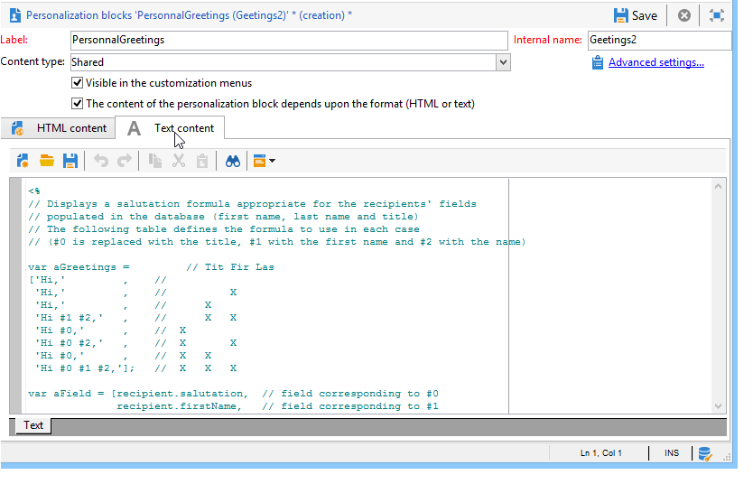

# 個人化區塊{#personalization-blocks}

個人化區塊是動態、個人化的區塊，並包含您可插入至傳送的特定轉譯。 例如，您可以新增標誌、問候訊息或鏡像頁面的連結。 請參閱[插入個人化區塊](#inserting-personalization-blocks)。

[ 在影片中探索此功能](#personalization-blocks-video)

個人化區塊可透過Adobe Campaign檔案總管的&#x200B;**[!UICONTROL Resources > Campaign Management > Personalization blocks]**&#x200B;節點存取。 預設有數個區塊可供使用（請參閱[現成個人化區塊](#out-of-the-box-personalization-blocks)）。

您可以定義新區塊，以便您最佳化傳遞個人化。 如需詳細資訊，請參閱[定義自訂個人化區塊](#defining-custom-personalization-blocks)。

>[!NOTE]
>
>個人化區塊也可從&#x200B;**[!UICONTROL Digital Content Editor (DCE)]**&#x200B;取得。 如需詳細資訊，請參閱[此頁面](../../web/using/editing-content.md#inserting-a-personalization-block)。

## 插入個人化區塊 {#inserting-personalization-blocks}

若要在訊息中插入個人化區塊，請遵循下列步驟：

1. 在傳遞精靈的內容編輯器中，按一下個人化欄點陣圖示，然後選取&#x200B;**[!UICONTROL Include]**&#x200B;功能表。
1. 從清單中選取個人化區塊（清單顯示最後使用的10個區塊），或按一下&#x200B;**[!UICONTROL Other...]**&#x200B;功能表以存取完整清單。

   

1. **[!UICONTROL Other...]**&#x200B;功能表可讓您存取所有現成可用和自訂個人化區塊（請參閱[現成可用的個人化區塊](#out-of-the-box-personalization-blocks)和[定義自訂個人化區塊](#defining-custom-personalization-blocks)）。

   

1. 接著，個人化區塊會以指令碼的形式插入。 系統會在產生個人化時自動調整至收件者設定檔。

   

1. 按一下&#x200B;**[!UICONTROL Preview]**&#x200B;標籤，然後選取收件者以檢視個人化。

   

您可以在傳遞內容中加入個人化區塊的原始碼。 要執行此操作，請在選擇時選擇&#x200B;**[!UICONTROL Include the HTML source code of the block]**。

HTML原始碼會插入傳遞內容中。 例如，**[!UICONTROL Greetings]**&#x200B;個人化區塊顯示如下：

## 個人化區塊範例 {#personalization-blocks-example}

在此範例中，我們會建立電子郵件，讓收件者能夠使用個人化區塊來檢視鏡像頁面、在社交網路上分享電子報，以及取消訂閱未來的傳送內容。

為此，我們需要插入下列個人化區塊：

* **[!UICONTROL Link to mirror page]** .
* **[!UICONTROL Social network sharing links]** .
* **[!UICONTROL Unsubscription link]** .

>[!NOTE]
>
>有關鏡像頁生成的詳細資訊，請參閱[生成鏡像頁](sending-messages.md#generating-the-mirror-page)。

1. 建立新傳送或開啟現有的電子郵件類型傳送。
1. 在傳遞精靈中，按一下&#x200B;**[!UICONTROL Subject]**&#x200B;編輯訊息的主旨並輸入主旨。
1. 在訊息內文中插入個人化區塊。 要執行此操作，請按一下訊息內容中的，按一下個人化欄點陣圖示，然後選取&#x200B;**[!UICONTROL Include]**&#x200B;功能表。
1. 選取要插入的第一個區塊。 請續訂程式，以包含其他兩個區塊。

   

1. 按一下&#x200B;**[!UICONTROL Preview]**&#x200B;標籤以檢視個人化結果。 您必須選取收件者才能顯示該收件者的訊息。

   

1. 確認區塊內容已正確顯示。

## 現成可用的個人化區塊 {#out-of-the-box-personalization-blocks}

預設會提供個人化區塊清單，協助您個人化訊息的內容。

>[!NOTE]
>
>個人化區塊清單取決於您執行個體上已安裝的模組和選項。

* **[!UICONTROL Greetings]** :插入帶有收件人名稱的問候語。範例：「你好，無名氏，」
* **[!UICONTROL Insert logo]** :插入設定執行個體時已定義的現成可用標誌。
* **[!UICONTROL Powered by Adobe Campaign]** :插入「Powered by Adobe Campaign」徽標。
* **[!UICONTROL Mirror page URL]** :插入鏡像頁面URL，使「傳遞設計人員」能夠檢查連結。

   >[!NOTE]
   >
   >有關鏡像頁生成的詳細資訊，請參閱[生成鏡像頁](sending-messages.md#generating-the-mirror-page)。

* **[!UICONTROL Link to mirror page]** :插入指向鏡像頁面的連結：「如果您無法正確檢視此訊息，請按一下這裡」。
* **[!UICONTROL Unsubscription link]** :插入可從所有傳送（封鎖清單）中取消訂閱的連結。
* **[!UICONTROL Formatting function for proper nouns]** :會產生 **[!UICONTROL toSmartCase]** Javascript函式，此函式會將每個字詞的首字母變更為大寫。
* **[!UICONTROL Registration page URL]** :插入訂閱URL(請參閱 [關於服務與訂閱](about-services-and-subscriptions.md))。
* **[!UICONTROL Registration link]** :插入訂閱連結。在設定例項時已定義的項目。
* **[!UICONTROL Registration link (with referrer)]** :插入訂閱連結，以識別訪客和傳送。設定執行個體時已定義連結。

   >[!NOTE]
   >
   >此區塊僅可用於目標定位訪客的傳遞。

* **[!UICONTROL Registration confirmation]** :插入啟用以確認訂閱的連結。
* **[!UICONTROL Social network sharing links]** :插入可讓收件者與電子郵件用戶端、Facebook、Twitter和LinkedIn共用鏡像頁面內容連結的按鈕(請參閱病毒式行 [銷：轉給朋友](viral-and-social-marketing.md#viral-marketing--forward-to-a-friend))。
* **[!UICONTROL Style of content emails]** 和 **[!UICONTROL Notification style]** :產生程式碼，使用預先定義的HTML樣式來格式化電子郵件。這些區塊必須插入傳送的原始碼中（位於&#x200B;**[!UICONTROL ...]**&#x200B;區段），並插入&#x200B;**``**&#x200B;標籤中。
* **[!UICONTROL Offer acceptance URL in unitary mode]** :插入啟用將互動選件設為的URL(請 **[!UICONTROL Accepted]** 參閱 [本區段](../../interaction/using/offer-analysis-report.md))。

## 定義自訂個人化區塊 {#defining-custom-personalization-blocks}

您可以透過&#x200B;**[!UICONTROL Include...]**&#x200B;功能表，從個人化欄點陣圖示定義要插入的新個人化欄位。 這些欄位會在個人化區塊中定義。

若要建立個人化區塊，請前往瀏覽器並套用下列步驟：

1. 按一下&#x200B;**[!UICONTROL Resources > Campaign Management > Personalization blocks]**&#x200B;節點。
1. 以滑鼠右鍵按一下區塊清單，然後選取&#x200B;**[!UICONTROL New]** 。
1. 填入個人化區塊的設定：

   

   * 輸入區塊的標籤。 此標籤將顯示在個人化欄位插入視窗中。
   * 選取&#x200B;**[!UICONTROL Visible in the customization menus]**&#x200B;以從個人化欄位插入圖示存取此區塊。
   * 如有必要，請選取&#x200B;**[!UICONTROL The content of the personalization block depends upon the format]**，為HTML格式和文字格式的電子郵件定義兩個不同的區塊。

      接著，此編輯器的下半部會顯示兩個標籤（HTML內容和文字內容），以定義對應的內容。

      

   * 輸入內容（在HTML、文字、JavaScript等中） ，然後按一下&#x200B;**[!UICONTROL Save]**。

## 教學課程影片 {#personalization-blocks-video}

了解如何建立動態內容區塊，以及如何使用這些區塊來個人化電子郵件傳送的內容。

>[!VIDEO](https://video.tv.adobe.com/v/24924?quality=12)

其他Campaign Classic操作說明影片可在[此處](https://experienceleague.adobe.com/docs/campaign-classic-learn/tutorials/overview.html?lang=zh-Hant)取得。
