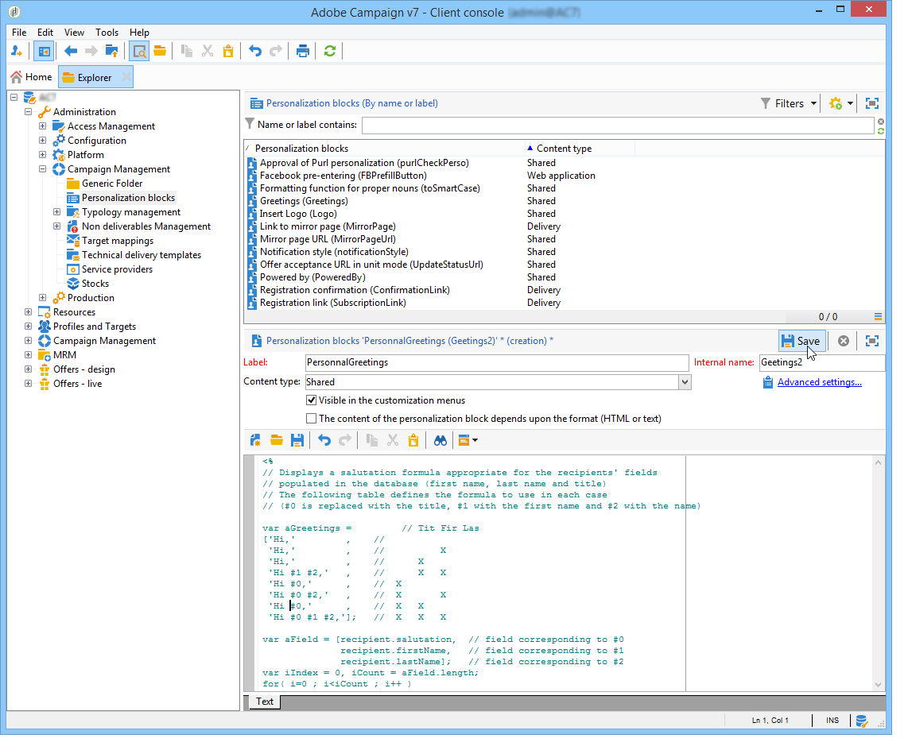

# 個人化區塊{#personalization-blocks}

個人化區塊為動態、個人化的區塊，並包含您可插入傳遞中的特定轉譯。 例如，您可以新增標誌、問候語訊息或映象頁面的連結。 請參閱[插入個人化區塊](#inserting-personalization-blocks)。

在影片[中探索此功能](#personalization-blocks-video)

透過Adobe Campaign總管的&#x200B;**[!UICONTROL Resources > Campaign Management > Personalization blocks]**&#x200B;節點存取個人化區塊。 預設提供數個區塊（請參閱[現成可用的個人化區塊](#out-of-the-box-personalization-blocks)）。

您可以定義新區塊，以讓您將傳送個人化最佳化。 如需詳細資訊，請參閱[定義自訂個人化區塊](#defining-custom-personalization-blocks)。

>[!NOTE]
>
>**[!UICONTROL Digital Content Editor (DCE)]**&#x200B;也提供個人化區塊。 如需詳細資訊，請參閱[此頁面](../../web/using/editing-content.md#inserting-a-personalization-block)。

## 插入個人化區塊 {#inserting-personalization-blocks}

若要在訊息中插入個人化區塊，請遵循下列步驟：

1. 在傳遞助理的內容編輯器中，按一下個人化欄點陣圖示並選取&#x200B;**[!UICONTROL Include]**&#x200B;功能表。
1. 從清單中選取個人化區塊（清單中顯示10個上次使用的區塊），或按一下&#x200B;**[!UICONTROL Other...]**&#x200B;功能表以存取完整清單。

   

1. **[!UICONTROL Other...]**&#x200B;功能表可存取所有現成可用的自訂個人化區塊（請參閱[現成可用的個人化區塊](#out-of-the-box-personalization-blocks)和[定義自訂個人化區塊](#defining-custom-personalization-blocks)）。

   

1. 然後，個人化區塊會插入為指令碼。 產生個人化時，會自動調整成適合收件者設定檔。

   

1. 按一下「**[!UICONTROL Preview]**」標籤，然後選取收件者以檢視個人化。

   

您可以在傳遞內容中包含個人化區塊的原始碼。 若要這麼做，請在選取&#x200B;**[!UICONTROL Include the HTML source code of the block]**&#x200B;時選取它。

HTML原始碼會插入傳遞內容中。 例如，**[!UICONTROL Greetings]**&#x200B;個人化區塊顯示如下：

## 個人化區塊範例 {#personalization-blocks-example}

在此範例中，我們會建立電子郵件，在其中使用個人化區塊來讓收件者檢視映象頁面、在社交網路上共用電子報，以及取消訂閱未來的傳送。

為此，我們需要插入以下個人化區塊：

* **[!UICONTROL Link to mirror page]** 。
* **[!UICONTROL Social network sharing links]** 。
* **[!UICONTROL Unsubscription link]** 。

>[!NOTE]
>
>如需映象頁面產生的詳細資訊，請參閱[產生映象頁面](sending-messages.md#generating-the-mirror-page)。

1. 建立新傳遞或開啟現有的電子郵件型別傳遞。
1. 在傳遞小幫手中，按一下&#x200B;**[!UICONTROL Subject]**&#x200B;以編輯郵件主旨並輸入主旨。
1. 在訊息本文中插入個人化區塊。 若要這麼做，請按一下訊息內容、按一下個人化欄點陣圖示並選取&#x200B;**[!UICONTROL Include]**&#x200B;功能表。
1. 選取要插入的第一個區塊。 更新程式以包含其他兩個區塊。

   

1. 按一下&#x200B;**[!UICONTROL Preview]**&#x200B;標籤以檢視個人化結果。 您必須選取收件者以顯示該收件者的訊息。

   

1. 確認區塊內容已正確顯示。

## 現成可用的個人化區塊 {#out-of-the-box-personalization-blocks}

依預設，提供個人化區塊清單，協助您個人化訊息內容。

>[!NOTE]
>
>個人化區塊的清單取決於執行個體上已安裝的模組和選項。

* **[!UICONTROL Greetings]** ：插入包含收件者名稱的問候語。 範例：「你好 John Doe，」。
* **[!UICONTROL Insert logo]** ：插入設定執行個體時已定義的現成標誌。
* **[!UICONTROL Powered by Adobe Campaign]** ：插入「Powered by Adobe Campaign」標誌。
* **[!UICONTROL Mirror page URL]** ：插入映象頁面URL，讓傳送設計工具檢查連結。

  >[!NOTE]
  >
  >如需映象頁面產生的詳細資訊，請參閱[產生映象頁面](sending-messages.md#generating-the-mirror-page)。

* **[!UICONTROL Link to mirror page]** ：插入映象頁面的連結：「如果您無法正確檢視此郵件，請按一下這裡」。
* **[!UICONTROL Unsubscription link]** ：插入連結，以取消訂閱所有傳遞（封鎖清單）。
* **[!UICONTROL Formatting function for proper nouns]** ：產生&#x200B;**[!UICONTROL toSmartCase]** Javascript函式，這會將每個字詞的第一個字母變更為大寫。
* **[!UICONTROL Registration page URL]** ：插入訂閱URL （請參閱[關於服務與訂閱](about-services-and-subscriptions.md)）。
* **[!UICONTROL Registration link]** ：插入訂閱連結。 即已在設定執行個體時所定義的屬性。
* **[!UICONTROL Registration link (with referrer)]** ：插入訂閱連結，以識別訪客和傳遞。 設定執行個體時，已定義連結。

  >[!NOTE]
  >
  >此區塊僅可用於以訪客為目標的傳遞。

* **[!UICONTROL Registration confirmation]** ：插入連結，以確認訂閱。
* **[!UICONTROL Social network sharing links]** ：插入可讓收件者與電子郵件使用者端、Facebook、X （先前稱為Twitter）和LinkedIn共用映象頁面內容連結的按鈕（請參閱[病毒式行銷：轉寄給朋友](viral-and-social-marketing.md#viral-marketing--forward-to-a-friend)）。
* **[!UICONTROL Style of content emails]**&#x200B;和&#x200B;**[!UICONTROL Notification style]** ：產生程式碼，使用預先定義的HTML樣式來格式化電子郵件。 這些區塊必須插入傳遞的原始程式碼中（在&#x200B;**[!UICONTROL ...]**&#x200B;區段中）的&#x200B;**``**&#x200B;標籤中。
* **[!UICONTROL Offer acceptance URL in unitary mode]** ：插入URL以啟用設定互動選件至&#x200B;**[!UICONTROL Accepted]** （請參閱[此區段](../../interaction/using/offer-analysis-report.md)）。

## 定義自訂個人化區塊 {#defining-custom-personalization-blocks}

您可以透過&#x200B;**[!UICONTROL Include...]**&#x200B;功能表，從個人化欄點陣圖示定義要插入的新個人化欄位。 這些欄位會在個人化區塊中定義。

若要建立個人化區塊，請前往瀏覽器並套用下列步驟：

1. 按一下&#x200B;**[!UICONTROL Resources > Campaign Management > Personalization blocks]**&#x200B;節點。
1. 在區塊清單上按一下滑鼠右鍵，然後選取「**[!UICONTROL New]**」。
1. 填寫個人化區塊的設定：

   

   * 輸入區塊的標籤。 此標籤將顯示在個人化欄位插入視窗中。
   * 選取&#x200B;**[!UICONTROL Visible in the customization menus]**&#x200B;以從個人化欄位插入圖示存取此區塊。
   * 如有必要，請選取&#x200B;**[!UICONTROL The content of the personalization block depends upon the format]**&#x200B;以為HTML格式的電子郵件和文字格式的電子郵件定義兩個個別的區塊。

     然後，兩個索引標籤會顯示在此編輯器的下方(HTML內容和文字內容)以定義對應的內容。

     

   * 輸入個人化區塊的內容(在HTML、文字、JavaScript等)，然後按一下&#x200B;**[!UICONTROL Save]**。

## 教學課程影片 {#personalization-blocks-video}

瞭解如何建立動態內容區塊，以及如何使用動態內容區塊來個人化您的電子郵件傳遞內容。

>[!VIDEO](https://video.tv.adobe.com/v/24924?quality=12)

其他 Campaign Classic 作法影片可在[此處](https://experienceleague.adobe.com/docs/campaign-classic-learn/tutorials/overview.html?lang=zh-Hant)取得。
