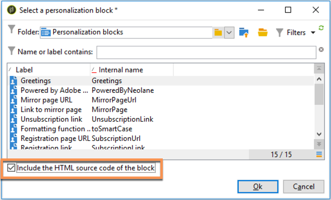

# 個人化區塊{#personalization-blocks}

個性化塊是動態的、個性化的，包含可插入到交貨中的特定呈現。 例如，可以添加徽標、問候語消息或鏡像頁的連結。 請參閱 [插入個性化塊](#inserting-personalization-blocks)。

[ 在影片中探索此功能](#personalization-blocks-video)

通過 **[!UICONTROL Resources > Campaign Management > Personalization blocks]** 的下界。 預設情況下有幾個可用塊(請參見 [現成個性化塊](#out-of-the-box-personalization-blocks))。

您能夠定義新塊，以便優化交付個性化。 有關此內容的詳細資訊，請參閱 [定義自定義個性化塊](#defining-custom-personalization-blocks)。

>[!NOTE]
>
>此外，還可從 **[!UICONTROL Digital Content Editor (DCE)]** 。 如需詳細資訊，請參閱[此頁面](../../web/using/editing-content.md#inserting-a-personalization-block)。

## 插入個性化塊 {#inserting-personalization-blocks}

要在消息中插入個性化塊，請執行以下步驟：

1. 在傳遞嚮導的內容編輯器中，按一下個性化欄位表徵圖並選擇 **[!UICONTROL Include]** 的子菜單。
1. 從清單中選擇個性化設定塊（該清單顯示10個最後使用的塊），或按一下 **[!UICONTROL Other...]** 的子菜單。

   

1. 的 **[!UICONTROL Other...]** 菜單允許訪問所有現成和自定義個性化塊(請參閱 [現成個性化塊](#out-of-the-box-personalization-blocks) 和 [定義自定義個性化塊](#defining-custom-personalization-blocks))。

   

1. 然後將個性化塊作為指令碼插入。 當產生個性化時，它自動適應於接收者簡檔。

   

1. 按一下 **[!UICONTROL Preview]** 頁籤，然後選擇一個收件人以查看個性化設定。

   

您可以將個性化塊的原始碼包括在傳遞內容中。 要執行此操作，請選擇 **[!UICONTROL Include the HTML source code of the block]** 的子菜單。

HTML原始碼被插入到傳遞內容中。 例如， **[!UICONTROL Greetings]** 個性化區顯示如下：

## 個性化塊示例 {#personalization-blocks-example}

在此示例中，我們建立一封電子郵件，在此電子郵件中，我們使用個性化塊使收件人能夠查看鏡像頁面、在社交網路上共用新聞簡報，以及取消訂閱將來的交付。

為此，我們需要插入以下個性化塊：

* **[!UICONTROL Link to mirror page]** 。
* **[!UICONTROL Social network sharing links]** 。
* **[!UICONTROL Unsubscription link]** 。

>[!NOTE]
>
>有關鏡像頁面生成的詳細資訊，請參閱 [生成鏡像頁](sending-messages.md#generating-the-mirror-page)。

1. 建立新的傳遞或開啟現有電子郵件類型傳遞。
1. 在傳遞嚮導中，按一下 **[!UICONTROL Subject]** 編輯消息的主題並輸入主題。
1. 在消息正文中插入個性化塊。 要執行此操作，請按一下消息內容，按一下個性化欄位表徵圖並選擇 **[!UICONTROL Include]** 的子菜單。
1. 選擇要插入的第一個塊。 續訂過程以包括另外兩個塊。

   

1. 按一下 **[!UICONTROL Preview]** 頁籤。 必須選擇一個收件人以顯示該收件人的郵件。

   

1. 確認塊內容顯示正確。

## 現成個性化塊 {#out-of-the-box-personalization-blocks}

預設情況下，個性化設定塊清單可幫助您個性化消息的內容。

>[!NOTE]
>
>個性化塊清單取決於實例上已安裝的模組和選項。

* **[!UICONTROL Greetings]** :插入帶收件人姓名的問候語。 示例：「你好，無名氏。」
* **[!UICONTROL Insert logo]** :插入配置實例時已定義的現成徽標。
* **[!UICONTROL Powered by Adobe Campaign]** :插入「Powered byAdobe Campaign」徽標。
* **[!UICONTROL Mirror page URL]** :插入鏡像頁面URL，使「傳遞設計器」能夠檢查連結。

   >[!NOTE]
   >
   >有關鏡像頁面生成的詳細資訊，請參閱 [生成鏡像頁](sending-messages.md#generating-the-mirror-page)。

* **[!UICONTROL Link to mirror page]** :插入指向鏡像頁的連結：&quot;如果無法正確查看此消息，請按一下這裡&quot;。
* **[!UICONTROL Unsubscription link]** :插入一個連結，該連結允許取消訂閱所有交貨(denylist)。
* **[!UICONTROL Formatting function for proper nouns]** :生成 **[!UICONTROL toSmartCase]** Javascript函式，它將每個單詞的第一個字母更改為大寫。
* **[!UICONTROL Registration page URL]** :插入訂閱URL(請參見 [關於服務和訂閱](about-services-and-subscriptions.md))。
* **[!UICONTROL Registration link]** :插入訂閱連結。 已在配置實例時定義。
* **[!UICONTROL Registration link (with referrer)]** :插入訂閱連結，用於標識訪問者和傳遞。 配置實例時已定義連結。

   >[!NOTE]
   >
   >此塊僅可用於以訪問者為目標的遞送。

* **[!UICONTROL Registration confirmation]** :插入啟用確認訂閱的連結。
* **[!UICONTROL Social network sharing links]** :插入使收件人能夠與電子郵件客戶端、Facebook、Twitter和LinkedIn共用指向鏡像頁面內容的連結的按鈕（請參見） [病毒式營銷：轉給朋友](viral-and-social-marketing.md#viral-marketing--forward-to-a-friend))。
* **[!UICONTROL Style of content emails]** 和 **[!UICONTROL Notification style]** :生成用預定義HTML樣式格式化電子郵件的代碼。 這些塊必須插入傳遞的原始碼中， **[!UICONTROL ...]** 中 **``** 標籤。
* **[!UICONTROL Offer acceptance URL in unitary mode]** :插入URL，該URL可將交互優惠設定為 **[!UICONTROL Accepted]** （請參見） [此部分](../../interaction/using/offer-analysis-report.md))。

## 定義自定義個性化塊 {#defining-custom-personalization-blocks}

您可以通過 **[!UICONTROL Include...]** 的子菜單。 這些欄位在個性化塊中定義。

要建立個性化設定塊，請轉到瀏覽器並應用以下步驟：

1. 按一下 **[!UICONTROL Resources > Campaign Management > Personalization blocks]** 的下界。
1. 按一下右鍵塊清單並選擇 **[!UICONTROL New]** 。
1. 填寫個性化設定塊的設定：

   

   * 輸入塊的標籤。 此標籤將顯示在個性化欄位插入窗口中。
   * 選擇 **[!UICONTROL Visible in the customization menus]** 可通過個性化欄位插入表徵圖訪問此塊。
   * 如有必要，請選擇 **[!UICONTROL The content of the personalization block depends upon the format]** 為HTML格式和文本格式的電子郵件定義兩個單獨的塊。

      然後，在此編輯器的下部顯示兩個頁籤(HTML內容和文本內容)，以定義相應的內容。

      

   * 輸入內容(在HTML、文本、JavaScript等中) 並按一下 **[!UICONTROL Save]**。

## 教程視頻 {#personalization-blocks-video}

瞭解如何建立動態內容塊以及如何使用它們來個性化您電子郵件傳遞的內容。

>[!VIDEO](https://video.tv.adobe.com/v/24924?quality=12)

可提供其他Campaign Classic操作視頻 [這裡](https://experienceleague.adobe.com/docs/campaign-classic-learn/tutorials/overview.html?lang=zh-Hant)。
