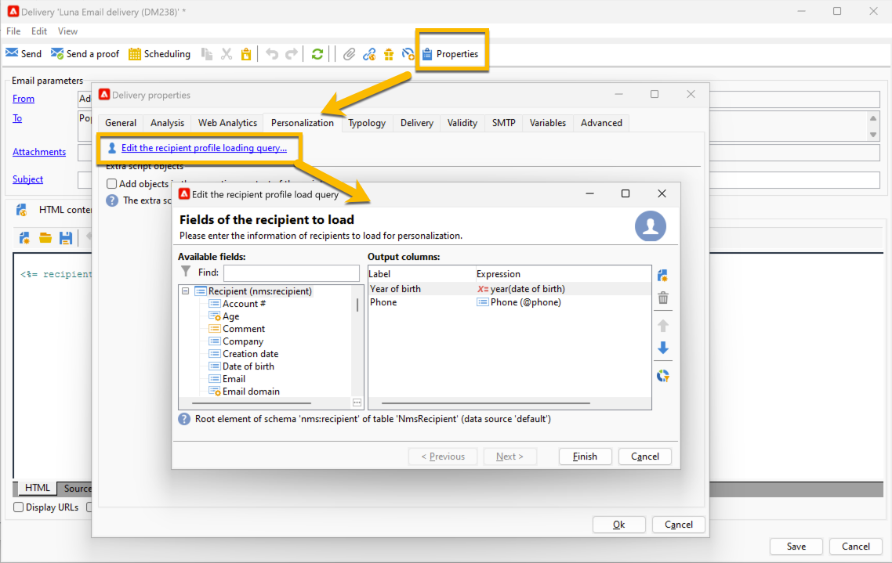

# 個人化欄位{#personalization-fields}

個人化欄位係用於傳遞訊息內容的第一層級個人化。您在主要內容插入的欄位，將顯示從選取的資料來源插入資料的位置。

例如，使用&#x200B;**&lt;%= recipient.LastName %>**&#x200B;語法的個人化欄位會告訴Adobe Campaign將收件者的名稱插入資料庫（收件者表格）。

 [在影片中探索此功能](#personalization-fields-video)

>[!CAUTION]
>
>個人化欄位內容不可超過1024個字元。

## 資料來源 {#data-sources}

根據所選的傳送模式，個人化欄位可能來自兩種型別的資料來源：

* Adobe Campaign資料庫是資料來源。 這是最常見的案例，例如「收件者個人化欄位」。 這些是收件者表格中定義的所有欄位，無論是標準欄位（通常是：姓氏、名字、地址、城鎮、出生日期等）或使用者定義的欄位，都是如此。
* 外部檔案是資料來源。 這些是使用外部檔案中的資料進行傳遞期間，在檔案的欄中定義的所有欄位都會呈現為輸入。

>[!NOTE]
>
>Adobe Campaign個人化標籤一律會有下清單單&#x200B;**&lt;%=table.field%>**。

## 插入個人化欄位 {#inserting-a-personalization-field}

若要插入個人化欄位，請按一下可從任何標題、主旨或郵件內文編輯欄位存取的下拉式圖示。

在選擇資料來源（收件者欄位或檔案欄位）後，此插入會採用命令形式，由Adobe Campaign解譯並以指定收件者的欄位值取代。 然後可以在&#x200B;**[!UICONTROL Preview]**&#x200B;索引標籤中檢視實體取代。

## 個人化欄位範例 {#personalization-fields-example}

我們會建立電子郵件，首先在其中插入收件者的名稱，然後在郵件內文中新增設定檔建立日期。 操作步驟：

1. 建立新傳遞或開啟現有的電子郵件型別傳遞。
1. 在傳遞小幫手中，按一下&#x200B;**[!UICONTROL Subject]**&#x200B;以編輯郵件主旨並輸入主旨。
1. 輸入&quot; **[!UICONTROL Special offer for]** &quot;並使用工具列中的按鈕插入個人化欄位。 選取 **[!UICONTROL Recipients>Title]**。

   

1. 重複操作以插入收件者的名稱。 在所有個人化欄位之間插入空格。
1. 按一下&#x200B;**[!UICONTROL OK]**&#x200B;進行驗證。
1. 在訊息本文中插入個人化。 若要這麼做，請按一下訊息內容中的，然後按一下欄位插入按鈕。
1. 選取 **[!UICONTROL Recipient>Other...]**。

   

1. 選取包含要顯示之資訊的欄位，然後按一下&#x200B;**[!UICONTROL OK]**。

   

1. 按一下&#x200B;**[!UICONTROL Preview]**&#x200B;標籤以檢視個人化結果。 您必須選取收件者以顯示該收件者的訊息。

   

   >[!NOTE]
   >
   >當傳送屬於工作流程的一部分時，您可以使用暫時工作流程表格中的資料。 此資料會分組到&#x200B;**[!UICONTROL Target extension]**&#x200B;功能表中。 如需詳細資訊，請參閱[本章節](../../workflow/using/data-life-cycle.md#target-data)。

## 最佳化個人化 {#optimizing-personalization}

您可以使用專用的選項&#x200B;**[!UICONTROL Prepare the personalization data with a workflow]**&#x200B;來最佳化個人化，該選項可在傳遞屬性的&#x200B;**[!UICONTROL Analysis]**&#x200B;索引標籤中使用。 如需分析傳遞的詳細資訊，請參閱[本節](steps-validating-the-delivery.md#analyzing-the-delivery)。

在傳遞分析期間，此選項會自動建立並執行工作流程，將所有連結至目標的資料儲存在臨時表格中，包括來自FDA連結表格的資料。

勾選此選項可大幅改善處理大量資料時的傳遞分析效能，尤其是當個人化資料來自透過FDA的外部表格時。 如需詳細資訊，請參閱[存取外部資料庫(FDA)](../../installation/using/about-fda.md)。

例如，如果您在傳送給大量收件者時，在訊息內容中使用大量個人化欄位和/或個人化區塊而遇到效能問題，此選項可以加速個人化的處理，並因此加速訊息的傳送。

若要使用此選項，請遵循下列步驟：

1. 建立行銷活動。 如需詳細資訊，請參閱[本章節](../../campaign/using/setting-up-marketing-campaigns.md#creating-a-campaign)。
1. 在行銷活動的&#x200B;**[!UICONTROL Targeting and workflows]**&#x200B;索引標籤中，新增&#x200B;**查詢**&#x200B;活動至您的工作流程。 有關使用此活動的詳細資訊，請參閱[本區段](../../workflow/using/query.md)。
1. 將&#x200B;**[!UICONTROL Email delivery]**&#x200B;活動新增至工作流程並開啟它。 有關使用此活動的詳細資訊，請參閱[本區段](../../workflow/using/delivery.md)。
1. 移至&#x200B;**[!UICONTROL Analysis]**&#x200B;的&#x200B;**[!UICONTROL Delivery properties]**&#x200B;標籤，並選取&#x200B;**[!UICONTROL Prepare the personalization data with a workflow]**&#x200B;選項。

   

1. 設定傳送並啟動工作流程以啟動分析。

分析完成後，個人化資料會透過分析期間即時建立的臨時技術工作流程，儲存在臨時表格中。

Adobe Campaign介面中看不到此工作流程。 其目的僅在於成為快速儲存和處理個人化資料的技術方法。

分析完成後，移至工作流程&#x200B;**[!UICONTROL Properties]**&#x200B;並選取&#x200B;**[!UICONTROL Variables]**&#x200B;標籤。 您可以在此看到可用來進行SQL呼叫以顯示其包含之ID的暫存表格名稱。

## 個人化階段逾時 {#timing-out-personalization}

若要改善傳送保護，您可以設定個人化階段的逾時期間。

在&#x200B;**[!UICONTROL Delivery]**&#x200B;的&#x200B;**[!UICONTROL Delivery properties]**&#x200B;索引標籤中，選取&#x200B;**[!UICONTROL Maximum personalization run time]**&#x200B;選項的最大值（以秒為單位）。

在預覽或傳送期間，如果個人化階段超過您在此欄位中設定的最大時間，流程將中止，並出現錯誤訊息，傳送將失敗。

預設值為5秒。

如果您將此選項設為0，個人化階段將沒有時間限制。

## Personalization索引標籤 {#personalization-tab}

在傳送屬性中，您有Personalization索引標籤。

您可以按一下&#x200B;**「編輯收件者設定檔載入查詢」**，找到將資料新增至目標維度設定檔查詢的可能性。 您可以使用直接在運算式中擷取的資料，以擷取您真正需要的資料。 這些資料將新增至內容。

{zoomable="yes"}

如果您要新增的資料不在目標維度中，您可以按一下&#x200B;**「在指令碼的執行內容中新增物件」**。

{zoomable="yes"}

您可以在此處選取所需的物件結構描述，然後您可以在Javascript程式碼中使用這些資料，這些資料將在傳送準備期間執行。

{zoomable="yes"}

透過新增物件結構，您可以選取要新增到內容的欄位：

{zoomable="yes"}

## 教學課程影片 {#personalization-fields-video}

瞭解如何將個人化欄位新增至主旨行，以及電子郵件傳送的內容。

>[!VIDEO](https://video.tv.adobe.com/v/24925?quality=12)

其他 Campaign Classic 作法影片可在[此處](https://experienceleague.adobe.com/docs/campaign-classic-learn/tutorials/overview.html?lang=zh-Hant)取得。
