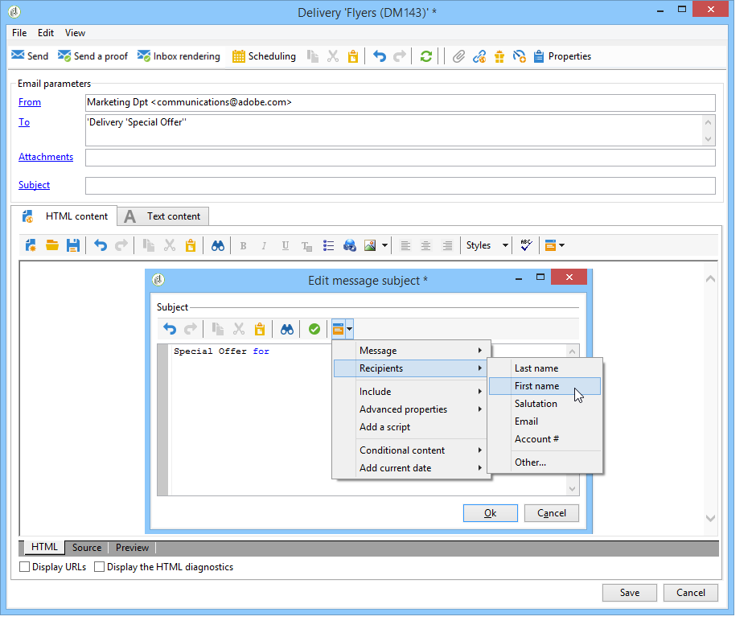

# 個人化欄位{#personalization-fields}

個人化欄位用於傳遞訊息內容的第一層級個人化。 您在主要內容中插入的欄位會顯示從選取資料來源插入資料的位置。

例如，具有 **** &lt;%= recipient.LastName %>語法的個人化欄位會告訴Adobe Campaign將收件者名稱插入資料庫（收件者表格）。

>[!NOTE]
>
>個人化欄位內容不能超過1024個字元。

## Data sources {#data-sources}

個人化欄位可以根據選取的傳送模式，來自兩種資料來源：

* Adobe Campaign資料庫是資料來源。 這是最常見的情況，例如「收件者個人化欄位」。 這些都是在收件者表格中定義的所有欄位，不論是標準欄位(通常： 姓氏、名字、地址、城鎮、出生日期等) 或使用者定義欄位。
* 外部檔案是資料源。 這些是檔案欄中定義的所有欄位，在傳送期間使用外部檔案中的資料顯示為輸入。

>[!NOTE]
>
>Adobe Campaign個人化標籤一律具有下 **列格式&lt;%=table.field%>**。

## 插入個人化欄位 {#inserting-a-personalization-field}

若要插入個人化欄位，請按一下可從任何標題、主旨或訊息內文編輯欄位存取的下拉式圖示。

在選取資料來源（收件者欄位或檔案欄位）後，此插入會採用命令的形式，由Adobe Campaign解釋，並由指定收件者的欄位值取代。 然後，您就可以在標籤中檢視實體 **[!UICONTROL Preview]** 取代。

## 個人化欄位範例 {#personalization-fields-example}

我們會建立電子郵件，我們會先插入收件者的名稱，然後在訊息正文中新增描述檔建立日期。 操作步驟：

1. 建立新的傳送，或開啟現有的電子郵件類型傳送。
1. 在傳送精靈中，按一 **[!UICONTROL Subject]** 下以編輯訊息的主旨並輸入主旨。
1. 輸入&quot; **[!UICONTROL Special offer for]** &quot; ，然後使用工具欄中的按鈕插入個性化欄位。 Select **[!UICONTROL Recipients>Title]**.

   

1. 重複此操作以插入收件人的名稱。 在所有個人化欄位之間插入空格。
1. Click **[!UICONTROL OK]** to validate.
1. 將個人化插入訊息內文。 若要這麼做，請按一下訊息內容中的，然後按一下欄位插入按鈕。
1. Select **[!UICONTROL Recipient>Other...]**.

   

1. 選擇包含要顯示的資訊的欄位，然後按一下 **[!UICONTROL OK]**。

   

1. 按一下標 **[!UICONTROL Preview]** 簽以檢視個人化結果。 您必須選擇收件者，才能顯示該收件者的訊息。

   

   >[!NOTE]
   >
   >當傳送是工作流程的一部分時，您可以使用臨時工作流程表格中的資料。 此資料會分組在功能表 **[!UICONTROL Target extension]** 中。 如需詳細資訊，請參閱[本章節](../../workflow/using/data-life-cycle.md#target-data)。

## 最佳化個人化 {#optimizing-personalization}

您可以使用專屬選項來最佳化個人化： **[!UICONTROL Prepare the personalization data with a workflow]**，可在傳送屬 **[!UICONTROL Analysis]** 性的標籤中取用。 如需分析傳送的詳細資訊，請參 [閱本節](../../delivery/using/steps-validating-the-delivery.md#analyzing-the-delivery)。

在傳送分析期間，此選項會自動建立並執行將所有連結至目標的資料儲存在暫存表格中的工作流程，包括FDA中連結之表格的資料。

在處理大量資料時，檢查此選項可大幅改善傳送分析效能，尤其是當個人化資料來自透過FDA的外部表格時。 有關詳細資訊，請參 [閱訪問外部資料庫(FDA)](../../platform/using/additional-options.md#optimizing-email-personalization-with-external-data)。

例如，如果您在傳送訊息給大量收件者時，在訊息內容中使用許多個人化欄位和／或個人化區塊，遇到效能問題，這個選項可加速個人化的處理，進而加速訊息的傳送。

若要使用此選項，請遵循下列步驟：

1. 建立促銷活動。 如需詳細資訊，請參閱[本章節](../../campaign/using/setting-up-marketing-campaigns.md#creating-a-campaign)。
1. 在促銷 **[!UICONTROL Targeting and workflows]** 活動的標籤中，新增「查 **詢** 」活動至工作流程。 For more on using this activity, refer to [this section](../../workflow/using/query.md).
1. 新增活 **[!UICONTROL Email delivery]** 動至工作流程並開啟它。 For more on using this activity, refer to [this section](../../workflow/using/delivery.md).
1. 轉到的 **[!UICONTROL Analysis]** 頁籤並 **[!UICONTROL Delivery properties]** 選擇選 **[!UICONTROL Prepare the personalization data with a workflow]** 項。

   

1. 設定傳送並啟動工作流程以啟動分析。

分析完成後，個人化資料會透過分析期間即時建立的臨時技術工作流程，儲存在臨時表格中。

Adobe Campaign介面中不會顯示此工作流程。 它只是一種技術手段，可快速儲存和處理個人化資料。

分析完成後，請轉至工作流並選 **[!UICONTROL Properties]** 擇該選 **[!UICONTROL Variables]** 項卡。 您可以看到臨時表的名稱，該臨時表可用於進行SQL調用，以顯示它包含的ID。

## 逾時個人化階段 {#timing-out-personalization}

若要改善傳送保護，您可以設定個人化階段的逾時期。

在的選 **[!UICONTROL Delivery]** 項卡中 **[!UICONTROL Delivery properties]**，為選項選擇一個最大值(以秒為單 **[!UICONTROL Maximum personalization run time]** 位)。

在預覽或傳送期間，如果個人化階段超過您在此欄位中設定的最長時間，則會中止程式並顯示錯誤訊息，而傳送將會失敗。

預設值為5秒。

如果您將此選項設為0，個人化階段將不會有時間限制。