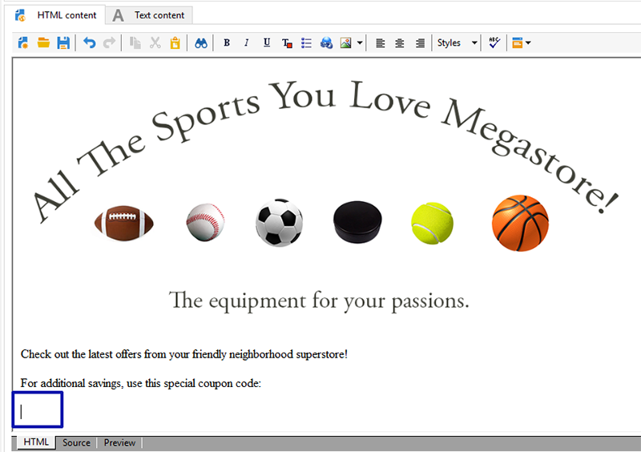

# 個人化優惠券{#personalized-coupons}

將抵用券加入傳送，可讓收件者享有更優惠的產品與服務價值。 您可以使用「促銷活動抵用券」模組來建立一組抵用券，您預期這些抵用券會新增至即將推出的行銷選件。 當您準備好要建立傳送時，請指派適用的抵用券。 由於抵用券在選擇期間有效，所指派的抵用券會唯一連結至其傳送訊息。 此外，促銷活動會確認在傳送訊息之前，有足夠的抵用券可容納訊息數量。

>[!NOTE]
>
>抵用券管理是必須安裝的套件。 若要確認您有「抵用券」管理，請勾選&#x200B;**[!UICONTROL Administration > Configuration > Package management > Installed packages.]**
>
>抵用券資料可以使用CSV和XML格式匯入和匯出。 有關導入和導出的詳細資訊，請參閱[本節](../../platform/using/get-started-data-import-export.md)。

## 建立抵用券{#creating-a-coupon}

抵用券模組提供您兩個選項來建立抵用券：

* **匿名**:特定收件者或收件者清單的一般抵用券。
* **個人**:特定收件者的個人化優惠券。

在遵循下列步驟之前，請確定您知道要建立的抵用券類型。

1. 在促銷活動樹狀結構中，前往&#x200B;**[!UICONTROL Resources > Campaign management > Coupons]**。

   

1. 按一下 **[!UICONTROL New]** 按鈕。
1. 在&#x200B;**[!UICONTROL Label]**&#x200B;欄位中輸入抵用券名稱。 已在&#x200B;**[!UICONTROL Coupon code]**&#x200B;中自動輸入唯一代碼。 您可以保留代碼或輸入新代碼。

   

1. 選擇&#x200B;**[!UICONTROL Start date]**&#x200B;和&#x200B;**[!UICONTROL End date]**&#x200B;以設定抵用券有效的期間。
1. 在&#x200B;**[!UICONTROL Coupon type]**&#x200B;中，選擇「匿名」或「個人」。

   **[!UICONTROL Anonymous coupons]** :匿名抵用券對所有收件者都相同。確認已在&#x200B;**抵用券類型**&#x200B;功能表中選取「匿名」，然後按一下「儲存」以產生抵用券。****

   **[!UICONTROL Individual coupons]** :使用附加的抵用券代碼可以進一步個人化單個抵用券。例如，在運動器材商店建立銷售的個別抵用券。 然而，受獎者名單很長，他們對單項運動的熱情也不同。 您可以根據運動（例如足球、足球、棒球等）為個別抵用券新增程式碼名稱 並將每個程式碼傳送給適用的收件者。

   1. 選擇「個人」時，新的標籤「抵用券」會出現在左下角。 轉到&#x200B;**[!UICONTROL Coupons]**&#x200B;頁籤，然後按一下&#x200B;**[!UICONTROL Add]**。
   1. 在彈出式視窗提示時，輸入個別抵用券的唯一代碼。
   1. 按一下&#x200B;**[!UICONTROL Save]**&#x200B;以產生抵用券。

   如需「抵用券」標籤的詳細資訊，請參閱「設定個別抵用券」。

   >[!NOTE]
   >
   >您可大量匯入個別抵用券。 有關導入和導出的詳細資訊，請參閱[本節](../../platform/using/get-started-data-import-export.md)。

### 設定個別抵用券{#configuring-individual-coupons}

「抵用券」標籤僅適用於「個別」抵用券。 在抵用券與傳送相關聯後，「抵用券」標籤會提供下列詳細資訊：

* **[!UICONTROL Status]** :抵用券可用性。
* **[!UICONTROL Redeemed on]** :抵用券的兌換日期。
* **[!UICONTROL Channel]** :用來傳送抵用券的渠道。
* **[!UICONTROL Address]** :收件者的電子郵件地址。

**[!UICONTROL status]**、**[!UICONTROL channel]**&#x200B;和&#x200B;**[!UICONTROL address]**&#x200B;的值會自動完成。 不過，促銷活動不會復原&#x200B;**[!UICONTROL redeemed on]**&#x200B;的值。 您可匯入包含抵用券兌換詳細資訊的檔案，以完成這些作業。

## 將抵用券插入電子郵件傳送{#inserting-a-coupon-into-an-email-delivery}

在以下範例中，傳送是從首頁建立。 有關如何建立傳送的詳細說明，請參閱[本節](../../delivery/using/about-email-channel.md)。 您也可以在工作流程中將抵用券新增至傳送。

1. 前往&#x200B;**[!UICONTROL Campaigns]**&#x200B;並選擇&#x200B;**[!UICONTROL Deliveries]**。
1. 按一下 **[!UICONTROL Create]**。

   

1. 在&#x200B;**[!UICONTROL Label]**&#x200B;中輸入名稱，然後按一下&#x200B;**[!UICONTROL Continue]**。
1. 按一下&#x200B;**[!UICONTROL To]**&#x200B;以新增收件者。
1. 按一下&#x200B;**[!UICONTROL Add]**&#x200B;以選擇傳送的收件者。 選擇收件者後，按一下&#x200B;**[!UICONTROL Ok]**&#x200B;返回傳送。

   

1. 輸入主旨並新增內容至訊息。

   

1. 在工具欄中，按一下&#x200B;**[!UICONTROL Properties]** ，然後選擇&#x200B;**[!UICONTROL Advanced]**&#x200B;頁籤。
1. 按一下&#x200B;**[!UICONTROL Coupon management]**&#x200B;的資料夾表徵圖。

   

1. 選擇抵用券，然後按一下&#x200B;**[!UICONTROL Ok]**。 再次按一下&#x200B;**[!UICONTROL Ok]**。

   

1. 按一下訊息，以選擇您要放置抵用券的位置。

   

1. 按一下個人化圖示，根據抵用券類型選擇下列其中一項：

   * 匿名抵用券：**[!UICONTROL Coupon > Coupon code]**

      

   * 個別抵用券：**[!UICONTROL Coupon value > Coupon code]**

      

      抵用券會以程式碼的形式插入訊息中，而非您指派的名稱。 代碼用於促銷活動Otb資料模型中。
   

1. 執行測試以確認您指派給抵用券的名稱。 轉到&#x200B;**[!UICONTROL Preview]**&#x200B;頁籤，然後按一下&#x200B;**[!UICONTROL Test personalization]**。 選擇測試的收件者。

   

   在測試後，抵用券應顯示為已指派的名稱，而非代碼。

   

1. 在工具列中，按一下&#x200B;**[!UICONTROL Send]**（左上方），然後選擇傳送方式。

   

1. 按一下 **[!UICONTROL Analyze]**。如果分析記錄確認所有收件者都有足夠的抵用券，請按一下&#x200B;**[!UICONTROL Confirm delivery]**&#x200B;傳送。

   

>[!NOTE]
>
>如需如何管理傳送抵用券不足的指示，請參閱[管理抵用券不足](#managing-insufficient-coupons)

若要確認傳送成功：

1. 前往&#x200B;**[!UICONTROL Explorer > Resources > Campaign management > Coupons]**。
1. 按一下&#x200B;**[!UICONTROL Deliveries]**&#x200B;頁籤。

   

   成功傳送的狀態為&#x200B;**[!UICONTROL Finished]**。

>[!NOTE]
>
>預設情況下，抵用券管理模組使用&#x200B;**nms:recipient**&#x200B;表。 有關如何使用其他表的說明，請參見[編輯結構](../../configuration/using/data-schemas.md)。

## 管理抵用券不足{#managing-insufficient-coupons}

如果抵用券數少於訊息數，則傳送分析會停止。 在這種情況下，您可以匯入更多抵用券或限制訊息數。 如果要限制訊息數量，請依照下列指示進行。

1. 前往電子郵件傳送視窗。
1. 按一下 **[!UICONTROL To]**。
1. 在&#x200B;**[!UICONTROL Select target]**&#x200B;中，轉至&#x200B;**[!UICONTROL Exclusions]**&#x200B;頁籤。

   

1. 在排除設定區段中，按一下&#x200B;**[!UICONTROL Edit]**。
1. 輸入要在&#x200B;**[!UICONTROL Limit delivery to...messages]**&#x200B;中發送的消息數，然後按一下&#x200B;**[!UICONTROL Ok]**。 您可以傳送傳送。

   

>[!NOTE]
>
>在管理有限數量的抵用券時，傳送工作流程可讓您根據您的准則來分割傳送。 如果您想要將抵用券傳送給選取的人口群，而不限制目標，這是個不錯的選項。
