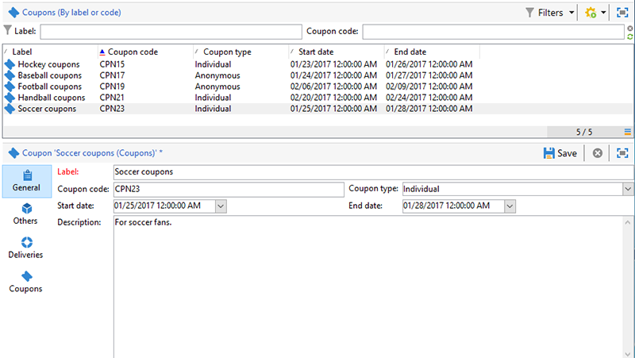

# 個人化優惠券{#personalized-coupons}

將抵用券加到您的傳遞，可讓收件者獲得更高的產品和服務價值。 您可以使用「促銷活動抵用券」模組，建立一組您預期要新增至即將推出之行銷活動的抵用券。 當您準備好建立傳遞時，請指派適用的抵用券。 由於抵用券對於選取的期間有效，所指派的抵用券會唯一連結至其傳送訊息。 此外，Campaign會確認在傳送訊息之前，有足夠的抵用券數量。

>[!NOTE]
>
>抵用券管理是必須安裝的套件。 若要確認您有「抵用券」管理，請檢查 **[!UICONTROL Administration > Configuration > Package management > Installed packages.]**
>
>抵用券資料可以使用CSV和XML格式匯入和匯出。 有關匯入和匯出的詳細資訊，請參閱 [本節](../../platform/using/get-started-data-import-export.md).

## 建立抵用券 {#creating-a-coupon}

「抵用券」模組提供建立抵用券時的兩個選項：

* **匿名**:特定收件者或收件者清單的一般抵用券。
* **個人**:特定收件者的個人化抵用券。

執行下列步驟之前，請確定您知道要建立的抵用券類型。

1. 在促銷活動樹狀結構中，前往 **[!UICONTROL Resources > Campaign management > Coupons]**.

   

1. 按一下 **[!UICONTROL New]** 按鈕。
1. 在 **[!UICONTROL Label]** 欄位。 已自動在 **[!UICONTROL Coupon code]**. 您可以保留代碼或輸入新代碼。

   

1. 選擇 **[!UICONTROL Start date]** 和 **[!UICONTROL End date]** 以設定抵用券有效的期間。
1. 在 **[!UICONTROL Coupon type]**，選擇「匿名」或「個人」。

   **[!UICONTROL Anonymous coupons]** :匿名抵用券對所有收件者都相同。 確認已在 **抵用券類型** 按一下 **儲存** 來產生抵用券。

   **[!UICONTROL Individual coupons]** :個別抵用券可透過其他抵用券代碼進一步個人化。 例如，在運動器材商店為銷售建立個別抵用券。 然而，收件者名單很長，他們對單項運動的熱情並不相同。 您可以根據運動（例如足球、足球、棒球等），為個別抵用券新增程式碼名稱 並將每個程式碼傳送給適用的收件者。

   1. 選擇「個人」時，左下方會顯示新的分頁「抵用券」。 前往 **[!UICONTROL Coupons]** 按一下 **[!UICONTROL Add]**.
   1. 在彈出式視窗提示時，輸入個別抵用券的唯一代碼。
   1. 按一下 **[!UICONTROL Save]** 來產生抵用券。

   如需「抵用券」索引標籤的詳細資訊，請參閱 [設定個別抵用券](#configuring-individual-coupons).

   >[!NOTE]
   >
   >個別抵用券可以大量匯入。 有關匯入和匯出的詳細資訊，請參閱 [本節](../../platform/using/get-started-data-import-export.md).

### 設定個別抵用券 {#configuring-individual-coupons}

「抵用券」索引標籤只能搭配「個別抵用券」使用。 將抵用券與傳送建立關聯後，「抵用券」索引標籤會提供下列詳細資料：

* **[!UICONTROL Status]** :抵用券可用性。
* **[!UICONTROL Redeemed on]** :抵用券的兌換日期。
* **[!UICONTROL Channel]** :用來傳送抵用券的管道。
* **[!UICONTROL Address]** :收件者的電子郵件地址。

的值 **[!UICONTROL status]**, **[!UICONTROL channel]**，和 **[!UICONTROL address]** 會自動完成。 不過， **[!UICONTROL redeemed on]** 未由Campaign復原。 您可以匯入包含抵用券贖回詳細資訊的檔案，以完成這些操作。

## 將抵用券插入電子郵件傳送 {#inserting-a-coupon-into-an-email-delivery}

在以下範例中，傳遞是從首頁建立。 如需如何建立傳送的詳細指示，請參閱 [本節](about-email-channel.md). 您也可以在工作流程中將抵用券新增至傳送。

1. 前往 **[!UICONTROL Campaigns]** 選擇 **[!UICONTROL Deliveries]**.
1. 按一下&#x200B;**[!UICONTROL Create]**。

   

1. 在 **[!UICONTROL Label]** 按一下 **[!UICONTROL Continue]**.
1. 按一下 **[!UICONTROL To]** 以新增收件者。
1. 按一下 **[!UICONTROL Add]** 來選擇傳送的收件者。 選取收件者後，按一下 **[!UICONTROL Ok]** 返回傳遞。

   

1. 輸入主旨並新增內容至訊息。

   

1. 在工具列中，按一下 **[!UICONTROL Properties]** 並選擇 **[!UICONTROL Advanced]** 標籤。
1. 按一下 **[!UICONTROL Coupon management]**.

   

1. 選擇抵用券並按一下 **[!UICONTROL Ok]**. 按一下 **[!UICONTROL Ok]** 。

   

1. 按一下訊息，以選擇您要放置抵用券的位置。

   

1. 按一下個人化圖示，根據抵用券類型選擇下列其中一項：

   * 匿名抵用券： **[!UICONTROL Coupon > Coupon code]**

      

   * 個別抵用券： **[!UICONTROL Coupon value > Coupon code]**

      

      抵用券會以程式碼的形式插入訊息中，而非您指派的名稱。 程式碼用於Campaign Ootb資料模型中。
   

1. 執行測試以確認您指派給抵用券的名稱。 前往 **[!UICONTROL Preview]** 按一下 **[!UICONTROL Test personalization]**. 選擇測試的收件者。

   

   測試後，抵用券應會顯示為指派的名稱，而非代碼。

   

1. 在工具列中，按一下 **[!UICONTROL Send]** （左上方），並選取要如何傳送傳遞。

   

1. 按一下 **[!UICONTROL Analyze]**。如果分析記錄確認有足夠的抵用券給所有收件者，請按一下 **[!UICONTROL Confirm delivery]** 來發送。

   

>[!NOTE]
>
>如需如何管理傳遞之抵用券不足的指示，請參閱 [管理不足的抵用券](#managing-insufficient-coupons)

若要確認傳送成功：

1. 前往 **[!UICONTROL Explorer > Resources > Campaign management > Coupons]**.
1. 按一下 **[!UICONTROL Deliveries]** 標籤。

   

   狀態顯示為 **[!UICONTROL Finished]** 成功傳送。

>[!NOTE]
>
>依預設，抵用券管理模組會使用 **nms:recipient** 表格。 [了解更多](../../configuration/using/about-data-model.md#default-recipient-table)。
>
>了解如何使用自訂收件者表格 [在本頁](../../configuration/using/about-custom-recipient-table.md).

## 管理不足的抵用券 {#managing-insufficient-coupons}

如果抵用券數少於訊息數，傳遞分析就會停止。 在這種情況下，您可以匯入更多抵用券或限制訊息的數量。 如果要限制訊息數量，請依照下列指示操作。

1. 前往電子郵件傳送視窗。
1. 按一下&#x200B;**[!UICONTROL To]**。
1. 在 **[!UICONTROL Select target]**，前往 **[!UICONTROL Exclusions]** 標籤。

   

1. 在排除設定區段中，按一下 **[!UICONTROL Edit]**.
1. 輸入要傳入的訊息數 **[!UICONTROL Limit delivery to...messages]** 按一下 **[!UICONTROL Ok]**. 您可以傳送傳遞。

   

>[!NOTE]
>
>管理有限數量的抵用券時，傳遞工作流程可讓您根據條件來分割傳送。 如果您想要將抵用券傳送至選取的人口族群，而不限制目標，這個選項很合適。
