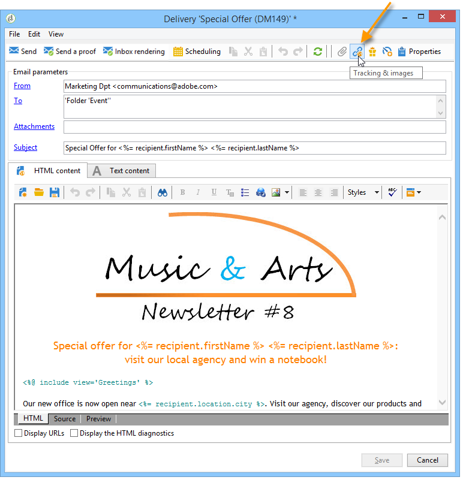

# 設定 URL 追蹤選項{#personalizing-url-tracking}

進階訊息追蹤設定可透過 **[!UICONTROL Tracking & Images]** 圖示進行遞送。

>[!NOTE]
>
>電子郵件中的影像管理也在此視窗中設定。 另請參閱 [新增影像](defining-the-email-content.md#adding-images).

您可以設定追蹤選項：

* 為所有訊息啟用/停用URL追蹤。

  >[!CAUTION]
  >
  >未在傳遞上啟用追蹤時(例如 **[!UICONTROL Activate tracking]** 選項未選取)，與追蹤相關的報表和資料無法使用：開啟、快速點選和追蹤的URL報表不會顯示任何資料，並且 **[!UICONTROL Tracking logs]** 將不會為此傳遞顯示索引標籤。

* 啟用/停用訊息開啟的追蹤。

追蹤的URL會以樹狀形式列在中央視窗中。

您可以個別針對每個訊息URL啟用或停用追蹤。 如需詳細資訊，請參閱[本章節](how-to-configure-tracked-links.md)。

此 **[!UICONTROL Advanced]** 索引標籤可讓您個人化追蹤URL和開頭URL的計算公式。

>[!CAUTION]
>
>此標籤中的設定只能由專家使用者修改。
