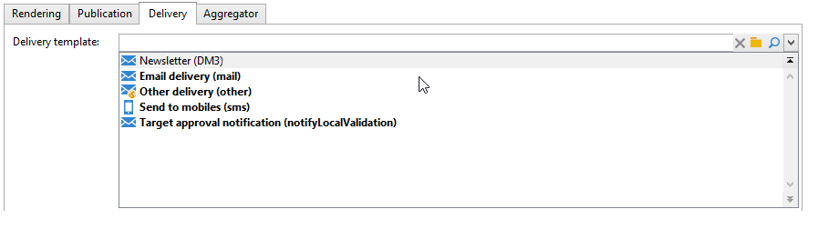

# 發佈範本{#publication-templates}


## 關於發佈模板 {#about-publication-templates}

發佈模板是要發佈的內容的身份證。 它引用了發佈過程中使用的資源，即：

* 資料模式，
* 輸入表，
* 每個輸出文檔的轉換模板。

## 發佈模板的標識 {#identification-of-a-publication-template}

發佈模板由其名稱和命名空間標識。

樣式表的標識鍵是由命名空間和名稱以冒號分隔的字串；例如： **cus：新聞稿**。

>[!NOTE]
>
>在實踐中，建議對架構、表單和發佈模板使用相同的鍵。

## 建立和配置模板 {#creating-and-configuring-the-template}

發佈模板預設儲存在 **[!UICONTROL Administration > Configuration > Publication templates]** 的下界。 要建立新模板，請按一下 **[!UICONTROL New]** 按鈕。

要配置發佈模板，請填充模板的名稱（即由名稱和命名空間組成的標識鍵）、其標籤、資料架構及其連結的輸入表單。


>[!NOTE]
>
>每當基於此發佈模板建立內容時，標籤將出現。

的 **檢查狀態以驗證內容生成** 選項強制檢查內容實例的「已驗證」狀態以授權檔案生成。 有關此內容的詳細資訊，請參閱 [發佈](#publication)。

必須為每個輸出文檔添加轉換模板。 您可以根據需要建立盡可能多的轉換模板。

的 **[!UICONTROL Name of template]** 欄位是一個自由標籤，它描述了輸出處呈現的類型。 對於每個轉換模板，發佈設定都可在頁籤中使用。

### 渲染 {#rendering}

的 **[!UICONTROL Rendering]** 頁籤：

* 用於投影輸出文檔的渲染類型：XSL樣式表或JavaScript模板，
* 輸出文檔的格式：HTML、文本、XML或RTF
* 包含構造資料的模板，即要使用的樣式表或JavaScript模板。

### 發佈 {#publication}

發佈涉及以檔案形式生成輸出文檔(如果所選類型為 **[!UICONTROL File]**。


以下發佈選項可用：

* 輸出檔案編碼字元集可通過 **[!UICONTROL Encoding]** 的子菜單。 預設使用拉丁文1(1252)字元集。
* 的 **[!UICONTROL Multi-file generation]** 的子菜單。 此選項包括在輸出文檔的每頁的開頭填充分區標籤。 生成內容將為每個填充的分區標籤生成檔案。 此模式用於從內容塊生成迷你站點。 有關此的詳細資訊，請參閱 [多檔案生成](#multi-file-generation)。
* 的 **[!UICONTROL Location]** 欄位包含輸出檔案的名稱。 名稱可由變數組成，以便生成自動檔案名。

   變數填充的格式如下： **`$(<xpath>)`**，也請參見Wiki頁。 **`<xpath>`** 是發佈模板資料架構的欄位的路徑。

   檔案名可以由日期類型欄位組成。 要正確設定此欄位的格式，請使用 **$date格式** 函式，使用欄位的路徑和輸出格式作為參數。

   預設情況下，檔案名的構造格式使用「@name」和「@date」欄位中的變數：

   ```
   ct_$(@name)_$date-format(@date,'%4Y%2M%2D').htm
   ```

   生成的檔案名將如下所示：ct_news12_20110901.htm。

   >[!NOTE]
   >
   >有關內容生成的詳細資訊，請參閱 [建立內容實例](using-a-content-template.md#creating-a-content-instance)。

### 傳遞 {#delivery}

此頁籤允許您選擇方案，以便直接在內容上啟動交付。 電子郵件的內容將根據輸出格式(HTML或文本)自動填充。



>[!NOTE]
>
>有關基於內容的交付建立示例，請參閱 [提供內容實例](using-a-content-template.md#delivering-a-content-instance)。

### 聚合器 {#aggregator}

通過聚合指令碼或查詢清單中的資料，可以使用內容資料來豐富XML文檔。 目的是補充連結引用的某些資訊或從資料庫中添加元素。

### 多檔案生成 {#multi-file-generation}

要激活多個檔案生成，請選擇 **[!UICONTROL Multi-file generation]** 的子菜單。 此選項用於在樣式表中為輸出文檔的每頁開始指定分區標籤。 內容的生成將為遇到的每個分區標籤生成檔案。

要在樣式表中整合的分區標籤如下：

**`<xsl:comment> #nl:output_replace(<name_of_file>) </xsl:comment>`** 何處 **`<name_of_file>`** 是要生成的頁的檔案名。

**示例：** 使用&quot;cus:book&quot;架構生成多個檔案。

其原則是生成一個首頁，列出各章，並有可能在外部頁面中顯示各章的詳細資訊。


相應的樣式表(&quot;cus:book.xsl&quot;)如下：

```
<?xml version="1.0" encoding="ISO-8859-1" ?>
<xsl:stylesheet xmlns:xsl="http://www.w3.org/1999/XSL/Transform" version="1.0">
  <xsl:output encoding="ISO-8859-1" method="html"/>

  <!-- Style sheet entry point -->
  <xsl:template match="/book">
    <html>
      <body>
        <h1><xsl:value-of select="@name"/></h1>
        <lu>
          <xsl:for-each select="chapter">
            <li><a target="_blank" href="chapter{@id}.htm"><xsl:value-of select="@name"/></a></li>  
          </xsl:for-each>
       </lu>
      </body>
    </html>
   </xsl:template>
</xsl:stylesheet>
```

生成各章的詳細資訊需要第二個樣式表(「cus:chapter.xsl」):

```
<?xml version="1.0" encoding="ISO-8859-1" ?>
<xsl:stylesheet xmlns:xsl="http://www.w3.org/1999/XSL/Transform" version="1.0">
  <xsl:output encoding="ISO-8859-1" method="html"/>

  <!-- Detail of a chapter -->
  <xsl:template match="chapter">
    <!-- Cut tag -->   
    <xsl:comment> #nl:output_replace($(path)/chapter<xsl:value-of select="@id"/>.htm)</xsl:comment>
    
    <html>
      <body>
        <h1><xsl:value-of select="@name"/></h1>
        <xsl:value-of select="page" disable-output-escaping="yes"/>
      </body>
    </html>
  </xsl:template>

  <!-- Style sheet entry point -->
  <xsl:template match="/book">
    <xsl:apply-templates/>
   </xsl:template>
</xsl:stylesheet>
```

分區標籤被填充在要包含在要生成的檔案中的頁面的開頭。

```
<xsl:comment> #nl:output_replace($(path)/<xsl:value-of select="@id"/>.htm)</xsl:comment>
```

檔案名由 **$（路徑）** 包含發佈路徑和 **`<xsl:value-of select="@id" />`**，它與輸入文檔中的章節的標識符匹配。

發佈模型必須用兩個樣式表&quot;cus:book.xsl&quot;和&quot;cus:chapter.xsl&quot;填充。

的 **[!UICONTROL Multi-file generation]** 選項必須在章節轉換模型上處於活動狀態：


的 **[!UICONTROL Location]** 欄位不用於生成多個檔案，但必須仍填充此欄位以避免發佈時出錯。
