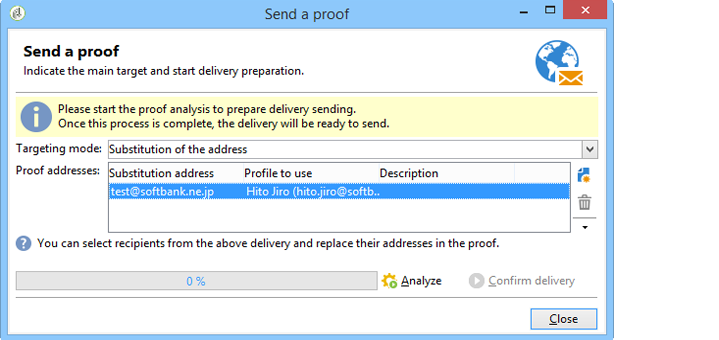

# 在日文行動裝置上傳送電子郵件{#sending-emails-on-japanese-mobiles}

## 日文行動裝置的電子郵件格式{#email-formats-for-japanese-mobiles}

Adobe Campaign管理行動裝置上電子郵件的三種特定日文格式：**Deco-mail**（DoCoMo行動裝置）、**Decore Mail**（軟體銀行行動裝置）和&#x200B;**Decoration Mail**（KDDI AU行動裝置）。 這些格式會施加特定的編碼、結構和大小限制。 進一步了解[本節](#limitations-and-recommendations)中的限制和建議。

為了讓收件者正確接收以下其中一種格式的訊息，建議在對應的設定檔中選取&#x200B;**[!UICONTROL Deco-mail (DoCoMo)]**、**[!UICONTROL Decore Mail (Softbank)]**&#x200B;或&#x200B;**[!UICONTROL Decoration Mail (KDDI AU)]**:

不過，如果您將&#x200B;**[!UICONTROL Email format]**&#x200B;選項保留為&#x200B;**[!UICONTROL Unknown]**、**[!UICONTROL HTML]**&#x200B;或&#x200B;**[!UICONTROL Text]**,Adobe Campaign會自動偵測（傳送電子郵件時）要使用的日文格式，以便正確顯示訊息。

該自動檢測系統基於&#x200B;**[!UICONTROL Management of Email Formats]**&#x200B;郵件規則集中定義的預定義域清單。 有關管理電子郵件格式的詳細資訊，請參閱[本頁](../../installation/using/email-deliverability.md#managing-email-formats)。

## 限制與建議{#limitations-and-recommendations}

對於發送將在由日本提供商（軟體銀行、 DoCoMo、KDDI AU）運營的移動設備上讀取的電子郵件，應使用一定數量的限制。

因此，您必須：

* 僅使用JPEG或GIF格式的影像
* 建立包含嚴格低於10 000位元組的文字和HTML區段的傳送（針對KDDI AU和DoCoMo）
* 使用大小總計（編碼前）低於100 KB的影像
* 每則訊息不要使用超過20個影像
* 使用縮小大小的HTML格式（每個運算子可使用有限數量的標籤）

>[!NOTE]
>
>建立訊息時，應考量每個運算子的特定限制。 請參閱:
>
>* 若為DoCoMo，請參閱[此頁面](https://www.nttdocomo.co.jp/service/developer/make/content/deco_mail/index.html)
>* 對於KDDI AU，請參閱[此頁](https://www.au.com/ezfactory/tec/spec/decorations/template.html)
>* 有關軟體庫，請參閱[此頁](https://www.support.softbankmobile.co.jp/partner/home_tech3/index.cfm)

## 測試電子郵件內容{#testing-the-email-content}

### 預覽訊息{#previewing-the-message}

Adobe Campaign可讓您檢查訊息格式是否適合傳送至日文行動裝置。

定義內容並輸入電子郵件主旨後，您就可以在建立訊息時檢查顯示和格式。

在內容編輯視窗的&#x200B;**[!UICONTROL Preview]**&#x200B;標籤中，按一下&#x200B;**[!UICONTROL More... > Deco-mail diagnostic]**&#x200B;可讓您：

* 檢查HTML內容標籤是否符合日文格式限制
* 檢查訊息中的影像數量是否未超過格式（20個影像）所設定的限制
* 檢查總郵件大小（小於100kB）

   

### 執行類型規則{#running-typology-rule}

除了預覽診斷外，在傳送校樣或傳送時還會執行第二次檢查：分析期間會啟動特定類型規則&#x200B;**[!UICONTROL Deco-mail check]**。

>[!IMPORTANT]
>
>只有當至少有一個收件者設定為以&#x200B;**[!UICONTROL Deco-mail (DoCoMo)]**、**[!UICONTROL Decore Mail (Softbank)]**&#x200B;或&#x200B;**[!UICONTROL Decoration Mail (KDDI AU)]**&#x200B;格式接收電子郵件時，才會執行此類型規則。

此類型規則可讓您確定傳送符合日文運算子定義的[格式限制](#limitations-and-recommendations)，尤其是與電子郵件總大小、HTML和文字區段的大小、訊息中的影像數量，以及HTML內容中的標籤有關。

### 傳送校樣 {#sending-proofs}

您可以傳送校樣以測試傳遞。 傳送校樣時，如果您使用替代地址，請輸入與所用設定檔的電子郵件格式相對應的地址。

例如，如果此設定檔的電子郵件格式是預先定義在&#x200B;**[!UICONTROL Decore Mail (Softbank)]**&#x200B;上，您可以以test@softbank.ne.jp取代設定檔的地址。

## 傳送訊息 {#sending-messages}

若要使用Campaign以日文電子郵件格式傳送電子郵件給收件者，可以使用兩個選項：

* 建立兩個傳送：一個僅適用於日文收件者，另一個僅適用於其他收件者 — 請參閱[本區段](#designing-a-specific-delivery-for-japanese-formats)。
* 建立單一傳送，Adobe Campaign會自動偵測要使用的格式 — 請參閱[此區段](#designing-a-delivery-for-all-formats)。

### 設計日文格式的特定傳送{#designing-a-specific-delivery-for-japanese-formats}

您可以建立包含兩個傳送的工作流程：一個在日文行動裝置上讀取，另一個在標準電子郵件格式的收件者閱讀。

要執行此操作，請在工作流程中使用&#x200B;**[!UICONTROL Split]**&#x200B;活動，並將日文電子郵件格式（Deco-mail、Decore Mail和Decore Mail）定義為篩選條件。

### 設計所有格式的傳送{#designing-a-delivery-for-all-formats}

當Adobe Campaign根據網域（具有定義為&#x200B;**[!UICONTROL Unknown]**、**[!UICONTROL HTML]**&#x200B;或&#x200B;**[!UICONTROL Text]**&#x200B;之電子郵件格式的設定檔）動態管理格式時，您可以傳送相同的傳送給所有收件者。

訊息連絡人將正確顯示給日文行動裝置上的使用者，正如標準收件者。

>[!IMPORTANT]
>
>請務必遵守與每個日文電子郵件格式（裝飾郵件、裝飾郵件和Decore Mail）相關的特殊功能。 有關限制的詳細資訊，請參閱[此部分](#limitations-and-recommendations)。
