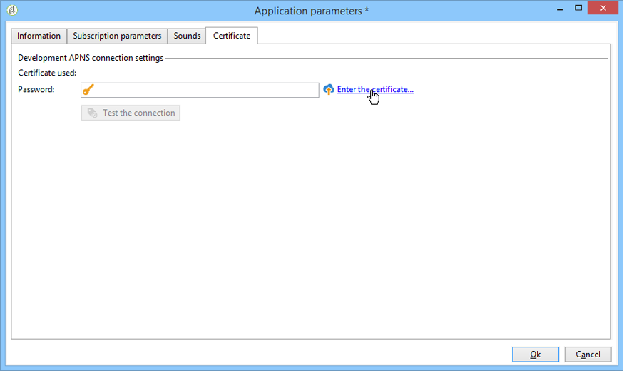

# 設定行動應用程式頻道{#setting-up-mobile-app-channel}

## 簡介 {#introduction}

>[!CAUTION]
>
>行動應用程式頻道實施必須由專家使用者執行。 如果您需要協助，請聯絡您的Adobe客戶主管或專業服務合作夥伴。

您可以建立數個行動應用程式版本(iOS、Android):「行動應用程式頻道」選項可讓您傳送通知給已安裝應用程式的終端。

若要使用Adobe Campaign行動應用程式頻道的功能，您必須變更／調整行動應用程式，以將其整合至Adobe Campaign平台。

目前提供兩個Campaign Classic SDK，一個用於Android，另一個用於iOS，讓您的行動應用程式與Adobe Campaign輕鬆整合。 Java和Objective-C需要深入的技術知識。 將Campaign SDK整合至行動應用程式中， [提供Campaign SDK的詳細說明](#integrating-campaign-sdk-into-the-mobile-application)。

>[!NOTE]
>
>Adobe Campaign提供的程式庫可與Xcode(iOS)和Android Studio(Android)搭配使用。

## 連接器 {#connectors}

### iOS連接器 {#ios-connectors}

對於iOS，有兩個連接器可用：

* iOS二進位連接器會在舊版二進位APNS伺服器上傳送通知。
* iOS HTTP/2連接器會傳送通知給HTTP/2 APNS。

要選擇要使用的連接器，請執行以下步驟：

1. 前往 **[!UICONTROL Administration > Platform > External accounts]**。
1. 選擇iOS傳送外部帳戶。
1. 在標籤 **[!UICONTROL Connector]** 中，填寫欄 **[!UICONTROL Access URL of the connector]** 位：

   對於iOS二進位檔：https://localhost:8080/nms/jsp/ios.jsp

   對於iOS HTTP2:http://localhost:8080/nms/jsp/iosHTTP2.jsp

   

### Android連接器 {#android-connectors}

對於Android，有兩個連接器可用：

* V1連接器，允許每個MTA子項連接一個。
* V2連接器允許與FCM伺服器同時連接，以提高吞吐量。

要選擇要使用的連接器，請執行以下步驟：

1. 前往 **[!UICONTROL Administration > Platform > External accounts]**。
1. 選擇外 **[!UICONTROL Android routing]** 部帳戶。
1. 在標籤 **[!UICONTROL Connector]** 中，填寫欄 **[!UICONTROL JavaScript used in the connector]** 位：

   對於Android V1:https://localhost:8080/nms/jsp/androidPushConnector.js

   針對Android V2:https://localhost:8080/nms/jsp/androidPushConnectorV2.js

   

1. 對於Android V2,Adobe Server組態檔(serverConf.xml)中還有一個參數：

   * **maxGCMConnectPerChild**:每個子伺服器啟動的對FCM的並行HTTP請求的最大限制（預設為8）。

## 配置步驟 {#configuration-steps}

### 建立應用程式 {#creating-the-application}

如果您沒有行動應用程式（應用程式），應用程式開發人員就需要建立它並整合SDK。 如果行動應用程式存在，開發人員需要整合Adobe Campaign SDK並新增服務專用的設定來調整它。 如需SDK的說明，請參閱將Campaign [SDK整合至行動應用程式](#integrating-campaign-sdk-into-the-mobile-application)。

>[!CAUTION]
>
>在與Adobe Campaign SDK整合之前，應用程式必須已設定為推播動作。
>
>如果不是這樣，請參閱 [本頁](https://developer.apple.com/library/archive/documentation/NetworkingInternet/Conceptual/RemoteNotificationsPG/)。

### 收集資訊 {#collecting-information-}

若要設定應用程式，您必須收集技術規格，以定義一組可讓Adobe Campaign和行動應用程式通訊的參數。 這些參數包括：

* **整合金鑰**:每個應用程式都有唯一的金鑰。 此金鑰可讓您連結Adobe Campaign服務和行動應用程式。 請參閱一 [般資訊](#general-information)。
* **變數**:在您啟動通知時定義應用程式的行為。 請參閱一 [般資訊](#general-information)。
* **訂閱設定**:依預設，Adobe Campaign會復原 **@userKey** 欄位，讓您協調行動裝置與資料庫中的收件者。 如果您想要收集其他資料（例如複雜的協調金鑰），則可以定義訂閱設定。 請參閱 [訂閱設定](#subscription-settings)。
* **音效** （僅限iOS）:如果選取的音效不是系統音效，則音效檔必須內嵌在行動應用程式中。 請參閱應 [用程式音效](#application-sounds)。
* **行銷伺服器和追蹤伺服器的URL**:adobe Campaign管理員必須提供應用程式開發人員行銷伺服器的URL和追蹤伺服器的URL。 有關詳情，請參閱：將 [Campaign SDK整合至行動應用程式](#integrating-campaign-sdk-into-the-mobile-application)。

### 建立服務 {#creating-the-service}

Adobe Campaign管理員需要建立並設定連結至行動應用程式的服務。 如需詳細資訊，請參閱「在 [Adobe Campaign中設定行動應用程式」](#configuring-the-mobile-application-in-adobe-campaign)。

### 測試應用程式 {#testing-the-application}

在iOS上，您需要建立應用程式，使用沙盒模式進行測試和核准。 然後，在相同的Adobe Campaign服務中，建立新的生產類型應用程式並輸入相關憑證。 如需詳細資訊，請參閱Apple通知服務上的檔案。

在Android上，您只需要建立一個應用程式。 請先在您的應用程式上測試完整的訂閱和傳送收集程式，再將它公開。

## 資料路徑 {#data-path}

下列結構說明如何讓行動應用程式與Adobe Campaign交換資料的步驟。 此過程涉及三個實體：

* 行動應用程式
* 通知服務：Apple適用的APNS（Apple推播通知服務）和Android適用的FCM（Firebase cloud訊息）
* Adobe Campaign

通知程式的三個主要步驟是：在Adobe Campaign中註冊應用程式（訂閱收集）、傳送和追蹤。

### 步驟1:訂閱系列 {#step-1--subscription-collection}

行動應用程式是由使用者從App Store或Google play下載。 此應用程式包含連線設定（iOS憑證和Android專案金鑰）和整合金鑰。 首次開啟應用程式時（視設定而定），系統會要求使用者輸入註冊資訊(@userKey:電子郵件或帳號)。 同時，應用程式會詢問通知服務以收集通知ID（推播ID）。 所有這些資訊（連線設定、整合金鑰、通知識別碼、userKey）都會傳送至Adobe Campaign。


### 步驟2:傳送 {#step-2--delivery}

行銷人員鎖定應用程式訂閱者。 傳送程式會傳送連線設定至通知服務（iOS憑證和Android專案金鑰）、通知ID（推播ID）和通知內容。 通知服務向目標終端發送通知。

Adobe Campaign提供下列資訊：

* 僅限Android:顯示通知的裝置數（曝光數）
* Android和iOS:通知的點按次數


Adobe Campaign伺服器必須能夠透過下列埠連絡APNS伺服器：

* iOS二進位連接器的2195（傳送）和2186（回饋服務）
* 443 for iOS HTTP/2 connector

若要檢查它是否正常運作，請使用下列命令：

* 針對測試：

   ```
   telnet gateway.sandbox.push.apple.com
   ```

* 生產中：

   ```
   telnet gateway.push.apple.com
   ```

如果使用iOS二進位連接器，MTA和Web伺服器必須能夠連絡連接埠2195（傳送）的APNS，工作流程伺服器必須能夠連絡連接埠2196的APNS（回饋服務）。

如果使用iOS HTTP/2連接器，MTA、Web伺服器和工作流程伺服器必須能夠連絡連接埠443上的APNS。

## 將Campaign SDK整合至行動應用程式 {#integrating-campaign-sdk-into-the-mobile-application}

iOS和Android適用的促銷活動SDK是行動應用程式頻道模組的元件之一。

>[!NOTE]
>
>若要取得Campaign SDK（先前稱為Neolane SDK），請聯絡Adobe客戶服務。

SDK的目標是協助將行動應用程式整合至Adobe Campaign平台。

若要進一步瞭解支援的不同Android和iOS版本，請參閱「相容 [性」表](https://helpx.adobe.com/campaign/kb/compatibility-matrix.html#MobileSDK) 。

### 載入促銷活動SDK {#loading-campaign-sdk}

* **在Android中**:neolane_sdk-release.aar **** 檔案必須連結至專案。

   下列權限授與Adobe Campaign伺服器的存取權：

   ```
   Neolane.getInstance().setIntegrationKey("your Adobe mobile app integration key");
   Neolane.getInstance().setMarketingHost("https://yourMarketingHost:yourMarketingPort/");
   Neolane.getInstance().setTrackingHost("https://yourTrackingHost:yourTrackingPort/");
   ```

   以下權限允許您恢復電話的唯一ID:

   ```
   <uses-permission android:name="android.permission.READ_PHONE_STATE" /> 
   ```

   在SDK 1.0.24版中，此權限僅用於Android 6.0之前的版本。

   從SDK 1.0.26版，將不再使用此權限。

* **在iOS中**:libNeolaneSDK.a **** 和Neolane_SDK.h **** 檔案必須連結至專案。 從SDK 1.0.24版啟動 **ENABLE_BITCODE** 選項。

   >[!NOTE]
   >
   >對於SDK 1.0.25版，Neolane_SDK.h檔案中提供這四種 **架構** 。

### 宣告整合設定 {#declaring-integration-settings}

若要將Campaign SDK整合至行動應用程式，功能管理員必須向開發人員提供下列資訊：

* **整合金鑰**:以啟用Adobe Campaign平台來識別行動應用程式。

   >[!NOTE]
   >
   >此整合金鑰是在Adobe Campaign主控台的行動應用程式專用 **[!UICONTROL Information]** 服務標籤中輸入的。 請參閱一 [般資訊](#general-information)。

* **追蹤URL**:符合Adobe Campaign追蹤伺服器位址的連結。
* **行銷URL**:以啟用訂閱的集合。

* **在Android中**:

   ```
   Neolane.getInstance().setIntegrationKey("your Adobe mobile app integration key");
   Neolane.getInstance().setMarketingHost("https://yourMarketingHost:yourMarketingPort/");
   Neolane.getInstance().setTrackingHost("https://yourTrackingHost:yourTrackingPort/"); 
   ```

* **在iOS中**:

   ```
   Neolane_SDK *nl = [Neolane_SDK getInstance];
   [nl setMarketingHost:strMktHost];
   [nl setTrackingHost:strTckHost];
   [nl setIntegrationKey:strIntegrationKey];
   ```

### 配準功能 {#registration-function}

註冊功能使您能夠：

* 傳送通知ID或推播ID（iOS的deviceToken和Android的registrationID）至Adobe Campaign。
* 恢復協調密鑰或userKey（例如，電子郵件或帳號）

* **在Android中**:

   ```
   void registerInNeolane(String registrationId, String userKey, Context context)
   {
    try{
     Neolane.getInstance().registerDevice(registrationToken, userKey, null, context);
    } catch (NeolaneException e){
     //...
    } catch (IOException e){
     //...
    }
   }
   ```

   如果您使用FCM(Firebase Cloud Messaging)，我們建議您在呼叫 **onTokenRefresh** 函式時使用registerDevice **** 函式，以通知Adobe Campaign使用者行動裝置Token的變更。

   ```
   public class NeoTripFirebaseInstanceIDService extends FirebaseInstanceIdService {
     @Override
     public void onTokenRefresh() {
       String registrationToken = FirebaseInstanceId.getInstance().getToken();
       NeolaneAsyncRunner neolaneAs = new NeolaneAsyncRunner(Neolane.getInstance());
       ...
       ...
       // Neolane Registration
       neolaneAs.registerDevice(registrationToken, userKey, additionnalParam, this, new NeolaneAsyncRunner.RequestListener() {
       public void onComplete(String e, Object state) { ... }
       public void onNeolaneException(NeolaneException e, Object state) { ... }
       public void onIOException(IOException e, Object state) { ... }
       });
       ...
       ...
     }
   }
   ```

* **在iOS中**:

   ```
   // Callback called on successful registration to the APNS
   - (void)application:(UIApplication*)application didRegisterForRemoteNotificationsWithDeviceToken:(NSData*)deviceToken
   {
       // Pass the token to Adobe Campaign
       Neolane_SDK *nl = [Neolane_SDK getInstance];
       [nl registerDevice:tokenString:self.userKey:dic];
   }
   ```

### 追蹤函式 {#tracking-function}

* **在Android中**:

   追蹤功能可讓您追蹤通知啟動（開啟）和通知顯示（螢幕擷取）。

   若要追蹤通知顯示(透過呼叫SDK的 **notifyReceive** 函式完成)，請遵循下列實作。 請注意，如果您使用FCM(Firebase Cloud Messaging)，我們建議您在Android系統呼叫 **onMessageReceived****** 函式時使用notifyReceive函式。

   ```
   package com.android.YourApplication;
   
   import android.content.Context;
   import android.content.SharedPreferences;
   import android.os.Bundle;
   import android.util.Log;
   
   import com.google.firebase.messaging.FirebaseMessagingService;
   import com.google.firebase.messaging.RemoteMessage;
   
   import java.util.Iterator;
   import java.util.Map;
   import java.util.Map.Entry;
   
   public class YourApplicationFirebaseMessagingService extends FirebaseMessagingService {
     private static final String TAG = "MyFirebaseMsgService";
   
     @Override
     public void onMessageReceived(RemoteMessage message) {
       Log.d(TAG, "Receive message from: " + message.getFrom());
       Map<String,String> payloadData = message.getData();
       final Bundle extras = new Bundle();
       final Iterator<Entry<String, String>> iter = payloadData.entrySet().iterator();
       while(iter.hasNext())
       {
         final Entry<String, String>  entry =iter.next();
         extras.putString(entry.getKey(), entry.getValue());
       }
   
       SharedPreferences settings = this.getSharedPreferences(YourApplicationActivity.APPLICATION_PREF_NAME, Context.MODE_PRIVATE);
       String mesg = payloadData.get("_msg");
       String title = payloadData.get("title");
       String url = payloadData.get("url");
       String messageId = payloadData.get("_mId");
       String deliveryId = payloadData.get("_dId");
       YourApplicationActivity.handleNotification(this, mesg, title, url, messageId, deliveryId, extras);
     }
   }
   ```

   ```
   public static void handleNotification(Context context, String message, String title, String url, String messageId, String deliveryId, Bundle extras){
       if( message == null ) message = "No Content";
       if( title == null )   title = "No title";
       if( url == null )     url = "https://www.tripadvisor.fr";
       int iconId = R.drawable.notif_neotrip;
   
       // notify Neolane that a notification just arrived
       NeolaneAsyncRunner nas = new NeolaneAsyncRunner(Neolane.getInstance());
       nas.notifyReceive(Integer.valueOf(messageId), deliveryId, new NeolaneAsyncRunner.RequestListener() {
         public void onNeolaneException(NeolaneException arg0, Object arg1) {}
         public void onIOException(IOException arg0, Object arg1) {}
         public void onComplete(String arg0, Object arg1){}
       });
       if (yourApplication.isActivityVisible())
       {
         Log.i("INFO", "The application has the focus" );
         ...
       }
       else
       {
         // notification creation :
         NotificationManager notificationManager = (NotificationManager) context.getSystemService(Context.NOTIFICATION_SERVICE);
         Notification notification;
   
         // Activity to start :
         Intent notifIntent = new Intent(context.getApplicationContext(), NotificationActivity.class);
         notifIntent.putExtra("notificationText", message);
         notifIntent.putExtra(NotificationActivity.NOTIFICATION_URL_KEYNAME, url);
         notifIntent.putExtra("_dId", deliveryId);
         notifIntent.putExtra("_mId", messageId);
         notifIntent.addFlags(Intent.FLAG_ACTIVITY_NEW_TASK);
         PendingIntent contentIntent = PendingIntent.getActivity(context, 1, notifIntent, PendingIntent.FLAG_UPDATE_CURRENT);
   
         notification = new Notification.Builder(context)
                 .setContentTitle(title)
                 .setContentText(message)
                 .setSmallIcon(iconId)
                 .setContentIntent(contentIntent)
                 .build();
   
         // launch the notification :
         notification.flags |= Notification.FLAG_AUTO_CANCEL;
         notificationManager.notify(Integer.valueOf(messageId), notification);
       }
   }
   ```

   以下是追蹤開啟通知的實作範例(透過呼叫SDK的 **notifyOpening** 函式來執行)。 NotificationActivity **類與上例中用於建立** notifIntent **** 對象的類相對應。

   ```
   public class NotificationActivity extends Activity {
    public static final String NOTIFICATION_URL_KEYNAME = "NotificationUrl";
    .....
    public void onCreate(Bundle savedBundle) {
     super.onCreate(savedBundle);
     setContentView(R.layout.notification_viewer);  
     .....  
     Bundle extra = getIntent().getExtras();  
     .....  
     //get the messageId and the deliveryId to do the tracking  
     String deliveryId = extra.getString("_dId");
     String messageId = extra.getString("_mId");
     if (deliveryId != null && messageId != null) {
      NeolaneAsyncRunner neolaneAs = new NeolaneAsyncRunner(Neolane.getInstance());
      neolaneAs.notifyOpening(Integer.valueOf(messageId), deliveryId, new NeolaneAsyncRunner.RequestListener() {
       public void onNeolaneException(NeolaneException arg0, Object arg1) {}
       public void onIOException(IOException arg0, Object arg1) {}
       public void onComplete(String arg0, Object arg1) {}
       });
     }
    }
   }
   ```

* **在iOS中**:

   追蹤功能可讓您在啟動（開啟）通知時追蹤。

   ```
   (void)application:(UIApplication *)application didReceiveRemoteNotification:(NSDictionary *)launchOptions
   fetchCompletionHandler:(void (^)(UIBackgroundFetchResult))completionHandler
   {
   if( launchOptions ) { // Retrieve notification parameters here ... // Track application opening Neolane_SDK
   *nl = [Neolane_SDK getInstance]; [nl track:launchOptions:NL_TRACK_CLICK]; } 
   ...  
   completionHandler(UIBackgroundFetchResultNoData);
   }
   ```

   >[!NOTE]
   >
   >在7.0版中，一旦實 **施application:didReceiveRemoteNotification:fetchCompletionHandler** 函式，作業系統就只會呼叫此函式。 因 **此不會呼叫application:didReceiveRemoteNotification** 函式。

### 無訊息通知追蹤 {#silent-notification-tracking}

iOS可讓您傳送無訊息通知、通知或資料，這些通知或資料將直接傳送至行動應用程式，而不會顯示。 Adobe Campaign可讓您追蹤他們。

若要追蹤您的無訊息通知，請遵循下列範例：

```
// AppDelegate.m
...
...
#import "AppDelegate.h"
#import "Neolane_SDK.h"
...
...
// Callback called when the application is already launched (whether the application is running foreground or background)
- (void)application:(UIApplication *)application didReceiveRemoteNotification:(NSDictionary *)launchOptions fetchCompletionHandler:(void (^)(UIBackgroundFetchResult))completionHandler
{
 NSLog(@"IN didReceiveRemoteNotification:fetchCompletionHandler");
 if (launchOptions) NSLog(@"IN launchOptions: %@", [launchOptions description]);
 NSLog(@"Application state: %ld", (long)application.applicationState);

 // Silent Notification (specific case, can use NL_TRACK_RECEIVE as the user doesn't have click/open the notification)
 if ([launchOptions[@"aps"][@"content-available"] intValue] == 1 )
       {
  NSLog(@"Silent Push Notification");
  ...  
  ...
  //Call receive tracking
        Neolane_SDK *nl = [Neolane_SDK getInstance];
  [nl track:launchOptions:NL_TRACK_RECEIVE];

  completionHandler(UIBackgroundFetchResultNoData); //Do not show notification
  return;
 }  
 ...
 ...
        completionHandler(UIBackgroundFetchResultNoData);
}
```

### RegisterDeviceStatus委派 {#registerdevicestatus-delegate}

>[!NOTE]
>
>請注意，這是iOS專屬的。

在iOS中，委派通訊協定可讓您取得registerDevice **呼叫的結果** ，並可用來知道註冊期間是否發生錯誤。

registerDeviceStatus **原型** 為：

```
- (void) registerDeviceStatus: (ACCRegisterDeviceStatus) status:(NSString *) errorReason;
```

**狀態** 可讓您知道註冊是否成功或發生錯誤。

**ErrorReason** 為您提供了有關所發生錯誤的詳細資訊。 有關可用錯誤及其說明的詳細資訊，請參閱下表。

<table> 
 <thead>
  <tr>
   <th> 狀態<br /> </th>
   <th> 說明<br /> </th>
   <th> 錯誤原因<br /> </th>
  </tr>
 </thead>
 <tbody>
  <tr>
   <td> ACCRegisterDeviceStatusSuccess <br /> </td>
   <td> 註冊成功<br /> </td>
   <td> 空<br /> </td>
  </tr>
  <tr> 
   <td> ACCRegisterDeviceStatusFailureMarketingServerHostnameEmpty <br /> </td>
   <td> ACC行銷伺服器主機名稱是空的或未設定。<br /> </td>
   <td> 空<br /> </td>
  </tr>
  <tr> 
   <td> ACCRegisterDeviceStatusFailureIntegrationKeyEmpty <br /> </td>
   <td> 整合金鑰是空的或未設定。<br /> </td>
   <td> 空<br /> </td>
  </tr>
  <tr> 
   <td> ACCRegisterDeviceStatusFailureConnectionIssue<br /> </td>
   <td> ACC的連線問題<br /> </td>
   <td> 詳細資訊（使用作業系統目前的語言）<br /> </td>
  </tr>
  <tr> 
   <td> ACCRegisterDeviceStatusFailureUnknownUUID<br /> </td>
   <td> 提供的UUID（整合鍵）未知。<br /> </td>
   <td> 空<br /> </td>
  </tr>
  <tr> 
   <td> ACCRegisterDeviceStatusFailureUnexpectedError<br /> </td>
   <td> ACC伺服器傳回未預期的錯誤。<br /> </td>
   <td> 錯誤訊息傳回至ACC。<br /> </td>
  </tr>
 </tbody>
</table>

**Neolane_SDKDelegate** 通訊協定 **和registerDeviceStatus** delegate定義如下：

```
//  Neolane_SDK.h
//  Neolane SDK
..
.. 
// Register Device Status Enum
typedef NS_ENUM(NSUInteger, ACCRegisterDeviceStatus) {
 ACCRegisterDeviceStatusSuccess,                               // Resistration Succeed
 ACCRegisterDeviceStatusFailureMarketingServerHostnameEmpty,   // The ACC marketing server hostname is Empty or not set
 ACCRegisterDeviceStatusFailureIntegrationKeyEmpty,            // The integration key is empty or not set
 ACCRegisterDeviceStatusFailureConnectionIssue,                // Connection issue with ACC, more information in errorReason
 ACCRegisterDeviceStatusFailureUnknownUUID,                    // The provided UUID (integration key) is unknown
 ACCRegisterDeviceStatusFailureUnexpectedError                 // Unexpected error returned by ACC server, more information in errorReason
};
// define the protocol for the registerDeviceStatus delegate
@protocol Neolane_SDKDelegate <NSObject>
@optional
- (void) registerDeviceStatus: (ACCRegisterDeviceStatus) status :(NSString *) errorReason;
@end
@interface Neolane_SDK: NSObject {
} 
...
...
// registerDeviceStatus delegate
@property (nonatomic, weak) id <Neolane_SDKDelegate> delegate;
...
...
@end
```

若要實作 **registerDeviceStatus委派** ，請遵循下列步驟：

1. 在SDK初始 **化期間** ，實作setDelegate。

   ```
   // AppDelegate.m
   ...
   ... 
   - (BOOL)application:(UIApplication *)application didFinishLaunchingWithOptions:(NSDictionary *)launchOptions
   {
   ...
   ...
    // Get the stored settings
   
    NSUserDefaults *defaults = [NSUserDefaults standardUserDefaults];
    NSString *strMktHost = [defaults objectForKey:@"mktHost"];
    NSString *strTckHost = [defaults objectForKey:@"tckHost"];
    NSString *strIntegrationKey = [defaults objectForKey:@"integrationKey"];
    userKey = [defaults objectForKey:@"userKey"];
   
    // Configure Neolane SDK on first launch
    Neolane_SDK *nl = [Neolane_SDK getInstance];
    [nl setMarketingHost:strMktHost];
    [nl setTrackingHost:strTckHost];
    [nl setIntegrationKey:strIntegrationKey];
    [nl setDelegate:self];    // HERE
   ...
   ...
   }
   ```

1. 在類的 **@interface** 中添加協定。

   ```
   //  AppDelegate.h
   
   #import <UIKit/UIKit.h>
   #import <CoreLocation/CoreLocation.h>
   #import "Neolane_SDK.h"
   
   @class LandingPageViewController;
   
   @interface AppDelegate : UIResponder <UIApplicationDelegate, CLLocationManagerDelegate, Neolane_SDKDelegate> {
       CLLocationManager *locationManager;
       NSString *userKey;
       NSString *mktServerUrl;
       NSString *tckServerUrl;
       NSString *homeURL;
       NSString *strLandingPageUrl;
       NSTimer *timer;
   }
   ```

1. 在 **AppDelegate中實作委派**。

   ```
   //  AppDelegate.m
   
   #import "AppDelegate.h"
   #import "Neolane_SDK.h"
   #import "LandingPageViewController.h"
   #import "RootViewController.h"
   ...
   ...
   - (void) registerDeviceStatus: (ACCRegisterDeviceStatus) status :(NSString *) errorReason
   {
       NSLog(@"registerStatus: %lu",status);
   
       if ( errorReason != nil )
           NSLog(@"errorReason: %@",errorReason);
   
       if( status == ACCRegisterDeviceStatusSuccess )
       {
           // Registration successful
           ...
           ...
       }
       else { // An error occurred
           NSString *message;
           switch ( status ){
               case ACCRegisterDeviceStatusFailureUnknownUUID:
                   message = @"Unkown IntegrationKey (UUID)";
                   break;
               case ACCRegisterDeviceStatusFailureMarketingServerHostnameEmpty:
                   message = @"Marketing URL not set or Empty";
                   break;
               case ACCRegisterDeviceStatusFailureIntegrationKeyEmpty:
                   message = @"Integration Key not set or empty";
                   break;
               case ACCRegisterDeviceStatusFailureConnectionIssue:
                   message = [NSString stringWithFormat:@"%@ %@",@"Connection issue:",errorReason];
                   break;
               case ACCRegisterDeviceStatusFailureUnexpectedError:
               default:
                   message = [NSString stringWithFormat:@"%@ %@",@"Unexpected Error",errorReason];
                   break;
           }
    ...
    ...
       }
   }
   @end
   ```

### 變數 {#variables}

這些變數可讓您在收到通知後定義行動應用程式行為。 這些變數必須在行動應用程式程式碼和Adobe Campaign主控台中，在專用行動應用程式服務的 **[!UICONTROL Variables]** 標籤中定義(請參閱一 [般資訊](#general-information))。 以下是允許行動應用程式收集通知中任何新增變數的程式碼範例。 在我們的範例中，我們使用&quot;VAR&quot;變數。

* **在Android中**:

   ```
   public void onReceive(Context context, Intent intent) {
        ...
       String event = intent.getStringExtra("VAR");
        ...
   }
   ```

* **在iOS中**:

   ```
   - (BOOL)application:(UIApplication *)application didFinishLaunchingWithOptions:(NSDictionary *)launchOptions
   {
       ....
       if( launchOptions )
       {
           // When application is not already launched, the notification data if any are stored in the key 'UIApplicationLaunchOptionsRemoteNotificationKey'
           NSDictionary *localLaunchOptions = [launchOptions objectForKey:@"UIApplicationLaunchOptionsRemoteNotificationKey"];
           if( localLaunchOptions )
           {
            ...
            [localLaunchOptions objectForKey:@"VAR"];
           ...
           }
      }
   }
   
   // Callback called when the application is already launched (whether the application is running foreground or background)
   - (void)application:(UIApplication *)application didReceiveRemoteNotification:(NSDictionary *)launchOptions
   {
       if( launchOptions )
       {
        ...
           [launchOptions objectForKey:@"VAR"];
       }
   }
   ```

>[!CAUTION]
>
>Adobe建議選擇簡短的變數名稱，因為iOS和Android的通知大小限制為4kB。

## 在Adobe Campaign中設定行動應用程式 {#configuring-the-mobile-application-in-adobe-campaign}

您可以根據銷售線上假日套件的公司，在下方找到設定範例。 他的行動應用程式(Neotrips)有兩種版本可供客戶使用：iOS專用的Neotrips和Neotrips。 若要在Adobe Campaign中設定行動應用程式，您必須：

1. 為Neotrips行動 **[!UICONTROL Mobile application]** 應用程 [式建立類型](#creating-the-service-and-collecting-subscriptions) 資訊服務。
1. 將應用程式的iOS和Android版本新增至此服務。


>[!NOTE]
>
>前往服 **[!UICONTROL Subscriptions]** 務的標籤，檢視服務訂閱者清單，即所有已在行動裝置上安裝應用程式並同意接收通知的使用者。

### 建立服務並收集訂閱 {#creating-the-service-and-collecting-subscriptions}

1. 轉到節 **[!UICONTROL Profiles and Targets > Services and subscriptions]** 點並按一下 **[!UICONTROL New]**。

   

1. 定義 **[!UICONTROL Label]** 和 **[!UICONTROL Internal name]**。
1. 轉至欄位 **[!UICONTROL Type]** 並選取 **[!UICONTROL Mobile application]**。

   >[!NOTE]
   >
   >預設的 **[!UICONTROL Subscriber applications (nms:appSubscriptionRcp)]** 目標對應會連結至收件者表格。 如果要使用不同的目標映射，則需要建立新的目標映射並在服務的字 **[!UICONTROL Target mapping]** 段中輸入。 有關建立目標映射的詳細資訊，請參 [閱配置指南](../../configuration/using/about-custom-recipient-table.md)。

1. 然後按一 **[!UICONTROL Add]** 下按鈕，以定義行動應用程式的各種版本(iOS、Android)。

   

請參閱下方，以取得每個版本的設定步驟詳細簡報。

>[!NOTE]
>
>當您建立iOS應用程式時，精靈會邀請您設定應用程式的開發版本（沙盒）和生產版本。 建立應用程式後，就會新增兩個版本。

### 一般資訊 {#general-information}


1. 首先輸入 **[!UICONTROL Label]**。
1. 請確定Adobe Campaign和 **[!UICONTROL Integration key]** 應用程式碼（透過SDK）中已定義相同的內容。 有關詳情，請參閱：將 [Campaign SDK整合至行動應用程式](#integrating-campaign-sdk-into-the-mobile-application)。 此整合金鑰是每個應用程式專屬，可讓您將行動應用程式連結至Adobe Campaign平台。
1. 如果您的應用程式處理應用程式圖示（通知的左上角），您可在此處新增，讓預覽更忠實於傳送的實際樣式。 若要在內容中新增影像（豐富式通知），請參閱「豐富式 [通知](#rich-notifications) 」區段。

   >[!CAUTION]
   >
   >iOS的影像解析度應為48x48像素。

1. 對於Android，輸入應用程式的連線設定：輸入由行動應用程式開發人員提供的專案金鑰。
1. 然後輸入應用程式變數。

   

   變數可讓您在收到通知後定義核銷行為：例如，您可以設定應用程式特定畫面，讓使用者在啟動通知時顯示。 這些變數必須在行動應用程式的程式碼中定義。 按一下 **[!UICONTROL Add]** 按鈕，將其新增至Adobe Campaign。

   傳送精靈可讓您定義這些變數的值。 請參閱建 [立通知](../../delivery/using/creating-notifications.md)。

### 訂閱設定 {#subscription-settings}

>[!NOTE]
>
>如果您想要收集其他資料，則此標籤只需要設定。


依預設，Adobe Campaign會在表格的(@userKey) **[!UICONTROL User identifier]** 欄位中儲存金鑰 **[!UICONTROL Subscriber applications (nms:appSubscriptionRcp)]** 。 此金鑰可讓您將訂閱連結至收件者。 要收集其他資料（如複雜的協調密鑰），需要應用以下配置：

1. 建立方案的擴 **[!UICONTROL Subscriber applications (nms:appsubscriptionRcp)]** 展名並定義新欄位。
1. 在標籤中定義映 **[!UICONTROL Subscription parameters]** 射。

   >[!CAUTION]
   >
   >請確定標籤中的設 **[!UICONTROL Subscription parameters]** 定名稱與行動應用程式程式碼中的設定名稱相同。 請參閱「將 [Campaign SDK整合至行動應用程式」區](#integrating-campaign-sdk-into-the-mobile-application) 段。

### 應用程式音效 {#application-sounds}

>[!NOTE]
>
>此標籤僅適用於iOS版本的應用程式。


如果您的iOS應用程式有內嵌音效，請使用此標籤來新增音效。 然後，您就可以使用傳送精靈來選取在收到通知時要播放的其中一個音效。 如需詳細資訊，請參閱「在iOS [上傳送通知」](../../delivery/using/creating-notifications.md#sending-notifications-on-ios)。

>[!NOTE]
>
>系統音效也可在此畫面中定義。

在屏 **[!UICONTROL Application setting]** 幕中，字 **[!UICONTROL Internal name]** 段必須包含應用程式中嵌入的檔案的名稱或系統聲音的名稱。 在欄位中輸入的 **[!UICONTROL Label]** 值會顯示在傳送精 **[!UICONTROL Play a sound]** 靈的下拉式清單中。

### 憑證 {#certificate}

>[!NOTE]
>
>此標籤僅適用於iOS版本的應用程式。

在此螢幕中，輸入應用程式連接設定。



按一下 **[!UICONTROL Enter the certificate...]** 連結，然後選取驗證憑證並輸入行動應用程式開發人員提供的密碼。

>[!NOTE]
>
>請確定您的開發版本（沙盒）和應用程式的生產版本不使用相同的憑證。

## 豐富式通知 {#rich-notifications}

豐富式通知可讓您將其他類型的媒體加入通知中，例如影像、視訊等。

### Android {#android}

Adobe Campaign可讓您除了定義內容外，還定義應用程式變數(請參閱「在Android [上傳送通知](../../delivery/using/creating-notifications.md#sending-notifications-on-android)」)。 這些變數可用來提供資訊，例如行動應用程式的影像URL。 然後，行動應用程式可產生自訂通知。

您必須先在Adobe Campaign中建立行動應用程式，並定義該應用程式的應用程式變數。

1. 前往 **[!UICONTROL Profiles and Targets]** > **[!UICONTROL Services and Subscriptions]**。
1. 按一下 **[!UICONTROL New]** 建立服務。
1. 在標 **[!UICONTROL Edit]** 簽中，選 **[!UICONTROL Mobile application]** 擇 **[!UICONTROL Type]** 作為，並選 **[!UICONTROL Subscriber application]** 擇(nms:appSubscriptionRcp)作為 **[!UICONTROL Target mapping]**。
1. 在中， **[!UICONTROL List of mobile applications that use the service]**&#x200B;添加新應用程式並選擇 **[!UICONTROL Create an Android application]**。
1. 按一下 **[!UICONTROL Next]**.
1. 在建立 **[!UICONTROL Information]** 嚮導的頁籤中，輸入標籤。
1. 在欄位 **[!UICONTROL Application variables]** 中，新增您要用來傳送豐富式推播的參數：

   * 標題
   * sub
   * 有效性
   * imageURL
   * webpageURL

1. 按一 **[!UICONTROL Finish]** 下並儲存服務。

   

然後，您需要建立新的傳送範本，並將其連結至您建立的行動應用程式。

1. 前往 **[!UICONTROL Resources]** > **[!UICONTROL Templates]** > **[!UICONTROL Delivery templates]**。
1. 複製范 **[!UICONTROL Deliver on Android]** 本。
1. 變更標籤，然後按一下 **[!UICONTROL Continue]**。
1. 按一下 **[!UICONTROL To]** 連結以定位應用程式的訂閱者。
1. 將更改 **[!UICONTROL Target mapping]** 為 **[!UICONTROL Subscriber applications (nms:appSubscriptionRcp)]**。

   

1. 按一 **[!UICONTROL Add]**&#x200B;下，選 **[!UICONTROL Subscribers of an Android mobile application]** 取並按一 **[!UICONTROL Next]**&#x200B;下。
1. 輸入標籤，選擇您建立的服務以及在此服務中建立的移動應用程式。

   

1. 按一下 **[!UICONTROL Finish]**.

您在行動應用程式中建立的參數會顯示在「應用程式變 **數」欄位中** 。


最後，建立新的Android傳送並新增您想要的值，以用於您在行動應用程式中定義的參數。

1. 前往 **[!UICONTROL Campaign management]** > **[!UICONTROL Deliveries]**。
1. 按一下 **[!UICONTROL New]**.
1. 選取您剛建立的傳送範本，然後按一下 **[!UICONTROL Continue]**。
1. 在欄位 **[!UICONTROL Application variables]** 中，新增您為不同參數選擇的值。

   

1. 按一 **[!UICONTROL Save]** 下並傳送您的傳送。

當在訂閱者的行動Android裝置上收到影像和網頁時，應該會顯示在推播通知中。

### iOS {#ios}

有了iOS 10或更新版本，就可產生豐富式通知。 Adobe Campaign可以使用變數來傳送通知，讓裝置顯示豐富式通知。

>[!NOTE]
>
>如果您想要使用豐富式通知，則需要使用iOS HTTP/2連接器。 請參閱「 [連接器](#connectors) 」部分。

在Adobe Campaign中，下列參數必須傳送至行動應用程式：

* 選中編 **[!UICONTROL Mutable content]** 輯通知窗口中的框。 這可讓行動應用程式下載媒體內容。
* 必 **[!UICONTROL Category]** 須設定欄位。 此值必須符合其中一個行動應用程式的內容擴充功能(參 **數UNNotificationExtensionCategory**)。
* 在應用程式變數中，新增您要行動應用程式下載及顯示之媒體檔案的URL。

   

若要在行動應用程式中實作豐富式通知，您必須在專案中新增下列擴充功能：

* 通知服務延保
* 通知內容延伸模組（根據您的實作，一或多個）

**通知服務延保**

必須在通知服務擴展級別下載介質。

```
#import "NotificationService.h"

@interface NotificationService ()

@property (nonatomic, strong) void (^contentHandler)(UNNotificationContent *contentToDeliver);
@property (nonatomic, strong) UNMutableNotificationContent *bestAttemptContent;

@end

@implementation NotificationService

- (void)didReceiveNotificationRequest:(UNNotificationRequest *)request withContentHandler:(void (^)(UNNotificationContent * _Nonnull))contentHandler {
    NSDictionary *userInfo = nil;
    NSString *url = nil;

    self.contentHandler = contentHandler;
    self.bestAttemptContent = [request.content mutableCopy];

    userInfo = request.content.userInfo;
    if ( userInfo != nil )
    {
        url = userInfo[@"mediaUrl"];  // Get the url of the media to download (Adobe Campaign additional variable)
    }
    ...
    // Perform the download to local storage
```

**通知內容擴充功能**

在此層級，您需要：

* 將您的內容擴充功能與Adobe Campaign所傳送的類別建立關聯：

   如果您想要行動應用程式顯示影像，可以在Adobe Campaign中將類別值設為&quot;image&quot;，在行動應用程式中，您會建立通知副檔名， **UNNotificationExtensionCategory** 參數設為&quot;image&quot;。 當在裝置上收到推播通知時，會根據所定義的類別值呼叫擴充功能。

* 定義您的通知配置

   您需要使用相關Widget來定義版面。 對於影像，介面工具集會命名為 **UIImageView**。

* 顯示您的媒體

   您需要新增程式碼，將媒體資料饋送至介面工具集。 以下是影像的程式碼範例：

   ```
   #import "NotificationViewController.h"
   #import <UserNotifications/UserNotifications.h>
   #import <UserNotificationsUI/UserNotificationsUI.h>
   
   @interface NotificationViewController () <UNNotificationContentExtension>
   
   @property (strong, nonatomic) IBOutlet UIImageView *imageView;
   @property (strong, nonatomic) IBOutlet UILabel *notifContent;
   @property (strong, nonatomic) IBOutlet UILabel *label;
   
   @end
   
   @implementation NotificationViewController
   
   - (void)viewDidLoad {
       [super viewDidLoad];
       // Do any required interface initialization here.
   }
   
   - (void)didReceiveNotification:(UNNotification *)notification {
       self.label.text = notification.request.content.title;
       self.notifContent.text = notification.request.content.body;
       UNNotificationAttachment *attachment = [notification.request.content.attachments objectAtIndex:0];
       if ([attachment.URL startAccessingSecurityScopedResource])
       {
         NSData * imageData = [[NSData alloc] initWithContentsOfURL:attachment.URL];
         self.imageView.image =[UIImage imageWithData: imageData];
         [attachment.URL stopAccessingSecurityScopedResource];
       }
   }
   @end
   ```
