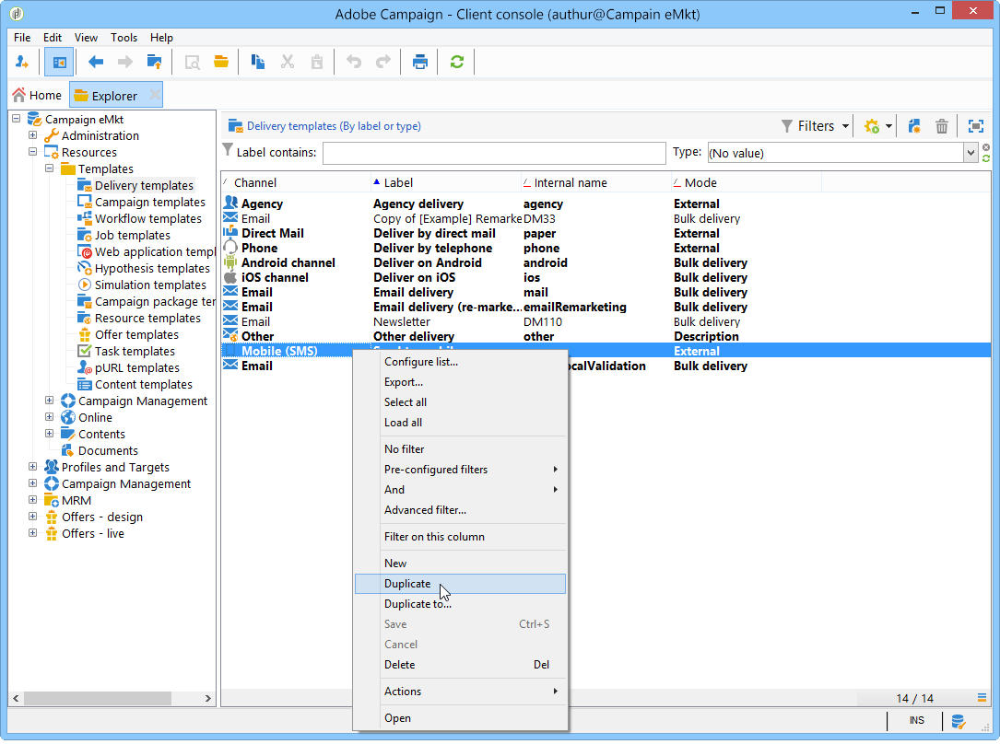
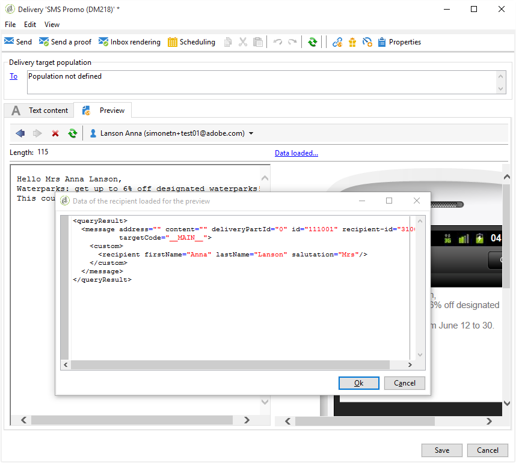

# SMS 頻道{#sms-channel}

Adobe Campaign可讓您執行大量個人化的簡訊傳送。 收件者描述檔必須至少包含行動電話號碼。

>[!NOTE]
>
>Adobe Campaign也可讓您透過其&#x200B;**Adobe Campaign行動應用頻道(NMAC)**&#x200B;選項，在行動終端上提交通知。
> 
>如需詳細資訊，請參閱[關於行動應用程式頻道](../../delivery/using/about-mobile-app-channel.md)一節。

以下各節提供SMS頻道專屬的資訊。 有關如何建立傳送的全局資訊，請參閱[本節](../../delivery/using/steps-about-delivery-creation-steps.md)。

## 設定SMS通道{#setting-up-sms-channel}

若要傳送至行動電話，您需要：

1. 指定連接器和消息類型的外部帳戶。

   請注意，從20.2版開始，將不建議使用下列連接器：通用SMPP（支援二進位模式的SMPP 3.4版）、Sybase365(SAP SMS 365)、CLX通信、Tele2、O2和iOS。 淘汰的功能仍然可用，但將不會進一步增強，也不支援。 如需關於此項目的詳細資訊，請參閱此[頁面](https://helpx.adobe.com/tw/campaign/kb/deprecated-and-removed-features.html)。

1. 參考此外部帳戶的傳送範本。

### 建立SMPP外部帳戶{#creating-an-smpp-external-account}

若要將SMS傳送至行動電話，您首先需要建立SMPP外部帳戶。
有關SMS協定和設定的詳細資訊，請參閱此[頁](../../delivery/using/sms-protocol.md)。

要執行此操作，請遵循下列步驟：

1. 在樹的&#x200B;**[!UICONTROL Platform]** > **[!UICONTROL External accounts]**&#x200B;節點中，按一下&#x200B;**[!UICONTROL New]**&#x200B;表徵圖。
1. 將帳戶類型定義為&#x200B;**路由**，渠道定義為&#x200B;**移動(SMS)**，傳送模式定義為&#x200B;**批量傳送**。

   

1. 選中&#x200B;**[!UICONTROL Enabled]**&#x200B;框。
1. 在&#x200B;**[!UICONTROL Mobile]**&#x200B;標籤中，從&#x200B;**[!UICONTROL Connector]**&#x200B;下拉式清單中選擇&#x200B;**[!UICONTROL Extended generic SMPP]**。

   

   >[!CAUTION]
   >
   > 從20.2版開始，舊版連接器已過時且不受支援。 建議使用&#x200B;**[!UICONTROL Extended generic SMPP]**&#x200B;連接器。 有關如何遷移到建議連接器的詳細資訊，請參閱此[頁](../../delivery/using/unsupported-connector-migration.md)。

1. **[!UICONTROL Enable verbose SMPP traces in the log file]**&#x200B;選項允許您將所有SMPP通信轉儲到日誌檔案中。 必須啟用此選項，才能疑難排解連接器，並與提供者所看到的流量進行比較。

1. 請連絡您的SMS服務供應商，該服務提供商將向您解釋如何從&#x200B;**[!UICONTROL Connection settings]**&#x200B;頁籤填寫不同的外部帳戶欄位。

   然後，請根據您選擇的供應商，與您聯繫，由誰為您提供輸入&#x200B;**[!UICONTROL SMSC implementation name]**&#x200B;欄位的值。

   您可以定義每個MTA子代與提供者的連線數。 依預設，會設為1。

1. 根據預設，SMS中的字元數量符合GSM標準。

   使用 GSM 編碼的 SMS 訊息最多只能有 160 個字元，若是以多個部分傳送的訊息，則每個 SMS 的 SMS 訊息最多只能有 153 個字元。

   >[!NOTE]
   >
   >某些字元會計為兩個字元（括弧、方括弧、歐元符號等）。
   >
   >以下列出可用的GSM字元。

   您也可以核取相對應的方塊，以授權字元音譯。

   

   如需詳細資訊，請參閱[本章節](#about-character-transliteration)。

1. 在&#x200B;**[!UICONTROL Throughput and delays]**&#x200B;頁籤中，可以指定每秒MT的出站消息（「MT」,「已終止移動」）的最大吞吐量。 如果您在對應欄位中輸入　&quot;0&quot;，則吞吐量將無限制。

   與持續時間對應的所有欄位的值需要以秒為單位完成。

1. 在&#x200B;**[!UICONTROL Mapping of encodings]**&#x200B;標籤中，您可以定義編碼。

   如需詳細資訊，請參閱[本章節](#about-text-encodings)。

1. 在&#x200B;**[!UICONTROL SMSC specificities]**&#x200B;標籤中，**[!UICONTROL Send full phone number]**&#x200B;選項預設為停用。 如果要遵守SMPP協定並僅將數字傳輸到SMS提供器(SMSC)的伺服器，請不要啟用它。

   但是，由於某些提供者需要使用&#39;+&#39;首碼，建議您與提供者確認，並建議您視需要啟用此選項。

   使用&#x200B;**[!UICONTROL Enable TLS over SMPP]**&#x200B;複選框可以加密SMPP通信。 如需關於此項目的詳細資訊，請參閱此[頁面](../../delivery/using/sms-protocol.md)。

1. 如果您要設定&#x200B;**[!UICONTROL Extended generic SMPP]**&#x200B;連接器，則可以設定自動回覆。

   如需詳細資訊，請參閱[本章節](#automatic-reply)。

### 關於字元音譯{#about-character-transliteration}

字母音譯可在SMPP行動傳送外部帳戶中設定，位於&#x200B;**[!UICONTROL Mobile]**&#x200B;標籤下。

音譯包括當 GSM 標準未考慮到 SMS 的一個字元時，用另一個字元取代該字元。

* 如果音譯是&#x200B;**[!UICONTROL authorized]**，則在傳送訊息時，未考慮的每個字元都會由GSM字元取代。 例如，字元 &quot;ë&quot; 會由 &quot;e&quot; 取代。因此，訊息會稍微變更，但字元限制將維持不變。
* 當音譯為&#x200B;**[!UICONTROL not authorized]**&#x200B;時，每個包含未納入考量的字元的訊息都會以二進位格式(Unicode)傳送：因此，所有字元都將按原樣發送。 不過，使用 Unicode 的 SMS 訊息最多只能有 70 個字元（若是以多個部分傳送的訊息，則每個 SMS 有 67 個字元）。如果超出字元數上限，則會傳送數則訊息，這可能會造成額外成本。

>[!IMPORTANT]
>
>將個人化欄位插入您的 SMS 訊息內容，可能會引入 GSM 編碼未考慮的字元。

依預設，會停用字元音譯。如果您希望 SMS 訊息中的所有字元都保持原樣，不要變更正確名稱（例如），建議您不要啟用此選項。

不過，如果您的 SMS 訊息包含許多產生 Unicode 訊息的字元，您可以選取啟用此選項，以限制傳送訊息的成本。

下表列出GSM標準所考慮的字元。 除下面提及的字元外，所有插入訊息內文的字元都會將整個訊息轉換為二進位格式 (Unicode)，因此限制為 70 個字元。

**基本字元**

<table> 
 <tbody> 
  <tr> 
   <td> @ </td> 
   <td>  </td> 
   <td> SP </td> 
   <td> 0 </td> 
   <td> 「 </td> 
   <td> P </td> 
   <td> 。 </td> 
   <td> p </td> 
  </tr> 
  <tr> 
   <td> 英鎊 </td> 
   <td> _ </td> 
   <td> ! </td> 
   <td> 1 </td> 
   <td> A </td> 
   <td> Q </td> 
   <td> a </td> 
   <td> q </td> 
  </tr> 
  <tr> 
   <td> $ </td> 
   <td>  </td> 
   <td> 」 </td> 
   <td> 2 </td> 
   <td> B </td> 
   <td> R </td> 
   <td> b </td> 
   <td> r </td> 
  </tr> 
  <tr> 
   <td> ¥ </td> 
   <td>  </td> 
   <td> # </td> 
   <td> 3 </td> 
   <td> C </td> 
   <td> S </td> 
   <td> c </td> 
   <td> s </td> 
  </tr> 
  <tr> 
   <td> è </td> 
   <td>  </td> 
   <td> ∮ </td> 
   <td> 4 </td> 
   <td> D </td> 
   <td> T </td> 
   <td> d </td> 
   <td> t </td> 
  </tr> 
  <tr> 
   <td> é </td> 
   <td>  </td> 
   <td> % </td> 
   <td> 5 </td> 
   <td> E </td> 
   <td> U </td> 
   <td> e </td> 
   <td> u </td> 
  </tr> 
  <tr> 
   <td> ù </td> 
   <td>  </td> 
   <td> &amp; </td> 
   <td> 6 </td> 
   <td> F </td> 
   <td> V </td> 
   <td> f </td> 
   <td> v </td> 
  </tr> 
  <tr> 
   <td> ì </td> 
   <td>  </td> 
   <td> ' </td> 
   <td> 7 </td> 
   <td> G </td> 
   <td> W </td> 
   <td> g </td> 
   <td> w </td> 
  </tr> 
  <tr> 
   <td> ò </td> 
   <td>  </td> 
   <td> ( </td> 
   <td> 8 </td> 
   <td> H </td> 
   <td> X </td> 
   <td> h </td> 
   <td> x </td> 
  </tr> 
  <tr> 
   <td> Ç </td> 
   <td>  </td> 
   <td> ） </td> 
   <td> 9 </td> 
   <td> I </td> 
   <td> Y </td> 
   <td> i </td> 
   <td> y </td> 
  </tr> 
  <tr> 
   <td> LF </td> 
   <td>  </td> 
   <td> * </td> 
   <td> : </td> 
   <td> J </td> 
   <td> Z </td> 
   <td> j </td> 
   <td> z </td> 
  </tr> 
  <tr> 
   <td> Ø </td> 
   <td> ESC </td> 
   <td> + </td> 
   <td> ; </td> 
   <td> K </td> 
   <td> Ä </td> 
   <td> k </td> 
   <td> ä </td> 
  </tr> 
  <tr> 
   <td> ø </td> 
   <td> Æ </td> 
   <td> 的 </td> 
   <td> &lt;&gt; </td> 
   <td> L </td> 
   <td> Ö </td> 
   <td> l </td> 
   <td> ö </td> 
  </tr> 
  <tr> 
   <td> CR </td> 
   <td> æ </td> 
   <td> - </td> 
   <td> = </td> 
   <td> M </td> 
   <td> Ñ </td> 
   <td> m </td> 
   <td> ñ </td> 
  </tr> 
  <tr> 
   <td> Å </td> 
   <td> ß </td> 
   <td> . </td> 
   <td> &gt; </td> 
   <td> N </td> 
   <td> Ü </td> 
   <td> n </td> 
   <td> ü </td> 
  </tr> 
  <tr> 
   <td> å </td> 
   <td> É </td> 
   <td> / </td> 
   <td> ? </td> 
   <td> O </td> 
   <td> § </td> 
   <td> o </td> 
   <td> à </td> 
  </tr> 
 </tbody> 
</table>

SP：Space

ESC：Escape

LF：換行

CR：歸位

**進階字元（計算兩次）**

^ { } `[ ~ ]` |€

### 關於文字編碼{#about-text-encodings}

傳送 SMS 訊息時，Adobe Campaign 可以使用一或多種文字編碼。每個編碼都有其專屬的字元集，並決定符合 SMS 訊息的字元數。

在配置新的SMPP移動傳送外部帳戶時，您可以在&#x200B;**[!UICONTROL Mobile]**&#x200B;標籤中定義&#x200B;**[!UICONTROL Mapping of encodings]**:**[!UICONTROL data_coding]**&#x200B;欄位可讓Adobe Campaign通訊SMSC使用哪種編碼。

>[!NOTE]
>
>**data_coding** 值及實際使用編碼之間的對應是標準化的。然而，某些SMSC有其自己的具體對應：在這種情況下，您的&#x200B;**Adobe Campaign**&#x200B;管理員需要聲明此映射。 請洽詢您的提供者以瞭解更多資訊。

您可以宣告&#x200B;**data_codings**，並視需要強制編碼：若要這麼做，請在表格中指定單一編碼。

* 當未定義編碼的映射時，連接器會採取一般行為：

   * 它會嘗試使用 GSM 編碼，將 **data_coding = 0** 的值指派給它。
   * 如果 GSM 編碼失敗，則會使用 **UCS2** 編碼，並對其指派值 **data_coding = 8**。

* 當您定義要使用的編碼以及連結的&#x200B;**[!UICONTROL data_coding]**&#x200B;欄位值時，Adobe Campaign會嘗試使用清單中的第一個編碼，如果第一個編碼不可能，則下列。

>[!IMPORTANT]
>
>宣告的順序非常重要：建議您以&#x200B;**成本**&#x200B;的遞增順序顯示清單，以利於編碼，讓您在每則 SMS 訊息中盡可能多地顯示字元。
>
>僅宣告您要使用的編碼。如果SMSC提供的某些編碼不符合您的使用目的，請勿在清單中宣告。

### 自動回覆{#automatic-reply}

在設定擴展的通用SMPP連接器時，可以配置自動回覆。

當訂閱者回覆透過Adobe Campaign傳送給他們的SMS訊息，且其訊息包含關鍵字（例如「STOP」）時，您可在&#x200B;**[!UICONTROL Automatic reply sent to the MO]**&#x200B;區段中設定自動傳回給他們的訊息。

>[!NOTE]
>
>關鍵字不區分大小寫。

對於每個關鍵字，請指定一個簡短代碼，此代碼通常用於發送傳送，並用作發送者名稱，然後輸入要發送給訂閱者的消息。

您也可以將動作連結至自動回應：**[!UICONTROL Send to quarantine]**&#x200B;或&#x200B;**[!UICONTROL Remove from quarantine]**。 例如，如果收件者傳送關鍵字&quot;STOP&quot;，他們會自動收到取消訂閱的確認，並傳送至隔離。


如果您將&#x200B;**[!UICONTROL Remove from quarantine]**&#x200B;動作連結至自動回應，傳送對應關鍵字的收件者會自動從隔離中移除。

**[!UICONTROL Administration]** > **[!UICONTROL Campaign Management]** > **[!UICONTROL Non deliverables Management]**&#x200B;功能表提供的&#x200B;**[!UICONTROL Non deliverables and addresses]**&#x200B;表中列出了收件者。

* 若要傳送相同的回覆，不論是短程式碼，請將&#x200B;**[!UICONTROL Short code]**&#x200B;欄留空。
* 若要傳送相同的回覆，不論關鍵字為何，請將&#x200B;**[!UICONTROL Keyword]**&#x200B;欄留空。
* 要執行不發送響應的操作，請將&#x200B;**[!UICONTROL Response]**&#x200B;列保留為空。 例如，這可讓您從隔離使用「STOP」以外訊息回覆的使用者移除。

如果您使用具有相同提供者帳戶的擴充通用SMPP連接器，有多個外部帳戶，可能會發生下列問題：當傳送回覆至簡短程式碼時，可能會在您的任何外部帳戶連線上收到回覆。 因此，所發送的自動回覆不能是預期訊息。
若要避免此情況，請根據您使用的提供者，套用下列其中一個解決方案：

* 為每個外部帳戶建立一個提供程式帳戶。
* 使用&#x200B;**[!UICONTROL Mobile]** > **[!UICONTROL Connection settings]**&#x200B;標籤中的&#x200B;**[!UICONTROL System type]**&#x200B;欄位來區分每個簡短代碼。 請向您的供應商洽詢每個帳戶的不同值。

   

使用擴展通用SMPP連接器設定外部帳戶的步驟在[建立SMPP外部帳戶](../../delivery/using/sms-channel.md#creating-an-smpp-external-account)部分中有詳細說明。

### 變更傳送範本{#changing-the-delivery-template}

Adobe Campaign為您提供傳送至行動裝置的範本。 此模板在&#x200B;**[!UICONTROL Resources > Templates > Delivery templates]**&#x200B;節點中可用。 有關詳細資訊，請參閱[關於templates](../../delivery/using/about-templates.md)部分。

若要透過SMS頻道傳送，您必須建立參考頻道連接器的範本。

為了保留原生傳送範本，建議您先複製範本，然後加以設定。

在以下範例中，我們建立範本，以透過先前啟用的SMPP帳戶傳送訊息。 操作步驟：

1. 轉至&#x200B;**[!UICONTROL Delivery templates]**&#x200B;節點。
1. 按一下右鍵&#x200B;**[!UICONTROL Send to mobiles]**&#x200B;模板，然後選擇&#x200B;**[!UICONTROL Duplicate]**。

   

1. 變更範本的標籤，例如&#x200B;**傳送至行動裝置(SMPP)**。

   

1. 按一下 **[!UICONTROL Properties]**。
1. 在&#x200B;**[!UICONTROL General]**&#x200B;標籤中，選擇與您在前面步驟中建立的外部帳戶相對應的路由模式。

   

1. 按一下&#x200B;**[!UICONTROL Save]**&#x200B;以建立範本。

   

您現在擁有外部帳戶和傳送範本，可讓您透過SMS傳送。

## 建立SMS傳送{#creating-a-sms-delivery}

### 選擇傳送渠道{#selecting-the-delivery-channel}

若要建立新的SMS傳送，請遵循下列步驟：

>[!NOTE]
>
>在[本節](../../delivery/using/steps-about-delivery-creation-steps.md)中介紹了建立交付的全局概念。

1. 建立新的傳送，例如從「傳送」控制面板建立。
1. 選擇您先前建立的傳送範本&#x200B;**傳送至行動裝置(SMPP)**。 有關詳細資訊，請參閱[更改傳送模板](#changing-the-delivery-template)部分。

   

1. 使用標籤、程式碼和說明來識別您的傳送。 如需詳細資訊，請參閱[本章節](../../delivery/using/steps-create-and-identify-the-delivery.md#identifying-the-delivery)。
1. 按一下&#x200B;**[!UICONTROL Continue]**&#x200B;確認此資訊並顯示消息配置窗口。

## 定義SMS內容{#defining-the-sms-content}

若要建立SMS內容，請遵循下列步驟：

1. 在嚮導的&#x200B;**[!UICONTROL Text content]**&#x200B;部分中輸入消息內容。 工具列按鈕可讓您匯入、儲存或搜尋內容。 最後一個按鈕用於插入個人化欄位。

   

   個人化欄位的使用會顯示在[關於個人化](../../delivery/using/about-personalization.md)區段中。

1. 按一下頁面底部的&#x200B;**[!UICONTROL Preview]**，檢視訊息的個人化呈現。 若要啟動預覽，請使用工具列中的&#x200B;**[!UICONTROL Test personalization]**&#x200B;按鈕選取收件者。 您可以從定義的目標中選擇收件者，或選擇其他收件者。

   

   您可以核准SMS訊息。 您也可以在內容編輯器右側的行動電話畫面上檢視SMS內容。 按一下畫面，然後使用滑鼠捲動內容。

   

1. 按一下&#x200B;**[!UICONTROL Data loaded]**&#x200B;連結可查看有關收件人的資訊。

   

   >[!NOTE]
   >
   >如果使用Latin-1(ISO-8859-1)程式碼頁面，SMS訊息的長度將限制為160個字元。 如果訊息是以Unicode撰寫，則不得超過70個字元。 某些特殊字元會影響訊息長度。 有關消息長度的詳細資訊，請參閱[關於字元音譯](#about-character-transliteration)部分。
   >
   >當個人化欄位或條件式內容欄位存在時，訊息的大小會因收件者而異。 執行個人化時，必須評估訊息的長度。
   >
   >啟動分析時，會檢查訊息的長度，並在發生溢位時顯示警告。

1. 如果您使用NetSize連接器或SMPP連接器，則可以個人化傳送者的名稱。 有關詳細資訊，請參閱[Advanced parameters](#advanced-parameters)部分。

## 選擇目標人口{#selecting-the-target-population}

選擇傳送的目標人口時的詳細過程顯示在[本節](../../delivery/using/steps-defining-the-target-population.md)中。

有關個人化欄位的詳細資訊，請參閱[關於個人化](../../delivery/using/about-personalization.md)。

有關包含種子清單的詳細資訊，請參閱[關於種子地址](../../delivery/using/about-seed-addresses.md)。

## 發送SMS消息{#sending-sms-messages}

若要核准訊息並傳送給所建立之傳送的收件者，請按一下&#x200B;**[!UICONTROL Send]**。

驗證和傳送傳送時的詳細程式會列於以下各節：

* [驗證傳遞](../../delivery/using/steps-validating-the-delivery.md)
* [傳送傳遞](../../delivery/using/steps-sending-the-delivery.md)

### 高級參數 {#advanced-parameters}

**[!UICONTROL Properties]**&#x200B;按鈕可讓您存取進階傳送參數。 SMS傳送的特定參數位於&#x200B;**[!UICONTROL Delivery]**&#x200B;標籤的&#x200B;**[!UICONTROL SMS parameters]**&#x200B;區段中。

可以使用以下選項：

* **發件人地址**:可讓您使用字母數字字元字串（以十一個字元為限），個人化傳送者的名稱。該欄位不能只由數字組成。 您可以定義條件，例如根據收件者的區域代碼顯示不同的名稱：

   ```
   <% if( String(recipient.mobilePhone).indexOf("+1") == 0){ %>NeoShopUS<%} else %>
   ```

   >[!IMPORTANT]
   >
   >檢查您所在國家／地區有關編輯傳送者名稱的法律。 您也應洽詢您的營運商，看他們是否提供此功能。

* **傳輸模式**:通過SMS進行消息傳輸。
* **優先順序**:指派給訊息的重要程度。**[!UICONTROL Normal]** 優先順序預設為選取。請洽詢您的服務供應商有關以&#x200B;**[!UICONTROL High]**&#x200B;優先順序傳送之簡訊的成本。
* **應用程式類型**:選擇您要指派給SMS傳送的應用程式。預設會選取&#x200B;**[!UICONTROL Direct Marketing]**&#x200B;選項，是最常用的選項。

**NetSize連接器的特定參數**


* **針對單一訊息使用數種簡訊**:這可讓您透過數條簡訊傳送超過160個字元的訊息。

**SMPP連接器的特定參數**


* **每則訊息的SMS最大數量**:此選項可讓您設定用來傳送訊息的SMS數目。如果數字設為0，您可以使用SMS來傳送訊息。 例如，如果SMS的數目設為1或2，而訊息超過此臨界值，則不會傳送。

## 監控和追蹤SMS傳送{#monitoring-and-tracking-sms-deliveries}

傳送訊息後，您可以監控及追蹤傳送內容。 如需詳細資訊，請參閱下列區段。

* [監視](../../delivery/using/about-delivery-monitoring.md)
* [瞭解傳送故障](../../delivery/using/understanding-delivery-failures.md)
* [關於訊息追蹤](../../delivery/using/about-message-tracking.md)

## 處理入站消息{#processing-inbound-messages}

**nlserver sms**&#x200B;模組以定期間隔查詢SMS路由器。 這可讓Adobe Campaign追蹤傳送進度，並處理狀態報告和收件者取消訂閱的要求。

* **狀態報告**:檢視傳送記錄，以檢查訊息的狀態。

   >[!NOTE]
   >
   >每個傳送的簡訊都會連結至其主要金鑰的外部帳戶。 這樣：
   >
   > * 已刪除外部SMS帳戶的狀態報告無法正確處理。
   > * SMS帳戶只能連結至單一外部帳戶，以確保狀態報表歸屬於正確的帳戶


* **取消訂閱**:希望停止接收SMS傳送的收件者可傳回包含STOP字詞的訊息。如果您的提供者根據合約條款允許留言，您可以透過&#x200B;**傳入SMS**&#x200B;工作流程活動擷取訊息，然後建立查詢以啟用&#x200B;**不再為相關收件者連絡此收件者**&#x200B;選項。

   請參閱[Workflows](../../workflow/using/architecture.md)指南。

## InSMS架構{#insms-schema}

InSMS架構包含與傳入SMS相關的資訊。 這些欄位的說明可透過desc屬性取得。

* **訊息**:收到的簡訊內容。
* **來源**:訊息來源的行動電話號碼。
* **providerId**:SMSC（消息中心）返回的消息的標識符。
* **已建立**:日期傳入消息被插入Adobe Campaign。
* **extAccount**:Adobe Campaign外部帳戶。

   >[!IMPORTANT]
   >
   >以下欄位是NetSize專用的。
   >
   >如果使用中的運算子不是NetSize，則這些欄位會視為空白。

* **別名**:傳入消息的別名。
* **分隔符**:別名和消息正文之間的分隔符。
* **messageDate**:運算子提供的訊息日期。
* **receivalDate**:SMSC（消息中心）收到來自操作員的日期消息。
* **deliveryDate**:由SMSC（消息中心）發送的日期消息。
* **largeAccount**:連結至傳入SMS的客戶帳戶代碼。
* **countryCode**:營運商國家／地區代碼。
* **operatorCode**:營運商網路程式碼。
* **linkedSmsId**:Adobe Campaign識別碼(broadlogId)，連結至傳出的SMS，而此SMS是回應。

## 管理自動回覆（美國法規）{#managing-automatic-replies--american-regulation-}

當訂閱者回覆透過Adobe Campaign傳送給他們的SMS訊息，並使用STOP、HELP或YES等關鍵字時，在美國市場，必須設定自動傳回的訊息。

例如，如果收件者傳送關鍵字STOP，他們會自動收到確認訊息，指出他們已取消訂閱。

此類型訊息的傳送者名稱是用來傳送傳送訊息的簡短代碼。

>[!IMPORTANT]
>
>以下詳細過程僅對SMPP連接器有效，擴展的通用SMPP連接器除外。 有關詳細資訊，請參閱[建立SMPP外部帳戶](#creating-an-smpp-external-account)部分。
>
>它是美國營運商在美國進行行銷宣傳的認證程式的一部分。 這些對包含關鍵字的訂戶SMS消息的回覆必須在收到來自他們的消息後立即傳回給訂戶。

1. 建立此類型的XML檔案：

   ```
   <autoreply>
     <shortcode name="12345">
       <reply keyword="STOP" text="You will not receive SMS anymore" />
       <reply keyword="HELP" text="Powered by Adobe Campaign" />
     </shortcode>
     <shortcode name="43115">
       <reply keyword="STOP" text="Vous ne recevrez plus de SMS" />
       <reply keyword="HELP" text="Service rendu par Adobe Campaign" />
     </shortcode>
     <shortcode name="*">
       <reply keyword="ADOBE" text="This text is replied when you send ADOBE to any short code" />
     </shortcode>
   </autoreply>
   ```

1. 對於&#x200B;**`<shortcode>`**&#x200B;標籤的&#x200B;**name**&#x200B;屬性，指定將顯示在消息發送者名稱位置的短代碼。

   在每個&#x200B;**`<reply>`**&#x200B;標籤中，輸入包含關鍵字的&#x200B;**keyword**&#x200B;屬性，以及包含您要為此關鍵字傳送訊息的&#x200B;**text**&#x200B;屬性。

   >[!NOTE]
   >
   >每個關鍵字都必須以大寫字母寫入。

   如果您想要傳送多個關鍵字的相同訊息，請複製對應的行。

   例如：

   ```
   <reply keyword="STOP" text="You will not receive SMS anymore" />
   <reply keyword="QUIT" text="You will not receive SMS anymore" />
   ```

1. 完成後，請以&#x200B;**smsAutoReply.xml**&#x200B;的名稱儲存此檔案。

   請注意，在Linux中，檔案名稱區分大小寫。

1. 將此檔案複製到Adobe Campaign的&#x200B;**conf**&#x200B;目錄，與Web伺服器位於同一位置。

>[!IMPORTANT]
>
>這類自動訊息不會保留歷史記錄。 因此，它們不會出現在[傳送控制面板](../../delivery/using/delivery-dashboard.md)中。
>
>這些消息不被視為[商用壓力規則](../../campaign/using/pressure-rules.md)的一部分。
