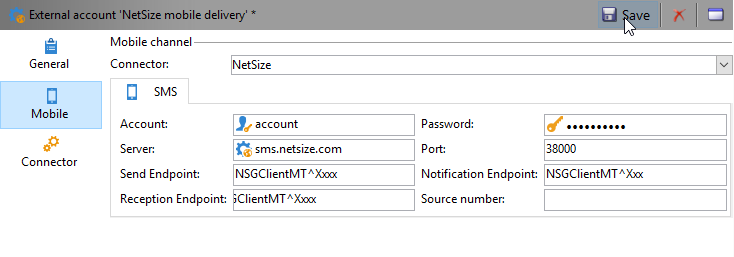

# SMS頻道{#sms-channel}

Adobe Campaign可讓您執行大量個人化的SMS訊息傳送。 收件者描述檔必須至少包含行動電話號碼。

>[!NOTE]
>
>Adobe Campaign也可讓您透過其 **Adobe Campaign行動應用程式頻道(NMAC)選項，在行動終端上送出通知** 。
> 
>如需詳細資訊，請參閱關於行 [動應用程式頻道](../../delivery/using/about-mobile-app-channel.md) 。

以下各節提供SMS頻道專屬的資訊。 如需如何建立傳送的全域資訊，請參[閱本節](../../delivery/using/steps-about-delivery-creation-steps.md)。

## 設定SMS頻道 {#setting-up-sms-channel}

若要傳送至行動電話，您需要：

1. 指定連接器和消息類型的外部帳戶。

   可用連接器包括：NetSize、通用SMPP（支援二進位模式的SMPP 3.4版）、Sybase365(SAP SMS 365)、CLX通信、Tele2、O2和擴展通用SMPP。

1. 參考此外部帳戶的傳送範本。

### 啟用外部帳戶 {#activating-an-external-account}

外部帳戶清單可在Adobe Campaign檔案總管 **[!UICONTROL Platform]** 樹狀 **[!UICONTROL External accounts]** 結構的>節點中找到。

* 例如，前往名為的預設帳戶 **[!UICONTROL NetSize mobile delivery]**。
* 在頁籤 **[!UICONTROL General]** 中，選中該 **[!UICONTROL Enabled]** 框。

   

* 檢查是否 **[!UICONTROL Mobile]** 已為欄位選擇選 **[!UICONTROL Channel]** 項。
* 在頁籤 **[!UICONTROL Mobile]** 中，從下拉清單中選擇一個連接器：NetSize、通用SMPP、Sybase365(SAP SMS 365)、CLX通信、Tele2、O2或擴展通用SMPP。 有關擴展通用SMPP連接器的詳細資訊，請參閱 [建立SMPP外部帳戶部分](#creating-an-smpp-external-account) 。

   

* 根據供應商提供的資訊配置連接器。 在以下範例中，運算子是NetSize。

   

* 在標籤 **[!UICONTROL Connector]** 中，預設會保 **[!UICONTROL Call Web Service]** 留啟動模式。

   

* 如果顯 **[!UICONTROL Connector]** 示頁籤，請指定連接器的訪問URL。 如果提供者是NetSize, **則該地址必須以netsize.jsp** 結尾。 對於所有其他連接器，URL地址以 **smpp34.jsp結束**。

### 建立SMPP外部帳戶 {#creating-an-smpp-external-account}

如果您想使用SMPP通訊協定，也可以建立新的外部帳戶。

有關SMS通訊協定和設定的詳細資訊，請參閱此 [技術說明](https://helpx.adobe.com/campaign/kb/sms-connector-protocol-and-settings.html)。

要執行此操作，請遵循下列步驟：

1. 在樹 **[!UICONTROL Platform]** 的> **[!UICONTROL External accounts]** 節點中，按一下圖 **[!UICONTROL New]** 標。
1. 將帳戶類型定 **義為「路由**」、頻道定義為「 **行動」(SMS)**，以及傳送模式定義為「大量 **傳送」**。

   

1. 選中該 **[!UICONTROL Enabled]** 框。
1. 在標籤 **[!UICONTROL Mobile]** 中，從下 **[!UICONTROL Extended generic SMPP]** 拉式清 **[!UICONTROL Connector]** 單中選取。

   

   此選 **[!UICONTROL Enable verbose SMPP traces in the log file]** 項允許您將所有SMPP流量轉儲到日誌檔案中。 必須啟用此選項，才能排除連接器故障，並與提供者所看到的流量進行比較。

1. 請連絡您的SMS服務供應商，該服務供應商將向您說明如何從標籤填寫不同的外部帳戶 **[!UICONTROL Connection settings]** 欄位。

   然後，請根據您選擇的供應商，與您聯繫，由誰為您提供輸入欄位的 **[!UICONTROL SMSC implementation name]** 值。

   您可以定義每個MTA子代與提供者的連線數。 依預設，會設為1。

1. 根據預設，SMS中的字元數量符合GSM標準。

   使用GSM編碼的SMS訊息最多只能有160個字元，若是以多個部分傳送的訊息，則每個SMS的SMS訊息最多只能有153個字元。

   >[!NOTE]
   >
   >某些字元會計為兩個字元（括弧、方括弧、歐元符號等）。
   >
   >以下列出可用的GSM字元。

   如果您喜歡，可以勾選對應方塊，以授權字母音譯。

   

   如需詳細資訊，請參閱[本小節](#about-character-transliteration)。

1. 在該選 **[!UICONTROL Throughput and delays]** 項卡中，可以指定每秒MT的出站消息（「MT」,「已終止移動」）的最大吞吐量。 如果您在對應欄位中輸入&quot;0&quot;，則吞吐量將無限制。

   與持續時間對應的所有欄位的值需要以秒為單位完成。

1. 在標籤 **[!UICONTROL Mapping of encodings]** 中，您可以定義編碼。

   如需詳細資訊，請參閱[本小節](#about-text-encodings)。

1. 在標籤 **[!UICONTROL SMSC specificities]** 中，預設 **[!UICONTROL Send full phone number]** 會停用選項。 如果要遵守SMPP協定並僅將數字傳輸到SMS提供器(SMSC)的伺服器，請不要啟用它。

   但是，由於某些提供者需要使用&#39;+&#39;首碼，建議您向提供者確認，並建議您視需要啟用此選項。

   此復 **[!UICONTROL Enable TLS over SMPP]** 選框允許您加密SMPP通信。 有關詳情，請參閱本技 [術說明](https://helpx.adobe.com/campaign/kb/sms-connector-protocol-and-settings.html)。

1. 如果您要設定連 **[!UICONTROL Extended generic SMPP]** 接器，可以設定自動回覆。

   如需詳細資訊，請參閱[本小節](#automatic-reply)。

### 關於字元音譯 {#about-character-transliteration}

字母音譯可在SMPP行動傳送外部帳戶的標籤下設定 **[!UICONTROL Mobile]** 。

音譯包括當GSM標準未考慮到SMS的一個字元時，用另一個字元取代該字元。

* 如果音譯是 **[!UICONTROL authorized]**&#x200B;音譯的，則在傳送訊息時，未考慮的每個字元都會由GSM字元取代。 例如，字母&quot;ë&quot;被&quot;e&quot;取代。 因此，訊息會稍微變更，但字元限制將維持不變。
* 當音譯時， **[!UICONTROL not authorized]**&#x200B;每個包含未納入考量的字元的訊息，都會以二進位格式(Unicode)傳送：因此，所有字元都將按原樣發送。 不過，使用Unicode的SMS訊息最多只能有70個字元（若是以多個部分傳送的訊息，則每個SMS有67個字元）。 如果超出字元數上限，則會傳送數則訊息，這可能會造成額外成本。

>[!CAUTION]
>
>將個人化欄位插入您的SMS訊息內容，可能會引入GSM編碼未考慮的字元。

依預設，字母音譯會停用。 如果您希望SMS訊息中的所有字元都保持原樣，不要變更正確名稱（例如），建議您不要啟用此選項。

不過，如果您的SMS訊息包含許多產生Unicode訊息的字元，您可以選擇啟用此選項，以限制傳送訊息的成本。

下表列出GSM標準所考慮的字元。 除下面提及的字元外，所有插入訊息內文的字元都會將整個訊息轉換為二進位格式(Unicode)，因此限制為70個字元。

**基本字元**

<table> 
 <tbody> 
  <tr> 
   <td> @ </td> 
   <td>  </td> 
   <td> SP </td> 
   <td> 0 </td> 
   <td> ¡ </td> 
   <td> P </td> 
   <td> ¿ </td> 
   <td> p </td> 
  </tr> 
  <tr> 
   <td> £ </td> 
   <td> _ </td> 
   <td> ! </td> 
   <td> 1 </td> 
   <td> A </td> 
   <td> Q </td> 
   <td> a </td> 
   <td> q </td> 
  </tr> 
  <tr> 
   <td> $ </td> 
   <td>  </td> 
   <td> " </td> 
   <td> 2 </td> 
   <td> B </td> 
   <td> R </td> 
   <td> b </td> 
   <td> r </td> 
  </tr> 
  <tr> 
   <td> ¥ </td> 
   <td>  </td> 
   <td> # </td> 
   <td> 3 </td> 
   <td> C </td> 
   <td> S </td> 
   <td> c </td> 
   <td> s </td> 
  </tr> 
  <tr> 
   <td> è </td> 
   <td>  </td> 
   <td> ¤ </td> 
   <td> 4 </td> 
   <td> D </td> 
   <td> T </td> 
   <td> d </td> 
   <td> t </td> 
  </tr> 
  <tr> 
   <td> 埃 </td> 
   <td>  </td> 
   <td> % </td> 
   <td> 5 </td> 
   <td> E </td> 
   <td> U </td> 
   <td> e </td> 
   <td> u </td> 
  </tr> 
  <tr> 
   <td> 烏 </td> 
   <td>  </td> 
   <td> &amp; </td> 
   <td> 6 </td> 
   <td> F </td> 
   <td> V </td> 
   <td> f </td> 
   <td> v </td> 
  </tr> 
  <tr> 
   <td> ì </td> 
   <td>  </td> 
   <td> ' </td> 
   <td> 7 </td> 
   <td> G </td> 
   <td> W </td> 
   <td> g </td> 
   <td> ww </td> 
  </tr> 
  <tr> 
   <td> 奧 </td> 
   <td>  </td> 
   <td> ( </td> 
   <td> 8 </td> 
   <td> H </td> 
   <td> X </td> 
   <td> h </td> 
   <td> x </td> 
  </tr> 
  <tr> 
   <td> Ç </td> 
   <td>  </td> 
   <td> ) </td> 
   <td> 9 </td> 
   <td> I </td> 
   <td> Y </td> 
   <td> i </td> 
   <td> y </td> 
  </tr> 
  <tr> 
   <td> LF </td> 
   <td>  </td> 
   <td> * </td> 
   <td> : </td> 
   <td> J </td> 
   <td> Z </td> 
   <td> j </td> 
   <td> z </td> 
  </tr> 
  <tr> 
   <td> 島 </td> 
   <td> ESC </td> 
   <td> + </td> 
   <td> ; </td> 
   <td> K </td> 
   <td> Ä </td> 
   <td> k </td> 
   <td> ä </td> 
  </tr> 
  <tr> 
   <td> ø </td> 
   <td> AE </td> 
   <td> , </td> 
   <td> &lt; </td> 
   <td> L </td> 
   <td> 厄 </td> 
   <td> l </td> 
   <td> ö </td> 
  </tr> 
  <tr> 
   <td> CR </td> 
   <td> æ </td> 
   <td> - </td> 
   <td> = </td> 
   <td> M </td> 
   <td> Ñ </td> 
   <td> m </td> 
   <td> ñ </td> 
  </tr> 
  <tr> 
   <td> 奧 </td> 
   <td> ß </td> 
   <td> . </td> 
   <td> &gt; </td> 
   <td> N </td> 
   <td> Ü </td> 
   <td> n </td> 
   <td> 女 </td> 
  </tr> 
  <tr> 
   <td> å </td> 
   <td> 埃 </td> 
   <td> / </td> 
   <td> ? </td> 
   <td> O </td> 
   <td> § </td> 
   <td> o </td> 
   <td> a </td> 
  </tr> 
 </tbody> 
</table>

SP:空間

ESC:Escape

LF:行動態消息

CR:歸位

**進階字元（計算兩次）**

^ { } `[ ~ ]` | €

### 關於文字編碼 {#about-text-encodings}

傳送SMS訊息時，Adobe Campaign可以使用一或多種文字編碼。 每個編碼都有其專屬的字元集，並決定符合SMS訊息的字元數。

在設定新的SMPP行動傳送外部帳戶時，您可以在標 **[!UICONTROL Mapping of encodings]** 簽中定 **[!UICONTROL Mobile]** 義：此欄 **[!UICONTROL data_coding]** 位可讓Adobe Campaign傳達SMSC使用的編碼。

>[!NOTE]
>
>標準化 **data_coding值與實際使用的編碼** 之間的映射。 然而，某些SMSC有其自己的具體對應：在這種情況下，您的 **** Adobe Campaign管理員需要宣告此對應。 請洽詢您的供應商以瞭解更多資訊。

您可以宣 **告data_codings** ，並強制進行編碼（如有必要）:若要這麼做，請在表格中指定單一編碼。

* 當未定義編碼的映射時，連接器會採取一般行為：

   * 它會嘗試使用GSM編碼，將 **data_coding = 0的值指派給它**。
   * 如果GSM編碼失敗，則會使 **用UCS2** 編碼，將值 **data_coding = 8**。

* 當您定義要使用的編碼以及連結的欄位值時，Adobe **[!UICONTROL data_coding]** Campaign會嘗試使用清單中的第一個編碼，如果第一個編碼被證明是不可能的，則會嘗試使用下列。

>[!CAUTION]
>
>聲明的順序非常重要：建議您將清單以成本的遞增 **順序** ，以利於編碼，讓您在每則SMS訊息中盡可能多地顯示字元。
>
>僅聲明您要使用的編碼。 如果SMSC提供的某些編碼不符合您的使用目的，請勿在清單中宣告。

### 自動回覆 {#automatic-reply}

在設定擴展的通用SMPP連接器時，可以配置自動回覆。

當訂閱者回覆透過Adobe Campaign傳送給他們的SMS訊息，且其訊息包含關鍵字（例如「STOP」）時，您可以設定訊息，並在區段中自動傳回給他們 **[!UICONTROL Automatic reply sent to the MO]** 。

>[!NOTE]
>
>關鍵字不區分大小寫。

對於每個關鍵字，請指定一個簡短代碼，此代碼通常用於發送傳送，並用作發送者名稱，然後輸入要發送給訂閱者的消息。

您也可以將動作連結至自動回應：或 **[!UICONTROL Send to quarantine]** 者 **[!UICONTROL Remove from quarantine]**。 例如，如果收件者傳送關鍵字&quot;STOP&quot;，他們會自動收到取消訂閱的確認，並傳送至隔離。


如果您將動作連 **[!UICONTROL Remove from quarantine]** 結至自動回應，傳送對應關鍵字的收件者會自動從隔離中移除。

收件者會列在可透過 **[!UICONTROL Non deliverables and addresses]** > >功能表 **[!UICONTROL Administration]** 取得 **[!UICONTROL Campaign Management]** 的表格中 **[!UICONTROL Non deliverables Management]** 。

* 若要傳送相同的回覆（無論是簡碼），請將欄留 **[!UICONTROL Short code]** 空。
* 若要傳送相同的回覆（無論關鍵字為何），請將欄留 **[!UICONTROL Keyword]** 空。
* 若要執行動作而不傳送回應，請將欄留 **[!UICONTROL Response]** 空。 例如，這可讓您從隔離使用「STOP」以外訊息回覆的使用者移除。

如果您使用具有相同提供者帳戶的擴充通用SMPP連接器，有多個外部帳戶，可能會發生下列問題：當傳送回覆至簡短程式碼時，可能會在您的任何外部帳戶連線上收到回覆。 因此，所發送的自動回覆不能是預期訊息。
若要避免此情況，請根據您使用的提供者，套用下列其中一個解決方案：
* 為每個外部帳戶建立一個提供程式帳戶。
* 使用> **[!UICONTROL System type]** 標籤中的欄 **[!UICONTROL Mobile]** 位 **[!UICONTROL Connection settings]** 來區分每個簡短代碼。 請向您的供應商洽詢每個帳戶的不同值。

   

有關使用擴展通用SMPP連接器設定外部帳戶的步驟，請參閱建立SMPP外 [部帳戶部分](../../delivery/using/sms-channel.md#creating-an-smpp-external-account) 。

### 變更傳送範本 {#changing-the-delivery-template}

Adobe Campaign提供您傳送至行動裝置的範本。 此模板可在節點中 **[!UICONTROL Resources > Templates > Delivery templates]** 使用。 有關詳細資訊，請參閱關於 [模板部分](../../delivery/using/about-templates.md) 。

若要透過SMS頻道傳送，您必須建立參考頻道連接器的範本。

為了保留原生傳送範本，建議您先複製範本，然後加以設定。

在以下示例中，我們建立了一個模板，以通過先前啟用的NetSize帳戶發送消息。 操作步驟：

1. 轉至節 **[!UICONTROL Delivery templates]** 點。
1. 在範本上按一 **[!UICONTROL Send to mobiles]** 下滑鼠右鍵，然後選取 **[!UICONTROL Duplicate]**。

   

1. 變更範本的標籤。

   

1. 按一下 **[!UICONTROL Properties]**.
1. 在標 **[!UICONTROL General]** 簽中，選擇與您配置的外部帳戶對應的路由模式，例如 **[!UICONTROL NetSize mobile delivery]**。

   

1. 按一 **[!UICONTROL Save]** 下以建立範本。

   

您現在擁有外部帳戶和傳送範本，可讓您透過SMS傳送。

## 建立簡訊傳送 {#creating-a-sms-delivery}

### 選擇傳送渠道 {#selecting-the-delivery-channel}

若要建立新的SMS傳送，請遵循下列步驟：

>[!NOTE]
>
>本節將介紹有關建立交付的全 [局概念](../../delivery/using/steps-about-delivery-creation-steps.md)。

1. 建立新的傳送，例如從「傳送」控制面板建立。
1. 選取您先前建立 **[!UICONTROL Send to mobiles (NetSize)]** 的傳送範本。 如需詳細資訊，請參閱「變更 [傳送範本」一節](#changing-the-delivery-template) 。

   

1. 使用標籤、程式碼和說明來識別您的傳送。 如需詳細資訊，請參閱[本小節](../../delivery/using/steps-create-and-identify-the-delivery.md#identifying-the-delivery)。
1. 按一下 **[!UICONTROL Continue]** 確認此資訊並顯示消息配置窗口。

## 定義SMS內容 {#defining-the-sms-content}

若要建立SMS內容，請遵循下列步驟：

1. 在嚮導的部分中輸 **[!UICONTROL Text content]** 入消息內容。 工具列按鈕可讓您匯入、儲存或搜尋內容。 最後一個按鈕用於插入個人化欄位。

   

   個人化欄位的使用會顯示在「關於個 [人化](../../delivery/using/about-personalization.md) 」區段。

1. 按一 **[!UICONTROL Preview]** 下頁面底部的，以檢視以個人化呈現訊息的情形。 若要啟動預覽，請使用工具列中的按 **[!UICONTROL Test personalization]** 鈕選取收件者。 您可以從定義的目標中選擇收件者，或選擇其他收件者。

   

   您可以核准SMS訊息。 您也可以在內容編輯器右側的行動電話畫面上檢視SMS內容。 按一下畫面，然後使用滑鼠捲動內容。

   

1. 按一下 **[!UICONTROL Data loaded]** 連結以檢視收件者的相關資訊。

   

   >[!NOTE]
   >
   >如果使用Latin-1(ISO-8859-1)程式碼頁面，SMS訊息的長度將限制為160個字元。 如果訊息是以Unicode撰寫，則不得超過70個字元。 某些特殊字元會影響訊息長度。 有關消息長度的詳細資訊，請參閱關於字 [符音譯部分](#about-character-transliteration) 。
   >
   >當個人化欄位或條件式內容欄位存在時，訊息的大小會因收件者而異。 執行個人化時，必須評估訊息的長度。
   >
   >啟動分析時，會檢查訊息的長度，並在發生溢位時顯示警告。

1. 如果您使用NetSize連接器或SMPP連接器，則可以個人化傳送者的名稱。 有關詳細資訊，請參閱「高 [級參數](#advanced-parameters) 」部分。

## 選擇目標人口 {#selecting-the-target-population}

本節將介紹在選擇交貨的目標人口時的詳細 [流程](../../delivery/using/steps-defining-the-target-population.md)。

有關個人化欄位使用的詳細資訊，請參閱關於個 [人化](../../delivery/using/about-personalization.md)。

有關包含種子清單的詳細資訊，請參閱關於 [種子地址](../../delivery/using/about-seed-addresses.md)。

## 傳送簡訊訊息 {#sending-sms-messages}

若要核准訊息並傳送給所建立之傳送的收件者，請按一下 **[!UICONTROL Send]**。

驗證和傳送傳送時的詳細程式會列於以下各節：

* [驗證傳送](../../delivery/using/steps-validating-the-delivery.md)
* [傳送傳送](../../delivery/using/steps-sending-the-delivery.md)

### 高級參數 {#advanced-parameters}

按 **[!UICONTROL Properties]** 鈕可存取進階傳送參數。 SMS傳送的特定參數位於標 **[!UICONTROL SMS parameters]** 簽的區 **[!UICONTROL Delivery]** 段。

可以使用以下選項：

* **傳送者位址** （僅適用於NetSize連接器和SMPP連接器）:可讓您使用字母數字字元字串（以十一個字元為限），個人化傳送者的名稱。 該欄位不能只由數字組成。 您可以定義條件，例如根據收件者的區域代碼顯示不同的名稱：

   ```
   <% if( String(recipient.mobilePhone).indexOf("+1") == 0){ %>NeoShopUS<%} else %>
   ```

   >[!CAUTION]
   >
   >檢查您所在國家／地區有關編輯傳送者名稱的法律。 您也應洽詢您的營運商，看他們是否提供此功能。

* **傳輸模式**:通過SMS進行消息傳輸。
* **優先順序**:指派給訊息的重要程度。 **[!UICONTROL Normal]** 優先順序預設為選取。 請洽詢您的服務供應商有關優先傳送之簡訊的 **[!UICONTROL High]** 成本。
* **應用程式類型**:選擇您要指派給SMS傳送的應用程式。 預 **[!UICONTROL Direct Marketing]** 設會選取此選項，是最常用的選項。

**NetSize連接器的特定參數**


* **針對單一訊息使用數種簡訊**:這可讓您透過數條簡訊傳送超過160個字元的訊息。

**SMPP連接器的特定參數**


* **每則訊息的SMS最大數量**:此選項可讓您設定用來傳送訊息的SMS數目。 如果數字設為0，您可以使用SMS來傳送訊息。 例如，如果SMS的數目設為1或2，而訊息超過此臨界值，則不會傳送。

## 監控和追蹤SMS傳送 {#monitoring-and-tracking-sms-deliveries}

傳送訊息後，您可以監控及追蹤傳送內容。 如需更多相關資訊，請參閱以下章節：

* [監控傳送](../../delivery/using/monitoring-a-delivery.md)
* [瞭解傳送故障](../../delivery/using/understanding-delivery-failures.md)
* [關於訊息追蹤](../../delivery/using/about-message-tracking.md)

## 處理入站消息 {#processing-inbound-messages}

nlserver **sms** 模組定期查詢SMS路由器。 這可讓Adobe Campaign追蹤傳送進度，並處理狀態報表和收件者取消訂閱請求。

* **狀態報告**:檢視傳送記錄，以檢查訊息的狀態。

   >[!NOTE]
   >
   >每個傳送的簡訊都會連結至其主要金鑰的外部帳戶。 這樣：
   >
   > * 已刪除外部SMS帳戶的狀態報告無法正確處理。
   > * SMS帳戶只能連結至單一外部帳戶，以確保狀態報表歸屬於正確的帳戶


* **取消訂閱**:希望停止接收SMS傳送的收件者可傳回包含STOP字詞的訊息。 如果您的提供者根據合約條款允許留言，您可以透過 **Inbound SMS** workflow活動擷取訊息，然後建立查詢，為相關收件者啟用 **No recontact this recipient** option。

   請參閱「工 [作流程](../../workflow/using/executing-a-workflow.md#architecture) 」指南。

## InSMS架構 {#insms-schema}

InSMS架構包含與傳入SMS相關的資訊。 這些欄位的說明可透過desc屬性取得。

* **訊息**:收到的簡訊內容。
* **來源**:訊息來源的行動電話號碼。
* **providerId**:SMSC（消息中心）返回的消息的標識符。
* **已建立**:日期傳入訊息已插入Adobe Campaign。
* **extAccount**:Adobe Campaign外部帳戶。

   >[!CAUTION]
   >
   >以下欄位是NetSize專用的。
   >
   >如果使用中的運算子不是NetSize，則這些欄位會被視為空白。

* **別名**:傳入消息的別名。
* **分隔符**:別名和消息正文之間的分隔符。
* **messageDate**:運算子提供的訊息日期。
* **receivalDate**:SMSC（消息中心）收到來自操作員的日期消息。
* **deliveryDate**:由SMSC（消息中心）發送的日期消息。
* **largeAccount**:連結至傳入SMS的客戶帳戶代碼。
* **countryCode**:營運商國家／地區代碼。
* **operatorCode**:營運商網路程式碼。
* **linkedSmsId**:連結至傳出SMS的Adobe Campaign識別碼(broadlogId)，此SMS即為回應。

## 管理自動回覆（美國法規） {#managing-automatic-replies--american-regulation-}

當訂閱者回覆透過Adobe Campaign傳送給他們的SMS訊息，並使用STOP、HELP或YES等關鍵字時，美國市場必須設定自動傳回的訊息。

例如，如果收件者傳送關鍵字STOP，他們會自動收到確認訊息，指出他們已取消訂閱。

此類型訊息的傳送者名稱是用來傳送傳送訊息的簡短代碼。

>[!CAUTION]
>
>以下詳細過程僅對SMPP連接器有效，擴展的通用SMPP連接器除外。 有關詳細資訊，請參閱「創 [建SMPP外部帳戶](#creating-an-smpp-external-account) 」部分。
>
>它是美國營運商在美國進行行銷宣傳的認證程式的一部分。 這些對包含關鍵字的訂戶SMS消息的回覆必須在收到來自他們的消息後立即傳回給訂戶。

1. 建立此類型的XML檔案：

   ```
   <autoreply>
     <shortcode name="12345">
       <reply keyword="STOP" text="You will not receive SMS anymore" />
       <reply keyword="HELP" text="Powered by Adobe Campaign" />
     </shortcode>
     <shortcode name="43115">
       <reply keyword="STOP" text="Vous ne recevrez plus de SMS" />
       <reply keyword="HELP" text="Service rendu par Adobe Campaign" />
     </shortcode>
     <shortcode name="*">
       <reply keyword="ADOBE" text="This text is replied when you send ADOBE to any short code" />
     </shortcode>
   </autoreply>
   ```

1. 對於標 **記的** name屬性 **`<shortcode>`** ，請指定將顯示在消息發送者名稱位置的短代碼。

   在每個 **`<reply>`** 標籤中，輸入帶有關鍵字 **的關鍵字屬性，以及帶** 有要為此關鍵字發送的消息的text **** attribute。

   >[!NOTE]
   >
   >每個關鍵字都必須以大寫字母寫入。

   如果您想要傳送多個關鍵字的相同訊息，請複製對應的行。

   例如：

   ```
   <reply keyword="STOP" text="You will not receive SMS anymore" />
   <reply keyword="QUIT" text="You will not receive SMS anymore" />
   ```

1. 完成後，請以 **smsAutoReply.xml名稱儲存此檔案**。

   請注意，在Linux中，檔案名稱區分大小寫。

1. 將此檔案複製 **到** Adobe Campaign中與Web伺服器位置相同的conf目錄。

>[!CAUTION]
>
>這類自動訊息不會保留歷史記錄。 因此，它們不會出現在傳送控 [制面板中](../../delivery/using/monitoring-a-delivery.md#delivery-dashboard)。
>
>這些訊息不被視為商業壓力 [規則的一部分](../../campaign/using/pressure-rules.md)。
