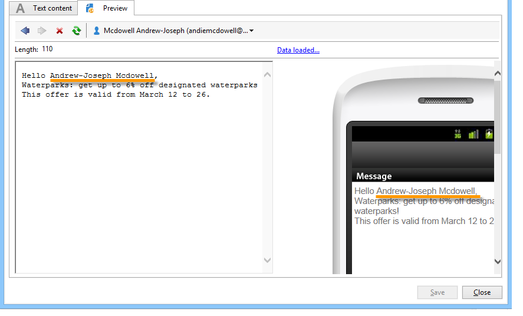

# 建立並傳送SMS傳送{#creating-a-sms-delivery}

## 選擇傳送渠道{#selecting-the-delivery-channel}

若要建立新的SMS傳送，請遵循下列步驟：

>[!NOTE]
>
>在[本節](../../delivery/using/steps-about-delivery-creation-steps.md)中介紹了建立交付的全局概念。

1. 建立新的傳送，例如從「傳送」控制面板建立。
1. 選擇您先前建立的傳送範本&#x200B;**傳送至行動裝置(SMPP)**。 有關詳細資訊，請參閱[更改傳送模板](sms-set-up.md#changing-the-delivery-template)部分。

   

1. 使用標籤、程式碼和說明來識別您的傳送。 如需詳細資訊，請參閱[本章節](../../delivery/using/steps-create-and-identify-the-delivery.md#identifying-the-delivery)。
1. 按一下&#x200B;**[!UICONTROL Continue]**&#x200B;確認此資訊並顯示消息配置窗口。

## 定義SMS內容{#defining-the-sms-content}

若要建立SMS內容，請遵循下列步驟：

1. 在嚮導的&#x200B;**[!UICONTROL Text content]**&#x200B;部分中輸入消息內容。 工具列按鈕可讓您匯入、儲存或搜尋內容。 最後一個按鈕用於插入個人化欄位。

   

   個人化欄位的使用會顯示在[關於個人化](../../delivery/using/about-personalization.md)區段中。

1. 按一下頁面底部的&#x200B;**[!UICONTROL Preview]**，檢視訊息的個人化呈現。 若要啟動預覽，請使用工具列中的&#x200B;**[!UICONTROL Test personalization]**&#x200B;按鈕選取收件者。 您可以從定義的目標中選擇收件者，或選擇其他收件者。

   

   您可以核准SMS訊息。 您也可以在內容編輯器右側的行動電話畫面上檢視SMS內容。 按一下畫面，然後使用滑鼠捲動內容。

   

1. 按一下&#x200B;**[!UICONTROL Data loaded]**&#x200B;連結可查看有關收件人的資訊。

   

   >[!NOTE]
   >
   >如果使用Latin-1(ISO-8859-1)程式碼頁面，SMS訊息的長度將限制為160個字元。 如果訊息是以Unicode撰寫，則不得超過70個字元。 某些特殊字元會影響訊息長度。 有關消息長度的詳細資訊，請參閱[SMS字元音譯](#about-character-transliteration)部分。
   >
   >當個人化欄位或條件式內容欄位存在時，訊息的大小會因收件者而異。 執行個人化時，必須評估訊息的長度。
   >
   >啟動分析時，會檢查訊息的長度，並在發生溢位時顯示警告。

1. 如果您使用NetSize連接器或SMPP連接器，則可以個人化傳送者的名稱。 有關詳細資訊，請參閱[Advanced parameters](#advanced-parameters)部分。

## 選擇目標人口{#selecting-the-target-population}

選擇傳送的目標人口時的詳細過程顯示在[本節](../../delivery/using/steps-defining-the-target-population.md)中。

有關個人化欄位的詳細資訊，請參閱[本節](../../delivery/using/about-personalization.md)。

有關包含種子清單的詳細資訊，請參閱[本頁](../../delivery/using/about-seed-addresses.md)。

