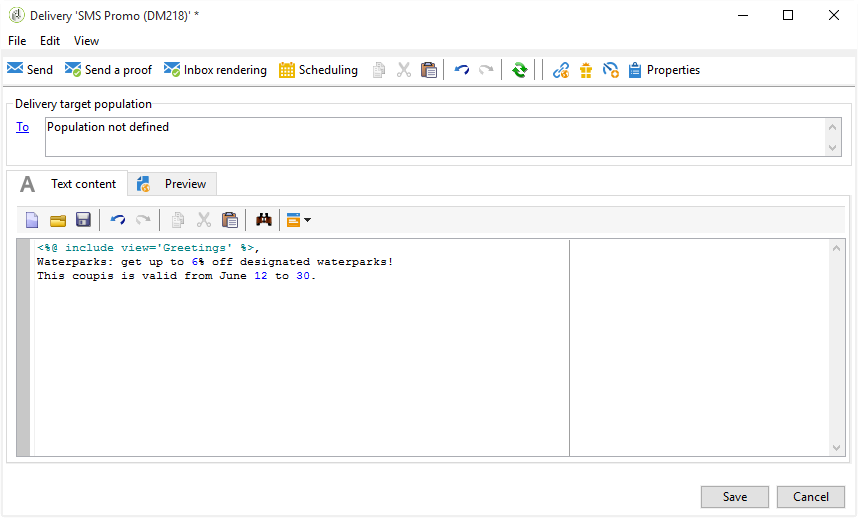

# 建立 SMS 傳送 {#creating-a-sms-delivery}

## 選擇交貨渠道 {#selecting-the-delivery-channel}

要建立新的SMS交付，請執行以下步驟：

>[!NOTE]
>
>有關交付建立的全球概念，請參閱 [此部分](steps-about-delivery-creation-steps.md)。

1. 建立新交貨，例如從「交貨」控制面板建立。
1. 選擇交貨模板 **發送到手機(SMPP)** 你之前創造的。 有關詳細資訊，請參閱 [更改交貨模板](sms-set-up.md#changing-the-delivery-template) 的子菜單。

   

1. 使用標籤、代碼和說明標識您的交貨。 如需詳細資訊，請參閱[本章節](steps-create-and-identify-the-delivery.md#identifying-the-delivery)。
1. 按一下 **[!UICONTROL Continue]** 確認此資訊並顯示消息配置窗口。

## 定義SMS內容 {#defining-the-sms-content}

要建立SMS的內容，請執行以下步驟：

1. 在 **[!UICONTROL Text content]** 的子菜單。 使用工具欄按鈕可以導入、保存或搜索內容。 最後一個按鈕用於插入個性化欄位。

   

   個性化欄位的使用在 [關於個性化](about-personalization.md) 的子菜單。

1. 按一下 **[!UICONTROL Preview]** 頁面底部查看消息的呈現及其個性化。 要啟動預覽，請使用 **[!UICONTROL Test personalization]** 按鈕 您可以從定義的目標中選擇一個收件人或選擇另一個收件人。

   

   您可以批准SMS消息。 您還可以在內容編輯器右側顯示的行動電話螢幕上查看SMS的內容。 按一下螢幕，然後使用滑鼠滾動瀏覽內容。

   

1. 按一下 **[!UICONTROL Data loaded]** 連結，查看有關收件人的資訊。

   

   >[!NOTE]
   >
   >如果使用Latin-1(ISO-8859-1)代碼頁，則SMS消息的長度限制為160個字元。 如果消息以Unicode寫入，則不得超過70個字元。 某些特殊字元會影響消息長度。 有關消息長度的詳細資訊，請參閱 [簡訊字元音譯](#about-character-transliteration) 的子菜單。
   >
   >當存在個性化欄位或條件內容欄位時，消息的大小會因一個收件人而異。 執行個性化設定時，必須評估消息的長度。
   >
   >啟動分析時，將檢查消息的長度，並在出現溢出時顯示警告。

1. 如果使用NetSize連接器或SMPP連接器，則可以個性化遞送發件人的名稱。 有關詳細資訊，請參閱 [高級參數](#advanced-parameters) 的子菜單。

## 選擇目標人口 {#selecting-the-target-population}

選擇交貨的目標總量時的詳細過程，請參見 [此部分](steps-defining-the-target-population.md)。

有關使用個性化欄位的詳細資訊，請參閱 [此部分](about-personalization.md)。

有關包含種子清單的詳細資訊，請參閱 [此頁](about-seed-addresses.md)。
