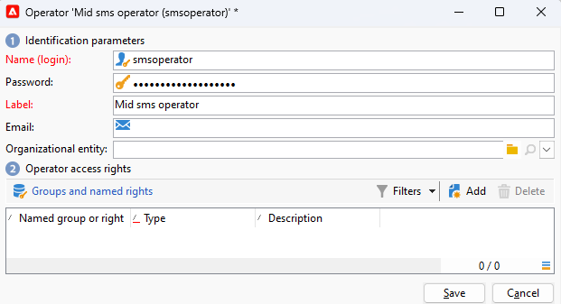
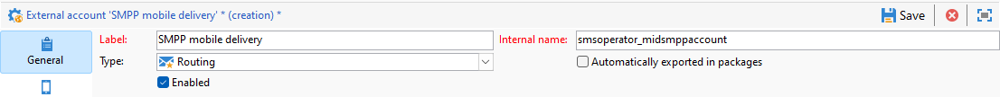

# 在中間來源基礎結構上設定簡訊頻道 {#setting-up-sms-channel}

若要傳送至具有中間伺服器的行動電話，您需要：

1. 在中間伺服器上建立的SMS運運算元，用於行銷伺服器上建立的SMS外部帳戶。

1. 行銷伺服器上的外部帳戶，用於指定管道和傳送模式。

1. 中間伺服器上的外部帳戶，詳細說明聯結器和訊息型別。

1. 參照外部帳戶的傳遞範本以簡化傳送流程。

>[!NOTE]
>
> 對於SMS傳遞，型別應使用在&#x200B;**one**&#x200B;專用應用程式伺服器容器中建立的特定SMS相似性。 [了解更多](../../installation/using/configure-delivery-settings.md#managing-outbound-smtp-traffic-with-affinities)

## 在中間伺服器上建立SMS運運算元 {#create-sms-operator}

若要開始設定程式，您必須在中間伺服器上建立專門用於外部帳戶的SMS運運算元。

>[!IMPORTANT]
>
>每個SMS聯結器都需要唯一的SMS運運算元。

1. 在樹狀結構的&#x200B;**[!UICONTROL Administration]** > **[!UICONTROL Access management]** > **[!UICONTROL Operators node]**&#x200B;節點中，按一下&#x200B;**[!UICONTROL New]**&#x200B;圖示。

   

1. 指定使用者的&#x200B;**[!UICONTROL Identification parameters]**，包括其登入、密碼和名稱。 操作員需要登入和密碼才能安全地登入Adobe Campaign。

   請注意，**[!UICONTROL Name (login)]**&#x200B;稍後將用於在中間伺服器中為您的SMPP外部帳戶命名。

   

1. 在「操作員存取權」區段中，選取授與操作員的許可權。

   若要將許可權配置給操作員，請按一下許可權清單上方的&#x200B;**[!UICONTROL Add]**&#x200B;按鈕。 接著，從可用群組清單中選取&#x200B;**[!UICONTROL Operator group]**&#x200B;或&#x200B;**[!UICONTROL Named rights]**。

   

1. 按一下&#x200B;**[!UICONTROL Save]**&#x200B;完成運運算元的建立。 設定檔現在包含在現有運運算元的清單中。

## 在行銷伺服器上建立簡訊外部帳戶 {#create-accound-mkt}

若要將SMS傳送至具有中間伺服器的行動電話，您首先需要在行銷伺服器上建立您的SMS外部帳戶。

1. 在樹狀結構的&#x200B;**[!UICONTROL Platform]** > **[!UICONTROL External accounts]**&#x200B;節點中，按一下&#x200B;**[!UICONTROL New]**&#x200B;圖示。

   

1. 輸入您的&#x200B;**[!UICONTROL Label]**&#x200B;和&#x200B;**[!UICONTROL Internal name]**。 請注意，稍後會使用內部名稱在中間伺服器中為您的SMPP外部帳戶命名。

1. 將帳戶型別定義為&#x200B;**[!UICONTROL Routing]**，將通道定義為&#x200B;**[!UICONTROL Mobile (SMS)]**，並將傳遞模式定義為&#x200B;**[!UICONTROL Mid-sourcing]**。

   

1. 在&#x200B;**[!UICONTROL Mid-Sourcing]**&#x200B;索引標籤中，指定中間來源伺服器連線引數。

   在&#x200B;**[!UICONTROL Account]**&#x200B;和&#x200B;**[!UICONTROL Password]**&#x200B;欄位中輸入[先前建立的SMS聯結器](#create-sms-operator)的詳細資料。

   

1. 按一下&#x200B;**[!UICONTROL Test the connection]**&#x200B;以確認您的設定。

1. 按一下&#x200B;**[!UICONTROL Save]**。

## 在中間伺服器上建立SMPP外部帳戶 {#creating-smpp-mid}

>[!IMPORTANT]
>
>對多個外部SMS帳戶使用相同的帳戶和密碼可能會導致帳戶之間的衝突和重疊。 請參閱[簡訊疑難排解頁面](troubleshooting-sms.md#external-account-conflict)。

在行銷伺服器上成功設定SMS外部帳戶後，下一步就是在中繼伺服器上建立SMPP外部帳戶。

有關SMS通訊協定和設定的詳細資訊，請參閱此[頁面](sms-protocol.md)。

要執行此操作，請遵循下列步驟：

1. 在樹狀結構的&#x200B;**[!UICONTROL Platform]** > **[!UICONTROL External accounts]**&#x200B;節點中，按一下&#x200B;**[!UICONTROL New]**&#x200B;圖示。

1. 輸入您的&#x200B;**[!UICONTROL Label]**&#x200B;和&#x200B;**[!UICONTROL Internal name]**。

   >[!WARNING]
   >
   >指派&#x200B;**[!UICONTROL Internal name]**&#x200B;時，請務必遵循指定的命名慣例：
   >  `SMS Operator Name_Internal Name of the Marketing SMS external account`

   

1. 將帳戶型別定義為&#x200B;**路由**，將通道定義為&#x200B;**行動（簡訊）**，並將傳遞模式定義為&#x200B;**大量傳遞**。

   

1. 勾選&#x200B;**[!UICONTROL Enabled]**&#x200B;方塊。

1. 在&#x200B;**[!UICONTROL Mobile]**&#x200B;索引標籤中，從&#x200B;**[!UICONTROL Connector]**&#x200B;下拉式清單中選取&#x200B;**[!UICONTROL Extended generic SMPP]**。

   

1. **[!UICONTROL Enable verbose SMPP traces in the log file]**&#x200B;選項可讓您將所有SMPP通訊傾印到記錄檔中。 應該僅啟用此選項來疑難排解聯結器，並與提供者所看到的流量進行比較。

1. 請連絡您的SMS服務提供者，該服務提供者將向您說明如何從&#x200B;**[!UICONTROL Connection settings]**&#x200B;索引標籤完成不同的外部帳戶欄位。

   接著，請根據選取的提供者連絡您的提供者，提供您進入&#x200B;**[!UICONTROL SMSC implementation name]**&#x200B;欄位的值。

   您可以定義每個MTA子系與提供者的連線數目。 預設會設為1。

1. 根據預設，SMS中的字元數量符合GSM標準。

   使用 GSM 編碼的簡訊訊息最多只能有 160 個字元，若是以多個部分傳送的訊息，則每個簡訊的簡訊訊息最多只能有 153 個字元。

   >[!NOTE]
   >
   >某些字元會計為兩個字元（大括弧、方括弧、歐元符號等）。
   >
   >可用GSM字元的清單會顯示在[本節](sms-set-up.md#about-character-transliteration)中。

   您也可以核取對應的方塊，以授權字母音譯。

   

1. 在&#x200B;**[!UICONTROL Throughput and delays]**&#x200B;索引標籤中，您可以指定輸出訊息(&quot;MT&quot;，Mobile Terminated)的吞吐量上限，以每秒MT為單位。 如果您在對應欄位中輸入　&quot;0&quot;，則吞吐量將無限制。

   與持續時間對應的所有欄位的值需要以秒為單位完成。

1. 在&#x200B;**[!UICONTROL Mapping of encodings]**&#x200B;索引標籤中，您可以定義編碼。

   如需詳細資訊，請參閱[本章節](sms-set-up.md#about-text-encodings)。

1. 在&#x200B;**[!UICONTROL SMSC specificities]**&#x200B;索引標籤中，**[!UICONTROL Send full phone number]**&#x200B;選項預設為停用。 如果您想遵守SMPP通訊協定，並且只將數位傳輸到SMS提供者(SMSC)的伺服器，請勿啟用它。

   不過，由於某些提供者需要使用&#39;+&#39;首碼，因此建議您向提供者查詢，並建議您視需要啟用此選項。

   **[!UICONTROL Enable TLS over SMPP]**&#x200B;核取方塊可讓您加密SMPP通訊。 如需關於此項目的詳細資訊，請參閱此[頁面](sms-protocol.md)。

1. 如果您正在設定&#x200B;**[!UICONTROL Extended generic SMPP]**&#x200B;聯結器，您可以設定自動回覆。

   如需詳細資訊，請參閱[本章節](sms-set-up.md#automatic-reply)。

## 變更傳遞範本 {#changing-the-delivery-template}

Adobe Campaign提供位於&#x200B;**[!UICONTROL Resources > Templates > Delivery templates]**&#x200B;節點中的行動傳遞範本。 如需詳細資訊，請參閱[關於範本](about-templates.md)區段。

若要透過SMS頻道傳送訊息，您必須建立包含頻道聯結器參照的範本。

若要保留原生傳遞範本，建議您複製並加以設定。

在以下範例中，我們會產生範本以方便透過先前建立的SMPP帳戶傳送訊息。 操作步驟：

1. 在樹狀結構的&#x200B;**[!UICONTROL Resources]** > **[!UICONTROL Templates]** > **[!UICONTROL Delivery templates]**&#x200B;節點中，用滑鼠右鍵按一下&#x200B;**[!UICONTROL Send to mobiles]**&#x200B;範本，然後選取&#x200B;**[!UICONTROL Duplicate]**。

   

1. 變更範本的標籤，例如&#x200B;**傳送至行動裝置(SMPP)**。

   

1. 按一下&#x200B;**[!UICONTROL Properties]**。

1. 在&#x200B;**[!UICONTROL General]**&#x200B;索引標籤中，選取與您在[在行銷伺服器上建立SMS外部帳戶](#create-accound-mkt)區段中建立的外部帳戶對應的路由模式。

   

1. 按一下&#x200B;**[!UICONTROL Save]**&#x200B;以建立範本。

   

您現在有外部帳戶和傳遞範本，可讓您透過簡訊傳遞。

## 相關主題 {#related-topics}

* [簡訊字母音譯](sms-set-up.md#about-character-transliteration)
* [文字編碼](sms-set-up.md#about-text-encodings)
* [自動回覆](sms-set-up.md#automatic-reply)
