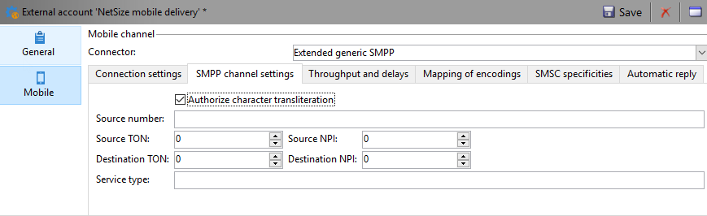
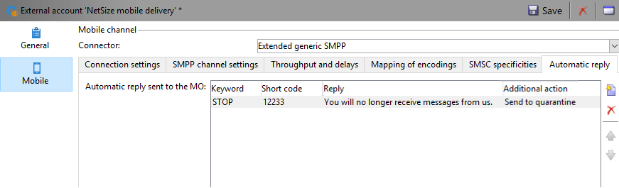

# 設定簡訊頻道 {#setting-up-sms-channel}

若要傳送至行動電話，您需要：

1. 指定連接器和訊息類型的外部帳戶。

   請注意，舊連接器現已過時。 已棄用的功能仍可使用，但將不會進一步增強或支援。 在[本頁](../../rn/using/deprecated-features.md)中深入瞭解。

1. 參考此外部帳戶的傳遞範本。

## 建立SMPP外部帳戶 {#creating-an-smpp-external-account}

若要將SMS傳送至行動電話，您必須先建立SMPP外部帳戶。
有關SMS協定和設定的詳細資訊，請參閱 [頁面](sms-protocol.md).

要執行此操作，請遵循下列步驟：

1. 在 **[!UICONTROL Platform]** > **[!UICONTROL External accounts]** 節點，按一下 **[!UICONTROL New]** 表徵圖。
1. 將帳戶類型定義為 **路由**，通道為 **行動（簡訊）**，而傳送模式為 **大量傳送**.

   

1. 檢查 **[!UICONTROL Enabled]** 框。
1. 在 **[!UICONTROL Mobile]** 索引標籤，選取 **[!UICONTROL Extended generic SMPP]** 從 **[!UICONTROL Connector]** 下拉式清單。

   

   >[!CAUTION]
   >
   > 自20.2版起，舊版連接器已遭取代，不受支援。 建議您使用 **[!UICONTROL Extended generic SMPP]** 連接器。 如需如何移轉至建議連接器的詳細資訊，請參閱 [頁面](unsupported-connector-migration.md).

1. 此 **[!UICONTROL Enable verbose SMPP traces in the log file]** 選項可讓您將所有SMPP通訊傾印到記錄檔中。 必須啟用此選項，才能疑難排解連接器，並與提供者所看到的流量進行比較。

1. 請連絡您的SMS服務提供者，該服務提供者將向您說明如何從 **[!UICONTROL Connection settings]** 標籤。

   接著，請連絡您的提供者，視所選取的提供者而定，他們會為您提供輸入的值 **[!UICONTROL SMSC implementation name]** 欄位。

   您可以定義每個MTA子項與提供者的連線數。 預設會設為1。

1. 根據預設，SMS中的字元數量符合GSM標準。

   使用 GSM 編碼的 SMS 訊息最多只能有 160 個字元，若是以多個部分傳送的訊息，則每個 SMS 的 SMS 訊息最多只能有 153 個字元。

   >[!NOTE]
   >
   >某些字元會計為兩個字元（括弧、方括弧、歐元符號等）。
   >
   >可用GSM字元的清單如下。

   您也可以核取相對應的方塊，以授權字元音譯。

   

   如需詳細資訊，請參閱[本章節](#about-character-transliteration)。

1. 在 **[!UICONTROL Throughput and delays]** 頁簽，您可以指定出站訊息(「MT」， Mobile Terminated)的吞吐量上限（以每秒MT為單位）。 如果您在對應欄位中輸入　&quot;0&quot;，則吞吐量將無限制。

   與持續時間對應的所有欄位的值需要以秒為單位完成。

1. 在 **[!UICONTROL Mapping of encodings]** 標籤中，您可以定義編碼。

   如需詳細資訊，請參閱[本章節](#about-text-encodings)。

1. 在 **[!UICONTROL SMSC specificities]** 標籤 **[!UICONTROL Send full phone number]** 選項預設為停用。 如果要遵守SMPP協定，並僅將數字傳輸到SMS提供程式(SMSC)的伺服器，請勿啟用它。

   但是，由於某些提供者需要使用「+」首碼，因此建議您向您的提供者查詢，並建議您視需要啟用此選項。

   此 **[!UICONTROL Enable TLS over SMPP]** 核取方塊可讓您加密SMPP流量。 如需關於此項目的詳細資訊，請參閱此[頁面](sms-protocol.md)。

1. 如果您要設定 **[!UICONTROL Extended generic SMPP]** 連接器，您可以設定自動回覆。

   如需詳細資訊，請參閱[本章節](#automatic-reply)。

## SMS字母音譯 {#about-character-transliteration}

字母音譯可在SMPP行動傳送外部帳戶的 **[!UICONTROL Mobile]** 標籤。

音譯包括當 GSM 標準未考慮到 SMS 的一個字元時，用另一個字元取代該字元。

* 如果音譯是 **[!UICONTROL authorized]**，則在傳送訊息時，未考慮的每個字元都會由GSM字元取代。 例如，字元 &quot;ë&quot; 會由 &quot;e&quot; 取代。因此，訊息會稍微變更，但字元限制將維持不變。
* 音譯為 **[!UICONTROL not authorized]**，每則包含未納入考量之字元的訊息都會以二進位格式(Unicode)傳送：因此，所有字元都會依原樣傳送。 不過，使用 Unicode 的 SMS 訊息最多只能有 70 個字元（若是以多個部分傳送的訊息，則每個 SMS 有 67 個字元）。如果超出字元數上限，則會傳送數則訊息，這可能會造成額外成本。

>[!IMPORTANT]
>
>將個人化欄位插入您的 SMS 訊息內容，可能會引入 GSM 編碼未考慮的字元。

依預設，會停用字元音譯。如果您希望 SMS 訊息中的所有字元都保持原樣，不要變更正確名稱（例如），建議您不要啟用此選項。

不過，如果您的 SMS 訊息包含許多產生 Unicode 訊息的字元，您可以選取啟用此選項，以限制傳送訊息的成本。

下表顯示GSM標準所考慮的字元。 除下面提及的字元外，所有插入訊息內文的字元都會將整個訊息轉換為二進位格式 (Unicode)，因此限制為 70 個字元。

**基本字元**

<table> 
 <tbody> 
  <tr> 
   <td> @ </td> 
   <td>  </td> 
   <td> SP </td> 
   <td> 0 </td> 
   <td> " </td> 
   <td> P </td> 
   <td> - </td> 
   <td> p </td> 
  </tr> 
  <tr> 
   <td> £ </td> 
   <td> _ </td> 
   <td> ! </td> 
   <td> 1 </td> 
   <td> A </td> 
   <td> Q </td> 
   <td> a </td> 
   <td> q </td> 
  </tr> 
  <tr> 
   <td> $ </td> 
   <td>  </td> 
   <td> 」 </td> 
   <td> 2 </td> 
   <td> B </td> 
   <td> R </td> 
   <td> b </td> 
   <td> r </td> 
  </tr> 
  <tr> 
   <td> ¥ </td> 
   <td>  </td> 
   <td> # </td> 
   <td> 3 </td> 
   <td> C </td> 
   <td> S </td> 
   <td> c </td> 
   <td> s </td> 
  </tr> 
  <tr> 
   <td> è </td> 
   <td>  </td> 
   <td> " </td> 
   <td> 4 </td> 
   <td> D </td> 
   <td> T </td> 
   <td> d </td> 
   <td> t </td> 
  </tr> 
  <tr> 
   <td> é </td> 
   <td>  </td> 
   <td> % </td> 
   <td> 5 </td> 
   <td> E </td> 
   <td> U </td> 
   <td> e </td> 
   <td> u </td> 
  </tr> 
  <tr> 
   <td> ù </td> 
   <td>  </td> 
   <td> &amp; </td> 
   <td> 6 </td> 
   <td> F </td> 
   <td> V </td> 
   <td> f </td> 
   <td> v </td> 
  </tr> 
  <tr> 
   <td> ì </td> 
   <td>  </td> 
   <td> ' </td> 
   <td> 7 </td> 
   <td> G </td> 
   <td> W </td> 
   <td> g </td> 
   <td> w </td> 
  </tr> 
  <tr> 
   <td> ò </td> 
   <td>  </td> 
   <td> ( </td> 
   <td> 8 </td> 
   <td> H </td> 
   <td> X </td> 
   <td> h </td> 
   <td> x </td> 
  </tr> 
  <tr> 
   <td> Ç </td> 
   <td>  </td> 
   <td> ) </td> 
   <td> 9 </td> 
   <td> I </td> 
   <td> Y </td> 
   <td> i </td> 
   <td> y </td> 
  </tr> 
  <tr> 
   <td> LF </td> 
   <td>  </td> 
   <td> * </td> 
   <td> : </td> 
   <td> J </td> 
   <td> Z </td> 
   <td> j </td> 
   <td> z </td> 
  </tr> 
  <tr> 
   <td> Ø </td> 
   <td> ESC </td> 
   <td> + </td> 
   <td> ; </td> 
   <td> K </td> 
   <td> Ä </td> 
   <td> k </td> 
   <td> ä </td> 
  </tr> 
  <tr> 
   <td> ø </td> 
   <td> Æ </td> 
   <td> , </td> 
   <td> &lt; </td> 
   <td> L </td> 
   <td> Ö </td> 
   <td> l </td> 
   <td> ö </td> 
  </tr> 
  <tr> 
   <td> CR </td> 
   <td> æ </td> 
   <td> - </td> 
   <td> = </td> 
   <td> M </td> 
   <td> Ñ </td> 
   <td> m </td> 
   <td> ñ </td> 
  </tr> 
  <tr> 
   <td> Å </td> 
   <td> ß </td> 
   <td> . </td> 
   <td> &gt; </td> 
   <td> N </td> 
   <td> Ü </td> 
   <td> n </td> 
   <td> ü </td> 
  </tr> 
  <tr> 
   <td> å </td> 
   <td> É </td> 
   <td> / </td> 
   <td> ? </td> 
   <td> O </td> 
   <td> § </td> 
   <td> o </td> 
   <td> à </td> 
  </tr> 
 </tbody> 
</table>

SP：Space

ESC：Escape

LF：換行

CR：歸位

**進階字元（計算兩次）**

^ { } `[ ~ ]` | €

## 文字編碼 {#about-text-encodings}

傳送 SMS 訊息時，Adobe Campaign 可以使用一或多種文字編碼。每個編碼都有其專屬的字元集，並決定符合 SMS 訊息的字元數。

設定新的SMPP行動傳送外部帳戶時，您可以定義 **[!UICONTROL Mapping of encodings]** 在 **[!UICONTROL Mobile]** 標籤：the **[!UICONTROL data_coding]** 欄位可讓Adobe Campaign通訊要用於SMSC的編碼。

>[!NOTE]
>
>**data_coding** 值及實際使用編碼之間的對應是標準化的。然而，某些SMSC有其獨特的映射：在本例中，您的 **Adobe Campaign** 管理員需要聲明此映射。 請洽詢您的提供者以瞭解更多資訊。

您可以宣告 **data_codings** 並視需要強制編碼：若要這麼做，請在表格中指定單一編碼。

* 未定義編碼的對應時，連接器會採取一般行為：

   * 它會嘗試使用 GSM 編碼，將 **data_coding = 0** 的值指派給它。
   * 如果 GSM 編碼失敗，則會使用 **UCS2** 編碼，並對其指派值 **data_coding = 8**。

* 當您定義要使用的編碼以及連結的 **[!UICONTROL data_coding]** 欄位值時，Adobe Campaign會嘗試使用清單中的第一個編碼，如果第一個編碼無法，則請執行下列操作。

>[!IMPORTANT]
>
>宣告的順序非常重要：建議您以&#x200B;**成本**&#x200B;的遞增順序顯示清單，以利於編碼，讓您在每則 SMS 訊息中盡可能多地顯示字元。
>
>僅宣告您要使用的編碼。如果SMSC提供的某些編碼不符合您的使用目的，請勿在清單中宣告。

## 自動回覆 {#automatic-reply}

設定延伸的通用SMPP連接器時，您可以設定自動回覆。

當訂閱者回覆透過Adobe Campaign傳送給他們的SMS訊息，且其訊息包含關鍵字（例如「STOP」）時，您可以在 **[!UICONTROL Automatic reply sent to the MO]** 區段。

>[!NOTE]
>
>關鍵字不區分大小寫。

對於每個關鍵字，指定一個短代碼，該代碼通常是用於發送傳遞並且將作為發送者名稱的數字，然後輸入要發送到訂閱者的消息。

您也可以將動作連結至自動回應： **[!UICONTROL Send to quarantine]** 或 **[!UICONTROL Remove from quarantine]**. 例如，如果收件者傳送「STOP」關鍵字，則會自動收到取消訂閱確認，並傳送至隔離區。

如果您連結 **[!UICONTROL Remove from quarantine]** 對自動回應的動作，傳送對應關鍵字的收件者會自動從隔離區中移除。

收件者列於 **[!UICONTROL Non deliverables and addresses]** 表格 **[!UICONTROL Administration]** > **[!UICONTROL Campaign Management]** > **[!UICONTROL Non deliverables Management]** 功能表。

* 若要傳送相同的回覆（不論是什麼簡短程式碼），請保留 **[!UICONTROL Short code]** 欄空白。
* 若要傳送相同的回覆（無論關鍵字為何），請保留 **[!UICONTROL Keyword]** 欄空白。
* 若要在不傳送回應的情況下執行動作，請保留 **[!UICONTROL Response]** 欄空白。 例如，這可讓您從隔離區中移除回覆「STOP」以外訊息的使用者。

如果您使用具有相同提供者帳戶的Extended generic SMPP連接器有多個外部帳戶，可能會發生下列問題：向短代碼發送回復時，可能會在您的任何外部帳戶連接上接收。 因此，發送的自動答復不能是預期的消息。
若要避免此情況，請根據您使用的提供者，套用下列其中一個解決方案：

* 為每個外部帳戶建立一個提供程式帳戶。
* 使用 **[!UICONTROL System type]** 欄位 **[!UICONTROL Mobile]** > **[!UICONTROL Connection settings]** 標籤來區分每個短代碼。 請向您的提供者要求每個帳戶的不同值。

   

有關使用Extended generic SMPP連接器設定外部帳戶的步驟，請參閱 [建立SMPP外部帳戶](#creating-an-smpp-external-account) 區段。

## 變更傳遞範本 {#changing-the-delivery-template}

Adobe Campaign提供您傳送至行動裝置的範本。 此範本可在 **[!UICONTROL Resources > Templates > Delivery templates]** 節點。 有關詳細資訊，請參閱 [關於範本](about-templates.md) 區段。

若要透過SMS通道傳送，您必須建立參照通道連接器的範本。

若要保留原生傳送範本，建議您複製該範本，然後加以設定。

在以下範例中，我們建立範本，以透過先前啟用的SMPP帳戶傳送訊息。 操作步驟：

1. 前往 **[!UICONTROL Delivery templates]** 節點。
1. 以滑鼠右鍵按一下 **[!UICONTROL Send to mobiles]** 範本，然後選取 **[!UICONTROL Duplicate]**.

   

1. 變更範本的標籤，例如 **傳送至行動裝置(SMPP)**.

   

1. 按一下&#x200B;**[!UICONTROL Properties]**。
1. 在 **[!UICONTROL General]** 頁簽，選擇與在前面步驟中建立的外部帳戶相對應的路由模式。

   

1. 按一下 **[!UICONTROL Save]** 來建立範本。

   

您現在擁有外部帳戶和傳遞範本，可讓您透過SMS傳遞。
