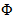

# 在独立執行個體上配置 SMS 通道 {#setting-up-sms-channel}

要發送到手機，您需要：

1. 指定連接器和消息類型的外部帳戶。

   Note that legacy connectors are now deprecated. 已棄用的功能仍可使用，但將不會進一步增強或支援。 在[本頁](../../rn/using/deprecated-features.md)中深入瞭解。

1. 引用此外部帳戶的傳遞範本。

>[!NOTE]
>
> 對於SMS傳遞，型別應使用在&#x200B;**one**&#x200B;專用應用程式伺服器容器中建立的特定SMS相似性。 [了解更多](../../installation/using/configure-delivery-settings.md#managing-outbound-smtp-traffic-with-affinities)

## 建立SMPP外部帳戶 {#creating-an-smpp-external-account}

>[!IMPORTANT]
>
>對多個外部SMS帳戶使用相同的帳戶和密碼可能會導致帳戶之間的衝突和重疊。 請参閱 [SMS 疑難解答頁面](troubleshooting-sms.md#external-account-conflict)。

要將簡訊發送到手機，您首先需要創建 SMPP 外部帳戶。有關 SMS 協定和設置的詳細信息，請参閱此 [頁面](sms-protocol.md)。

要執行此操作，請遵循下列步驟：

1. 在 **[!UICONTROL Platform]** 樹狀結構的> **[!UICONTROL External accounts]** 節點中，按兩下 **[!UICONTROL New]** 該圖示。
1. 將帳戶類型 **定義為路由**，將通道 **類型定義為移動 （SMS），**&#x200B;將傳遞模式 **定義為批量傳遞**。

   

1. 勾選&#x200B;**[!UICONTROL Enabled]**&#x200B;方塊。
1. 在&#x200B;**[!UICONTROL Mobile]**&#x200B;索引標籤中，從&#x200B;**[!UICONTROL Connector]**&#x200B;下拉式清單中選取&#x200B;**[!UICONTROL Extended generic SMPP]**。

   

   >[!CAUTION]
   >
   > 自版本20.2起，舊版聯結器已棄用且不受支援。 我們建議使用&#x200B;**[!UICONTROL Extended generic SMPP]**&#x200B;聯結器。 有關如何移轉至建議聯結器的詳細資訊，請參閱此[頁面](unsupported-connector-migration.md)。

1. **[!UICONTROL Enable verbose SMPP traces in the log file]**&#x200B;選項可讓您將所有SMPP通訊傾印到記錄檔中。 必須啟用此選項，才能疑難排解連接器，並與提供者所看到的流量進行比較。

1. 請聯繫您的短信服務提供者，他們將向您解釋如何從標籤填寫 **[!UICONTROL Connection settings]** 不同的外部帳戶字段。

   然後，聯繫您的供應商，具體取決於所選供應商，該提供者將為您提供要輸入 **[!UICONTROL SMSC implementation name]** 該欄位的值。

   您可以定義每個MTA子系與提供者的連線數目。 預設會設為1。

1. 根據預設，SMS中的字元數量符合GSM標準。

   使用 GSM 編碼的簡訊訊息最多只能有 160 個字元，若是以多個部分傳送的訊息，則每個簡訊的簡訊訊息最多只能有 153 個字元。

   >[!NOTE]
   >
   >特定字元計為兩個 （大括弧、方括弧、歐元符號等）。
   >
   >可用 GSM 字符清單如下所示。

   您也可以核取相對應的方塊，以授權字元音譯。

   

   如需詳細資訊，請參閱[本章節](#about-character-transliteration)。

1. 在 **[!UICONTROL Throughput and delays]** 標籤中，您可以指定每秒 MT 的出站消息（“MT”，移動終止）的最大輸送量。 如果您在對應欄位中輸入　&quot;0&quot;，則吞吐量將無限制。

   與持續時間對應的所有欄位的值需要以秒為單位完成。

1. In the **[!UICONTROL Mapping of encodings]** tab, you can define encodings.

   如需詳細資訊，請參閱[本章節](#about-text-encodings)。

1. In the **[!UICONTROL SMSC specificities]** tab, the **[!UICONTROL Send full phone number]** option is disabled by default. Do not enable it if you want to respect the SMPP protocol and transfer only digits to the server of the SMS provider (SMSC).

   不過，由於某些提供者需要使用&#39;+&#39;首碼，因此建議您向提供者查詢，並建議您視需要啟用此選項。

   **[!UICONTROL Enable TLS over SMPP]**&#x200B;核取方塊可讓您加密SMPP通訊。 如需關於此項目的詳細資訊，請參閱此[頁面](sms-protocol.md)。

1. 如果您正在設定&#x200B;**[!UICONTROL Extended generic SMPP]**&#x200B;聯結器，您可以設定自動回覆。

   如需詳細資訊，請參閱[本章節](#automatic-reply)。

## SMS character transliteration {#about-character-transliteration}

可在&#x200B;**[!UICONTROL Mobile]**&#x200B;標籤下的SMPP行動傳遞外部帳戶中設定字母音譯。

音譯包括當 GSM 標準未考慮到簡訊的一個字元時，用另一個字元取代該字元。

* 如果音譯為 **[!UICONTROL authorized]**，則發送消息時，未帳戶的每個字元都將替換為 GSM 字元。 例如，字元 &quot;ë&quot; 會由 &quot;e&quot; 取代。因此，訊息會稍微變更，但字元限制將維持不變。
* 當音譯為 **[!UICONTROL not authorized]**&#x200B;時，包含未放入帳戶的字元的每條消息都以二進位格式 （Unicode） 發送：因此所有字元都按原樣發送。 不過，使用 Unicode 的簡訊訊息最多只能有 70 個字元（若是以多個部分傳送的訊息，則每個簡訊有 67 個字元）。如果超出字元數上限，則會傳送數則訊息，這可能會造成額外成本。

>[!IMPORTANT]
>
>Inserting personalization fields into the content of your SMS message may introduce characters that are not taken into account by the GSM encoding.

依預設，會停用字元音譯。如果您希望簡訊訊息中的所有字元都保持原樣，不要變更正確名稱（例如），建議您不要啟用此選項。

不過，如果您的簡訊訊息包含許多產生 Unicode 訊息的字元，您可以選取啟用此選項，以限制傳送訊息的成本。

The following table presents the characters taken into account by the GSM standard. All of the characters inserted into the message body, other than those mentioned below, convert the entire message into binary format (Unicode) and therefore limit it to 70 characters.

**基本字元**

<table> 
 <tbody> 
  <tr> 
   <td> @ </td> 
   <td>  </td> 
   <td> SP </td> 
   <td> 0 </td> 
   <td> ¡URL </td> 
   <td> P </td> 
   <td> ？ </td> 
   <td> p </td> 
  </tr> 
  <tr> 
   <td> £ </td> 
   <td> _ </td> 
   <td> ! </td> 
   <td> 1 </td> 
   <td> A </td> 
   <td> Q </td> 
   <td> a </td> 
   <td> q </td> 
  </tr> 
  <tr> 
   <td> $ </td> 
   <td>  </td> 
   <td> 」 </td> 
   <td> 2 </td> 
   <td> byte </td> 
   <td> R </td> 
   <td> b </td> 
   <td> r </td> 
  </tr> 
  <tr> 
   <td> £ </td> 
   <td>  </td> 
   <td> # </td> 
   <td> 3 </td> 
   <td> C </td> 
   <td> S </td> 
   <td> c </td> 
   <td>   </td> 
  </tr> 
  <tr> 
   <td> è </td> 
   <td>  </td> 
   <td> ¤URL </td> 
   <td> 4 </td> 
   <td> D </td> 
   <td> T </td> 
   <td> 天 </td> 
   <td> t </td> 
  </tr> 
  <tr> 
   <td> é </td> 
   <td>  </td> 
   <td> % </td> 
   <td> 5 </td> 
   <td> E </td> 
   <td> U </td> 
   <td> e </td> 
   <td> u </td> 
  </tr> 
  <tr> 
   <td> u </td> 
   <td>  </td> 
   <td> &amp; </td> 
   <td> 6 </td> 
   <td> F </td> 
   <td> V </td> 
   <td> f </td> 
   <td> v </td> 
  </tr> 
  <tr> 
   <td> ì </td> 
   <td>  </td> 
   <td> ' </td> 
   <td> 7 </td> 
   <td> G </td> 
   <td> W </td> 
   <td> g </td> 
   <td> w </td> 
  </tr> 
  <tr> 
   <td> ò </td> 
   <td>  </td> 
   <td> ( </td> 
   <td> 8 </td> 
   <td> H </td> 
   <td> X </td> 
   <td> 小時 </td> 
   <td> x </td> 
  </tr> 
  <tr> 
   <td> Ç </td> 
   <td>  </td> 
   <td> ) </td> 
   <td> 9 </td> 
   <td> 我 </td> 
   <td> Y </td> 
   <td> 我 </td> 
   <td> y </td> 
  </tr> 
  <tr> 
   <td> 換行字元 </td> 
   <td>  </td> 
   <td> * </td> 
   <td> ： </td> 
   <td> J </td> 
   <td> Z </td> 
   <td> j </td> 
   <td> z </td> 
  </tr> 
  <tr> 
   <td> Ø </td> 
   <td> 電調 </td> 
   <td> + </td> 
   <td> ; </td> 
   <td> K </td> 
   <td> Ä </td> 
   <td> k </td> 
   <td> a </td> 
  </tr> 
  <tr> 
   <td> ø </td> 
   <td> Æ </td> 
   <td> , </td> 
   <td> &lt; </td> 
   <td> L </td> 
   <td> Ö </td> 
   <td> l </td> 
   <td> ö </td> 
  </tr> 
  <tr> 
   <td> 歸位字元 </td> 
   <td> æ </td> 
   <td> - </td> 
   <td> = </td> 
   <td> M </td> 
   <td> On </td> 
   <td> 分鐘 </td> 
   <td> n </td> 
  </tr> 
  <tr> 
   <td> Å </td> 
   <td> ß </td> 
   <td> 。 </td> 
   <td> &gt; </td> 
   <td> N </td> 
   <td> U </td> 
   <td> n </td> 
   <td> ü </td> 
  </tr> 
  <tr> 
   <td> å </td> 
   <td> É </td> 
   <td> / </td> 
   <td> ? </td> 
   <td> O </td> 
   <td> § </td> 
   <td> o </td> 
   <td> à </td> 
  </tr> 
 </tbody> 
</table>

SP：Space

ESC：Escape

LF：換行

CR：歸位

**進階字元（計算兩次）**

^ { } `[ ~ ]` | €

## Text encodings {#about-text-encodings}

傳送簡訊訊息時，Adobe Campaign 可以使用一或多種文字編碼。每個編碼都有其專屬的字元集，並決定符合簡訊訊息的字元數。

設定新的SMPP行動傳遞外部帳戶時，您可以在&#x200B;**[!UICONTROL Mobile]**&#x200B;索引標籤中定義&#x200B;**[!UICONTROL Mapping of encodings]**： **[!UICONTROL data_coding]**&#x200B;欄位可讓Adobe Campaign通訊要對SMSC使用哪種編碼。

>[!NOTE]
>
>**data_coding** 值及實際使用編碼之間的對應是標準化的。不過，特定SMSC有其專屬的對應：在這種情況下，您的&#x200B;**Adobe Campaign**&#x200B;管理員需要宣告此對應。 請洽詢您的提供者以瞭解更多資訊。

如有必要，可以聲明 **data_codings** 並強制編碼：為此，請在表中指定單個編碼。

* 如果未定義編碼映射，連接器將採取一般行為：

   * 它會嘗試使用 GSM 編碼，將 **data_coding = 0** 的值指派給它。
   * 如果 GSM 編碼失敗，則會使用 **UCS2** 編碼，並對其指派值 **data_coding = 8**。

* 當您定義要使用的編碼以及連結的&#x200B;**[!UICONTROL data_coding]**&#x200B;欄位值時，Adobe Campaign會嘗試使用清單中的第一個編碼，如果第一個編碼不可能，則請執行下列操作。

>[!IMPORTANT]
>
>宣告的順序非常重要：建議您以&#x200B;**成本**&#x200B;的遞增順序顯示清單，以利於編碼，讓您在每則簡訊訊息中盡可能多地顯示字元。
>
>僅宣告您要使用的編碼。如果SMSC提供的某些編碼不符合您的使用目的，請勿在清單中宣告。

## 自動回覆 {#automatic-reply}

設定擴充通用SMPP聯結器時，您可以設定自動回覆。

當訂閱者回復通過 Adobe Campaign 發送給他們的 SMS 消息並且他們的消息包含“STOP”等關鍵字時，您可以在該 **[!UICONTROL Automatic reply sent to the MO]** 部分中配置自動發回給他們的消息。

>[!NOTE]
>
>關鍵詞不區分大小寫。

對於每個關鍵字，請指定一個短代碼，該代碼通常用於發送傳遞並將用作發件人名稱，然後輸入將發送給訂閱者的消息。

您也可以對自動回應連結動作： **[!UICONTROL Send to quarantine]** 或 **[!UICONTROL Remove from quarantine]**。 例如，如果收件者發送關鍵字“STOP”，他們將自動收到取消訂閱確認併發送到隔離。

如果您將&#x200B;**[!UICONTROL Remove from quarantine]**&#x200B;動作連結至自動回應，則傳送對應關鍵字的收件者會自動從隔離中移除。

收件者會列於透過「>>」功能表取得&#x200B;**[!UICONTROL Administration]**&#x200B;的表格中&#x200B;**[!UICONTROL Non deliverables and addresses]**。 **[!UICONTROL Non deliverables Management]** **[!UICONTROL Campaign Management]**

* 要發送相同的回復，無論短代碼是什麼，請將列 **[!UICONTROL Short code]** 留空。
* 若要無論關鍵字如何都發送相同的答覆，請將該 **[!UICONTROL Keyword]** 列留空。
* 若要執行作而不發送回應，請將列 **[!UICONTROL Response]** 留空。 例如，這允許您從隔離中刪除回復「STOP」以外的消息的用戶。

If you have multiple external accounts using the Extended generic SMPP connector with the same provider account, the following issue may happen: when sending a reply to a short code, it may be received on any of your external account connections. 因此，傳送的自動回覆不能是預期的訊息。
為避免此問題，請根據您使用的提供者，套用下列解決方案之一：

* 為每個外部帳戶建立一個提供者帳戶。
* 使用&#x200B;**[!UICONTROL Mobile]** > **[!UICONTROL Connection settings]**&#x200B;索引標籤中的&#x200B;**[!UICONTROL System type]**&#x200B;欄位來區分每個簡短代碼。 請向您的提供者詢問每個帳戶的不同值。

  

使用Extended generic SMPP聯結器設定外部帳戶的步驟在[建立SMPP外部帳戶](#creating-an-smpp-external-account)區段中詳細說明。

## 變更傳遞範本 {#changing-the-delivery-template}

Adobe Campaign為您提供了交付到手機的範本。 此範本適用於節點 **[!UICONTROL Resources > Templates > Delivery templates]** 。 有關詳細資訊，請參閱 [關於範本](about-templates.md) 部分。

若要通過SMS通道傳遞，必須創建在其中引用通道連接器的範本。

為了保持原生傳遞範本，我們建議您先重複再進行配置。

在以下範例中，我們會建立範本，透過先前啟用的SMPP帳戶傳遞訊息。 操作步驟：

1. 前往&#x200B;**[!UICONTROL Delivery templates]**&#x200B;節點。
1. 用滑鼠右鍵按一下&#x200B;**[!UICONTROL Send to mobiles]**&#x200B;範本，然後選取&#x200B;**[!UICONTROL Duplicate]**。

   

1. 變更範本的標籤，例如&#x200B;**傳送至行動裝置(SMPP)**。

   

1. 按一下&#x200B;**[!UICONTROL Properties]**。
1. 在 **[!UICONTROL General]** 標籤中，選擇與您在前面的步驟中創建的外部帳戶相對應的路由模式。

   

1. 按一下&#x200B;**[!UICONTROL Save]**&#x200B;以建立範本。

   

您現在有外部帳戶和傳遞範本，可讓您透過簡訊傳遞。
