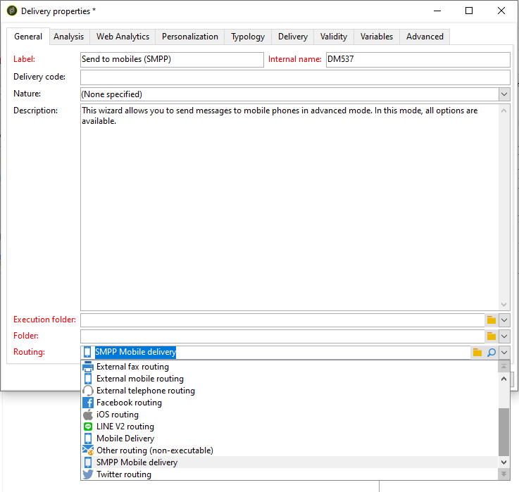

# 設定簡訊頻道 {#setting-up-sms-channel}

要發送到行動電話，您需要：

1. 指定連接器和消息類型的外部帳戶。

   請注意，現在已棄用舊式連接器。 已棄用的功能仍可使用，但將不會進一步增強或支援。 在[本頁](../../rn/using/deprecated-features.md)中深入瞭解。

1. 引用此外部帳戶的交貨模板。

>[!NOTE]
>
> 對於SMS傳遞，類型學應使用在中建立的特定SMS關聯 **一個** 專用應用程式伺服器容器。 [了解更多](../../installation/using/configure-delivery-settings.md#managing-outbound-smtp-traffic-with-affinities)

## 建立SMPP外部帳戶 {#creating-an-smpp-external-account}

要將SMS發送到行動電話，您首先需要建立SMPP外部帳戶。
有關SMS協定和設定的詳細資訊，請參閱此 [頁](sms-protocol.md)。

要執行此操作，請遵循下列步驟：

1. 在 **[!UICONTROL Platform]** > **[!UICONTROL External accounts]** 樹的節點，按一下 **[!UICONTROL New]** 表徵圖
1. 將帳戶類型定義為 **路由**&#x200B;的 **移動(SMS)**，並且傳送模式為 **批量交付**。

   

1. 檢查 **[!UICONTROL Enabled]** 框。
1. 在 **[!UICONTROL Mobile]** 頁籤 **[!UICONTROL Extended generic SMPP]** 從 **[!UICONTROL Connector]** 的子菜單。

   

   >[!CAUTION]
   >
   > 從20.2版開始，舊式連接器已棄用，不受支援。 建議使用 **[!UICONTROL Extended generic SMPP]** 連接器。 有關如何遷移到建議的連接器的詳細資訊，請參閱 [頁](unsupported-connector-migration.md)。

1. 的 **[!UICONTROL Enable verbose SMPP traces in the log file]** 選項允許將所有SMPP通信轉儲到日誌檔案中。 必須啟用此選項，才能疑難排解連接器，並與提供者所看到的流量進行比較。

1. 請與SMS服務提供商聯繫，該服務提供商將向您解釋如何從 **[!UICONTROL Connection settings]** 頁籤。

   然後，根據所選供應商，聯繫您的提供商，該提供商將為您提供輸入 **[!UICONTROL SMSC implementation name]** 的子菜單。

   可以定義每個MTA子代與提供程式的連接數。 預設情況下，它設定為1。

1. 預設情況下，SMS中的字元數符合GSM標準。

   使用 GSM 編碼的 SMS 訊息最多只能有 160 個字元，若是以多個部分傳送的訊息，則每個 SMS 的 SMS 訊息最多只能有 153 個字元。

   >[!NOTE]
   >
   >某些字元會計為兩個字元（括弧、方括弧、歐元符號等）。
   >
   >下面列出了可用的GSM字元清單。

   您也可以核取相對應的方塊，以授權字元音譯。

   

   如需詳細資訊，請參閱[本章節](#about-character-transliteration)。

1. 在 **[!UICONTROL Throughput and delays]** 頁籤，可以指定每秒以MT為單位的出站消息（「MT」，「移動終止」）的最大吞吐量。 如果您在對應欄位中輸入　&quot;0&quot;，則吞吐量將無限制。

   與持續時間對應的所有欄位的值需要以秒為單位完成。

1. 在 **[!UICONTROL Mapping of encodings]** 頁籤。

   如需詳細資訊，請參閱[本章節](#about-text-encodings)。

1. 在 **[!UICONTROL SMSC specificities]** 頁籤 **[!UICONTROL Send full phone number]** 選項。 如果要遵守SMPP協定，並且只將數字傳輸到SMS提供程式(SMSC)的伺服器，請不要啟用它。

   但是，由於某些提供程式要求使用「+」前置詞，因此建議您與提供程式進行核對，並建議您在必要時啟用此選項。

   的 **[!UICONTROL Enable TLS over SMPP]** 複選框允許您加密SMPP通信。 如需關於此項目的詳細資訊，請參閱此[頁面](sms-protocol.md)。

1. 如果要配置 **[!UICONTROL Extended generic SMPP]** 連接器，可以設定自動回復。

   如需詳細資訊，請參閱[本章節](#automatic-reply)。

## 簡訊字元音譯 {#about-character-transliteration}

字元音譯可以在SMPP移動傳送外部帳戶中，在 **[!UICONTROL Mobile]** 頁籤。

音譯包括當 GSM 標準未考慮到 SMS 的一個字元時，用另一個字元取代該字元。

* 如果音譯是 **[!UICONTROL authorized]**，在發送消息時，每個未考慮的字元都被GSM字元替換。 例如，字元 &quot;ë&quot; 會由 &quot;e&quot; 取代。因此，訊息會稍微變更，但字元限制將維持不變。
* 當音譯為 **[!UICONTROL not authorized]**，包含未考慮的字元的每條消息都以二進位格式(Unicode)發送：因此，所有字元都按原樣發送。 不過，使用 Unicode 的 SMS 訊息最多只能有 70 個字元（若是以多個部分傳送的訊息，則每個 SMS 有 67 個字元）。如果超出字元數上限，則會傳送數則訊息，這可能會造成額外成本。

>[!IMPORTANT]
>
>將個人化欄位插入您的 SMS 訊息內容，可能會引入 GSM 編碼未考慮的字元。

依預設，會停用字元音譯。如果您希望 SMS 訊息中的所有字元都保持原樣，不要變更正確名稱（例如），建議您不要啟用此選項。

不過，如果您的 SMS 訊息包含許多產生 Unicode 訊息的字元，您可以選取啟用此選項，以限制傳送訊息的成本。

下表顯示了GSM標準所考慮的字元。 除下面提及的字元外，所有插入訊息內文的字元都會將整個訊息轉換為二進位格式 (Unicode)，因此限制為 70 個字元。

**基本字元**

<table> 
 <tbody> 
  <tr> 
   <td> @ </td> 
   <td>  </td> 
   <td> SP </td> 
   <td> 0 </td> 
   <td> " </td> 
   <td> P </td> 
   <td> 。 </td> 
   <td> p </td> 
  </tr> 
  <tr> 
   <td> 英鎊 </td> 
   <td> _ </td> 
   <td> ! </td> 
   <td> 1 </td> 
   <td> A </td> 
   <td> Q </td> 
   <td> a </td> 
   <td> q </td> 
  </tr> 
  <tr> 
   <td> $ </td> 
   <td>  </td> 
   <td> 」 </td> 
   <td> 2 </td> 
   <td> B </td> 
   <td> R </td> 
   <td> b </td> 
   <td> r </td> 
  </tr> 
  <tr> 
   <td> ¥ </td> 
   <td>  </td> 
   <td> # </td> 
   <td> 3 </td> 
   <td> C </td> 
   <td> S </td> 
   <td> c </td> 
   <td> s </td> 
  </tr> 
  <tr> 
   <td> è </td> 
   <td>  </td> 
   <td> " </td> 
   <td> 4 </td> 
   <td> D </td> 
   <td> T </td> 
   <td> d </td> 
   <td> t </td> 
  </tr> 
  <tr> 
   <td> é </td> 
   <td>  </td> 
   <td> % </td> 
   <td> 5 </td> 
   <td> E </td> 
   <td> U </td> 
   <td> e </td> 
   <td> u </td> 
  </tr> 
  <tr> 
   <td> ù </td> 
   <td>  </td> 
   <td> &amp; </td> 
   <td> 6 </td> 
   <td> F </td> 
   <td> V </td> 
   <td> f </td> 
   <td> v </td> 
  </tr> 
  <tr> 
   <td> ì </td> 
   <td>  </td> 
   <td> " </td> 
   <td> 7 </td> 
   <td> G </td> 
   <td> W </td> 
   <td> g </td> 
   <td> w </td> 
  </tr> 
  <tr> 
   <td> ò </td> 
   <td>  </td> 
   <td> ( </td> 
   <td> 8 </td> 
   <td> H </td> 
   <td> X </td> 
   <td> h </td> 
   <td> x </td> 
  </tr> 
  <tr> 
   <td> Ç </td> 
   <td>  </td> 
   <td> ) </td> 
   <td> 9 </td> 
   <td> I </td> 
   <td> Y </td> 
   <td> i </td> 
   <td> y </td> 
  </tr> 
  <tr> 
   <td> LF </td> 
   <td>  </td> 
   <td> * </td> 
   <td> : </td> 
   <td> J </td> 
   <td> Z </td> 
   <td> j </td> 
   <td> z </td> 
  </tr> 
  <tr> 
   <td> Ø </td> 
   <td> ESC </td> 
   <td> + </td> 
   <td> ; </td> 
   <td> K </td> 
   <td> Ä </td> 
   <td> k </td> 
   <td> ä </td> 
  </tr> 
  <tr> 
   <td> ø </td> 
   <td> Æ </td> 
   <td> 。 </td> 
   <td> &lt; </td> 
   <td> L </td> 
   <td> Ö </td> 
   <td> l </td> 
   <td> ö </td> 
  </tr> 
  <tr> 
   <td> CR </td> 
   <td> æ </td> 
   <td> - </td> 
   <td> = </td> 
   <td> M </td> 
   <td> Ñ </td> 
   <td> m </td> 
   <td> ñ </td> 
  </tr> 
  <tr> 
   <td> Å </td> 
   <td> ß </td> 
   <td> . </td> 
   <td> &gt; </td> 
   <td> N </td> 
   <td> Ü </td> 
   <td> n </td> 
   <td> ü </td> 
  </tr> 
  <tr> 
   <td> å </td> 
   <td> É </td> 
   <td> / </td> 
   <td> ? </td> 
   <td> O </td> 
   <td> § </td> 
   <td> o </td> 
   <td> à </td> 
  </tr> 
 </tbody> 
</table>

SP：Space

ESC：Escape

LF：換行

CR：歸位

**進階字元（計算兩次）**

^ { } `[ ~ ]` €

## 文本編碼 {#about-text-encodings}

傳送 SMS 訊息時，Adobe Campaign 可以使用一或多種文字編碼。每個編碼都有其專屬的字元集，並決定符合 SMS 訊息的字元數。

配置新的SMPP移動交付外部帳戶時，您可以定義 **[!UICONTROL Mapping of encodings]** 的 **[!UICONTROL Mobile]** 頁籤：這樣 **[!UICONTROL data_coding]** 欄位允許Adobe Campaign通信SMSC使用的編碼。

>[!NOTE]
>
>**data_coding** 值及實際使用編碼之間的對應是標準化的。然而，某些SMSC有自己的具體映射：在這種情況下， **Adobe Campaign** 管理員需要聲明此映射。 請洽詢您的提供者以瞭解更多資訊。

可以聲明 **data_codings** 必要時強制編碼：為此，請在表中指定單個編碼。

* 當未定義編碼映射時，連接器將執行一種通用行為：

   * 它會嘗試使用 GSM 編碼，將 **data_coding = 0** 的值指派給它。
   * 如果 GSM 編碼失敗，則會使用 **UCS2** 編碼，並對其指派值 **data_coding = 8**。

* 定義要使用的編碼以及連結的 **[!UICONTROL data_coding]** 欄位值，Adobe Campaign將嘗試使用清單中的第一個編碼，如果第一個編碼被證明不可能，則使用下列編碼。

>[!IMPORTANT]
>
>宣告的順序非常重要：建議您以&#x200B;**成本**&#x200B;的遞增順序顯示清單，以利於編碼，讓您在每則 SMS 訊息中盡可能多地顯示字元。
>
>僅宣告您要使用的編碼。如果SMSC提供的某些編碼不應與您的使用目的相符，請不要在清單中聲明這些編碼。

## 自動答復 {#automatic-reply}

設定擴展通用SMPP連接器時，可以配置自動回復。

當訂閱者回復通過Adobe Campaign發送給他們的SMS消息，並且其消息包含關鍵字（如「STOP」）時，您可以配置消息，這些消息將在 **[!UICONTROL Automatic reply sent to the MO]** 的子菜單。

>[!NOTE]
>
>關鍵字不區分大小寫。

對於每個關鍵字，指定一個短代碼，該代碼通常用於發送遞送並用作發件人名稱，然後輸入將發送到訂戶的消息。

您還可以將操作連結到自動響應： **[!UICONTROL Send to quarantine]** 或 **[!UICONTROL Remove from quarantine]**。 例如，如果收件人發送關鍵字「STOP」，則他們將自動收到取消訂閱確認併發送到隔離。

如果連結 **[!UICONTROL Remove from quarantine]** 對自動響應的操作，發送相應關鍵字的收件人將自動從隔離中刪除。

收件人列在 **[!UICONTROL Non deliverables and addresses]** 表 **[!UICONTROL Administration]** > **[!UICONTROL Campaign Management]** > **[!UICONTROL Non deliverables Management]** 的子菜單。

* 要發送相同的回復，無論代碼是什麼，請保留 **[!UICONTROL Short code]** 列為空。
* 要發送相同的回復，無論關鍵字是什麼，請保留 **[!UICONTROL Keyword]** 列為空。
* 要執行操作而不發送響應，請將 **[!UICONTROL Response]** 列為空。 例如，這允許您從隔離中刪除用「STOP」以外的消息回復的用戶。

如果您使用具有相同提供程式帳戶的擴展通用SMPP連接器有多個外部帳戶，則可能會發生以下問題：在向短代碼發送回復時，可能會在您的任何外部帳戶連接上收到它。 因此，發送的自動答復不能是預期消息。
要避免這種情況，請根據您使用的提供商來應用以下解決方案之一：

* 為每個外部帳戶建立一個提供程式帳戶。
* 使用 **[!UICONTROL System type]** 的 **[!UICONTROL Mobile]** > **[!UICONTROL Connection settings]** 頁籤以區分每個短代碼。 請向您的提供商詢問每個帳戶的不同值。

   

有關使用擴展通用SMPP連接器設定外部帳戶的步驟，請參見 [建立SMPP外部帳戶](#creating-an-smpp-external-account) 的子菜單。

## 更改交貨模板 {#changing-the-delivery-template}

Adobe Campaign為你提供了一個模板，可以發送給手機。 此模板在 **[!UICONTROL Resources > Templates > Delivery templates]** 的下界。 有關詳細資訊，請參閱 [關於模板](about-templates.md) 的子菜單。

要通過SMS通道傳送，必須建立引用通道連接器的模板。

為了保留本機交付模板，建議您複製該模板，然後對其進行配置。

在下面的示例中，我們建立一個模板，通過先前啟用的SMPP帳戶傳遞消息。 操作步驟：

1. 轉到 **[!UICONTROL Delivery templates]** 的下界。
1. 按一下右鍵 **[!UICONTROL Send to mobiles]** 模板，然後選擇 **[!UICONTROL Duplicate]**。

   

1. 更改模板的標籤，例如 **發送到手機(SMPP)**。

   

1. 按一下&#x200B;**[!UICONTROL Properties]**。
1. 在 **[!UICONTROL General]** 頁籤，選擇與您在前面步驟中建立的外部帳戶對應的路由模式。

   

1. 按一下 **[!UICONTROL Save]** 的子菜單。

   

您現在擁有一個外部帳戶和一個傳遞模板，可通過SMS傳遞。
