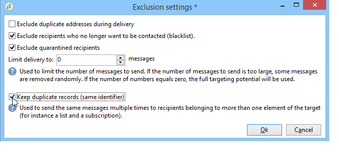
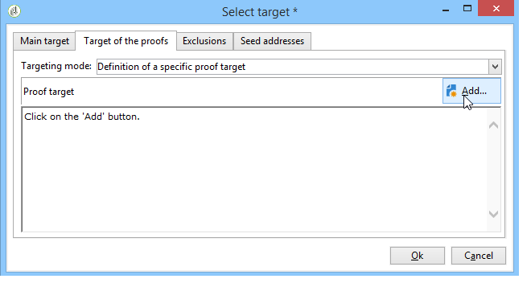
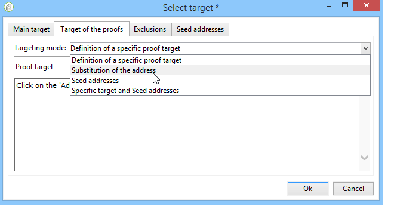
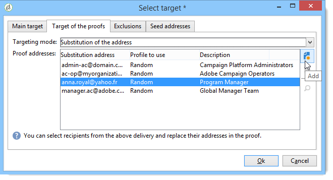

# 定義目標人口 {#defining-the-target-population}

## 關於目標人口 {#about-target-populations}

對於每個傳送，您可以定義數種目標母體類型：

* **主要對象**:接收訊息的設定檔。[深入瞭解](steps-defining-the-target-population.md#selecting-the-main-target)
* **證明**:校樣訊息的收件者，涉及驗證週期。[深入瞭解](steps-defining-the-target-population.md#defining-a-specific-proof-target)
* **種子地址**:未達到傳送目標但將收到傳送的收件者（僅限行銷活動的內容中）。[深入瞭解](about-seed-addresses.md)
* **控制組**:不會收到傳送的母體，用於追蹤行為和促銷活動影響（僅限行銷促銷活動的內容）。[深入瞭解](../../campaign/using/marketing-campaign-target.md#defining-a-control-group)。

## 選取傳送的主要收件者 {#selecting-the-main-target}

在大多數情況下，主要目標會從Adobe Campaign資料庫（預設模式）中擷取。 不過，收件者也可儲存在外部檔案中。 進一步了解[本節](steps-defining-the-target-population.md#selecting-external-recipients)。

若要選取傳送的收件者，請遵循下列步驟：

1. 在傳送編輯器中，選取&#x200B;**[!UICONTROL To]**。
1. 如果收件者儲存在資料庫中，請選擇第一個選項。

   

1. 在&#x200B;**[!UICONTROL Target mapping]**&#x200B;下拉式清單中選取目標對應。 Adobe Campaign預設目標對應為&#x200B;**[!UICONTROL Recipients]**，以&#x200B;**nms:recipient**&#x200B;架構為基礎。

   其他目標對應可供使用，有些可與您的特定設定相關。 有關目標映射的詳細資訊，請參閱[選擇目標映射](selecting-a-target-mapping.md)。

1. 按一下&#x200B;**[!UICONTROL Add]**&#x200B;按鈕以定義限制篩選器。

   然後，您可以選取要套用的篩選類型：

   

   您可以使用資料庫中定義的目標類型來選取收件者。 要使用目標類型，請選擇它，然後按一下&#x200B;**[!UICONTROL Next]**。 對於每個目標，您可以按一下&#x200B;**[!UICONTROL Preview]**&#x200B;標籤來顯示相關的收件者。 對於特定類型的目標，**[!UICONTROL Refine target]**&#x200B;按鈕可讓您結合數個目標准則。

   預設提供下列目標類型：

   * **[!UICONTROL Filtering conditions]** :此選項可讓您定義查詢並顯示結果。定義查詢的方法在[此部分](../../platform/using/creating-filters.md#creating-an-advanced-filter)中介紹。
   * **[!UICONTROL Subscribers of an information service]** :此選項可讓您選取電子報，收件者必須訂閱該電子報，才能由建立的傳送鎖定目標。

      

   * **[!UICONTROL Recipients of a delivery]** :此選項可讓您將現有傳送的收件者定義為定位准則。之後，您必須在清單中選取傳送：

      

   * **[!UICONTROL Delivery recipients belonging to a folder]** :此選項可讓您選取傳送資料夾，並鎖定該資料夾中傳送的收件者。

      

      您可以從下拉式清單中選取，以篩選收件者的行為：

      

      >[!NOTE]
      >
      >**[!UICONTROL Include sub-folders]**&#x200B;選項也可讓您定位所選節點下方樹狀結構中資料夾所包含的傳送。

   * **[!UICONTROL Recipients included in a folder]** :此選項可讓您定位樹的特定資料夾中包含的配置檔案。
   * **[!UICONTROL A recipient]** :此選項可讓您從資料庫的設定檔中選取特定收件者。
   * **[!UICONTROL A list of recipients]** :此選項可讓您鎖定收件者清單。清單顯示在[此部分](../../platform/using/creating-and-managing-lists.md)中。
   * **[!UICONTROL User filters]** :此選項可讓您存取預先設定的篩選器，以將其用作資料庫中設定檔的篩選條件。在[此部分](../../platform/using/creating-filters.md#saving-a-filter)中顯示預配置的篩選器。
   * 選項&#x200B;**[!UICONTROL Exclude recipients corresponding to this segment]**&#x200B;可讓您鎖定不符合已定義目標准則的收件者。 若要使用此選項，請選取適當的方塊，然後依照先前的定義套用目標，以排除產生的設定檔。

      

1. 在&#x200B;**[!UICONTROL Label]**&#x200B;欄位中輸入此目標的名稱。 依預設，標籤將是第一個定位准則的標籤。 對於組合，最好使用明確的名稱。
1. 按一下&#x200B;**[!UICONTROL Finish]**&#x200B;以驗證已設定的目標。

   定義的定位條件會匯總在主要目標設定標籤的中央區段。 按一下條件可查看其內容（配置和預覽）。 若要刪除條件，請按一下標籤後面的交叉點。

   

### 選取外部收件者 {#selecting-external-recipients}

您可以對未儲存在資料庫中，但儲存在外部檔案的收件者啟動傳遞。 例如，我們會在此傳送傳遞給從文字檔案匯入的收件者。

操作步驟：

1. 按一下&#x200B;**[!UICONTROL To]**&#x200B;連結以選取傳送的收件者。
1. 選擇&#x200B;**[!UICONTROL Defined in an external file]**&#x200B;選項。

   

1. 依預設，收件者會匯入資料庫中。 必須選擇&#x200B;**[!UICONTROL Target mapping]**。 有關目標映射的詳細資訊，請參閱[選擇目標映射](selecting-a-target-mapping.md)

   您也可以選擇&#x200B;**[!UICONTROL Do not import the recipients into the database]**。

1. 匯入收件者時，按一下&#x200B;**[!UICONTROL File format definition...]**&#x200B;連結以選取並設定外部檔案。

   有關資料導入的詳細資訊，請參閱[此部分](../../platform/using/executing-import-jobs.md#step-2---source-file-selection)。

1. 按一下&#x200B;**[!UICONTROL Finish]**&#x200B;並將傳送設為標準傳送。

>[!CAUTION]
>
>定義電子郵件傳送的郵件內容時，請勿包含鏡像頁面的連結；無法在此傳送模式中產生。

### 設定排除設定 {#customizing-exclusion-settings}

地址錯誤和質量評等由服務提供程式(IAP)提供。 在執行傳送動作後，此資訊會在收件者設定檔中自動更新，並包含服務提供者傳回的檔案。 可在設定檔中以唯讀方式檢視。

您可以選擇排除已達到特定數量連續錯誤的地址，或其質量等級低於此窗口中指定的閾值的地址。 您也可以選擇是否授權未傳回任何資料的未限定地址。

>[!NOTE]
>
>如果直接郵件傳送中有兩個收件者具有相同的名字、姓氏、郵遞區號和城市，將會發生雙重錯誤，且不會將重複項目列入考量。

**[!UICONTROL Exclusions]**&#x200B;索引標籤用於限制訊息數量。

>[!NOTE]
>
>建議使用預設參數，但您可以視需要調整設定。 不過，這些選項只能由專家使用者變更，以避免使用錯誤和錯誤。

按一下&#x200B;**[!UICONTROL Edit...]**&#x200B;連結以修改預設配置。

可以使用以下選項：

* **[!UICONTROL Exclude duplicate addresses during delivery]**.此選項預設為作用中：可讓您在傳送期間消除重複的電子郵件地址。 所套用的策略可能會因使用Adobe Campaign的方式和資料庫中的資料類型而異。

   可為每個傳送範本設定選項的預設值。

   例如：

   * 傳遞電子報或電子檔案。 如果資料沒有原生重複項目，在某些情況下不會排除重複項目。 訂閱相同電子郵件地址的夫婦可能會收到兩個特定的個人化電子郵件訊息：按姓名向每個人發送一個。 在此情況下，可取消選取此選項。
   * 行銷活動的傳送：重複排除是避免傳送過多訊息給相同收件者的必要條件。 在此情況下，可以選取此選項。

      如果您取消選取此選項，您可以存取其他選項：**[!UICONTROL Keep duplicate records (same identifier)]**。 它可讓您授權多個傳送給符合數個鎖定目標的收件者。

      

* **[!UICONTROL Exclude recipients who no longer want to be contacted]** ，亦即電子郵件地址已列入封鎖清單（「選擇退出」）的收件者。必須繼續選擇這一選項，以遵守電子營銷的職業道德和電子商務法。
* **[!UICONTROL Exclude quarantined recipients]**.此選項可讓您從目標中排除任何具有未回應之位址的設定檔。 強烈建議保留此選項。

   >[!NOTE]
   >
   >有關隔離管理的詳細資訊，請參閱[了解隔離管理](understanding-quarantine-management.md)。

* **[!UICONTROL Limit delivery]** 指定數量的訊息。此選項可讓您輸入要傳送的訊息數量上限。 如果目標的內容超過所指示的消息數，則隨機選擇被應用到目標。

### 縮小目標人口的大小 {#reducing-the-size-of-the-target-population}

您可以縮小目標母體的大小。 要執行此操作，請在&#x200B;**[!UICONTROL Requested quantity]**&#x200B;欄位中指定要匯出的收件者數量。

## 選取校樣訊息的收件者 {#selecting-the-proof-target}

校樣是特殊訊息，可讓您在將傳遞傳送至主要目標之前先測試傳遞。 校樣收件者負責核准訊息的表單和內容。

 [在影片中探索此功能](#seeds-and-proofs-video)

若要選取校樣的目標，請遵循下列步驟：

1. 按一下&#x200B;**[!UICONTROL To]**&#x200B;連結。
1. 按一下&#x200B;**[!UICONTROL Target of the proofs]**&#x200B;標籤。
1. 按一下&#x200B;**[!UICONTROL Targeting mode]**&#x200B;欄位以選擇要套用的方法：**[!UICONTROL Definition of a specific proof target]** 、 **[!UICONTROL Substitution of the address]** 、 **[!UICONTROL Seed addresses]**&#x200B;或&#x200B;**[!UICONTROL Specific target and seed addresses]**。

>[!NOTE]
>
>校樣的目標通常可新增至主要目標。 要執行此操作，請在&#x200B;**[!UICONTROL Main target]**&#x200B;標籤的下半部分中選取適當的選項。

## 定義特定校樣目標 {#defining-a-specific-proof-target}

選取校樣目標時，**[!UICONTROL Definition of a specific proof target]**&#x200B;選項可讓您從資料庫的設定檔中選取校樣收件者。

選擇此選項可使用&#x200B;**[!UICONTROL Add]**&#x200B;按鈕選擇收件者，如定義主目標的情況。 請參閱[選取主要目標](steps-defining-the-target-population.md#selecting-the-main-target)。

有關校樣傳送的詳細資訊，請參閱[此區段](steps-validating-the-delivery.md#sending-a-proof)。

### 在校樣中使用地址替代 {#using-address-substitution-in-proof}

您可以使用&#x200B;**[!UICONTROL Substitution of the address]**&#x200B;選項，而不是在資料庫中選擇專用的收件人。

此選項可讓您使用傳送的收件者設定檔，並將其電子郵件地址取代為將接收校樣的一或多個其他地址。

選取此選項時，校樣地址將透過特殊編輯器填入，此編輯器可讓您設定替代。

設定的執行方式如下：

1. 按一下&#x200B;**[!UICONTROL Add]**&#x200B;圖示以定義替代。
1. 輸入要使用的收件人地址，或從清單中選擇該地址。
1. 選取要在校樣中使用的設定檔：將&#x200B;**[!UICONTROL Random]**&#x200B;值儲存在&#x200B;**[!UICONTROL Profile to use]**&#x200B;欄中，以使用校樣中目標任何設定檔的資料。

   

1. 按一下&#x200B;**[!UICONTROL Detail]**&#x200B;圖示，從主要目標中選取設定檔，如下列範例所示：

   

   您可以根據需要定義任意數量的替代地址。

## 使用種子地址作為證明 {#using-seed-addresses-as-proof}

您可以使用&#x200B;**[!UICONTROL Seed addresses]**&#x200B;作為校樣的目標：此選項可讓您使用或匯入現有種子地址清單。

>[!NOTE]
>
>種子地址顯示在[關於種子地址](about-seed-addresses.md)中。

您可以使用&#x200B;**[!UICONTROL Specific target and Seed addresses]**&#x200B;選項結合特定校樣目標的定義和使用種子地址。 然後，在兩個不同的子標籤中定義相關配置。

另請參閱:

* [選取校樣目標](#selecting-the-proof-target)
* [關於種子地址](about-seed-addresses.md)
* [使用案例：依條件選取種子地址](use-case--selecting-seed-addresses-on-criteria.md)

## 教學課程影片 {#seeds-and-proofs-video}

在此影片中，您將學習如何為現有電子郵件新增種子和校樣，以及如何傳送。

>[!VIDEO](https://video.tv.adobe.com/v/25606?quality=12)

其他Campaign Classic操作說明影片可在[此處](https://experienceleague.adobe.com/docs/campaign-classic-learn/tutorials/overview.html?lang=zh-Hant)取得。
