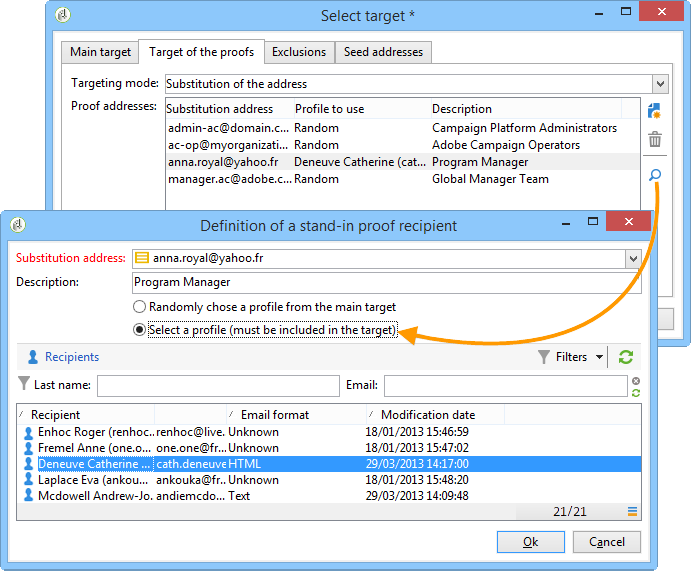

# 定義目標母體 {#defining-the-target-population}

對於每個傳送，您可以定義幾種目標母體：

* **主要對象**：將接收訊息的設定檔。 [了解更多](steps-defining-the-target-population.md#selecting-the-main-target)
* **證明**：驗證週期中涉及的證明訊息的收件者。 [了解更多](steps-defining-the-target-population.md#defining-a-specific-proof-target)
* **種子地址**：不在傳送目標但將接收傳送的收件者（僅在行銷活動的情況下）。 [了解更多](about-seed-addresses.md)
* **控制組**：不會接收傳送的母體，用於追蹤行為和行銷活動影響（僅適用於行銷活動內容）。 [了解更多](../../campaign/using/marketing-campaign-target.md#defining-a-control-group)。

## 選取傳遞的主要收件者 {#selecting-the-main-target}

在大多數情況下，主要目標會從Adobe Campaign資料庫（預設模式）擷取。 不過，收件者也可以儲存在外部檔案中。 若要了解詳細資訊，請參閱[本章節](steps-defining-the-target-population.md#selecting-external-recipients)。

若要選取傳遞的收件者，請遵循下列步驟：

1. 在傳遞編輯器中，選取 **[!UICONTROL To]**.
1. 如果收件者儲存在資料庫中，請選擇第一個選項。

   

1. 選取中的目標對應 **[!UICONTROL Target mapping]** 下拉式清單。 Adobe Campaign預設目標對應為 **[!UICONTROL Recipients]**，根據 **nms：recipient** 綱要。

   有其他目標對應可供使用，其中一些可能與您的特定設定相關。 有關目標對應的詳細資訊，請參閱 [選取目標對應](selecting-a-target-mapping.md).

1. 按一下 **[!UICONTROL Add]** 按鈕以定義限制篩選器。

   然後，您可以選取要套用的篩選型別：

   

   您可以使用資料庫中定義的定位型別來選取收件者。 若要使用目標型別，請選取並按一下 **[!UICONTROL Next]**. 對於每個目標，您可以按一下 **[!UICONTROL Preview]** 標籤。 對於特定型別的目標， **[!UICONTROL Refine target]** 按鈕可讓您合併多個鎖定目標條件。

   預設會提供下列目標型別：

   * **[!UICONTROL Filtering conditions]** ：此選項可讓您定義查詢並顯示結果。 有關定義查詢的方法，請參見 [本節](../../platform/using/creating-filters.md#creating-an-advanced-filter).
   * **[!UICONTROL Subscribers of an information service]** ：此選項可讓您選取收件者必須訂閱的Newsletter，才能由正在建立的傳遞定位。

     

   * **[!UICONTROL Recipients of a delivery]** ：此選項可讓您將現有傳送的收件者定義為定位條件。 之後，您必須在清單中選取傳送：

     

   * **[!UICONTROL Delivery recipients belonging to a folder]** ：此選項可讓您選取傳送資料夾，並鎖定該資料夾中傳送的收件者。

     

     您可以從下拉式清單中選取，以篩選收件者的行為：

     

     >[!NOTE]
     >
     >此 **[!UICONTROL Include sub-folders]** 選項也可讓您定位在所選節點下位於樹狀結構中的資料夾中所包含的傳送。

   * **[!UICONTROL Recipients included in a folder]** ：此選項可讓您定位樹狀結構之特定資料夾中所包含的設定檔。
   * **[!UICONTROL A recipient]** ：此選項可讓您從資料庫中的設定檔選取特定收件者。
   * **[!UICONTROL A list of recipients]** ：此選項可讓您鎖定收件者清單。 清單會顯示在 [本節](../../platform/using/creating-and-managing-lists.md).
   * **[!UICONTROL User filters]** ：此選項可讓您存取預先設定的篩選器，以將其用作資料庫中設定檔的篩選條件。 預先設定的篩選器會顯示在中 [本節](../../platform/using/creating-filters.md#saving-a-filter).
   * 選項 **[!UICONTROL Exclude recipients corresponding to this segment]** 可讓您鎖定不符合已定義目標准則的收件者。 若要使用此選項，請選取適當的方塊，然後套用定位（如先前所定義）以排除產生的設定檔。

     

1. 在「 」中輸入此定位的名稱 **[!UICONTROL Label]** 欄位。 依預設，標籤將是第一個鎖定目標條件的標籤。 若為組合，最好使用明確名稱。
1. 按一下 **[!UICONTROL Finish]** 以驗證已設定的鎖定目標。

   主要目標設定索引標籤的中央區段中會摘要說明已定義的鎖定目標條件。 按一下條件以檢視其內容（設定和預覽）。 若要刪除條件，請按一下位於其標籤後面的十字形。

   

### 選取外部收件者 {#selecting-external-recipients}

您可以對未儲存在資料庫中，但儲存在外部檔案中的收件者啟動傳遞。 例如，我們會傳送傳遞至從文字檔匯入的收件者。

操作步驟：

1. 按一下 **[!UICONTROL To]** 選取傳遞收件者的連結。
1. 選取 **[!UICONTROL Defined in an external file]** 選項。

   

1. 依預設，收件者會匯入資料庫中。 您必須選取 **[!UICONTROL Target mapping]**. 有關目標對應的詳細資訊，請參閱 [選取目標對應](selecting-a-target-mapping.md)

   您也可以選擇 **[!UICONTROL Do not import the recipients into the database]**.

1. 匯入收件者時，按一下 **[!UICONTROL File format definition...]** 用來選取及設定外部檔案的連結。

   如需資料匯入的詳細資訊，請參閱 [本節](../../platform/using/executing-import-jobs.md#step-2---source-file-selection).

1. 按一下 **[!UICONTROL Finish]** 並將您的傳送設定為標準傳送。

>[!CAUTION]
>
>定義電子郵件傳送的訊息內容時，請勿包含映象頁面的連結；此傳送模式無法產生此連結。

### 定義排除設定 {#define-exclusion-settings}

由服務提供者(IAP)提供地址錯誤和品質評等。 此資訊會在傳遞動作後自動更新收件者設定檔中，並包含服務提供者傳回的檔案。 您可以在設定檔中以唯讀方式檢視它。

您可以選擇排除已達到特定連續錯誤數或品質評等低於此視窗中所指定臨界值的地址。 您也可以選擇是否授權未傳回任何資料的非限定地址。

>[!NOTE]
>
>如果兩個收件者在直接郵件傳遞中具有相同的名字、姓氏、郵遞區號和城市，則會發生雙重錯誤，且不會考慮重複的專案。

此 **[!UICONTROL Exclusions]** 索引標籤用來限制訊息數量。

>[!NOTE]
>
>建議使用預設引數，但您可以根據需求調整設定。 不過，這些選項僅應由專家使用者變更，以避免任何誤用和錯誤。

按一下 **[!UICONTROL Edit...]** 連結以修改預設設定。

可以使用以下選項：

* **[!UICONTROL Exclude duplicate addresses during delivery]**. 此選項預設為作用中：可讓您在傳送期間消除重複的電子郵件地址。 套用的策略可能會因Adobe Campaign的使用方式及資料庫中的資料型別而異。

  可為每個傳遞範本設定選項的預設值。

  例如：

   * 電子報或電子檔案傳遞的傳遞。 若資料沒有原生重複專案，則某些情況下不會排除重複專案。 使用相同電子郵件地址訂閱的一對夫婦可能會收到兩則特定的個人化電子郵件訊息：一則以姓名傳送給每個人。 在此情況下，可取消選取此選項。
   * 行銷活動的傳遞：重複排除是避免傳送太多訊息給相同收件者的基本條件。 在此情況下，可以選取此選項。

     如果取消選取此選項，您可以存取其他選項： **[!UICONTROL Keep duplicate records (same identifier)]**. 它可讓您授權傳送多筆訊息給符合數個鎖定目標的收件者。

     

* **[!UICONTROL Exclude recipients who no longer want to be contacted]** ，即電子郵件地址位於封鎖清單上的收件者（「選擇退出」）。 為了遵守電子行銷的職業道德和電子商務的相關法律，必須保持選取此選項。
* **[!UICONTROL Exclude quarantined recipients]**. 此選項可讓您從目標排除位址未回應的任何設定檔。 我們強烈建議維持選取此選項。

  >[!NOTE]
  >
  >如需隔離管理的詳細資訊，請參閱 [瞭解隔離管理](understanding-quarantine-management.md).

* **[!UICONTROL Limit delivery]** 至指定數量的訊息。 此選項可讓您輸入要傳送的訊息數目上限。 如果目標的內容超過指示的訊息數，則會將隨機選取專案套用至目標。

### 減少目標母體大小 {#reducing-the-size-of-the-target-population}

您可以減少目標母體的大小。 若要這麼做，請指定要在中匯出的收件者人數 **[!UICONTROL Requested quantity]** 欄位。

## 選取校樣訊息的收件者 {#selecting-the-proof-target}

校樣是一則特殊訊息，可讓您在將內容傳送至主要目標之前先測試內容。 校樣收件者負責核准訊息的表單和內容。

 [在影片中探索此功能](#seeds-and-proofs-video)

若要選取校樣目標，請遵循下列步驟：

1. 按一下&#x200B;**[!UICONTROL To]**&#x200B;連結。
1. 按一下 **[!UICONTROL Target of the proofs]** 標籤。
1. 按一下 **[!UICONTROL Targeting mode]** 選擇要套用之方法的欄位： **[!UICONTROL Definition of a specific proof target]** ， **[!UICONTROL Substitution of the address]** ， **[!UICONTROL Seed addresses]** 或 **[!UICONTROL Specific target and seed addresses]**.

>[!NOTE]
>
>通常，校樣的目標可以新增到主要目標。 要執行此操作，請選取 **[!UICONTROL Main target]** 標籤。

## 定義特定校訂目標 {#defining-a-specific-proof-target}

選取校樣目標時， **[!UICONTROL Definition of a specific proof target]** 選項可讓您從資料庫中的設定檔選取校樣收件者。

選取此選項以使用 **[!UICONTROL Add]** 按鈕，例如在定義主要目標的情況下。 另請參閱 [選取主要目標](steps-defining-the-target-population.md#selecting-the-main-target).

有關校樣傳送的詳細資訊，請參閱 [本節](steps-validating-the-delivery.md#sending-a-proof).

### 在證明中使用地址替代 {#using-address-substitution-in-proof}

除了在資料庫中選取專用的收件者之外，您還可以使用 **[!UICONTROL Substitution of the address]** 選項。

此選項可讓您使用傳送的收件者設定檔，並將其電子郵件地址取代為將接收校樣的一或多個其他地址。

選取此選項時，將透過可讓您設定替代的特殊編輯器填寫校樣地址。

設定執行如下：

1. 按一下 **[!UICONTROL Add]** 圖示以定義替代。
1. 輸入要使用的收件者地址，或從清單中選取收件者地址。
1. 選取要在校訂中使用的設定檔：儲存 **[!UICONTROL Random]** 中的值 **[!UICONTROL Profile to use]** 欄，以在校樣中使用目標的任何設定檔的資料。

   

1. 按一下 **[!UICONTROL Detail]** 圖示以從主要目標選取設定檔，如下列範例所示：

   

   您可以視需要定義儘可能多的替代地址。

## 使用種子地址作為證明 {#using-seed-addresses-as-proof}

您可以使用 **[!UICONTROL Seed addresses]** 作為校訂的目標：此選項可讓您使用或匯入現有種子地址的清單。

>[!NOTE]
>
>種子地址會顯示在 [關於種子地址](about-seed-addresses.md).

您可以結合特定校樣目標的定義和種子地址的使用，使用 **[!UICONTROL Specific target and Seed addresses]** 選項。 相關設定隨後會在兩個單獨的子標籤中定義。

另請參閱：

* [選取校訂目標](#selecting-the-proof-target)
* [關於種子地址](about-seed-addresses.md)
* [使用實例：依條件選取種子地址](use-case-selecting-seed-addresses-on-criteria.md)

## 教學課程影片 {#seeds-and-proofs-video}

在本影片中，您將瞭解如何新增種子和校樣到現有電子郵件以及如何傳送它。

>[!VIDEO](https://video.tv.adobe.com/v/25606?quality=12)

提供其他Campaign Classic操作影片 [此處](https://experienceleague.adobe.com/docs/campaign-classic-learn/tutorials/overview.html?lang=zh-Hant).
