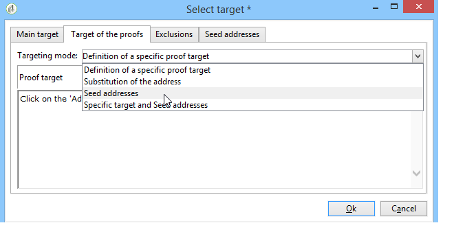

# 定義目標人口 {#defining-the-target-population}

對於每個交貨，您可以定義幾種類型的目標總體：

* **主觀觀眾**:接收消息的配置檔案。 [了解更多](steps-defining-the-target-population.md#selecting-the-main-target)
* **證明**:驗證週期中涉及的驗證消息的接收者。 [了解更多](steps-defining-the-target-population.md#defining-a-specific-proof-target)
* **種子地址**:超出交貨目標但將接收交貨的收件人（僅在市場營銷活動的上下文中）。 [了解更多](about-seed-addresses.md)
* **控制組**:將不接收交貨的人口，用於跟蹤行為和市場活動影響（僅在市場活動的上下文中）。 [了解更多](../../campaign/using/marketing-campaign-target.md#defining-a-control-group)。

## 選擇交貨的主收件人 {#selecting-the-main-target}

在大多數情況下，主目標是從Adobe Campaign資料庫（預設模式）中提取的。 但是，收件人也可以儲存在外部檔案中。 瞭解詳情 [此部分](steps-defining-the-target-population.md#selecting-external-recipients)。

要選擇交貨的收件人，請執行以下步驟：

1. 在傳遞編輯器中，選擇 **[!UICONTROL To]**。
1. 如果收件人儲存在資料庫中，請選擇第一個選項。

   

1. 在 **[!UICONTROL Target mapping]** 的子菜單。 Adobe Campaign預設目標映射 **[!UICONTROL Recipients]**，基於 **nms：收件人** 架構。

   其他目標映射可用，某些映射可能與您的特定配置相關。 有關目標映射的詳細資訊，請參閱 [選擇目標映射](selecting-a-target-mapping.md)。

1. 按一下 **[!UICONTROL Add]** 按鈕。

   然後，可以選擇要應用的篩選類型：

   

   可以使用資料庫中定義的目標類型選擇收件人。 要使用目標類型，請選擇它，然後按一下 **[!UICONTROL Next]**。 對於每個目標，可通過按一下 **[!UICONTROL Preview]** 頁籤。 對於某些類型的目標， **[!UICONTROL Refine target]** 按鈕，來組合多個目標條件。

   預設情況下提供以下目標類型：

   * **[!UICONTROL Filtering conditions]** :此選項允許您定義查詢並顯示結果。 定義查詢的方法如 [此部分](../../platform/using/creating-filters.md#creating-an-advanced-filter)。
   * **[!UICONTROL Subscribers of an information service]** :此選項允許您選擇必須訂閱收件人以作為建立的遞送目標的新聞稿。

      

   * **[!UICONTROL Recipients of a delivery]** :此選項允許您將現有交貨的接收人定義為目標標準。 然後，必須在清單中選擇交貨：

      

   * **[!UICONTROL Delivery recipients belonging to a folder]** :此選項允許您選擇交貨資料夾並將該資料夾中交貨的收件人作為目標。

      

      您可以通過從下拉清單中選擇來篩選收件人的行為：

      

      >[!NOTE]
      >
      >的 **[!UICONTROL Include sub-folders]** 選項還允許您將所選節點下的樹結構中資料夾中包含的交貨作為目標。

   * **[!UICONTROL Recipients included in a folder]** :此選項允許您將樹的特定資料夾中包含的配置檔案作為目標。
   * **[!UICONTROL A recipient]** :此選項允許您從資料庫中的配置檔案中選擇特定收件人。
   * **[!UICONTROL A list of recipients]** :此選項允許您以收件人清單為目標。 清單在 [此部分](../../platform/using/creating-and-managing-lists.md)。
   * **[!UICONTROL User filters]** :此選項允許您訪問預配置的篩選器，以將它們用作資料庫中配置檔案的篩選條件。 中提供了預配置的篩選器 [此部分](../../platform/using/creating-filters.md#saving-a-filter)。
   * 選項 **[!UICONTROL Exclude recipients corresponding to this segment]** 允許您針對不滿足定義的目標條件的收件人。 要使用此選項，請選擇相應的框，然後應用目標（如前所定義）以排除結果配置檔案。

      

1. 在 **[!UICONTROL Label]** 的子菜單。 預設情況下，標籤將是第一個目標條件的標籤。 對於組合，最好使用顯式名稱。
1. 按一下 **[!UICONTROL Finish]** 驗證配置的目標。

   定義的目標標準在主目標配置頁籤的中心部分進行匯總。 按一下條件查看其內容（配置和預覽）。 要刪除條件，請按一下標籤後的交叉點。

   

### 選擇外部收件人 {#selecting-external-recipients}

您可以對未保存在資料庫中但儲存在外部檔案中的收件人啟動傳遞。 例如，我們將在此處向從文本檔案導入的收件人發送傳遞。

操作步驟：

1. 按一下 **[!UICONTROL To]** 連結，以選擇交貨的收件人。
1. 選擇 **[!UICONTROL Defined in an external file]** 的雙曲餘切值。

   

1. 預設情況下，收件人會導入資料庫中。 必須選擇 **[!UICONTROL Target mapping]**。 有關目標映射的詳細資訊，請參閱 [選擇目標映射](selecting-a-target-mapping.md)

   您也可以選擇 **[!UICONTROL Do not import the recipients into the database]**。

1. 導入收件人時，按一下 **[!UICONTROL File format definition...]** 連結以選擇和配置外部檔案。

   有關資料導入的詳細資訊，請參閱 [此部分](../../platform/using/executing-import-jobs.md#step-2---source-file-selection)。

1. 按一下 **[!UICONTROL Finish]** 並將交貨配置為標準交貨。

>[!CAUTION]
>
>在定義郵件傳遞內容時，不要包括到鏡像頁面的連結；無法在此傳遞模式下生成。

### 定義排除設定 {#define-exclusion-settings}

地址錯誤和質量等級由服務提供商(IAP)提供。 在傳遞操作之後，此資訊將自動在收件人配置檔案中更新，並且檔案由服務提供商返回。 可以在配置檔案中以只讀方式查看。

您可以選擇排除已達到一定數量的連續錯誤或其質量評級低於此窗口中指定的閾值的地址。 您也可以選擇是否授權尚未返回資料的非限定地址。

>[!NOTE]
>
>如果直接郵寄中兩個收件人的名字、姓、郵戳和城市相同，則會出現雙重錯誤，並且不會考慮重複內容。

的 **[!UICONTROL Exclusions]** 頁籤用於限制消息數。

>[!NOTE]
>
>建議使用預設參數，但可以根據需要調整設定。 但是，這些選項只應由專家用戶更改，以避免任何誤用和錯誤。

按一下 **[!UICONTROL Edit...]** 連結以修改預設配置。

可以使用以下選項：

* **[!UICONTROL Exclude duplicate addresses during delivery]**。 預設情況下，此選項處於活動狀態：它使您能夠在交付期間消除重複的電子郵件地址。 所應用的策略可根據Adobe Campaign的使用方式和資料庫中的資料類型而有所不同。

   可以為每個傳遞模板配置選項的預設值。

   例如：

   * 提供新聞稿或電子文檔交付。 在某些情況下，如果資料沒有本機重複項，則不排除重複項。 使用相同電子郵件地址訂閱的對方可能會收到兩個特定的個性化電子郵件：每個人的名字都有一個。 在這種情況下，可以取消選擇此選項。
   * 市場營銷活動的交付：重複排除對於避免向同一收件人發送過多郵件至關重要。 在這種情況下，可以選擇此選項。

      如果取消選擇此選項，則可以訪問附加選項： **[!UICONTROL Keep duplicate records (same identifier)]**。 它允許您向滿足多個目標標準的收件人授權多個交貨。

      

* **[!UICONTROL Exclude recipients who no longer want to be contacted]** ，即電子郵件地址位於denylist（「選擇退出」）的收件人。 為遵守電子營銷的職業道德和電子商務的法律，必須繼續選擇這一選擇。
* **[!UICONTROL Exclude quarantined recipients]**。 此選項允許您從目標中排除任何地址沒有響應的配置檔案。 我們強烈建議保留此選項。

   >[!NOTE]
   >
   >有關隔離管理的詳細資訊，請參閱 [瞭解隔離管理](understanding-quarantine-management.md)。

* **[!UICONTROL Limit delivery]** 給定數量的消息。 此選項允許您輸入要發送的最大消息數。 如果目標的內容超過所指示的消息數，則隨機選擇被應用於目標。

### 減少目標人口的規模 {#reducing-the-size-of-the-target-population}

可以縮小目標種群的大小。 為此，請指定要在 **[!UICONTROL Requested quantity]** 的子菜單。

## 選擇校樣郵件的收件人 {#selecting-the-proof-target}

證明是一條特殊消息，它允許您在將傳遞發送到主目標之前test傳遞。 證明收件人負責批准郵件的表單和內容。

 [在影片中探索此功能](#seeds-and-proofs-video)

要選擇校樣的目標，請執行以下步驟：

1. 按一下&#x200B;**[!UICONTROL To]**&#x200B;連結。
1. 按一下 **[!UICONTROL Target of the proofs]** 頁籤。
1. 按一下 **[!UICONTROL Targeting mode]** 欄位以選擇要應用的方法： **[!UICONTROL Definition of a specific proof target]** 。 **[!UICONTROL Substitution of the address]** 。 **[!UICONTROL Seed addresses]** 或 **[!UICONTROL Specific target and seed addresses]**。

>[!NOTE]
>
>通常，證明目標可以添加到主目標。 為此，請在 **[!UICONTROL Main target]** 頁籤。

## 定義特定證明目標 {#defining-a-specific-proof-target}

選擇證明目標時， **[!UICONTROL Definition of a specific proof target]** 選項，可從資料庫中的配置檔案中選擇校樣收件人。

選擇此選項以使用 **[!UICONTROL Add]** 按鈕，如定義主目標時所示。 請參閱 [選擇主目標](steps-defining-the-target-population.md#selecting-the-main-target)。

有關證明發送的詳細資訊，請參閱 [此部分](steps-validating-the-delivery.md#sending-a-proof)。

### 在證明中使用地址替換 {#using-address-substitution-in-proof}

您可以使用 **[!UICONTROL Substitution of the address]** 的雙曲餘切值。

此選項允許您使用傳遞的收件人配置檔案，並將其電子郵件地址替換為一個或多個將接收證明的其他地址。

選擇此選項後，校樣地址將通過特殊編輯器填充，該編輯器允許您配置替代。

配置如下：

1. 按一下 **[!UICONTROL Add]** 表徵圖以定義替代。
1. 輸入要使用的收件人地址，或從清單中選擇它。
1. 選擇要在校樣中使用的配置檔案：保存 **[!UICONTROL Random]** 值 **[!UICONTROL Profile to use]** 列，以使用證明中目標的任何配置檔案的資料。

   

1. 按一下 **[!UICONTROL Detail]** 表徵圖，從主目標中選擇配置檔案，如下例所示：

   

   您可以根據需要定義任意數量的替代地址。

## 將種子地址用作證明 {#using-seed-addresses-as-proof}

您可以使用 **[!UICONTROL Seed addresses]** 作為證明的對象：此選項允許您使用或導入現有種子地址清單。

>[!NOTE]
>
>種子地址在 [關於種子地址](about-seed-addresses.md)。

您可以使用 **[!UICONTROL Specific target and Seed addresses]** 的雙曲餘切值。 然後在兩個單獨的子頁籤中定義相關配置。

另請參閱:

* [選擇校樣目標](#selecting-the-proof-target)
* [關於種子地址](about-seed-addresses.md)
* [使用實例：依條件選取種子地址](use-case--selecting-seed-addresses-on-criteria.md)

## 教程視頻 {#seeds-and-proofs-video}

在此視頻中，您將學習如何向現有電子郵件中添加種子和校樣以及如何發送。

>[!VIDEO](https://video.tv.adobe.com/v/25606?quality=12)

可提供其他Campaign Classic操作視頻 [這裡](https://experienceleague.adobe.com/docs/campaign-classic-learn/tutorials/overview.html?lang=zh-Hant)。
