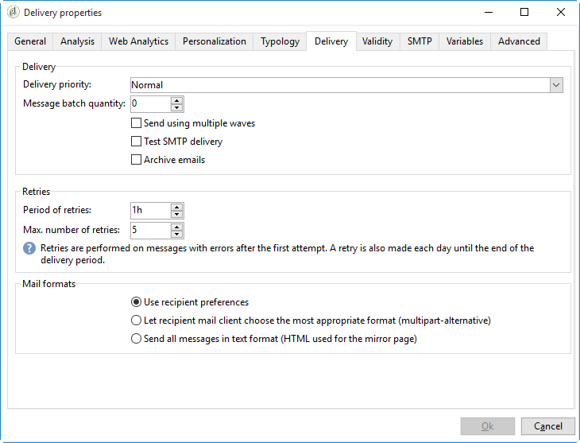
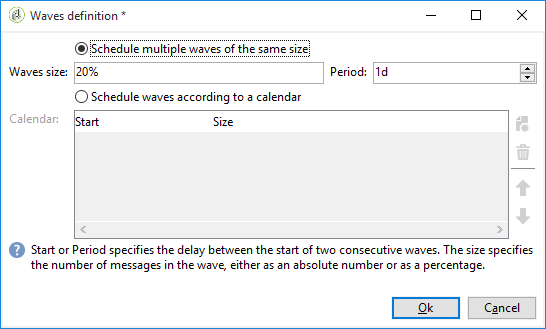

# 設定並傳送傳遞 {#configuring-and-sending-the-delivery}

## 權限{#delivery-permissions}

只有傳遞擁有者可以開始傳遞。 若要讓其他操作者（或操作者群組）能夠開始傳遞，請在中將他們新增為稽核者 **[!UICONTROL Delivery start:]** 欄位。 [了解更多](../../campaign/using/marketing-campaign-approval.md#selecting-reviewers)。

## 傳遞其他引數 {#delivery-additiona-parameters}

在傳送傳送前，您可以透過在傳送屬性中定義傳送引數 **[!UICONTROL Delivery]** 標籤。

* **[!UICONTROL Delivery priority]**：此選項可設定您的傳送的優先順序層級，以變更傳送順序：正常、高或低。

* **[!UICONTROL Message batch quantity]**：使用此選項可定義在同一XML傳遞套件中分組的訊息數。 如果引數設為0，訊息會自動分組。 封裝大小由計算定義 `<delivery size>/1024`，每個套件最少8則訊息，最多256則訊息。

  >[!IMPORTANT]
  >
  >當透過複製現有傳遞建立傳遞時，此引數會重設。

* **[!UICONTROL Send using multiple waves]**：使用此選項可批次傳送訊息，而非一次傳送給整個對象。 [了解更多](#sending-using-multiple-waves)。

* **[!UICONTROL Test SMTP delivery]**：使用此選項來測試透過SMTP的傳送。 處理傳遞直到連線到 SMTP 伺服器，但不傳送：對於傳遞的每個收件者，Campaign 會連線到 SMTP 提供者伺服器，執行 SMTP RCPT TO 命令，並在 SMTP DATA 命令之前關閉連線。

  >[!NOTE]
  >
  >* 此選項不得在中間來源中設定。
  >
  >* 瞭解更多有關SMTP伺服器設定的資訊，請參閱 [本節](../../installation/using/configure-delivery-settings.md).

* **[!UICONTROL Email BCC]**：使用此選項可透過密件副本將電子郵件儲存在外部系統上，只需將密件副本電子郵件地址新增至您的訊息目標即可。 [了解更多](sending-messages.md#archiving-emails)。

## 確認傳遞 {#confirming-delivery}

當傳送已設定好並準備好傳送時，請執行傳送分析。

若要這麼做，請按一下 **[!UICONTROL Send]**，選取所需動作並按一下 **[!UICONTROL Analyze]**. [了解更多](steps-validating-the-delivery.md#analyzing-the-delivery)。

完成後，按一下 **[!UICONTROL Confirm delivery]** 以啟動訊息的傳遞。

然後，您可以關閉傳遞精靈，並從 **[!UICONTROL Delivery]** 索引標籤，可透過此傳送的詳細資訊或傳送清單存取。

傳送訊息後，您可以監視和追蹤您的傳遞。 如需詳細資訊，請參閱下列區段。

* [監視傳遞](about-delivery-monitoring.md)
* [瞭解傳遞失敗](understanding-delivery-failures.md)
* [關於訊息追蹤](about-message-tracking.md)

## 排程傳遞傳送 {#scheduling-the-delivery-sending}

您可以排程傳遞，以延遲訊息傳送。

1. 按一下 **[!UICONTROL Send]** 按鈕並選取 **[!UICONTROL Postpone delivery]** 選項。

1. 在中指定開始日期 **[!UICONTROL Contact date]** 欄位。

1. 然後，您可以開始傳遞分析，然後確認傳遞傳送。 不過，傳送要等到中指定的日期才會開始 **[!UICONTROL Contact date]** 欄位。

>[!IMPORTANT]
>
>開始分析後，您定義的聯絡日期即已固定。 如果您修改此日期，則必須重新啟動分析，以便將您的修改納入考量。

在傳遞清單中，傳遞將會顯示為 **[!UICONTROL Pending]** 狀態。

您也可以透過以下方式設定上游 **[!UICONTROL Scheduling]** 傳遞的按鈕。

這可讓您將傳送延遲到較晚日期，或將傳送儲存在臨時行事曆中。

* 此 **[!UICONTROL Schedule delivery (no automatic execution)]** 選項可讓您排程傳遞的臨時分析。

  儲存此設定時，傳送會變更為 **[!UICONTROL Targeting pending]** 狀態。 分析將會在指定的日期啟動。

* 此 **[!UICONTROL Schedule delivery (automatic execution on planned date)]** 選項可讓您指定傳送日期。

  按一下 **[!UICONTROL Send]** 並選取 **[!UICONTROL Postpone delivery]** 然後啟動分析並確認傳送。 分析完成後，傳遞目標已準備就緒，訊息將於指定日期自動傳送。

日期和時間會以目前運運算元的時區表示。 此 **[!UICONTROL Time zone]** 位於聯絡資料輸入欄位下方的下拉式清單，可讓您自動將輸入的日期和時間轉換為所選的時區。

例如，如果您排程在倫敦時間8點自動執行傳遞，則時間會自動轉換為所選的時區：

## 使用多個波段傳送 {#sending-using-multiple-waves}

若要平衡負載，您可以將傳送劃分為幾個批次。 設定批次數量及其相對於整個傳送的比例。

>[!NOTE]
>
>您只能定義兩個連續波段之間的大小和延遲。 無法設定每個波次的收件者選取條件。

1. 開啟傳送屬性視窗，然後按一下 **[!UICONTROL Delivery]** 標籤。
1. 選取 **[!UICONTROL Send using multiple waves]** 選項，然後按一下 **[!UICONTROL Define waves...]** 連結。

   

1. 若要設定波段，您可以：

   * 定義每個波段的大小。 例如，如果您輸入 **[!UICONTROL 30%]** 在對應欄位中，每個波段將代表傳送中所包含訊息的30%，但最後一個波段除外，這將代表訊息的10%。

     在 **[!UICONTROL Period]** 欄位，指定兩個連續波段開始之間的延遲。 例如，如果您輸入 **[!UICONTROL 2d]**，第一波會立即開始，第二波會在兩天內開始，第三波會在四天內開始，以此類推。

     

   * 定義傳送每個波次的行事曆。

     在 **[!UICONTROL Start]** 欄，指定兩個連續波段開始之間的延遲。 在 **[!UICONTROL Size]** 欄，輸入固定數字或百分比。

     在以下範例中，第一個波段代表傳遞中包含之訊息總數的25%，並會立即開始。 接下來的兩個批次會完成傳遞，並設定為每六小時開始一次。

     

   特定的型別規則， **[!UICONTROL Wave scheduling check]**，確保最後一個波段是在傳遞效度限制之前計畫。 行銷活動型別及其規則，設定於 **[!UICONTROL Typology]** 傳遞屬性的索引標籤，顯示在 [包含型別的驗證程式](steps-validating-the-delivery.md#validation-process-with-typologies).

   >[!IMPORTANT]
   >
   >請確定最後一個批次沒有超過傳遞期限，該期限定義於 **[!UICONTROL Validity]** 標籤。 否則，部分訊息可能不會傳送。
   >
   >在設定最後一個波段時，您也必須允許足夠的重試時間。 請參閱[本節](steps-sending-the-delivery.md#configuring-retries)。

1. 若要監視您的傳送，請前往傳送記錄檔。 請參閱[此頁面](delivery-dashboard.md#delivery-logs-and-history)。

   您可以檢視已在處理批次中傳送的傳遞(**[!UICONTROL Sent]** 狀態)和在剩餘波段中要傳送的傳遞(**[!UICONTROL Pending]** 狀態)。

以下兩個範例是使用多個波段的最常見使用案例。

* **啟動處理期間**

  使用新平台傳送電子郵件時，網際網路服務提供者(ISP)會懷疑無法辨識的IP位址。 如果突然傳送大量電子郵件，ISP通常會將其標籤為垃圾郵件。

  為避免被標籤為垃圾訊息，您可以逐步增加使用波段傳送的數量。 這應該可以確保啟動階段的順利發展，並且讓您降低無效的位址的整體比率。

  若要這麼做，請使用 **[!UICONTROL Schedule waves according to a calendar]** 選項。 例如，將第一個波段設為10%，將第二個波段設為15%，以此類推。

  

* **涉及客服中心的行銷活動**

  透過電話管理忠誠度行銷活動時，貴組織處理聯絡訂閱者之通話次數的能力有限。

  使用波段時，您可以將訊息數量限製為每天20則，例如考量客服中心的每日處理能力。

  若要這麼做，請選取 **[!UICONTROL Schedule multiple waves of the same size]** 選項。 輸入 **[!UICONTROL 20]** 作為波浪的大小和 **[!UICONTROL 1d]** 在 **[!UICONTROL Period]** 欄位。

  

## 設定重試 {#configuring-retries}

由於下列原因暫時未傳遞的訊息： **柔光** 或 **已忽略** 錯誤可能會自動重試。 本頁面說明傳送失敗型別和原因 [區段](understanding-delivery-failures.md#delivery-failure-types-and-reasons).

>[!IMPORTANT]
>
>對於託管或混合安裝，如果您已升級至 [增強的MTA](sending-with-enhanced-mta.md)中，Campaign不再使用傳送中的重試設定。 軟退信重試次數和兩次之間的時間長度由Enhanced MTA根據從訊息的電子郵件網域傳回的退信回應的型別和嚴重性來決定。

對於使用舊版Campaign MTA的內部部署安裝和託管/混合安裝， **[!UICONTROL Delivery]** 傳遞引數的索引標籤指出在傳遞後一天應該執行多少次重試，以及重試之間的最小延遲。

根據預設，排程在傳送的第一天進行五次重試，最小間隔為一小時分佈在一天中的24小時。 之後及傳送期限之前，每天都會設定一次重試；傳送期限定義於 **[!UICONTROL Validity]** 標籤。 另請參閱 [定義有效期間](#defining-validity-period).

## 定義有效期間 {#defining-validity-period}

當傳送已啟動時，可傳送訊息（以及任何重試），直到傳送期限為止。 這會在傳遞屬性中透過指示 **[!UICONTROL Validity]** 標籤。

* 此 **[!UICONTROL Delivery duration]** 欄位可讓您輸入全域傳送重試的限制。 這表示 Adobe Campaign 會傳送從開始日期開始的訊息，然後，對於僅傳回錯誤的訊息，會執行一般、可設定的重試，直到達到效度限制為止。

  您也可以選擇指定日期。要執行此操作，請選取 **[!UICONTROL Explicitly set validity dates]**. 在此情況下，傳遞和有效期限制日期也讓您指定時間。預設使用目前時間，但您可以直接在輸入欄位中修改。

  >[!IMPORTANT]
  >
  >對於託管或混合安裝，如果您已升級至 [增強的MTA](sending-with-enhanced-mta.md)，則 **[!UICONTROL Delivery duration]** 您的Campaign電子郵件傳送中的設定，僅在設為時使用 **3.5天或以下**. 如果您定義的值超過3.5天，則不會考慮該值。

* **資源效度限制**：此 **[!UICONTROL Validity limit]** 欄位是用於上傳的資源，主要用於映象頁面和影像。 本頁上的資源在限定時間內有效（以節省磁碟空間）。

  此欄位中的值可以用下列單位表示： [本節](../../platform/using/adobe-campaign-workspace.md#default-units).
