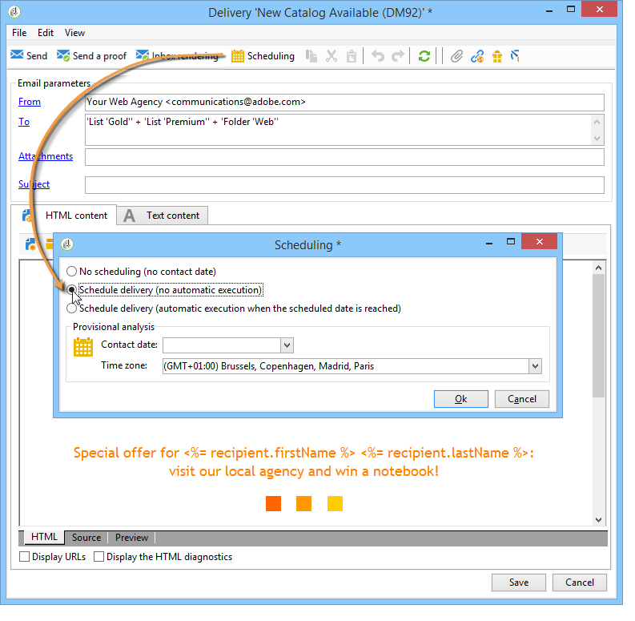

# 設定和傳送傳送 {#configuring-and-sending-the-delivery}

>[!NOTE]
>
>只有傳送擁有者才能開始傳送。 為了讓其他運算元（或運算元群組）能夠開始傳送，您必須在欄位中新增為審核 **[!UICONTROL Delivery start:]** 者。
>
>請參閱 [本節](../../campaign/using/marketing-campaign-approval.md#selecting-reviewers) ，以取得詳細資訊。

## 傳送其他參數 {#delivery-additiona-parameters}

在傳送傳送之前，您可以透過標籤在傳送屬性中定義傳送 **[!UICONTROL Delivery]** 參數。

* **[!UICONTROL Delivery priority]**:此選項可讓您指出傳送的優先順序等級（一般、高或低），以影響傳送的傳送順序。 這可讓您將特定、更緊急的遞送訂單排在優先順序，而非其他遞送。

* **[!UICONTROL Message batch quantity]**:此選項允許您定義在同一XML傳送包內分組的消息數。 如果參數設為0，則消息會自動分組。 軟體包大小由計算定義， `<delivery size>/1024`每個軟體包最少8條消息，最多256條消息。

   >[!CAUTION]
   >
   >複製傳送時，會重設參數。

* **[!UICONTROL Send using multiple waves]**:有關詳細資訊，請參 [閱使用多波發送](#sending-using-multiple-waves)。

* **[!UICONTROL Test SMTP delivery]**:此選項允許您測試通過SMTP發送的傳送。 傳送會處理到連接到SMTP伺服器，但不會發送。

   >[!NOTE]
   >
   >當安裝使用中間採購來源時，不建議使用此選項，即不呼叫mta。
   >
   >有關配置SMTP伺服器的詳細資訊，請參 [閱本節](../../installation/using/configuring-campaign-server.md#personalizing-delivery-parameters)。

* **[!UICONTROL Archive emails]**:此選項可讓您透過密件副本將電子郵件儲存在外部系統上，只要在訊息目標中新增密件副本電子郵件地址即可。 For more on this, refer to [Archiving emails](../../delivery/using/sending-messages.md#archiving-emails).

在設定傳送並準備傳送後，請確定您已執行傳送 [分析](../../delivery/using/steps-validating-the-delivery.md#analyzing-the-delivery)。 完成後，按一 **[!UICONTROL Confirm delivery]** 下以啟動訊息傳送。

然後，您可以關閉傳送精靈，並從標籤追蹤傳送的執行，您可透過此傳送的詳細資 **[!UICONTROL Delivery]** 料或傳送清單存取。

傳送訊息後，您可以監控及追蹤傳送內容。 如需更多相關資訊，請參閱以下章節：

* [監控傳送](../../delivery/using/monitoring-a-delivery.md)
* [瞭解傳送故障](../../delivery/using/understanding-delivery-failures.md)
* [關於訊息追蹤](../../delivery/using/about-message-tracking.md)

## 排程傳送傳送 {#scheduling-the-delivery-sending}

為了排程傳遞，管理銷售壓力以及避免過度行銷，您可以推延郵件的傳遞。

1. 按一下按 **[!UICONTROL Send]** 鈕並選取 **[!UICONTROL Postpone delivery]** 選項。

1. 在欄位中指定開始日 **[!UICONTROL Contact date]** 期。

1. 然後，您可以開始傳送分析，然後確認傳送傳送。 不過，傳送傳送要等到欄位中指定的日期才會 **[!UICONTROL Contact date]** 開始。

>[!CAUTION]
>
>開始分析後，您定義的連絡人日期即為固定。 如果您修改此日期，則必須重新開始分析，以便將您的修改納入考量。

在傳送清單中，傳送將會以狀態顯 **[!UICONTROL Pending]** 示。

您也可以透過傳送的按鈕，在上游 **[!UICONTROL Scheduling]** 設定排程。

它可讓您將傳送延遲至稍後的日期，或將傳送儲存在臨時日曆中。

* 選 **[!UICONTROL Schedule delivery (no automatic execution)]** 項可讓您排程傳送的臨時分析。

   儲存此設定時，傳送會變更為 **[!UICONTROL Targeting pending]** 狀態。 分析將在指定日期啟動。

* 選 **[!UICONTROL Schedule delivery (automatic execution on planned date)]** 項可讓您指定傳送日期。

   按一 **[!UICONTROL Send]** 下並選 **[!UICONTROL Postpone delivery]** 取，然後啟動分析並確認傳送。 分析完成後，傳送目標就緒，訊息會在指定日期自動傳送。

日期和時間以目前運算子的時區表示。 位 **[!UICONTROL Time zone]** 於連絡人日期輸入欄位下方的下拉式清單，可讓您自動將輸入的日期和時間轉換為選取的時區。

例如，如果您排程交貨將在倫敦時間的8點自動執行，則該時間會自動轉換為選定時區：

## 使用多波發送 {#sending-using-multiple-waves}

要平衡負載，您可以將交貨分成幾批。 配置批數及其相對於整個交貨的比例。

>[!NOTE]
>
>只能定義兩個連續波之間的大小和延遲。 無法配置每個波的接收者選擇標準。

1. 開啟傳送屬性視窗，然後按一下標 **[!UICONTROL Delivery]** 簽。
1. 選取選 **[!UICONTROL Send using multiple waves]** 項，然後按一下 **[!UICONTROL Define waves...]** 連結。

   

1. 要配置波，您可以執行以下任一操作：

   * 定義每個波的大小。 例如，如果您在對 **[!UICONTROL 30%]** 應欄位中輸入，則每個訊息會代表傳送中包含的30%訊息，但最後一個訊息除外，後者將代表10%訊息。

      在字 **[!UICONTROL Period]** 段中，指定兩個連續波開始之間的延遲。 例如，如果您進 **[!UICONTROL 2d]**&#x200B;入，第一波會立即開始，第二波會在兩天後開始，第三波會在四天後開始，依此類推。

      

   * 定義傳送每個波浪的日曆。

      在列中 **[!UICONTROL Start]** ，指定兩個連續波開始之間的延遲。 在列中 **[!UICONTROL Size]** 輸入固定數字或百分比。

      在以下範例中，第一波代表傳送中包含的訊息總數的25%，並會立即開始。 接下來的兩波將完成傳送，並設為以6小時間隔開始。

      
   特定的排版規則 **[!UICONTROL Wave scheduling check]**&#x200B;可確保最後一波在傳送有效性限制之前已規劃好。 促銷活動類型及其規則(在傳送屬性的標 **[!UICONTROL Typology]** 簽中設定)會在驗證程式中以類 [型顯示](../../delivery/using/steps-validating-the-delivery.md#validation-process-with-typologies)。

   >[!CAUTION]
   >
   >請確定最後一波不會超過標籤中定義的交貨期 **[!UICONTROL Validity]** 限。 否則，可能無法發送某些消息。
   >
   >配置最後一個波時，還必須允許足夠的時間進行重試。 請參 [閱本節](../../delivery/using/steps-sending-the-delivery.md#configuring-retries)。

1. 若要監控您的傳送，請前往傳送記錄檔。 請參 [閱本頁](../../delivery/using/monitoring-a-delivery.md#delivery-logs-and-history)。

   您可以看到已在處理波中發送的交貨(**[!UICONTROL Sent]** 狀態)，以及將在剩餘波中發送的交貨(**[!UICONTROL Pending]** 狀態)。

以下兩個範例是使用多波時最常見的使用案例。

* **在升級過程中**

   當使用新平台傳送電子郵件時，網際網路服務供應商(ISP)會懷疑無法辨識的IP位址。 如果突然傳送大量電子郵件，ISP通常會將它們標示為垃圾訊息。

   為避免標示為垃圾訊息，您可以逐步增加使用波浪傳送的音量。 這應確保啟動階段的順利開發，並讓您降低無效地址的總體速率。

   若要這麼做，請使用選 **[!UICONTROL Schedule waves according to a calendar]** 項。 例如，將第一波設為10%，將第二波設為15%，依此類推。

   

* **涉及客服中心的促銷活動**

   在管理電話忠誠度促銷活動時，您的組織處理聯絡訂閱者來電數的能力有限。

   使用電波，您可將訊息數量限制為每天20個訊息，即呼叫中心的日常處理能力。

   若要這麼做，請選取 **[!UICONTROL Schedule multiple waves of the same size]** 選項。 在 **[!UICONTROL 20]** 欄位中輸入波 **[!UICONTROL 1d]** 的大 **[!UICONTROL Period]** 小。

   

## 配置重試次數 {#configuring-retries}

由於「軟」或「已忽略 **」錯誤** ，暫時未傳送的訊 **** 息可能會遭到自動重試。 本節將介紹交貨失敗類型和原 [因](../../delivery/using/understanding-delivery-failures.md#delivery-failure-types-and-reasons)。

傳送參數標籤的中 **[!UICONTROL Delivery]** 央區段會指出在傳送後一天應執行多少次重試，以及兩次重試之間的最小延遲。

依預設，會在傳送的第一天排程五次重試，最少間隔為一小時，在一天中的24小時內分佈。 在此之後，每天會設定一次重試，直到傳送截止日期（在標籤中定義） **[!UICONTROL Validity]** 為止(請參 [閱定義有效期](../../delivery/using/steps-sending-the-delivery.md#defining-validity-period))。

>[!NOTE]
>
>對於代管或混合安裝，如果您已升級至「增強MTA」，則「促銷活動」不再使用傳送中的重試設定。 軟反彈重試次數及其間的時間長度，由增強的MTA根據訊息電子郵件網域傳回的反彈回應類型和嚴重性來決定。
>
>所有影響在 [Adobe Campaign Enhanced MTA檔案中詳述](https://helpx.adobe.com/campaign/kb/campaign-enhanced-mta.html) 。

## 定義有效期 {#defining-validity-period}

當傳送啟動後，訊息（以及任何重試）可傳送至傳送期限。 這會透過標籤在傳送屬性中 **[!UICONTROL Validity]** 指出。

* 欄位 **[!UICONTROL Delivery duration]** 可讓您輸入全域傳送重試的限制。 這表示Adobe Campaign會傳送從開始日期開始的訊息，然後針對傳回錯誤的訊息，會執行定期、可設定的重試，直到達到有效性限制為止。

   您也可以選擇指定日期。 若要這麼做，請選取 **[!UICONTROL Explicitly set validity dates]**。 在此情況下，傳送和有效性限制日期也可讓您指定時間。 目前時間預設會使用，但您可以直接在輸入欄位中修改。

* **資源的有效性限制**:此欄 **[!UICONTROL Validity limit]** 位用於上傳的資源，主要用於鏡像頁面和影像。 本頁上的資源在限定時間內有效（以節省磁碟空間）。

   此欄位中的值可以以本節所列的單位 [表示](../../platform/using/adobe-campaign-workspace.md#default-units)。

>[!NOTE]
>
>若是代管或混合安裝，如果您已升級至「增強MTA」, **[!UICONTROL Delivery duration]** 則只有在設為 **3.5** 天或以下時，才會使用促銷活動傳送中的設定。 如果您定義的值高於3.5天，則不會考慮該值。
>
>所有影響在 [Adobe Campaign Enhanced MTA檔案中詳述](https://helpx.adobe.com/campaign/kb/campaign-enhanced-mta.html) 。
