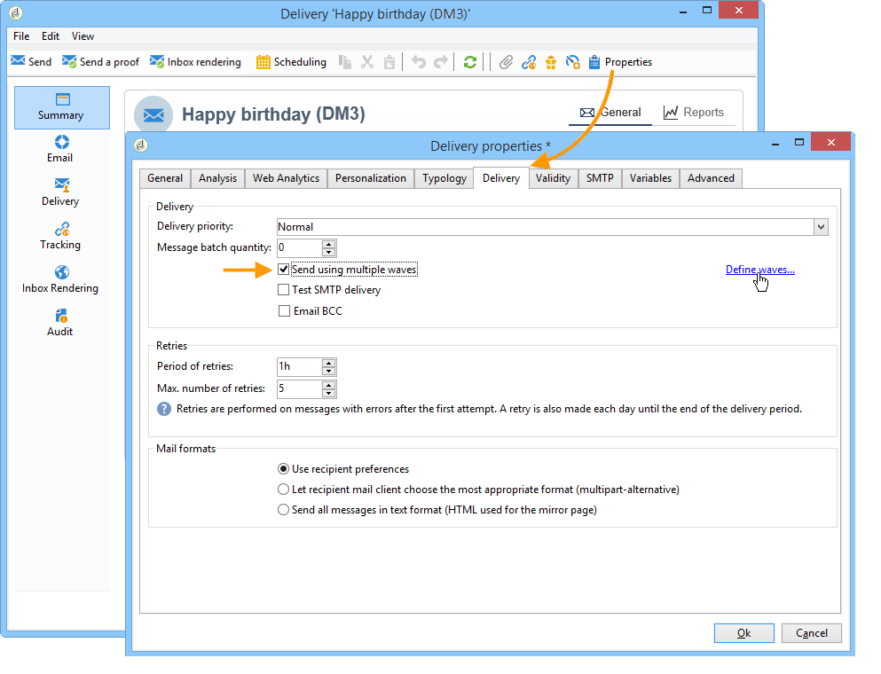

# 配置併發送交貨 {#configuring-and-sending-the-delivery}

>[!NOTE]
>
>只有交貨所有者才能啟動交貨。 為了使其他運算子（或運算子組）能夠啟動交付，您必須在 **[!UICONTROL Delivery start:]** 的子菜單。 有關詳細資訊，請參閱 [此部分](../../campaign/using/marketing-campaign-approval.md#selecting-reviewers)。

## 傳遞附加參數 {#delivery-additiona-parameters}

在發送交貨之前，您可以通過 **[!UICONTROL Delivery]** 頁籤。

* **[!UICONTROL Delivery priority]**:此選項允許您通過說明交貨的優先順序（正常、高或低）來影響交貨的發送順序。 這樣，您就可以優先訂購某些更緊急的送貨服務，而不是其它服務。

* **[!UICONTROL Message batch quantity]**:此選項允許您定義在同一XML傳遞包中分組的消息數。 如果參數設定為0，則消息將自動分組。 包大小由計算定義 `<delivery size>/1024`，每個包最少為8條，最多為256條消息。

   >[!IMPORTANT]
   >
   >複製傳遞時，會重置參數。

* **[!UICONTROL Send using multiple waves]**:使用此選項可以以波浪方式發送您的消息，而不是發送給整個觀眾。 配置批數及其比例。 [了解更多資訊](#sending-using-multiple-waves)。

* **[!UICONTROL Test SMTP delivery]**:使用此選項可test通過SMTP發送。 該傳遞被處理到連接到SMTP伺服器，但未發送：對於每個傳遞的收件人，Campign會連接到SMTP提供程式伺服器，執行SMTP RCPT TO命令，並在SMTP DATA命令之前關閉連接。

   >[!NOTE]
   >
   >* 在中間採購中不建議使用此選項。
   >
   >* 瞭解有關SMTP伺服器配置的詳細資訊，請參閱 [此部分](../../installation/using/configure-delivery-settings.md)。

* **[!UICONTROL Email BCC]**:此選項允許您通過密件抄送將電子郵件儲存在外部系統上，方法是將密件抄送電子郵件地址添加到郵件目標。 如需詳細資訊，請參閱[本章節](sending-messages.md#archiving-emails)。

## 確認交貨 {#confirming-delivery}

配置並準備發送交貨後，請確保已運行交貨分析。

要執行此操作，請按一下 **[!UICONTROL Send]**，選擇所需操作，然後按一下 **[!UICONTROL Analyze]**。 有關此的詳細資訊，請參閱 [啟動分析](steps-validating-the-delivery.md#analyzing-the-delivery)。

完成後，按一下 **[!UICONTROL Confirm delivery]** 啟動消息傳遞。

然後，您可以關閉交貨嚮導並從 **[!UICONTROL Delivery]** 頁籤，可通過此交貨的詳細資訊或交貨清單訪問。

發送消息後，您可以監視和跟蹤交貨。 如需詳細資訊，請參閱下列區段。

* [監視傳遞](about-delivery-monitoring.md)
* [瞭解傳遞失敗](understanding-delivery-failures.md)
* [關於訊息追蹤](about-message-tracking.md)

## 計畫交貨發送 {#scheduling-the-delivery-sending}

為了排程傳遞，管理銷售壓力以及避免過度行銷，您可以推延郵件的傳遞。

1. 按一下 **[!UICONTROL Send]** 按鈕 **[!UICONTROL Postpone delivery]** 的雙曲餘切值。

1. 在 **[!UICONTROL Contact date]** 的子菜單。

1. 然後，您可以開始交貨分析，然後確認交貨發送。 但是，交貨發送將直到在 **[!UICONTROL Contact date]** 的子菜單。

>[!IMPORTANT]
>
>開始分析後，您定義的聯繫日期為固定。 如果修改此日期，則必須重新啟動分析，以便將修改考慮在內。

在交貨清單中，交貨將顯示為 **[!UICONTROL Pending]** 狀態。

還可通過 **[!UICONTROL Scheduling]** 按鈕。

它允許您將交貨推遲到較晚日期或在臨時日曆中保存交貨。

* 的 **[!UICONTROL Schedule delivery (no automatic execution)]** 選項，可以計畫交貨的臨時分析。

   保存此配置後，交貨將更改為 **[!UICONTROL Targeting pending]** 狀態。 分析將在指定日期啟動。

* 的 **[!UICONTROL Schedule delivery (automatic execution on planned date)]** 的子菜單。

   按一下 **[!UICONTROL Send]** 選擇 **[!UICONTROL Postpone delivery]** 然後啟動分析並確認交付。 分析完成後，傳遞目標就緒，消息將在指定日期自動發送。

日期和時間在當前運算子的時區中表示。 的 **[!UICONTROL Time zone]** 位於「聯繫人日期」輸入欄位下方的下拉清單允許您自動將輸入的日期和時間轉換為選定的時區。

例如，如果您計畫在倫敦時間8點自動執行交貨，則該時間將自動轉換為選定的時區：

## 使用多波發送 {#sending-using-multiple-waves}

要平衡負荷，您可以將交貨分為多個批。 配置批數及其相對於整個交貨的比例。

>[!NOTE]
>
>只能定義兩個連續波之間的大小和延遲。 無法配置每個波次的收件人選擇標準。

1. 開啟「交貨屬性」窗口，然後按一下 **[!UICONTROL Delivery]** 頁籤。
1. 選擇 **[!UICONTROL Send using multiple waves]** ，然後按一下 **[!UICONTROL Define waves...]** 的子菜單。

   

1. 要配置波，您可以：

   * 定義每個波的大小。 例如，如果您 **[!UICONTROL 30%]** 在相應欄位中，每個波次將代表傳遞中包含的消息的30%，最後一個波次將代表消息的10%。

      在 **[!UICONTROL Period]** 欄位中，指定兩個連續波的開始之間的延遲。 例如，如果您 **[!UICONTROL 2d]**&#x200B;第一波立即開始，第二波在兩天內開始，第三波在四天內開始，等等。

      

   * 定義發送每個波次的日曆。

      在 **[!UICONTROL Start]** 列中，指定兩個連續波的開始之間的延遲。 在 **[!UICONTROL Size]** 列，輸入固定數字或百分比。

      在下面的示例中，第一波表示傳送中包含的郵件總數的25%，並將立即開始。 接下來的兩波將完成傳送，並設定為以六小時間隔開始。

      
   一個特定的分類規則， **[!UICONTROL Wave scheduling check]**，確保在交貨有效性限制之前計畫最後一次波次。 市場活動類型及其規則，在 **[!UICONTROL Typology]** 的子菜單。 [具有類型的驗證過程](steps-validating-the-delivery.md#validation-process-with-typologies)。

   >[!IMPORTANT]
   >
   >確保最後的波次不超過在 **[!UICONTROL Validity]** 頁籤。 否則，可能無法發送某些消息。
   >
   >在配置最後一波時，還必須留出足夠的重試時間。 請參閱[本節](steps-sending-the-delivery.md#configuring-retries)。

1. 要監視您的發送，請轉到交貨日誌。 請參閱[此頁面](delivery-dashboard.md#delivery-logs-and-history)。

   您可以看到已處理波次中發送的交貨(**[!UICONTROL Sent]** 狀態)和剩餘波次(**[!UICONTROL Pending]** 狀態)。

以下兩個示例是使用多個波的最常見使用案例。

* **在升速過程中**

   當使用新平台發送電子郵件時，Internet服務提供商(ISP)對無法識別的IP地址表示懷疑。 如果突然發送了大量電子郵件， ISP通常會將其標籤為垃圾郵件。

   為避免被標籤為垃圾郵件，您可以逐步增加使用波次發送的卷。 這應確保啟動階段的順利開發，並使您能夠降低無效地址的總體速率。

   為此，請使用 **[!UICONTROL Schedule waves according to a calendar]** 的雙曲餘切值。 例如，將第一波設定為10%，將第二波設定為15%，依此類推。

   

* **涉及呼叫中心的活動**

   在管理電話忠誠度活動時，您的組織處理聯繫訂閱者的呼叫數的能力有限。

   使用電波，您可以將每天的消息數限制為20，即呼叫中心的日處理能力。

   要執行此操作，請選擇 **[!UICONTROL Schedule multiple waves of the same size]** 的雙曲餘切值。 輸入 **[!UICONTROL 20]** 波的大小和 **[!UICONTROL 1d]** 的 **[!UICONTROL Period]** 的子菜單。

   

## 配置重試次數 {#configuring-retries}

由於 **軟** 或 **已忽略** 錯誤會自動重試。 此處介紹了交貨失敗類型和原因 [節](understanding-delivery-failures.md#delivery-failure-types-and-reasons)。

>[!IMPORTANT]
>
>對於托管或混合安裝，如果已升級到 [增強的MTA](sending-with-enhanced-mta.md)，市場活動不再使用傳遞中的重試設定。 軟反彈重試次數和它們之間的時間長度由增強MTA根據郵件電子郵件域返回的反彈響應的類型和嚴重性確定。

對於使用舊版Campaign MTA的內部安裝和托管/混合安裝， **[!UICONTROL Delivery]** 的子菜單。

預設情況下，為交付的第一天安排五次重試，最小間隔為一小時，在一天的24小時內展開。 每天一次重試的程式設定在此之後，直到交貨截止日期(在 **[!UICONTROL Validity]** 頁籤。 請參閱 [定義有效期](#defining-validity-period)。

## 定義有效期 {#defining-validity-period}

在啟動傳送後，可以將消息（以及任何重試）發送到傳送截止時間。 這在交付屬性中指示，通過 **[!UICONTROL Validity]** 頁籤。

* 的 **[!UICONTROL Delivery duration]** 欄位中，您可以輸入全局傳遞重試的限制。 這意味著Adobe Campaign發送從開始日期開始的消息，然後，對於僅返回錯誤的消息，將執行常規的可配置重試，直到達到有效性限制。

   您也可以選擇指定日期。 要執行此操作，請選擇 **[!UICONTROL Explicitly set validity dates]**。 在這種情況下，交貨和有效性限制日期也允許您指定時間。 預設情況下使用當前時間，但可以直接在輸入欄位中修改此時間。

   >[!IMPORTANT]
   >
   >對於托管或混合安裝，如果已升級到 [增強的MTA](sending-with-enhanced-mta.md)，也請參見Wiki頁。 **[!UICONTROL Delivery duration]** 只有在設定為時，才會使用市場活動電子郵件交貨中的設定 **3.5天或以下**。  如果您定義的值超過　3.5　天，則不會考慮該值。

* **資源的有效性限制**:的 **[!UICONTROL Validity limit]** 欄位主要用於上傳的資源，主要用於鏡像頁面和影像。 本頁上的資源在限定時間內有效（以節省磁碟空間）。

   此欄位中的值可以以中列出的單位表示 [此部分](../../platform/using/adobe-campaign-workspace.md#default-units)。
