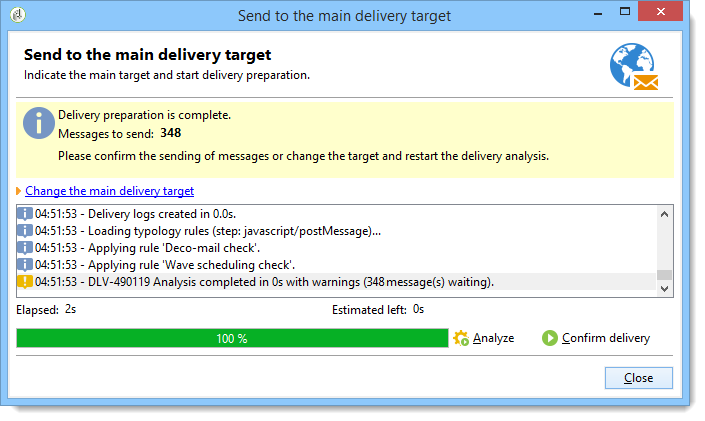

# 驗證傳送 {#validating-the-delivery}

建立並設定傳送後，您必須先驗證傳送，才能將它傳送至主要目標。

操作步驟：

1. **分析傳送**:此步驟可讓您準備要傳送的訊息。 請參閱 [分析傳送](#analyzing-the-delivery)。

   變更核准模式中會詳 [細說明可用的驗證模式](../../delivery/using/steps-validating-the-delivery.md#changing-the-approval-mode)。

1. **傳送校樣**:此步驟可讓您核准內容、URL、個人化欄位等。 請參 [閱傳送證明](../../delivery/using/steps-validating-the-delivery.md#sending-a-proof)[和定義特定證明目標](../../delivery/using/steps-defining-the-target-population.md#defining-a-specific-proof-target)。

>[!CAUTION]
>
>這兩個步驟都必須在對訊息內容進行每次修改後執行。

## 分析傳送 {#analyzing-the-delivery}

分析是計算目標人口並準備交付內容的階段。 完成後，即可傳送。 若要啟動傳送分析，請按一 **[!UICONTROL Send]**&#x200B;下，然後選取 **[!UICONTROL Deliver as soon as possible]**。

按 **[!UICONTROL Analyze]** 鈕可讓您手動啟動分析。 進度列顯示分析的進度。 窗口的下部顯示分析結果。 特殊圖示會顯示警告。

>[!NOTE]
>
>驗證規則在驗證流程中 [與類型一起描述](../../delivery/using/steps-validating-the-delivery.md#validation-process-with-typologies)。

您可以隨時按一下來停止此工作 **[!UICONTROL Stop]**。

分析階段不會傳送任何訊息。 因此，您可以啟動或取消此作業，而不會有風險。

>[!CAUTION]
>
>分析會在分析時凍結交付（或證明）。 任何對遞送的修改（或證據），在適用前必須先進行其他分析。

最後一條日誌消息顯示所有錯誤消息和錯誤數。 特殊圖示顯示錯誤類型：黃色圖示表示非關鍵處理錯誤，紅色圖示表示阻止傳送的嚴重錯誤。

按一 **[!UICONTROL Close]** 下以更正錯誤。 進行更改後，必須重新啟動分析。

在按一下以傳送訊息至指定的目 **[!UICONTROL Confirm delivery]** 標之前，請先檢查分析結果。 確認訊息可讓您啟動傳送。

>[!NOTE]
>
>如果要 **[!UICONTROL Change the main delivery target]** 傳送的訊息數量不符合您的設定，請按一下連結。 這可讓您變更目標人口的定義，並重新開始分析。

傳送參數 **[!UICONTROL Analysis]** 標籤可讓您定義分析階段中訊息準備的相關資訊集。

此標籤可存取下列選項：

* **[!UICONTROL Label and code of the delivery]** :在傳送分析階段，會使用畫面中此區段的相關選項來計算這些欄位的值。 該 **[!UICONTROL Calculate the execution folder during the delivery analysis]** 欄位會計算在分析階段中將包含此傳送操作的資料夾的名稱。
* **[!UICONTROL Approval mode]** :此欄位可讓您選取傳送核准的類型。 在驗證過程中，會使用 [類型來顯示批准模式](../../delivery/using/steps-validating-the-delivery.md#validation-process-with-typologies)。
* **[!UICONTROL Prepare the personalization data with a workflow]** :此選項可讓您在自動工作流程中準備傳送時所包含的個人化資料。 它可以在處理大量資料時，特別是當個人化資料來自外部表格（透過FDA）時，大幅改善傳送分析效能。 請參閱「 [存取外部資料庫(FDA)](../../platform/using/accessing-an-external-database.md#optimizing-email-personalization-with-external-data) 」一節。
* **[!UICONTROL Start job in a detached process]** :此選項可讓您在個別流程中啟動傳送分析。 分析功能依預設會使用Adobe Campaign應用程式伺服器程式(web nlserver)。 選取此選項，即使在應用程式伺服器發生故障時，您也能確保分析完成。
* **[!UICONTROL Log SQL queries generated during the analysis in the journal]** :此選項在分析階段將SQL查詢日誌添加到傳送日誌。
* **[!UICONTROL Ignore personalization scripts during sending]** :此選項可讓您略過HTML內容中的JavaScript指令解譯。 它們會如同傳送的內容一樣顯示。 這些指令是隨 **&lt;%=** tag引入的。

### 設定分析優先順序 {#analysis-priority-}

當傳送是促銷活動的一部分時，標籤 **[!UICONTROL Advanced]** 會提供其他選項。 這可讓您組織相同促銷活動中傳送的處理順序。

在傳送前，會分析每個傳送。 分析持續時間取決於傳送擷取檔案。 檔案大小愈大，分析所需時間愈長，就會等候下列傳送。

這些選項可讓 **[!UICONTROL Message preparation by the scheduler]** 您在促銷活動工作流程中排定傳送分析的優先順序。

如果傳送量過大，最好指定低優先順序給它，以免拖慢其他工作流程傳送的分析速度。

>[!NOTE]
>
>為確保較大的傳送分析不會拖慢工作流程的進度，您可以透過滴答作業來排程執行 **[!UICONTROL Schedule execution for a time of low activity]**。

## 傳送證明 {#sending-a-proof}

若要檢測訊息設定中可能出現的錯誤，Adobe 強烈建議您設定傳遞驗證階段。要經常性地透過傳送驗證訊息測試收件者，確保核准內容。每次進行變更時都必須傳送驗證訊息，以核准內容。

>[!NOTE]
>
>* 變更核准模式中會詳 [細說明可用的驗證模式](../../delivery/using/steps-validating-the-delivery.md#changing-the-approval-mode)。
>* 定義特定校對目標時，將說 [明校對目標的配置](../../delivery/using/steps-defining-the-target-population.md#defining-a-specific-proof-target)。
>

若要傳送證明，請遵循下列步驟：

1. 請確定已按照定義特定校對目標中的說 [明配置了校對目標](../../delivery/using/steps-defining-the-target-population.md#defining-a-specific-proof-target)。
1. 按一 **[!UICONTROL Send a proof]** 下傳送精靈頂端列上的。

   

1. 啟動消息分析。 請參閱 [分析傳送](../../delivery/using/steps-validating-the-delivery.md#analyzing-the-delivery)。
1. 您現在可以傳送傳送(請參閱 [傳送傳送](../../delivery/using/steps-sending-the-delivery.md))。

   傳送後，證明會出現在傳送清單中，並自動建立及編號。 如果您想要存取其內容和屬性，則可加以編輯。 For more on this, refer to this [page](../../delivery/using/monitoring-a-delivery.md#delivery-dashboard).

   

   >[!NOTE]
   >
   >如果為傳送（HTML和文字）建立了數種格式，您可以選擇要傳送至視窗下方校樣收件者的訊息格式。

   

您可能希望修改傳送內容，因為驗證群組收到證明時所做的任何註解。 進行變更後，您必須重新啟動分析，然後傳送其他證明。 每個新校樣都會編號並記錄在傳送日誌中。

分析傳送後，您就可以檢視透過記錄檔（標籤）的 **[!UICONTROL Proofs]** 子標籤所傳送的各種校&#x200B;**[!UICONTROL Audit]** 樣。

您必須視需要傳送多份校樣，直到傳送內容完成為止。 之後，您可將傳送內容傳送至主要目標，並關閉驗證週期。

傳送 **[!UICONTROL Advanced]** 屬性的標籤可讓您定義校對的屬性。 如有需要，您可以覆寫收件者排除規則。

可以使用以下選項：

* 第一個選項可讓您將校對加倍。
* 以下兩個選項都可讓您將黑名單收件人和地址保留在隔離中。 請參閱自訂排除設定中主要目標的這些選 [項說明](../../delivery/using/steps-defining-the-target-population.md#customizing-exclusion-settings)。 與遞送的目標（預設會排除這些位址）不同，它們預設會保留在證明的目標。
* 選 **[!UICONTROL Keep the delivery code for the proof]** 項可讓您提供與傳送相關之傳送所定義之傳送代碼相同的傳送代碼。 此程式碼是在傳送精靈的第一個步驟中指定。
* 依預設，證明的主旨是前置詞「證明#」，其中#是證明的編號。 您可以在欄位中變更此首 **[!UICONTROL Label prefix]** 碼。

## 具有類型的驗證流程 {#validation-process-with-typologies}

在傳送任何訊息之前，您應先分析促銷活動以核准其內容和設定。 分析階段期間套用的檢查規則是以類型學 **定義**。 依預設，對於電子郵件，分析涵蓋下列幾點：

* 批准對象
* 核准URL和影像
* 核准URL標籤
* 核准取消訂閱連結
* 檢查校樣大小
* 檢查有效期
* 檢查波的調度

在傳送參數的標籤中選取要套用至每個傳送 **[!UICONTROL Typologies]** 的類型學。

您可以透過節點檢視和編輯核准規則、其內容、執行順序及其完整說 **[!UICONTROL Administration > Campaign execution > Typology management > Typology rules]** 明。

您可以從此節點建立新規則並定義新類型。 但是，這些工作會保留給熟悉JavaScript的專業使用者。

若要編輯目前的排版，請按一 **[!UICONTROL Edit link]** 下欄位右側的圖 **[!UICONTROL Typology]** 示。

此標 **[!UICONTROL Rule]** 簽會列出要套用的類型學規則。 選取規則，然後按一下圖 **[!UICONTROL Detail...]** 示以檢視其設定：

>[!NOTE]
>
>**[!UICONTROL Arbitration]** 類型類型在銷售壓力管理的框架內使用。 如需詳細資訊，請參閱[本小節](../../campaign/using/about-marketing-resource-management.md)。

## 變更核准模式 {#changing-the-approval-mode}

傳送 **[!UICONTROL Analysis]** 屬性的標籤可讓您選取驗證模式。 如果分析期間產生警告（例如，如果某些字元在傳送的主旨中突出顯示等），您可以設定傳送來定義是否仍應執行。 預設情況下，用戶必須在分析階段結束時確認消息的發送：這是手動 **驗證** 。

從適當欄位的下拉式清單中選取另一個核准模式。

可使用下列核准模式：

* **[!UICONTROL Manual]**:在分析階段結束時，使用者必須確認傳送才能開始傳送。 若要這麼做，請按一下 **[!UICONTROL Start]** 按鈕以啟動傳送。
* **[!UICONTROL Semi-automatic]**:如果分析階段未產生警告訊息，則自動開始傳送。
* **[!UICONTROL Automatic]**:無論其結果如何，在分析階段結束時自動開始發送。
