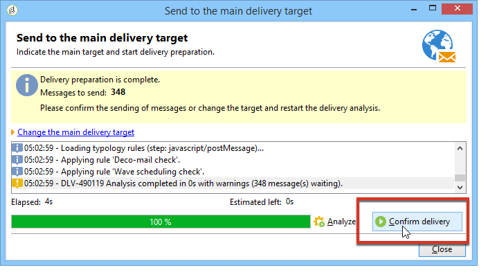
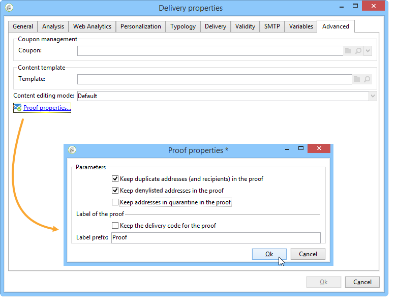

# 驗證傳遞 {#validating-the-delivery}

建立並設定傳送後，您必須先驗證傳送內容，才能將其傳送至主要目標。

操作步驟：

1. **分析傳遞**：此步驟可讓您準備要傳遞的訊息。 [了解更多](#analyzing-the-delivery)。

   分析期間套用的規則會顯示在[此區段](#validation-process-with-typologies)中。 可用的驗證模式在[變更核准模式](#changing-the-approval-mode)區段中詳細說明。

1. **傳送校樣**：此步驟可讓您控制內容、URL、個人化等。 深入瞭解[傳送校樣](steps-validating-the-delivery.md#sending-a-proof)和[定義特定校樣目標](steps-defining-the-target-population.md#defining-a-specific-proof-target)。

>[!IMPORTANT]
>
>每次修改訊息內容後，都必須執行上述兩個步驟。

## 分析傳遞 {#analyzing-the-delivery}

分析是計算目標母體以及準備傳遞內容的階段。 完成傳遞後，便可傳送內容。

### 啟動分析 {#launching-the-analysis}

1. 若要啟動傳遞分析，請按一下&#x200B;**[!UICONTROL Send]**。
1. 選取 **[!UICONTROL Deliver as soon as possible]**。

   

1. 按一下&#x200B;**[!UICONTROL Analyze]**&#x200B;以手動啟動分析。

   進度列會顯示分析的進度。

   

   >[!NOTE]
   >
   >分析期間使用的驗證規則在[具有型別](steps-validating-the-delivery.md#validation-process-with-typologies)的驗證程式部分中有說明。

1. 您可以隨時按一下&#x200B;**[!UICONTROL Stop]**&#x200B;來停止分析。

   

   在準備階段期間不會傳送任何訊息。 因此，您可以開始或取消分析而不會有風險。

   >[!IMPORTANT]
   >
   >執行時，分析會凍結傳送（或證明）。 對傳送（或證明）所做的任何變更都必須先進行其他分析，才能適用。

1. 等候分析完成。

   分析完成後，視窗的上半部會指出傳遞準備是否已完成或是否發生任何錯誤。 會列出所有驗證步驟、警告和錯誤。彩色圖示顯示訊息類型：
   * 藍色圖示表示資訊訊息。
   * 黃色圖示表示非嚴重的處理錯誤。
   * 紅色圖示表示會阻止傳送傳遞的嚴重錯誤。

   

1. 按一下&#x200B;**[!UICONTROL Close]**&#x200B;以更正錯誤（如果有的話）。

1. 進行變更後，按一下&#x200B;**[!UICONTROL Analyze]**&#x200B;重新啟動分析。

檢查分析結果後，您可以按一下&#x200B;**[!UICONTROL Confirm delivery]**&#x200B;將訊息傳送至指定的目標。 確認訊息可讓您啟動傳送。

>[!NOTE]
>
>如果要傳送的訊息數目不符合您的設定，請按一下&#x200B;**[!UICONTROL Change the main delivery target]**&#x200B;連結。 這可讓您變更目標母體的定義，並重新啟動分析。

### 分析設定 {#analysis-parameters}

傳遞屬性的&#x200B;**[!UICONTROL Analysis]**&#x200B;索引標籤可讓您定義有關分析階段準備訊息的一組資訊。

此索引標籤提供下列選項的存取權：

* **[!UICONTROL Label and code of the delivery]** ：此區段中的選項用於在傳遞分析階段期間計算這些欄位的值。 **[!UICONTROL Compute the execution folder during the delivery analysis]**&#x200B;欄位會在分析階段期間計算將包含此傳遞動作的資料夾名稱。
* **[!UICONTROL Approval mode]** ：此欄位可讓您定義分析完成時的手動或自動傳遞。 驗證模式顯示在[變更核准模式](#changing-the-approval-mode)區段中。
* **[!UICONTROL Prepare the delivery parts in the database]** ：此選項可讓您改善傳遞分析效能。 如需詳細資訊，請參閱[本節](#improving-delivery-analysis)。
* **[!UICONTROL Prepare the personalization data with a workflow]** ：此選項可讓您以自動工作流程準備傳遞中包含的個人化資料，這可讓您大幅提升執行個人化的效能。 如需詳細資訊，請參閱[最佳化個人化](personalization-fields.md#optimizing-personalization)。
* **[!UICONTROL Start job in a detached process]** ：此選項可讓您以個別程式啟動傳遞分析。 依預設，分析函式會使用Adobe Campaign應用程式伺服器處理序(web nlserver)。 選取此選項，即可確保即使應用程式伺服器發生故障，也能完成分析。
* **[!UICONTROL Log SQL queries generated during the analysis in the journal]** ：此選項會在分析階段將SQL查詢記錄檔新增至傳遞日誌。
* **[!UICONTROL Ignore personalization scripts during sending]** ：此選項可讓您略過HTML內容中JavaScript指示詞的解譯。 它們將顯示為已傳送內容中的原樣。 這些指示詞是以&#x200B;**&lt;%=**&#x200B;標籤匯入的。

### 改善傳遞分析效能 {#improving-delivery-analysis}

若要加速傳遞準備，您可以在啟動分析之前核取&#x200B;**[!UICONTROL Prepare the delivery parts in the database]**&#x200B;選項。

啟用此選項時，會直接在資料庫中執行傳遞準備，大幅加快分析。

目前，此選項只有在符合下列條件時才可用：

* 傳遞必須是電子郵件。 目前不支援其他管道。
* 您不得使用中間來源或外部路由，只能使用大量傳遞路由型別。 您可以檢查&#x200B;**[!UICONTROL Delivery properties]**&#x200B;之&#x200B;**[!UICONTROL General]**&#x200B;索引標籤中使用的路由。
* 您無法鎖定來自外部檔案的母體。 若為單一傳遞，請從&#x200B;**[!UICONTROL Email parameters]**&#x200B;按一下&#x200B;**[!UICONTROL To]**&#x200B;連結，並檢查是否已選取&#x200B;**[!UICONTROL Defined in the database]**&#x200B;選項。 針對工作流程中使用的傳遞，檢查收件者在&#x200B;**[!UICONTROL Delivery]**&#x200B;索引標籤中是否為&#x200B;**[!UICONTROL Specified by the inbound event(s)]**。
* 您必須使用PostgreSQL資料庫。

### 設定分析優先順序 {#analysis-priority-}

當傳遞為行銷活動的一部分時，**[!UICONTROL Advanced]**&#x200B;索引標籤會提供其他選項。 這可讓您在相同行銷活動中組織傳送的處理順序。

傳送前，會分析每個傳遞。 分析持續時間取決於傳遞擷取檔案。 檔案大小愈大，分析所需的時間愈長，下列傳送作業就會等待一段時間。

**[!UICONTROL Message preparation by the scheduler]**&#x200B;的選項可讓您在行銷活動工作流程中排定傳遞分析的優先順序。

如果傳送過大，最好將低優先順序指派給它，以避免減慢分析其他工作流程傳送的速度。

>[!NOTE]
>
>若要確保較大的傳遞分析不會減慢工作流程的進度，您可以按一下&#x200B;**[!UICONTROL Schedule execution for a time of low activity]**&#x200B;以排程其執行。

## 傳送證明 {#sending-a-proof}

若要檢測訊息設定中可能出現的錯誤，Adobe 強烈建議您配置傳遞驗證階段。要經常性地透過傳送驗證訊息測試收件者，確保核准內容。每次進行變更時都必須傳送驗證訊息，以核准內容。

>[!NOTE]
>
>可用的驗證模式在[變更核准模式](steps-validating-the-delivery.md#changing-the-approval-mode)中詳細說明。

若要傳送證明，請遵循下列步驟：

1. 確定校訂目標已設定為[定義特定校訂目標](steps-defining-the-target-population.md#defining-a-specific-proof-target)中所述的設定。

1. 按一下傳遞助理頂端列上的&#x200B;**[!UICONTROL Send a proof]**。

   

1. 開始訊息分析。 請參閱[分析傳遞](steps-validating-the-delivery.md#analyzing-the-delivery)。
1. 您現在可以傳送傳遞（請參閱[傳送傳遞](steps-sending-the-delivery.md)）。

   傳送傳遞後，證明會出現在傳遞清單中，並自動建立及編號。 如果您想要存取其內容和屬性，可以編輯它。 如需關於此項目的詳細資訊，請參閱此[頁面](about-delivery-monitoring.md)。

   

   >[!NOTE]
   >
   >如果為傳遞建立了幾種格式(HTML和文字)，您可以在視窗的下半部分選擇要傳送給校樣收件者的訊息格式。

   

收到證明的驗證群組有任何註解後，您可能會想要修改傳送的內容。 進行變更後，您必須重新啟動分析，然後傳送另一個校樣。 每個新校樣都進行了編號並記錄到傳送日誌中。

分析傳遞後，您可以檢視透過記錄檔的&#x200B;**[!UICONTROL Proofs]**&#x200B;子索引標籤（**[!UICONTROL Audit]**&#x200B;索引標籤）傳送的各種校樣。

您必須視需要傳送多份校樣，直到完成傳送內容為止。 之後，您可以將傳遞傳送至主要目標並關閉驗證週期。

傳遞屬性的&#x200B;**[!UICONTROL Advanced]**&#x200B;索引標籤可讓您定義證明的屬性。 如有需要，您可以覆寫收件者排除規則。

可以使用以下選項：

* 第一個選項可讓您保留校樣雙面。
* 以下兩個選項可讓您保留已加入封鎖清單的收件者和處於隔離狀態的地址。 請在[自訂排除設定](steps-defining-the-target-population.md#customizing-exclusion-settings)中檢視主要目標的這些選項說明。 不像預設會排除這些地址的傳送目標，這些地址會預設為校樣目標保留。
* **[!UICONTROL Keep the delivery code for the proof]**&#x200B;選項可讓您為證明提供的傳遞代碼，與為其相關傳遞定義的傳遞代碼相同。 此程式碼會在傳遞助理的第一個步驟中指定。
* 依預設，校訂的主題前面會加上「Proof #」，其中#是校訂的編號。 您可以在&#x200B;**[!UICONTROL Label prefix]**&#x200B;欄位中變更此首碼。

## 包含型別的驗證程式 {#validation-process-with-typologies}

在傳送任何訊息之前，您應該分析行銷活動以核准其內容和設定。 在分析階段期間套用的檢查規則已在&#x200B;**型別**&#x200B;中定義。 針對電子郵件，預設分析會涵蓋下列幾點：

* 核准物件
* 核准URL和影像
* 核准URL標籤
* 核准取消訂閱連結
* 檢查校樣的大小
* 檢查有效期
* 檢查波段排程

在傳遞引數的&#x200B;**[!UICONTROL Typologies]**&#x200B;索引標籤中選取要套用至每個傳遞的型別。

您可以透過&#x200B;**[!UICONTROL Administration > Campaign execution > Typology management > Typology rules]**&#x200B;節點檢視及編輯核准規則、其內容、其執行順序及其完整說明。

您可以從此節點建立新規則及定義新型別。 不過，這些工作會保留給熟悉JavaScript的專家使用者。

如需型別規則的詳細資訊，請參閱[此頁面](../../campaign-opt/using/about-campaign-typologies.md)。

若要編輯目前的型別，請按一下&#x200B;**[!UICONTROL Typology]**&#x200B;欄位右側的&#x200B;**[!UICONTROL Edit link]**&#x200B;圖示。

**[!UICONTROL Rule]**&#x200B;索引標籤提供要套用的型別規則清單。 選取規則並按一下&#x200B;**[!UICONTROL Detail...]**&#x200B;圖示以檢視其設定：

>[!NOTE]
>
>**[!UICONTROL Arbitration]**&#x200B;型別型別用於銷售壓力管理的架構中。 如需詳細資訊，請參閱[本章節](../../mrm/using/about-marketing-resource-management.md)。

## 變更核准模式 {#changing-the-approval-mode}

傳遞屬性的&#x200B;**[!UICONTROL Analysis]**&#x200B;標籤可讓您選取驗證模式。 如果在分析期間產生警告（例如，如果傳送主題中的某些字元強調等），您可以設定傳送以定義是否仍應執行。 依預設，使用者必須在分析階段結束時確認傳送訊息：這是&#x200B;**手動**&#x200B;驗證。

從適當欄位的下拉式清單中選取其他核准模式。

可使用下列核准模式：

* **[!UICONTROL Manual]**：在分析階段結束時，使用者必須確認傳遞才能開始傳送。 若要這麼做，請按一下&#x200B;**[!UICONTROL Start]**&#x200B;按鈕以啟動傳遞。
* **[!UICONTROL Semi-automatic]**：如果分析階段未產生任何警告訊息，傳送會自動開始。
* **[!UICONTROL Automatic]**：傳送會在分析階段結束時自動開始，無論結果為何。
