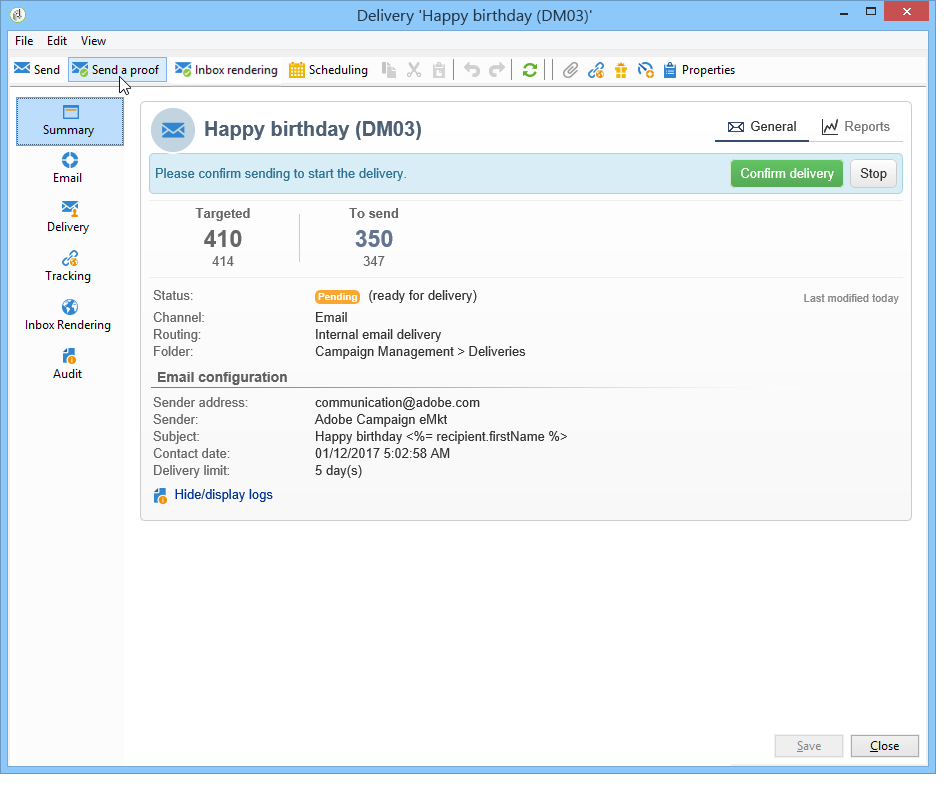

# 驗證傳送 {#validating-the-delivery}

建立並設定傳送後，您必須先驗證傳送，才能將它傳送至主要目標。

操作步驟：

1. **分析傳送**: 此步驟可讓您準備要傳送的訊息。 請參閱 [分析傳送](#analyzing-the-delivery)。

   分析期間應用的規則會在「驗證」流程中 [與類型一起顯示](#validation-process-with-typologies) 。 可用的驗證模式在「更改批准模 [式」部分中有詳細說明](#changing-the-approval-mode) 。

1. **傳送校樣**: 此步驟可讓您核准內容、URL、個人化欄位等。 請參 [閱傳送證明](../../delivery/using/steps-validating-the-delivery.md#sending-a-proof)[和定義特定證明目標](../../delivery/using/steps-defining-the-target-population.md#defining-a-specific-proof-target)。

>[!IMPORTANT]
>
>這兩個步驟都必須在對訊息內容進行每次修改後執行。

## 分析傳送 {#analyzing-the-delivery}

分析是計算目標人口並準備交付內容的階段。 完成後，即可傳送。

### 啟動分析 {#launching-the-analysis}

1. 若要啟動傳送分析，請按一下 **[!UICONTROL Send]**。
1. Select **[!UICONTROL Deliver as soon as possible]**.

   

1. 按一 **[!UICONTROL Analyze]** 下以手動啟動分析。

   進度列顯示分析的進度。

   

   >[!NOTE]
   >
   >分析期間使用的驗證規則在「含類型的驗 [證」流程中有說明](../../delivery/using/steps-validating-the-delivery.md#validation-process-with-typologies) 。

1. 您可以隨時按一下以停止分析 **[!UICONTROL Stop]**。

   

   在準備階段不會傳送任何訊息。 因此，您可以啟動或取消分析，而不會有風險。

   >[!IMPORTANT]
   >
   >執行時，分析會凍結傳送（或證明）。 交付（或證明）的任何變更必須先進行其他分析，才能生效。

1. 等待分析完成。

   分析完成後，窗口的上部區域將指示交貨準備是否完成或是否發生任何錯誤。 列出所有驗證步驟、警告和錯誤。 彩色表徵圖顯示消息類型：
   * 藍色圖示表示資訊性訊息。
   * 黃色表徵圖表示非嚴重處理錯誤。
   * 紅色圖示表示無法傳送傳送的重大錯誤。
   

1. 按一 **[!UICONTROL Close]** 下以更正錯誤（如果有）。

1. 進行更改後，按一下重新啟動分析 **[!UICONTROL Analyze]**。

在檢查分析結果後，您可以按一下，將 **[!UICONTROL Confirm delivery]** 訊息傳送至指定的目標。 確認訊息可讓您啟動傳送。

>[!NOTE]
>
>如果要 **[!UICONTROL Change the main delivery target]** 傳送的訊息數量不符合您的設定，請按一下連結。 這可讓您變更目標人口的定義，並重新開始分析。

### 分析參數 {#analysis-parameters}

傳送 **[!UICONTROL Analysis]** 屬性的標籤可讓您定義分析階段中訊息準備的相關資訊集。

此標籤可存取下列選項：

* **[!UICONTROL Label and code of the delivery]** : 本節中的選項用於計算傳送分析階段中這些欄位的值。 該 **[!UICONTROL Compute the execution folder during the delivery analysis]** 欄位會計算在分析階段中將包含此傳送操作的資料夾的名稱。
* **[!UICONTROL Approval mode]** : 此欄位可讓您定義分析完成後的人工或自動傳送。 驗證模式顯示在「更改 [批准模式」部分](#changing-the-approval-mode) 。
* **[!UICONTROL Prepare the delivery parts in the database]** : 此選項可讓您改善傳送分析效能。 For more on this, see [this section](#improving-delivery-analysis).
* **[!UICONTROL Prepare the personalization data with a workflow]** : 此選項可讓您在自動工作流程中準備傳送時包含的個人化資料，如此可大幅提升執行個人化的效能。 如需詳細資訊，請參閱最佳 [化個人化](../../delivery/using/personalization-fields.md#optimizing-personalization)。
* **[!UICONTROL Start job in a detached process]** : 此選項可讓您在個別程式中啟動傳送分析。 分析功能依預設會使用Adobe Campaign應用程式伺服器程式(web nlserver)。 選取此選項，即使在應用程式伺服器發生故障時，您也能確保分析完成。
* **[!UICONTROL Log SQL queries generated during the analysis in the journal]** : 此選項在分析階段將SQL查詢日誌添加到傳送日誌。
* **[!UICONTROL Ignore personalization scripts during sending]** : 此選項可讓您略過HTML內容中的JavaScript指令解譯。 它們會如同傳送的內容一樣顯示。 這些指令是隨 **&lt;%=** tag引入的。

### 改善傳送分析效能 {#improving-delivery-analysis}

若要加速傳送準備，您可以在啟動分析 **[!UICONTROL Prepare the delivery parts in the database]** 前先勾選選項。

啟用此選項後，將直接在資料庫內執行交付準備，這樣可以顯著加快分析。

目前，此選項僅在符合下列條件時才可用：
* 傳送內容必須是電子郵件。 目前不支援其他頻道。
* 您不得使用中間來源補充或外部工藝路線，只能使用批量交貨工藝路線類型。 您可以檢查在的標籤中使 **[!UICONTROL General]** 用的工藝路線 **[!UICONTROL Delivery properties]**。
* 您無法定位來自外部檔案的人口。 若是單一傳送，請按一 **[!UICONTROL To]** 下連結並 **[!UICONTROL Email parameters]** 檢查選 **[!UICONTROL Defined in the database]** 取的選項。 對於工作流中使用的傳送，請檢查收件者是否在 **[!UICONTROL Specified by the inbound event(s)]** 標籤 **[!UICONTROL Delivery]** 中。
* 您必須使用PostgreSQL資料庫。

### 設定分析優先順序 {#analysis-priority-}

當傳送是促銷活動的一部分時，標籤 **[!UICONTROL Advanced]** 會提供其他選項。 這可讓您組織相同促銷活動中傳送的處理順序。

在傳送前，會分析每個傳送。 分析持續時間取決於傳送擷取檔案。 檔案大小愈大，分析所需時間愈長，就會等候下列傳送。

這些選項可讓 **[!UICONTROL Message preparation by the scheduler]** 您在促銷活動工作流程中排定傳送分析的優先順序。

如果傳送量過大，最好指定低優先順序給它，以免拖慢其他工作流程傳送的分析速度。

>[!NOTE]
>
>為確保較大的傳送分析不會拖慢工作流程的進度，您可以透過滴答作業來排程執行 **[!UICONTROL Schedule execution for a time of low activity]**。

## 傳送證明 {#sending-a-proof}

若要檢測訊息設定中可能出現的錯誤，Adobe 強烈建議您設定傳遞驗證階段。要經常性地透過傳送驗證訊息測試收件者，確保核准內容。每次進行變更時都必須傳送驗證訊息，以核准內容。

>[!NOTE]
>
>* 變更核准模式中會詳 [細說明可用的驗證模式](../../delivery/using/steps-validating-the-delivery.md#changing-the-approval-mode)。
>* 定義特定校對目標時，將說 [明校對目標的配置](../../delivery/using/steps-defining-the-target-population.md#defining-a-specific-proof-target)。
>

若要傳送證明，請遵循下列步驟：

1. 請確定已按照定義特定校對目標中的說 [明配置了校對目標](../../delivery/using/steps-defining-the-target-population.md#defining-a-specific-proof-target)。
1. 按一 **[!UICONTROL Send a proof]** 下傳送精靈頂端列上的。

   

1. 啟動消息分析。 請參閱 [分析傳送](../../delivery/using/steps-validating-the-delivery.md#analyzing-the-delivery)。
1. 您現在可以傳送傳送(請參閱 [傳送傳送](../../delivery/using/steps-sending-the-delivery.md))。

   傳送後，證明會出現在傳送清單中，並自動建立及編號。 如果您想要存取其內容和屬性，則可加以編輯。 For more on this, refer to this [page](../../delivery/using/monitoring-a-delivery.md#delivery-dashboard).

   

   >[!NOTE]
   >
   >如果為傳送（HTML和文字）建立了數種格式，您可以選擇要傳送至視窗下方校樣收件者的訊息格式。

   

您可能希望修改傳送內容，因為驗證群組收到證明時所做的任何註解。 進行變更後，您必須重新啟動分析，然後傳送其他證明。 每個新校樣都會編號並記錄在傳送日誌中。

分析傳送後，您就可以檢視透過記錄檔（標籤）的 **[!UICONTROL Proofs]** 子標籤所傳送的各種校&#x200B;**[!UICONTROL Audit]** 樣。

您必須視需要傳送多份校樣，直到傳送內容完成為止。 之後，您可將傳送內容傳送至主要目標，並關閉驗證週期。

傳送 **[!UICONTROL Advanced]** 屬性的標籤可讓您定義校對的屬性。 如有需要，您可以覆寫收件者排除規則。

可以使用以下選項：

* 第一個選項可讓您將校對加倍。
* 以下兩個選項都可讓您將黑名單收件人和地址保留在隔離中。 請參閱自訂排除設定中主要目標的這些選 [項說明](../../delivery/using/steps-defining-the-target-population.md#customizing-exclusion-settings)。 與遞送的目標（預設會排除這些位址）不同，它們預設會保留在證明的目標。
* 選 **[!UICONTROL Keep the delivery code for the proof]** 項可讓您提供與傳送相關之傳送所定義之傳送代碼相同的傳送代碼。 此程式碼是在傳送精靈的第一個步驟中指定。
* 依預設，證明的主旨是前置詞「證明#」，其中#是證明的編號。 您可以在欄位中變更此首 **[!UICONTROL Label prefix]** 碼。

## 具有類型的驗證流程 {#validation-process-with-typologies}

在傳送任何訊息之前，您應先分析促銷活動以核准其內容和設定。 分析階段期間套用的檢查規則是以類型學 **定義**。 依預設，對於電子郵件，分析涵蓋下列幾點：

* 批准對象
* 核准URL和影像
* 核准URL標籤
* 核准取消訂閱連結
* 檢查校樣大小
* 檢查有效期
* 檢查波的調度

在傳送參數的標籤中選取要套用至每個傳送 **[!UICONTROL Typologies]** 的類型學。

您可以透過節點檢視和編輯核准規則、其內容、執行順序及其完整說 **[!UICONTROL Administration > Campaign execution > Typology management > Typology rules]** 明。

您可以從此節點建立新規則並定義新類型。 但是，這些工作會保留給熟悉JavaScript的專業使用者。

如需有關類型規則的詳細資訊，請參 [閱關於促銷活動類型](../../campaign/using/about-campaign-typologies.md)。

若要編輯目前的排版，請按一 **[!UICONTROL Edit link]** 下欄位右側的圖 **[!UICONTROL Typology]** 示。

此標 **[!UICONTROL Rule]** 簽會列出要套用的類型學規則。 選取規則，然後按一下圖 **[!UICONTROL Detail...]** 示以檢視其設定：

>[!NOTE]
>
>**[!UICONTROL Arbitration]** 類型類型在銷售壓力管理的框架內使用。 如需詳細資訊，請參閱[本章節](../../campaign/using/about-marketing-resource-management.md)。

## 變更核准模式 {#changing-the-approval-mode}

傳送 **[!UICONTROL Analysis]** 屬性的標籤可讓您選取驗證模式。 如果分析期間產生警告（例如，如果某些字元在傳送的主旨中突出顯示等），您可以設定傳送來定義是否仍應執行。 預設情況下，用戶必須在分析階段結束時確認消息的發送： 這是手動 **驗證** 。

從適當欄位的下拉式清單中選取另一個核准模式。

可使用下列核准模式：

* **[!UICONTROL Manual]**: 在分析階段結束時，使用者必須確認傳送才能開始傳送。 若要這麼做，請按一下 **[!UICONTROL Start]** 按鈕以啟動傳送。
* **[!UICONTROL Semi-automatic]**: 如果分析階段未產生警告訊息，則自動開始傳送。
* **[!UICONTROL Automatic]**: 無論其結果如何，在分析階段結束時自動開始發送。
