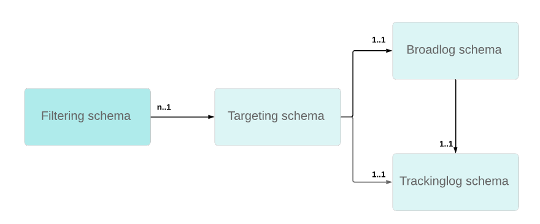

# 追蹤疑難排解 {#tracking-troubleshooting}


在本節中，您將在Adobe Campaign Classic找到與跟蹤配置和實施相關的常見問題。

## 跟蹤工作流失敗 {#tracking-workflow-failing}

我的跟蹤工作流失敗，如何檢測跟蹤檔案中的損壞行？

>[!NOTE]
>
>僅適用於Windows

損壞的跟蹤日誌檔案……/nl6/var&lt;instance_name>/redir/log/0x0000日誌可以停止跟蹤工作流。 要輕鬆檢測損壞的行並刪除它們以繼續跟蹤工作流，可使用以下命令。

### 我知道損壞的行在哪個檔案

在這種情況下，在0x000000000000000A0000.log檔案中可以找到損壞的行，但同一進程可以應用到一組檔案中 — 一個一個地。

```
$ cd {install directory}/var/{instance name}/redir/log
$ cat 0x00000000000A0000.log | sed -nE '/^[[:alnum:]]{2}x[[:alnum:]]*\t[0-9T:\.-]*\t[0-9a-fA-F]*\t[0-9a-fA-F]*\t[0-9a-fA-F]*\t[[:alnum:]]*\t[[:alnum:]-]*\t[[:print:]]*\t[[:print:]]*\t[[:print:]]*\t([0-9a-fA-F\.:]*|[0-9a-fA-F\.:]*\t[[:print:]]*|[0-9a-fA-F\.:]*,[[:print:]]*)$/!p'
```

然後，您可以停止跟蹤工作流，刪除損壞的行並重新啟動工作流。

### 我現在不知道損壞的行在哪個檔案

1. 使用以下命令行簽入所有跟蹤檔案。

   ```
   $ cd {install directory}/var/{instance name}/redir/log
   $ cat *.log | sed -nE '/^[[:alnum:]]{2}x[[:alnum:]]*\t[0-9T:\.-]*\t[0-9a-fA-F]*\t[0-9a-fA-F]*\t[0-9a-fA-F]*\t[[:alnum:]]*\t[[:alnum:]-]*\t[[:print:]]*\t[[:print:]]*\t[[:print:]]*\t([0-9a-fA-F\.:]*|[0-9a-fA-F\.:]*\t[[:print:]]*|[0-9a-fA-F\.:]*,[[:print:]]*)$/!p'
   ```

1. 命令列出所有損壞的行。 例如：

   ```
   50x000000000FD7EC86 2017-06-24T21:00:50.96 1f506d71 1aeab4b6 1af77020 0 e5155671-4ab7-4ce4-a763-3b82dda6d881 h
   Mozilla/5.0 (Macintosh; Intel Mac OS X 10_12_4) AppleWebKit/537.36 (KHTML, like Gecko) Chrome/55.0.2883.95 Safari/537.36 52.46.20.64
   ```

   >[!NOTE]
   >
   >已在用戶代理之前添加回車符，以便能夠更好地讀取，且不反映有效的呈現。

1. 運行grep命令以查找相應的檔案。

```
$ grep -Rn <Log Id>
# for example:
$ grep -Rn 50x000000000FD7EC86
```

1. 查找具有檔案名和行號的錯誤日誌。 例如：

   ```
   ./0x000000000FD7E000.log:3207:50x000000000FD7EC86 2017-06-24T21:00:50.96 1f506d71 1aeab4b6 1af77020 0 e5155671-4ab7-4ce4-a763-3b82dda6d881 h
   Mozilla/5.0 (Macintosh; Intel Mac OS X 10_12_4) AppleWebKit/537.36 (KHTML, like Gecko) Chrome/55.0.2883.95 Safari/537.36 52.46.20.64
   ```

   >[!NOTE]
   >
   >在用戶代理之前添加了回車符，以便能夠更好地讀取，且不能反映有效的呈現。

然後，您可以停止跟蹤工作流，刪除損壞的行並重新啟動工作流。

## 跟蹤鏈路間歇性失敗 {#tracking-links-fail-intermittently}

嘗試訪問跟蹤連結時，將顯示以下消息：

`Requested URL '/r/ id=h787bc0,281a4d8,281a4da&amp;p1=1' cannot be found`

1. 訪問 &lt;redirection_server>/r/testURL並檢查請求是否返回了內部版本號和localhost。

1. 在serverConf.xml檔案中檢查跟蹤伺服器的spareServer配置。 此配置應處於重定向模式。

   ```
   <redirection>
      <spareServer _operation="update" enabledIf="$(hostname)!='test-rt1'" id="1"
      url="http://test-rt1:8080"/>
      <spareServer _operation="insert" enabledIf="$(hostname)!='test-rt4'" id="4"
      url="http://test-rt4:8080"/>
      <spareServer _operation="insert" enabledIf="$(hostname)!='test-rt3'" id="3"
      url="http://test-rt3:8080"/>
      <spareServer _operation="insert" enabledIf="$(hostname)!=test-rt2'" id="2"
      url="http://test-rt2:8080"/>
   </redirection>
   ```

1. 手動檢查 &lt;deliveryid>.xml檔案存在於以下位置的電腦上……/nl6/var&lt;instance_name>/redir/url/&lt;yyyy> 目錄（YYYY表示交貨年）。

1. 手動檢查是否 &lt;trackingurlid> 在 &lt;deliveryid>.xml檔案。

1. 手動檢查相關deliveryID傳遞中是否存在broadlogID。

1. 檢查 &lt;deliveryid>.xml檔案權限……/nl6/var&lt;instance_name>/redir/url/year目錄。

   他們應至少擁有644權限，以便Apache能夠讀取跟蹤URL以重定向請求的連結。

## 是否更新NmsTracking_Pointer選項？ {#updating-option}

更新NmsTracking_Pointer選項時，請遵循以下步驟：

1. 停止跟蹤工作流。

1. 停止跟蹤日誌服務。

1. 將NmsTracking_Pointer選項更新為所需值。

1. 重新啟動跟蹤日誌服務。

1. 重新啟動跟蹤工作流。

## 跟蹤似乎不適用於某些WebMail {#webmail}

您可以自定義按一下跟蹤公式並指定自定義Adobe Analytics跟蹤公式。

需要謹慎進行這種自定義，以避免添加額外的換行字元。 在JavaScript表達式外部出現的所有換行字元都將出現在最終公式中。

跟蹤URL中的這種額外換行字元將導致某些webMail（AOL、GMail等）中出現問題。

**第一個示例：**

* 語法不正確

   ```
   <%@ include option='NmsTracking_ClickFormula' %><% // Parameters expected by Adobe Analytics
   var pattern = new RegExp("(nl611\.test15|google\.com)", 'i')
   if( $(urlstring).match(pattern) && delivery.FCP == false )
   {
   %>
   &cid=<%= message.delivery.internalName %>&bid=<%= message.id.toString().toLowerCase() %><% } %>
   ```

* 正確語法

   ```
   <%@ include option='NmsTracking_ClickFormula' %><% // Parameters expected by Adobe Analytics
   var pattern = new RegExp("(nl611\.test15|google\.com)", 'i')
   if( $(urlstring).match(pattern) && delivery.FCP == false )
   {
   %>&cid=<%= message.delivery.internalName %>&bid=<%= message.id.toString().toLowerCase() %><% } %>
   ```

要瞭解額外換行的位置，可以用固定字串STRING替換JavaScript表達式。

```
// Incorrect
STRING1
&cid=STRING2&bid=STRING3

// Correct
STRING1&cid=STRING2&bid=STRING3
```

**第二個示例**

* 語法不正確

   ```
   <%@ include option='NmsTracking_ClickFormula' %>
   <% // Parameters expected by Adobe Analytics
   var pattern = new RegExp("(vistaprint|entryUrl)", 'i')
   if( $(urlstring).match(pattern) && delivery.FCP == false )
   {%>&cid=<%= message.delivery.internalName%>&bid=<%= message.id.toString().toLowerCase()%>&SHPID=<%= message.recipient.factShopper.shopper_id %><% }
   
   %>
   ```

* 正確語法

   ```
   <%@ include option='NmsTracking_ClickFormula' %><% // Parameters expected by Adobe Analytics
   var pattern = new RegExp("(vistaprint|entryUrl)", 'i')
   if( $(urlstring).match(pattern) && delivery.FCP == false )
   {%>&cid=<%= message.delivery.internalName%>&bid=<%= message.id.toString().toLowerCase()%>&SHPID=<%= message.recipient.factShopper.shopper_id %><% }
   
   %>
   ```

要瞭解額外換行的位置，可以用固定字串STRING替換JavaScript表達式。

```
// Incorrect
STRING1&cid=STRING2&bid=STRING3&SHPID=STRING4

// Correct
STRING1&cid=STRING2&bid=STRING3&SHPID=STRING4
```

## 跟蹤日誌檢索太慢 {#slow-retrieval}

當實例不直接檢索跟蹤日誌但從遠程的Adobe Campaign Classic伺服器檢索時，日誌通過在remoteTracking架構中定義的GetTrackingLogs SOAP調用檢索。

serverConf.xml檔案中的一個選項使您能夠設定通過以下方法一次檢索的日誌數：logCountPerRequest。

logCountPerRequest的預設值為1000，在某些情況下可能證明它太小。 接受的值必須介於0和10.000之間。

## 跟蹤日誌無法連結到收件人 {#link-recipients}

在Adobe Campaign Classic，目標映射在接收方架構與廣播/跟蹤日誌架構之間應是唯一的。



無法使用具有相同跟蹤日誌架構的多個目標架構，因為跟蹤工作流將無法協調具有目標ID的資料。

如果您不想將出廠設定目標映射與nms:recipient一起使用，我們建議使用以下方法：

* 如果要使用自定義目標維，則需要使用nms:broadlog作為模板（例如nms:broadLogRcp、nms:broadLogSvc等）建立自定義broadLog/trackingLog模式。

* 如果要使用OOB trackingLogRcp/broadLogRcp，則目標維需要是nms:recipient，篩選維可以是自定義架構。
