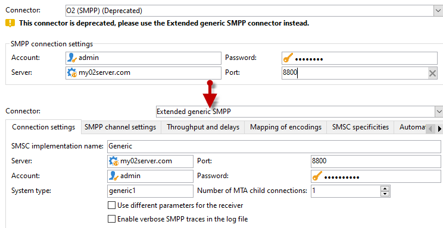

# 將不支援的SMS連接器遷移到擴展的通用SMPP連接器{#unsupported-connector-migration}

從20.2版開始，舊版連接器已過時。 本文檔將幫助您將仍在舊系統上運行的連接器遷移到推薦的SMPP連接器。

>[!CAUTION]
>
>此移轉並非必要，但Adobe建議您進行，並可確保您使用最新支援的軟體版本。

## 關於SMS連接器{#about-sms-connectors}

自20.2版起，已不再支援下列連接器：

* **[!UICONTROL Generic SMPP]** （支援二進位模式的SMPP 3.4版）
* **[!UICONTROL Sybase365]** (SAP SMS 365)
* **[!UICONTROL CLX Communications]**
* **[!UICONTROL Tele2]**
* **[!UICONTROL O2]**
* **[!UICONTROL iOS]**

淘汰的功能仍然可用且受支援，但是將不會進一步增強。 建議使用&#x200B;**[!UICONTROL Extended generic SMPP]**&#x200B;連接器。

有關已過時和已移除功能的詳細資訊，請參閱此[頁面](../../rn/using/deprecated-features.md)。

舊版SMS連接器使用Java SMS連接器，可過載Web程式。 遷移到新的&#x200B;**[!UICONTROL Extended Generic SMPP]**&#x200B;連接器會將此負載移到可支援此負載的MTA。

## 遷移到擴展通用SMPP連接器{#migrating-extended-generic-smpp}

>[!CAUTION]
>
>即使您可以轉換參數，設定&#x200B;**[!UICONTROL Extended Generic SMPP]**&#x200B;連接器也需要與提供者交談，提供您填入其餘參數所需的資訊。 如需關於此項目的詳細資訊，請參閱此[頁面](../../delivery/using/sms-protocol.md)。

首先，您需要建立新的&#x200B;**[!UICONTROL Extended Generic SMPP]**&#x200B;外部帳戶，然後您就可以轉換部分參數。 您可在此[頁面](../../delivery/using/sms-channel.md#creating-an-smpp-external-account)中找到詳細步驟。

您現在需要根據您先前的連接器，填寫新建立的&#x200B;**[!UICONTROL Extended Generic SMPP]**&#x200B;外部帳戶的&#x200B;**[!UICONTROL Mobile]**&#x200B;標籤中的參數。

### 從通用連接器{#from-generic-connector}

當選擇&#x200B;**[!UICONTROL Generic]**&#x200B;連接器時，您應有自訂的JavaScript連接器，以因應每種情況。

如果您知道此連接器已使用SMPP協定，則可遷移到&#x200B;**[!UICONTROL Extended Generic SMPP]**&#x200B;連接器。 如果不支援，請洽詢您的提供商是否支援SMPP協定，並在顧問的幫助下設定新連接器。

從&#x200B;**[!UICONTROL Generic]**&#x200B;連接器，您可以轉換至新建立的&#x200B;**[!UICONTROL Extended SMPP]**&#x200B;帳戶：

在&#x200B;**[!UICONTROL Connection Settings]**&#x200B;標籤中：

* **[!UICONTROL Account]**
* **[!UICONTROL Password]**
* **[!UICONTROL Server]**
* **[!UICONTROL Port]**

### 從通用SMPP連接器{#from-generic-smpp-connector}

從&#x200B;**[!UICONTROL Generic SMPP]**&#x200B;連接器，您可以轉換至新建立的&#x200B;**[!UICONTROL Extended SMPP]**&#x200B;帳戶：

在&#x200B;**[!UICONTROL Connection Settings]**&#x200B;標籤中：

* **[!UICONTROL Account]**
* **[!UICONTROL Password]**
* **[!UICONTROL Server]**
* **[!UICONTROL Port]**
* **[!UICONTROL System Type]**

在&#x200B;**[!UICONTROL SMPP Channel Settings]**&#x200B;標籤中：

* **[!UICONTROL Source number]**
* **[!UICONTROL Source NPI]**
* **[!UICONTROL Destination NPI]**
* **[!UICONTROL Source TON]**
* **[!UICONTROL Destination TON]**

在&#x200B;**[!UICONTROL Mapping of Encoding]**&#x200B;標籤中：

* **[!UICONTROL Outbound SMS coding]**

在&#x200B;**[!UICONTROL SMSC specificities]**&#x200B;標籤中：

* **[!UICONTROL Coding when sending]** 對應於  **[!UICONTROL ID Format in MT acknowledgement]**
* **[!UICONTROL Coding when receiving]** 對應於  **[!UICONTROL ID Format in the SR]**

### 從Sybase365連接器{#from-sybase}

從&#x200B;**[!UICONTROL Sybase365]**&#x200B;連接器，您可以轉換至新建立的&#x200B;**[!UICONTROL Extended SMPP]**&#x200B;帳戶：

在&#x200B;**[!UICONTROL Connection Settings]**&#x200B;標籤中：

* **[!UICONTROL Account]**
* **[!UICONTROL Password]**
* **[!UICONTROL Server]**
* **[!UICONTROL Port]**
* **[!UICONTROL System Type]**

### 從CLX連接器{#from-clx}

從&#x200B;**[!UICONTROL CLX]**&#x200B;連接器，您可以轉換至新建立的&#x200B;**[!UICONTROL Extended SMPP]**&#x200B;帳戶：

在&#x200B;**[!UICONTROL Connection Settings]**&#x200B;標籤中：

* **[!UICONTROL Account]**
* **[!UICONTROL Password]**
* **[!UICONTROL Server]**
* **[!UICONTROL Port]**
* **[!UICONTROL System Type]**

在&#x200B;**[!UICONTROL SMPP Channel Settings]**&#x200B;標籤中：

* **[!UICONTROL Source number]**

在&#x200B;**[!UICONTROL SMSC specificities]**&#x200B;標籤中：

* **[!UICONTROL Coding when sending]** 對應於  **[!UICONTROL ID Format in MT acknowledgement]**
* **[!UICONTROL Coding when receiving]** 對應於  **[!UICONTROL ID Format in the SR]**

### 從Tele2介面{#from-tele2}

從&#x200B;**[!UICONTROL Tele2]**&#x200B;連接器，您可以轉換至新建立的&#x200B;**[!UICONTROL Extended SMPP]**&#x200B;帳戶：

在&#x200B;**[!UICONTROL Connection Settings]**&#x200B;標籤中：

* **[!UICONTROL Account]**
* **[!UICONTROL Password]**
* **[!UICONTROL Server]**
* **[!UICONTROL Port]**
* **[!UICONTROL System Type]**

在&#x200B;**[!UICONTROL SMPP Channel Settings]**&#x200B;標籤中：

* **[!UICONTROL Source number]**
* **[!UICONTROL Source NPI]**
* **[!UICONTROL Destination NPI]**
* **[!UICONTROL Source TON]**

在&#x200B;**[!UICONTROL Mapping of Encoding]**&#x200B;標籤中：

* **[!UICONTROL Outbound SMS coding]**

### 從O2連接器{#from-O2}

從&#x200B;**[!UICONTROL O2]**&#x200B;連接器，您可以轉換至新建立的&#x200B;**[!UICONTROL Extended SMPP]**&#x200B;帳戶：

在&#x200B;**[!UICONTROL Connection Settings]**&#x200B;標籤中：

* **[!UICONTROL Account]**
* **[!UICONTROL Password]**
* **[!UICONTROL Server]**
* **[!UICONTROL Port]**
* **[!UICONTROL System Type]**

在&#x200B;**[!UICONTROL SMPP Channel Settings]**&#x200B;標籤中：

* **[!UICONTROL Source number]**
* **[!UICONTROL Source NPI]**
* **[!UICONTROL Destination NPI]**
* **[!UICONTROL Source TON]**
* **[!UICONTROL Destination TON]**