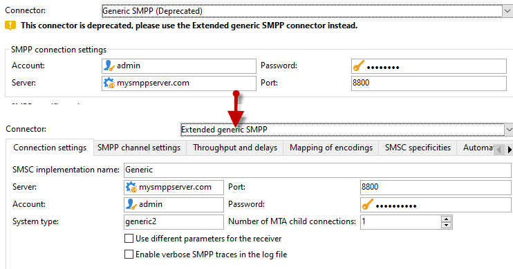

# 將不支援的SMS連接器遷移到擴展通用SMPP連接器{#unsupported-connector-migration}

從20.2版開始，舊版連接器已棄用。 本文檔將幫助您將仍在舊系統上運行的連接器遷移到推薦的SMPP連接器。

>[!CAUTION]
>
>此遷移不是強制的，但是Adobe建議您進行遷移，並將確保您在軟體的最新版本上運行。

## 關於SMS連接器 {#about-sms-connectors}

從20.2版開始不建議使用以下連接器：

* **[!UICONTROL Generic SMPP]** （支援二進位模式的SMPP 3.4版）
* **[!UICONTROL Sybase365]** (SAP SMS 365)
* **[!UICONTROL CLX Communications]**
* **[!UICONTROL Tele2]**
* **[!UICONTROL O2]**
* **[!UICONTROL iOS]**

不推薦使用的功能仍然可用並受支援，但不會進一步增強。 建議使用 **[!UICONTROL Extended generic SMPP]** 連接器。

有關已棄用和已刪除功能的詳細資訊，請參閱 [頁](../../rn/using/deprecated-features.md)。

舊的SMS連接器正在使用Java SMS連接器，該連接器將Web進程重載。 遷移到新 **[!UICONTROL Extended Generic SMPP]** 連接器將此負載移到可支援它的MTA。

## 遷移到擴展通用SMPP連接器 {#migrating-extended-generic-smpp}

>[!CAUTION]
>
>即使可以轉換參數，也可以配置 **[!UICONTROL Extended Generic SMPP]** connector要求您與提供商進行交談，後者將為您提供填充其餘參數所需的資訊。 如需關於此項目的詳細資訊，請參閱此[頁面](sms-protocol.md)。

首先，您需要建立 **[!UICONTROL Extended Generic SMPP]** 外部帳戶，然後您可能可以轉換一些參數。 您可以在此中找到詳細步驟 [頁](sms-set-up.md#creating-an-smpp-external-account)。

現在，您需要填寫 **[!UICONTROL Mobile]** 頁籤 **[!UICONTROL Extended Generic SMPP]** 外部帳戶，具體取決於您以前的連接器。

### 從通用連接器 {#from-generic-connector}

選擇 **[!UICONTROL Generic]** 連接器，您應該有一個自定義的JavaScript連接器，它將適應每種情況。

如果您知道此連接器已在使用SMPP協定，則可以遷移到 **[!UICONTROL Extended Generic SMPP]** 連接器。 如果不支援，請咨詢您的提供商，如果他們支援SMPP協定，並在顧問的幫助下設定新的連接器。

從 **[!UICONTROL Generic]** 連接器，可轉換到新建立的 **[!UICONTROL Extended SMPP]** 帳戶：

在 **[!UICONTROL Connection Settings]** 頁籤：

* **[!UICONTROL Account]**
* **[!UICONTROL Password]**
* **[!UICONTROL Server]**
* **[!UICONTROL Port]**

### 從通用SMPP連接器 {#from-generic-smpp-connector}

從 **[!UICONTROL Generic SMPP]** 連接器，可轉換到新建立的 **[!UICONTROL Extended SMPP]** 帳戶：

在 **[!UICONTROL Connection Settings]** 頁籤：

* **[!UICONTROL Account]**
* **[!UICONTROL Password]**
* **[!UICONTROL Server]**
* **[!UICONTROL Port]**
* **[!UICONTROL System Type]**

在 **[!UICONTROL SMPP Channel Settings]** 頁籤：

* **[!UICONTROL Source number]**
* **[!UICONTROL Source NPI]**
* **[!UICONTROL Destination NPI]**
* **[!UICONTROL Source TON]**
* **[!UICONTROL Destination TON]**

在 **[!UICONTROL Mapping of Encoding]** 頁籤：

* **[!UICONTROL Outbound SMS coding]**

在 **[!UICONTROL SMSC specificities]** 頁籤：

* **[!UICONTROL Coding when sending]** 對應 **[!UICONTROL ID Format in MT acknowledgement]**
* **[!UICONTROL Coding when receiving]** 對應 **[!UICONTROL ID Format in the SR]**

### 從Sybase365連接器 {#from-sybase}

從 **[!UICONTROL Sybase365]** 連接器，可轉換到新建立的 **[!UICONTROL Extended SMPP]** 帳戶：

在 **[!UICONTROL Connection Settings]** 頁籤：

* **[!UICONTROL Account]**
* **[!UICONTROL Password]**
* **[!UICONTROL Server]**
* **[!UICONTROL Port]**
* **[!UICONTROL System Type]**

### 從CLX連接器 {#from-clx}

從 **[!UICONTROL CLX]** 連接器，可轉換到新建立的 **[!UICONTROL Extended SMPP]** 帳戶：

在 **[!UICONTROL Connection Settings]** 頁籤：

* **[!UICONTROL Account]**
* **[!UICONTROL Password]**
* **[!UICONTROL Server]**
* **[!UICONTROL Port]**
* **[!UICONTROL System Type]**

在 **[!UICONTROL SMPP Channel Settings]** 頁籤：

* **[!UICONTROL Source number]**

在 **[!UICONTROL SMSC specificities]** 頁籤：

* **[!UICONTROL Coding when sending]** 對應 **[!UICONTROL ID Format in MT acknowledgement]**
* **[!UICONTROL Coding when receiving]** 對應 **[!UICONTROL ID Format in the SR]**

### 從Tele2連接器 {#from-tele2}

從 **[!UICONTROL Tele2]** 連接器，可轉換到新建立的 **[!UICONTROL Extended SMPP]** 帳戶：

在 **[!UICONTROL Connection Settings]** 頁籤：

* **[!UICONTROL Account]**
* **[!UICONTROL Password]**
* **[!UICONTROL Server]**
* **[!UICONTROL Port]**
* **[!UICONTROL System Type]**

在 **[!UICONTROL SMPP Channel Settings]** 頁籤：

* **[!UICONTROL Source number]**
* **[!UICONTROL Source NPI]**
* **[!UICONTROL Destination NPI]**
* **[!UICONTROL Source TON]**

在 **[!UICONTROL Mapping of Encoding]** 頁籤：

* **[!UICONTROL Outbound SMS coding]**

### 從O2連接器 {#from-O2}

從 **[!UICONTROL O2]** 連接器，可轉換到新建立的 **[!UICONTROL Extended SMPP]** 帳戶：

在 **[!UICONTROL Connection Settings]** 頁籤：

* **[!UICONTROL Account]**
* **[!UICONTROL Password]**
* **[!UICONTROL Server]**
* **[!UICONTROL Port]**
* **[!UICONTROL System Type]**

在 **[!UICONTROL SMPP Channel Settings]** 頁籤：

* **[!UICONTROL Source number]**
* **[!UICONTROL Source NPI]**
* **[!UICONTROL Destination NPI]**
* **[!UICONTROL Source TON]**
* **[!UICONTROL Destination TON]**
