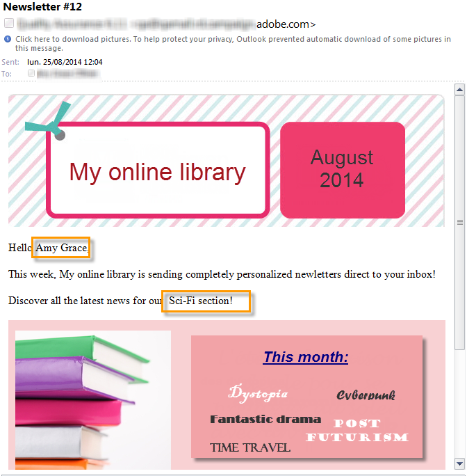

# 使用實例：設定欄位替代{#use-case-configuring-the-field-substitution}


隨機欄位替換允許您將一個值從收件人清單屬性到種子地址，當用戶在傳遞中使用此值時，這些種子地址為空(例如：名稱、城市等)。

此替代允許您在建立交貨時節省時間：替代不是手動將所需值添加到種子地址，而是在遞送目標的收件人清單中隨機恢復此值並將其應用於種子地址。

## 內容 {#context}

在此使用情形中，站點 **我的聯機庫** 想根據客戶最喜歡的文學類型給客戶打個折。

遞送管理器將與喜愛的流派連結的個性化欄位整合到其電子郵件中。 目的是使用一些種子地址：這些種子地址的表中包含個性化欄位，但此處未保存任何值。

要使用隨機欄位替換，您必須具有：

* 一個或多個個性化欄位的遞送，
* 種子地址 **資料模式** 根據在傳遞中使用的個性化欄位進行修改。

## 建立交貨 {#step-1---creating-a-delivery}

建立交貨的步驟在 [建立電子郵件傳遞](creating-an-email-delivery.md) 的子菜單。

在本示例中，交付經理建立了新聞稿。


## 編輯種子地址資料架構 {#editing-the-seed-addresses-data-schema}

有關如何修改資料架構的說明在一節中詳細介紹。

在此示例中，種子地址資料架構採用從收件人資料架構建立的值：

```
 <attribute label="Favorite literary genre" length="80" name="favoriteLiteraryGenre"
               type="string" userEnum="favoriteLiteraryGenre"/>
```

通過此枚舉，用戶可以指定其客戶的最喜愛的文學類型。

要在種子地址中查看此資料架構修改 **輸入表單**，必須更新。 請參閱 [更新輸入表單](use-case--selecting-seed-addresses-on-criteria.md#updating-the-input-form) 的子菜單。

## 配置個性化 {#configuring-personalization}

1. 開啟交貨。

   在此示例中，傳遞包含兩個個性化欄位：收件人 **名字** 收件人的 **最受歡迎的文學**。

   

1. 配置傳送清單和種子地址。 請參閱 [確定目標群體](steps-defining-the-target-population.md)。

   在此示例中，用戶選擇其 **最受歡迎的文學** 以科幻電影為主要目標群體。

   

   用戶將種子地址添加到遞送。

   

   >[!NOTE]
   >
   >有關 **[!UICONTROL Edit the dynamic condition...]** 連結，請參閱 [用例：選擇標準中的種子地址](use-case--selecting-seed-addresses-on-criteria.md)。

1. 按一下 **[!UICONTROL Preview]** 頁籤，然後選擇種子地址以test個性化。

   

   您可以看到其中一個個性化欄位為空。 由於種子地址沒有此欄位的資料，因此HTML內容預覽無法顯示值。

   進行場的隨機替換 **在交貨時**。

1. 按一下 **[!UICONTROL Send]** 按鈕。
1. 然後分析您的交貨 **確認交貨**。

   種子地址將接收收件箱中的傳遞。

   欄位個性化非常有效。

   
